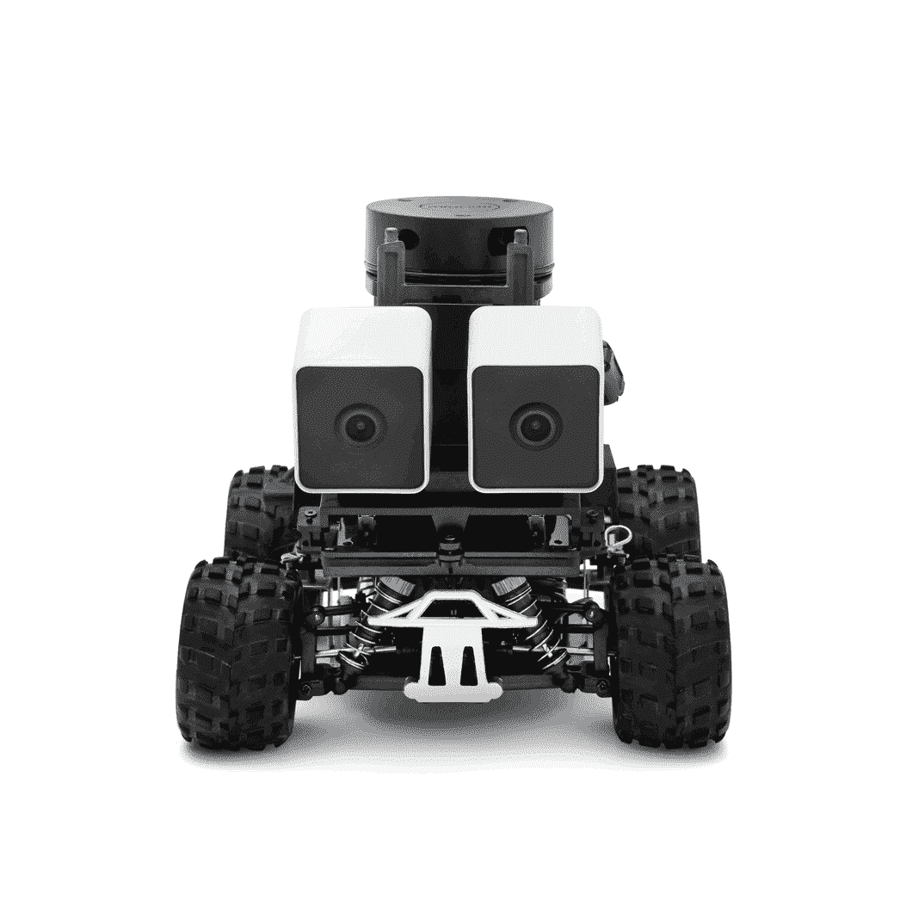
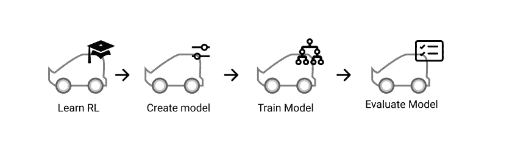
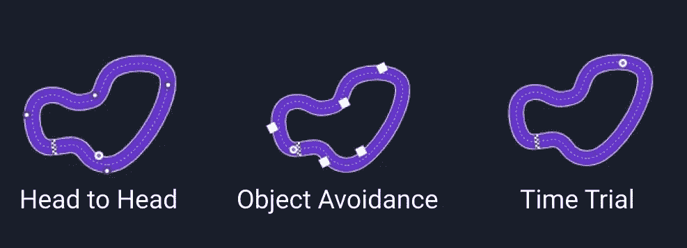
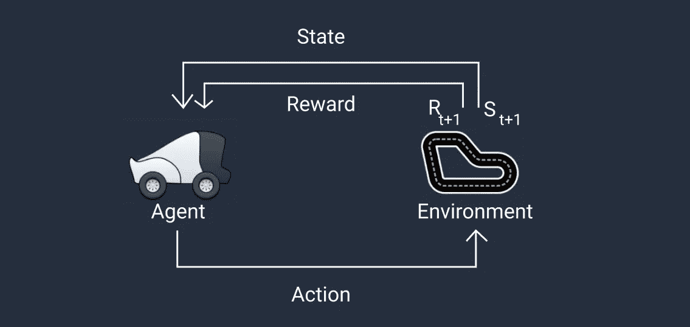
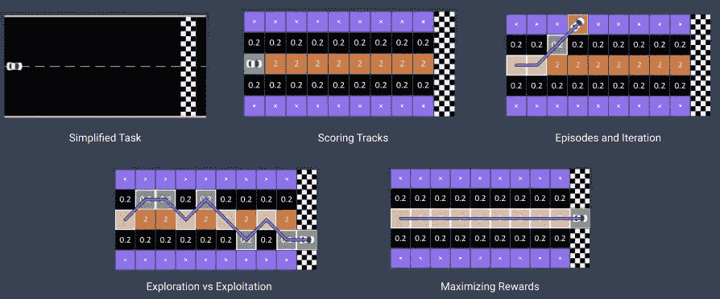

# AWS DeepRacer:强化学习的有趣方式

> 原文：<https://towardsdatascience.com/aws-deepracer-the-fun-way-of-learning-reinforcement-learning-c961cde9ce8b?source=collection_archive---------29----------------------->

# 欢迎来到 AWS DeepRacer 之旅

最近，我参加了一个训练营，将开始我学习强化学习(RL)的旅程。这个训练营是由亚马逊网络服务(AWS)和雅加达机器学习(JML)举办的。在接下来的三个月里，我们将接受 AWS 经验丰富的代表的指导，学习和应用强化学习理念。

> 这将是一个令人兴奋的旅程，因为我们将使用 AWS DeepRacer 以有趣的方式学习强化学习，并带上您！

尼古拉斯·佩罗尔在 [Unsplash](https://unsplash.com?utm_source=medium&utm_medium=referral) 上拍摄的照片

# 了解 AWS DeepRacer

我们先从了解什么是 AWS DeepRacer 开始。DeepRacer 是 AWS 将强化学习带到每个开发者手中的举措之一。这项倡议带来了一种有趣的学习机器学习的方法，特别是 RL，使用自动驾驶赛车，3D 在线赛车模拟器来建立你的模型，以及比赛。

## AWS 深赛车

AWS DeepRacer Evo 是一辆 1/18 比例的自动驾驶赛车，由强化学习驱动。这辆车配有左右前置摄像头，组成立体摄像头。立体摄像机可以帮助车辆学习图像中的深度信息，这些信息可用于感知和避免轨道上的物体被接近。这辆车还有一个向后的激光雷达传感器，用于检测车辆后面和旁边的物体。立体相机和激光雷达传感器的结合实现了物体回避和短兵相接的比赛。

AWS DeepRacer Evo 汽车。图片由 AWS DeepRacer 提供

## AWS DeepRacer 控制台

作为开发人员，我们可以在 3D 在线赛车模拟器中训练、评估和调整 RL 模型。这个旅程可以从学习 RL 的基础开始。AWS 提供了易于理解的学习材料来掌握基础知识。

模型创建流程。作者图片

然后，我们可以开始在 AWS 控制台中构建、训练和评估我们的模型。为了使它更容易，我们还可以开始使用预构建模型示例。AWS DeepRacer 控制台也为我们提供了执行此类任务的能力:

*   创建 RL 训练作业，以创建具有特定奖励函数、优化算法、超参数和环境的模型。
*   选择一个轨道来训练和评估一个模型。
*   克隆一个训练模型，通过调整超参数来优化模型的性能。
*   下载部署到 AWS DeepRacer 车辆的模型，以便它可以驾驶。
*   提交一个模型到一个虚拟的比赛中，并与其他模型进行比较。

## AWS 深度赛车联盟

一旦我们的模型准备好了，我们就可以将模型部署到 AWS DeepRacer 的在线或离线 AWS DeepRacer 联赛中，从而有机会赢得 AWS DeepRacer 冠军杯。

约书亚·戈尔德在 [Unsplash](https://unsplash.com?utm_source=medium&utm_medium=referral) 上拍摄的照片

2020 年 AWS DeepRacer 联赛有两种比赛方式。首先是在线虚拟电路，它允许你在世界任何地方进行比赛。AWS 还提供免费等级，使您能够进行 10 小时的培训。所以你可以免费进入联盟。第二个是顶峰赛道，在这里你可以和其他车手在顶峰比赛。

今年，联盟提供了三种比赛形式。它们是头对头，物体回避和计时赛。

AWS 深赛车联盟比赛格式。作者图片

*   在**面对面**排位赛中，我们需要完成几圈，同时避免 AWS 机器人赛车在赛道上移动。月底，前 32 名选手将被列入淘汰名单，我们需要与其他选手展开正面交锋。
*   在**物体躲避**比赛中，我们需要完成赛道，同时躲避路上指定数量的障碍物。最快的赛车手将晋级争夺冠军奖杯。
*   在**计时赛**比赛中，我们需要在赛道上完成规定的圈数。谁跑得最快，谁就能晋级争夺冠军奖杯。

# 强化学习

现在，让我们看看车轮后面，了解强化学习的基本概念。RL 是一种先进的机器学习(ML)技术，采用与其他机器学习方法非常不同的方法来训练模型。它的超级能力是，它可以在不需要任何标记训练数据的情况下学习非常复杂的行为，并可以在为长期目标优化的同时做出短期决策。

## RL 基础

在强化学习中，一个**代理**将探索一个**环境**来执行任务，采取**行动**并产生好的结果，避免坏的结果。该模型将从经验中学习，随着时间的推移，它将能够识别哪些活动会带来最佳的**回报**。

这里有一个有趣的例子来解释强化学习。在实验中，给鸡的任务是只钉粉红色的纸。当小鸡钉住正确的纸时，小鸡会被奖励食物。当桌子上引入其他颜色时，挑战变得更加有趣。有趣的是，这只鸡仍然设法只盯住粉红色。

## AWS DeepRacer 中的重要 RL 术语

AWS DeepRacer 中的重要术语。作者图片

有几个重要术语可用于探索这些想法，并理解它们与 AWS DeepRacer 的关系:

1.  **代理人。**代理由需要培训的 AWS DeepRacer 车辆代表。更具体地说，它体现了控制车辆、接受输入和决定行动的神经网络。
2.  **环境。**该环境包含一条定义车辆行驶路线的轨道。代理探索环境以收集数据来训练底层神经网络。
3.  **状态**。状态表示代理在某个时间点所处环境的快照。前置摄像头捕捉车辆上的这种状态。
4.  **动作**。动作是代理在当前状态下做出的决定。对于 AWS DeepRacer，动作对应于车辆以特定速度和转向角度移动。
5.  **奖励**。奖励是当代理在给定的状态下采取行动时作为反馈给代理的分数。在训练 AWS DeepRacer 模型时，奖励由一个*奖励函数*返回。一般来说，您定义或提供一个奖励函数来指定在给定的状态下代理应该采取什么样的行动。
6.  **剧集**。一集是代理终止之前的一组过程。

## 如何训练车辆

在这一点上，我们将在高层次上探索如何培训 AWS DeepRacer。训练过程是一个迭代的 tass。在模拟器中，代理将探索环境并获得经验。收集的经验用于更新模型，更新的模型用于获得更多的经验。

我们将在一个简化的环境中看到这些示例，以便真正了解培训过程是如何进行的。

简化的学习过程。作者图片

在这个例子中，我们希望车辆以最短的路径从起点到终点，而不离开赛道。然后我们可以将环境简化为一个正方形网格。每个方块代表一个单独的状态，我们将允许车辆在面向目标的方向上上下移动。

我们可以给网格中的每个方块分配一个分数，以决定激励什么行为。这里，我们将轨道边缘的方块指定为“停止状态”,这将告诉车辆它已经偏离了轨道并且失败了。因为我们想让车辆学会沿着轨道中心行驶，所以我们为中心线上的方块提供高奖励，而在其他地方提供低奖励。

在强化训练中，车辆将从探索网格开始，直到它移动出界或到达目的地。当它四处行驶时，车辆从我们定义的分数中累积奖励。这个过程被称为*插曲*。学习将需要一些迭代，以使车辆能够获取知识。

代理人需要*探索*，看看在哪里可以获得最高的回报，然后才能使用或*利用*这些知识。随着代理获得越来越多的经验，它学会留在中央广场，以获得更高的奖励。

随着更多的经验，代理变得更好，最终可以可靠地到达目的地，并找到最高的奖励。

照片由[安东·舒瓦洛夫](https://unsplash.com/@a8ka?utm_source=medium&utm_medium=referral)在 [Unsplash](https://unsplash.com?utm_source=medium&utm_medium=referral) 拍摄

# 结论

到目前为止，你应该已经知道什么是 AWS DeepRacer，以及 AWS DeepRacer 车辆、训练控制台和 AWS DeepRacer League 等每个组件。您还将了解强化学习的基础知识及其在 AWS DeepRacer 中的应用，包括重要术语和培训的执行方式。

# 文献学

*   [https://aws.amazon.com/deepracer/](https://aws.amazon.com/deepracer/)
*   [https://docs . AWS . Amazon . com/deep racer/latest/developer guide/what-is-deep racer . html？ICM PID = docs _ deep racer _ console](https://docs.aws.amazon.com/deepracer/latest/developerguide/what-is-deepracer.html?icmpid=docs_deepracer_console)
*   [AWS 强化学习简介](https://d2k9g1efyej86q.cloudfront.net/)

# 关于作者

Bima 是一名数据科学家，他总是渴望扩展自己的知识和技能。他毕业于万隆技术学院和新南威尔士大学，分别是采矿工程师。然后他通过 HardvardX、IBM、Udacity 等的各种在线课程开始了他的数据科学之旅。目前，他正与 DANA Indonesia 一起在印度尼西亚建立一个无现金社会。

如果您有任何疑问或任何要讨论的话题，请通过 [LinkedIn](https://www.linkedin.com/in/bpratama/) 联系 Bima。