# AWS Glue 101:您需要了解的全部内容

> 原文：<https://towardsdatascience.com/aws-glue-101-all-you-need-to-know-with-a-real-world-example-f34af17b782f?source=collection_archive---------0----------------------->

## 什么是胶水？解释了完整的 ETL 管道

照片由[埃里卡·普列塞](https://www.pexels.com/@erika-pugliese-1021047?utm_content=attributionCopyText&utm_medium=referral&utm_source=pexels)从[派克斯](https://www.pexels.com/photo/glue-gun-beside-green-leaves-and-flower-on-white-surface-1999263/?utm_content=attributionCopyText&utm_medium=referral&utm_source=pexels)拍摄

有没有想过大型科技公司是如何设计他们的生产 ETL 管道的？有兴趣了解如何无缝抓取数据的 TB、ZB 并高效解析到数据库或其他存储，以便于数据科学家和数据分析师使用吗？

在本帖中，我将详细解释(*用图形表示！*)使用 AWS 服务(Glue、S3、红移)的 ETL 过程的设计与实现。任何没有 AWS Glue 或 AWS 堆栈经验或接触过 AWS Glue 或 AWS 堆栈(甚至没有深入的开发经验)的人都应该很容易理解。对于那些对使用 AWS Glue 感兴趣的人来说，这篇文章可以作为一个很好的入门指南。

在开始本演练之前，让我们简要回答三(3)个常见问题:

> AWS 胶水到底是什么？
> 
> 使用胶水有什么特点和优势？
> 
> 真实世界的场景是什么？

# 什么是 AWS 胶水？

那么什么是胶水呢？AWS Glue 只是一个无服务器的 ETL 工具。ETL 指的是大多数数据分析/机器学习过程中通常需要的三(3)个过程:提取、转换、加载。*从源中提取*数据，*将*数据转换成适合应用程序的方式，然后*将数据加载*回数据仓库。AWS 帮助我们创造奇迹。AWS 控制台 UI 为我们提供了将整个任务执行到底的简单方法。不需要额外的代码脚本。

# AWS 胶水的成分

*   **数据目录:**数据目录保存元数据和数据的结构。
*   **数据库:**用于创建或访问源和目标的数据库。
*   **表:**在数据库中创建一个或多个表，供源和目标使用。
*   **爬虫和分类器:**爬虫用于使用内置或定制的分类器从源中检索数据。它创建/使用在数据目录中预定义的元数据表。
*   **作业:**作业是执行 ETL 任务的业务逻辑。在内部，Apache Spark 用 python 或 scala 语言编写了这个业务逻辑。
*   **触发器:**触发器按需或在特定时间启动 ETL 作业执行。
*   **开发端点:**它创建了一个可以测试、开发和调试 ETL 作业脚本的开发环境。

# 为什么要用 AWS 胶水？

胶水对我们有什么好处？以下是在你自己的工作场所或组织中使用它的一些优势

*   AWS 使用爬虫扫描所有可用的数据
*   最终处理的数据可以存储在许多不同的地方(亚马逊 RDS、亚马逊红移、亚马逊 S3 等)
*   是云服务。内部基础设施不需要资金。
*   这是一个划算的选择，因为它是一个无服务器的 ETL 服务
*   它很快。它马上给你 Python/Scala ETL 代码。

# AWS 胶水的生产用例

这里有一个使用 AWS 胶水的实际例子。

一个游戏软件每天会产生几 MB 或几 GB 的用户游戏数据。从软件中收集用户生成数据的服务器每 6 小时将数据推送到 AWS S3 一次(JDBC 连接使用亚马逊 S3、亚马逊 RDS、亚马逊红移或任何外部数据库连接数据源和目标)。

我们公司希望根据用户资料预测该剧的时长。为了执行这项任务，数据工程团队应该确保获得所有的原始数据，并以正确的方式对其进行预处理。Glue 提供了 Python SDK，我们可以在其中创建一个新的 Glue Job Python 脚本来简化 ETL。代码运行在 Spark(一个分布式系统，可以使过程更快)之上，它是在 AWS Glue 中自动配置的。由于 spark，数据将被分成小块，并在多台机器上同时并行处理。

**提取—** 该脚本将把 S3 存储桶中的所有使用数据读取到一个数据帧中(您可以把它想象成 Pandas 中的一个数据帧)

**转换—** 假设原始数据平均每秒包含 10 个不同的日志。分析团队希望以特定的逻辑每 1 分钟汇总一次数据。

**加载—** 将处理后的数据写回到另一个 S3 存储桶，供分析团队使用。

# 项目演练

对于项目的范围，我们将使用来自电信流失数据集的样本 CSV 文件(数据包含 20 个不同的列。数据集的目标是二元分类，并且目标是基于每个人的信息来预测每个人是否会继续订阅电信。我在这个演示中使用的数据和数据集的描述可以通过[点击这个 Kaggle 链接](https://www.kaggle.com/blastchar/telco-customer-churn)下载。

# 1.创建一个 IAM 角色来访问 AWS Glue + EC2 + CloudWatch + S3

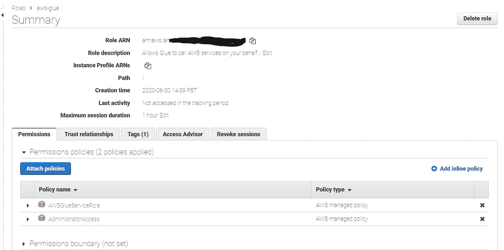

作者照片

您需要一个适当的角色来访问您将在此过程中使用的不同服务。IAM 角色类似于 IAM 用户，因为它是一个 AWS 身份，权限策略决定该身份在 AWS 中可以做什么和不可以做什么。当您获得一个角色时，它为您的角色会话提供临时安全凭证。你可以在这里找到更多关于我的角色的信息

*   打开[亚马逊 IAM 控制台](https://console.aws.amazon.com/iam)
*   点击*角色* → *创建角色*。
*   从“*选择将使用此角色的服务”*中选择粘合服务
*   从“*选择您的用例*部分选择胶水
*   从*附加权限策略*部分选择“*AWSGlueServiceRole”*。
*   点击*下一步:标签*。将*添加标签*部分留空。创建角色。
*   您的角色现在可以完全访问 AWS Glue 和其他服务

# 2.上传源文件到亚马逊 S3

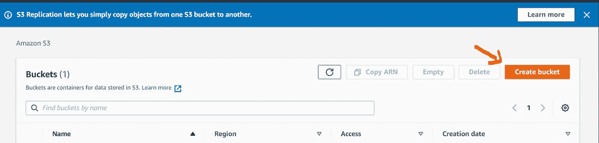

作者照片

*   在*亚马逊 S3* 控制台上，点击*创建一个可以存储文件和文件夹的存储桶*。

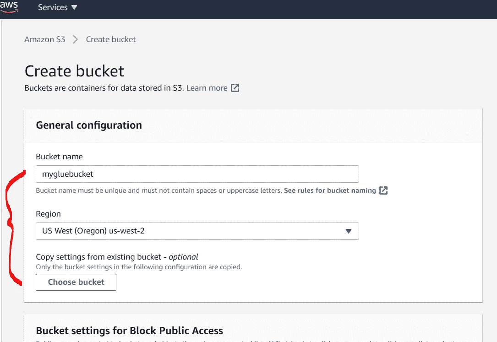

作者照片

*   输入一个*桶名*，选择一个*区域*，点击*下一个*

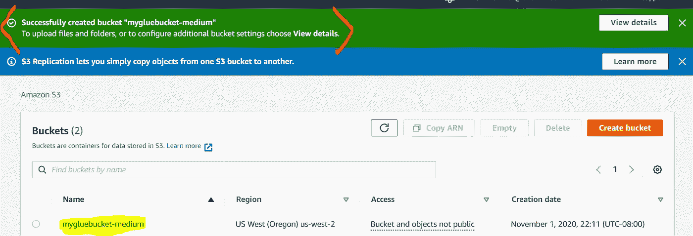

*   剩余的配置设置现在可以保持为空。点击下一个的*来创建你的 S3 桶。*
*   在您的存储桶中创建一个新文件夹，并上传源文件

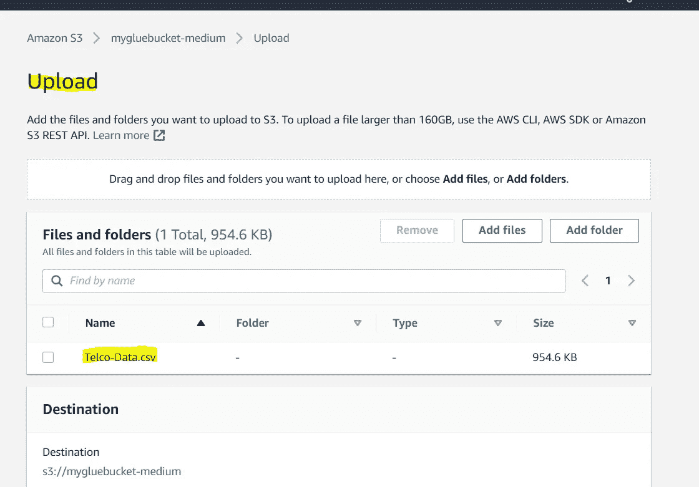

*   (可选)在将数据加载到 bucket 之前，您可以尝试使用 python 中的几个库将数据的大小压缩成不同的格式(例如 Parquet)

# 3.启动 AWS 胶水数据库

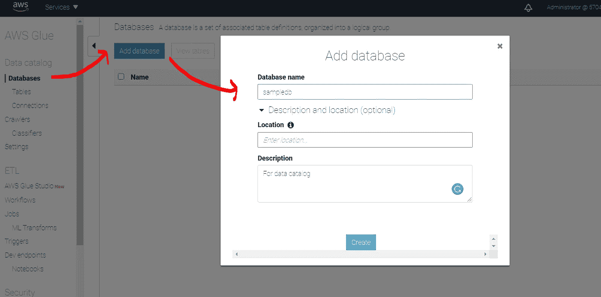

作者照片

为了将数据添加到粘合数据目录中，这有助于保存元数据和数据结构，我们需要将粘合数据库定义为逻辑容器。

所以我们需要初始化胶水数据库

# 4.**创建并运行胶水爬虫**

由于我们已经准备好了胶水数据库，我们需要将我们的数据输入到模型中。因此，我们正在尝试这样做:我们将创建爬行器，基本上扫描指定 S3 桶中的所有可用数据。爬虫[自动识别最常见的分类器](https://docs.aws.amazon.com/glue/latest/dg/add-classifier.html#classifier-built-in)，包括 CSV、JSON 和 Parquet。

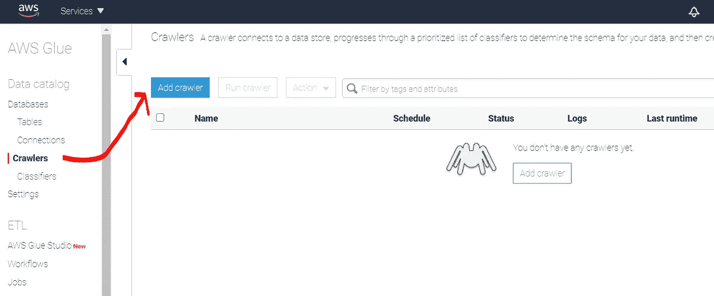

作者照片

*   在 *AWS 胶水*控制台的左窗格中，点击*爬虫- >添加爬虫*
*   点击蓝色的**添加爬虫**按钮。
*   将爬虫命名为**、**并保留不变，用于**“指定爬虫类型”**

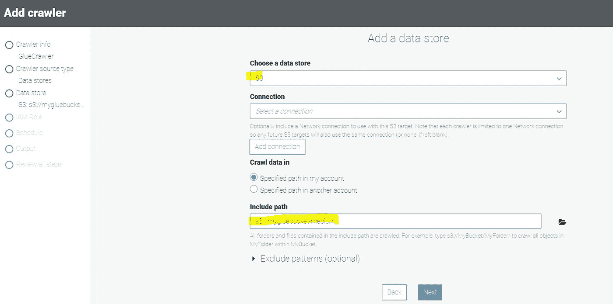

作者照片

*   在**数据存储中，**选择 S3 并选择您创建的存储桶。向下钻取选择*读取*文件夹

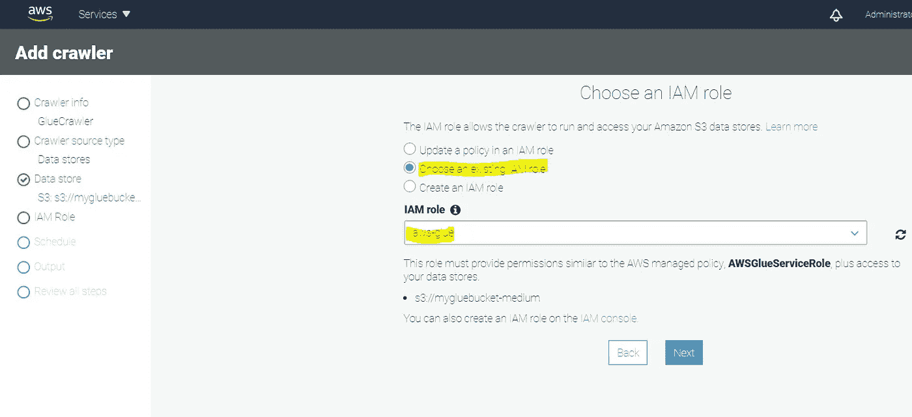

作者照片

*   在**我的角色中，**选择您在上面创建的角色
*   现在将频率设置为“按需运行”。您可以随时根据自己的兴趣更改爬虫计划。
*   在**输出中，**指定您在上面创建的胶水数据库( *sampledb* )

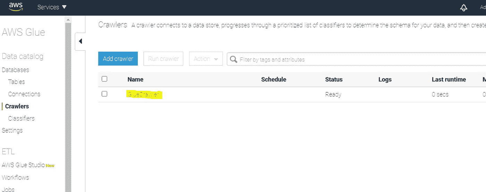

作者照片

*   然后，生成一个胶水爬行器，它读取指定 S3 桶中的所有文件
*   点击复选框，点击*运行爬虫*运行爬虫
*   完成后，您应该会看到它的状态为“停止”。并且指定了“上次运行时间”和“添加的表”。

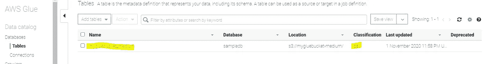

作者照片

*   然后，左侧窗格中的*数据库* → *表*让您验证这些表是否是由爬虫自动创建的。

# **5。定义涂胶作业**

有了最终的表，我们知道创建粘合作业，它可以按计划、按触发或按需运行。创建 Glue jobs 的有趣之处在于，它实际上可以是一个几乎完全基于 GUI 的活动，只需点击几下按钮就可以自动生成必要的 python 代码。但是，我将做一些编辑，以便综合多个源文件并执行就地数据质量验证。默认情况下，Glue 使用 DynamicFrame 对象来包含关系数据表，并且它们可以很容易地来回转换为 PySpark 数据帧以进行自定义转换。

> 请注意，在这一步，如果来自爬行器的数据变大，您可以选择启动另一个数据库(即 AWS RedShift)来保存最终数据表。对于项目范围，我们跳过这一步，将处理后的数据表直接放回另一个 S3 存储桶

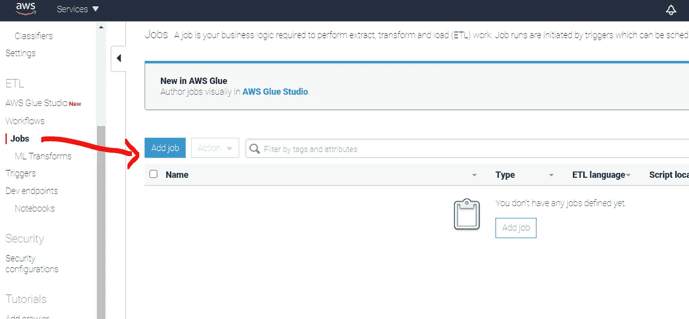

作者照片

*   在左侧窗格中，点击*工作*，然后点击*添加工作*

作者照片

*   给*起个名字*，然后选择之前为 AWS Glue 创建的 *IAM 角色*
*   选择*类型*的 *Spark* 选择 *Spark 2.4，*胶版*的 Python 3*
*   您可以在*安全配置、脚本库和作业参数*的*最大容量*字段中编辑 DPU(数据处理单元)值的数量(可选)。
*   剩余的配置是可选的

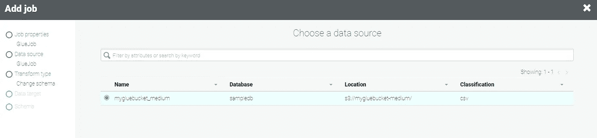

*   从*选择数据源*部分选择一个*数据源表*。您只能选择一个数据源。

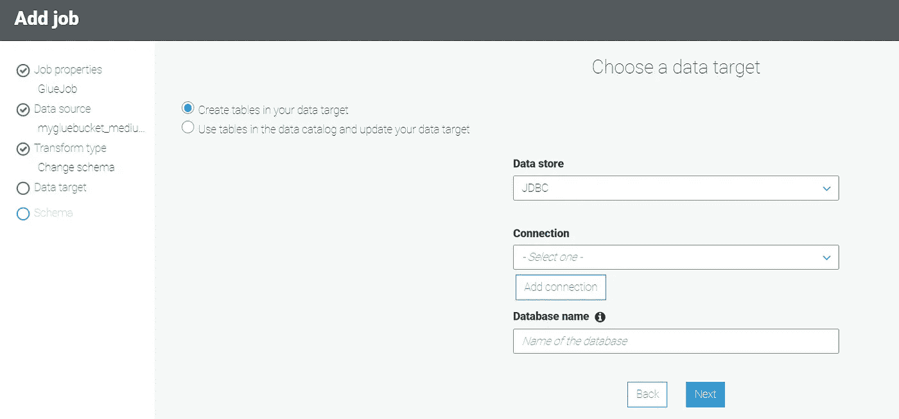

作者照片

*   给 AWS 红移增加一个 JDBC 连接。我们需要选择一个位置来存储最终处理后的数据。如果您有数据库，可以选择现有的数据库。或者你可以写回 S3 集群。对于本教程，我们将继续使用默认映射。业务逻辑也可以在以后对此进行修改。

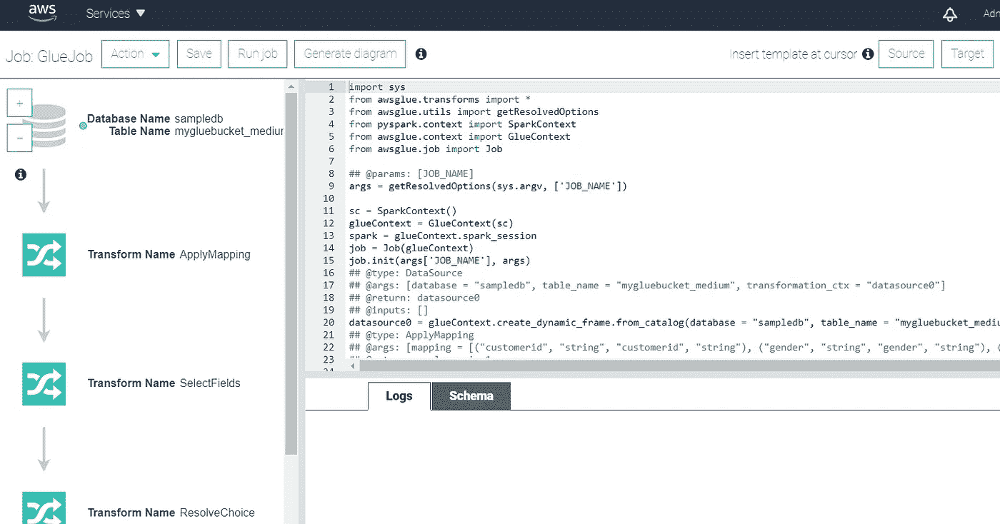

作者照片

*   通过选择最近创建的作业名称打开 Python 脚本。点击*动作- >编辑脚本*。
*   左窗格显示了 ETL 过程的可视化表示。右侧窗格显示脚本代码，在它的正下方，您可以看到正在运行的作业的日志。
*   通过单击运行作业保存并执行作业。

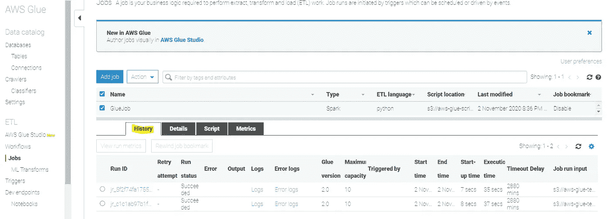

作者照片

*   我们在运行脚本后获得历史记录，并在 S3 中填充最终数据(或者，如果我们将红移作为最终数据存储，则为 SQL 准备好数据)

# 结论

总而言之，我们已经构建了一个完整的 ETL 过程:我们创建了一个 S3 桶，将我们的原始数据上传到桶中，启动 glue 数据库，添加一个 crawler 来浏览上述 S3 桶中的数据，创建一个 GlueJobs，它可以按计划、按触发或按需运行，最后将数据更新回 S3 桶。

可以做的额外工作是根据业务需求修改 GlueJob 阶段提供的 Python 脚本。
(即改进预处理以缩放数值变量)

总的来说，上面的结构将让您开始在任何业务生产环境中设置 ETL 管道。

# 额外资源

*有关学习其他数据科学主题的更多详细信息，下面的 Github 存储库也会有所帮助。它包含易于遵循的代码，让你开始解释。*

*   [生产中的 AWS sage maker](https://github.com/hyunjoonbok/amazon-sagemaker)
    展示如何使用 Amazon SageMaker 及其 ML/DL 算法解决业务问题的端到端示例。
*   [PySpark](https://github.com/hyunjoonbok/PySpark)
    函数和实用程序，带有真实世界的数据示例。可以用来构建一个完整的数据建模的 ETL 过程
*   [推荐系统](https://github.com/hyunjoonbok/Recommendation_System-PyTorch)
    py torch 中推荐系统的生产级实现。克隆 repo 并通过运行“main.py”开始训练
*   [自然语言处理(NLP)](https://github.com/hyunjoonbok/natural-language-processing)
    Python 中几种自然语言处理方法的完整实现示例。按照学习的复杂程度排序

# 关于作者

贤俊是一名拥有统计学学位的数据极客。他喜欢分享数据科学/分析知识。在 LinkedIn 上给他发消息联系。

*参考:* 【1】杰西·弗雷德里克森，[https://towardsdatascience . com/AWS-Glue-and-you-e2e 4322 f 0805](/aws-glue-and-you-e2e4322f0805)
【2】Synerzip，[https://www . Synerzip . com/blog/A-Practical-Guide-to-AWS-Glue/](https://www.synerzip.com/blog/a-practical-guide-to-aws-glue/)《AWS 胶水实用指南》
【3】肖恩·奈特，[https://towards](/aws-glue-amazons-new-etl-tool-8c4a813d751a)