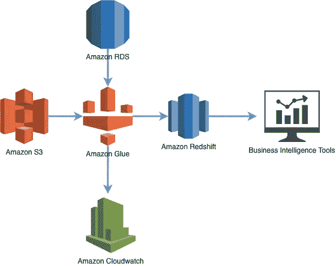

# AWS Glue:亚马逊的新 ETL 工具

> 原文：<https://towardsdatascience.com/aws-glue-amazons-new-etl-tool-8c4a813d751a?source=collection_archive---------18----------------------->

## 什么是 AWS 胶水，需要吗？

照片由[艾丽](https://unsplash.com/@acreativegangster?utm_source=medium&utm_medium=referral)在 [Unsplash](https://unsplash.com?utm_source=medium&utm_medium=referral) 上拍摄

Amazon AWS Glue 是一个完全托管的基于云的 ETL 服务，在 AWS 生态系统中可用。它是由亚马逊 AWS 于 2017 年 8 月推出的，大约在同一时间，由于公司无法成功实施大数据项目，大数据的宣传逐渐消失。2015 年， [Gartner](https://www.gartner.com/en/newsroom/press-releases/2015-09-15-gartner-says-business-intelligence-and-analytics-leaders-must-focus-on-mindsets-and-culture-to-kick-start-advanced-analytics) 曾做出一个著名的预测，到 2017 年将有 60%的大数据项目失败，尽管其[分析师](https://www.digitalnewsasia.com/insights/why-85-big-data-projects-fail)后来声称这个数字是保守的，实际失败率可能高达 85%。

在同一份报告中，在失败背后的许多因素中，Gartner 强调，缺乏正确的 IT 和基础架构技能将是此类大数据分析项目失败背后的一个关键因素。如果我们详细阐述这一点，任何大数据项目的主要挑战之一是将来自多个来源的各种数据纳入中央数据湖或数据仓库。这通常需要实现和管理复杂的 ETL 过程，这不是一件容易的事情，并且可能成为一个失败点。因此，亚马逊 AWS Glue 在 2017 年推出不仅仅是一个巧合，而是试图通过在其云上提供 ETL 服务来利用脆弱的 ETL 市场。

在我们深入探讨 Amazon AWS Glue 之前，让我们首先了解 ETL 到底是什么，以及与之相关的挑战是什么。然后我们来看看 AWS Glue 及其特性。最后，我们将讨论构建 ETL 管道的另一种解决方案:数据虚拟化。

# 什么是 ETL 过程？

ETL 代表提取、转换和加载，在这个过程中，从各种来源收集数据并加载到数据仓库或数据湖的目标数据库中。整个过程的三个主要步骤是:

# 提取

在此过程中，来自各种来源的数据被提取出来并放入一个临时区域。数据既可以从同类来源提取，也可以从异类来源提取。例如，您很有可能从 SQL 数据库中提取一些数据，从 NoSQL 数据库中提取一些数据用于您的数据湖。

# 改变

在第一步中提取的数据通常保存在一个临时区域中，以对其进行清理和预处理，从而使来自不同来源的数据保持一致，并确保它们符合我们的目标数据库的设计。例如，在从不同国家提取销售数据时，在将数据插入目标数据库之前，将不同的货币转换成一种通用货币(如美元)是有意义的。

# 负荷

在这个最后的步骤中，经过清理和预处理的数据最终被加载到数据湖或数据仓库的目标数据库中。现在，您可以使用这些数据来执行分析并从中获得见解。

# ETL 流程的主要挑战

*   ETL 已经以某种形式存在了很多年。在大数据爆炸之前，ETL 被认为是一个批处理过程，通常只需要处理同质数据。那时候事情很简单，但是现在时代变了，数据量大、速度快、种类多，而且人们越来越期望执行接近实时的 ETL。所有这些都需要非常复杂的 ETL 设计，这对 ETL 开发人员来说是一种新的挑战。
*   ETL 日益增长的复杂性要求更复杂的基础设施、服务器和资源。一个大企业仍然能够负担得起投资于内部强大的服务器，但是较小的公司可能并不总是发现花费来构建强大的 ETL 服务器是容易的。
*   ETL 不是奖励，而是开销。这是因为最终目标是提取报告、有意义的见解、对数据执行分析，而 ETL 只是先决条件。这份 2015 年的旧[调查](https://www.xplenty.com/news/2015-07-01-bi-professionals-spen-50-90-percent-of-their-time-cleaning-raw-data-for-analytics/)提到，三分之一的受访者表示，他们将 50%-90%的时间用于数据准备，以使其“为分析做好准备”。因此，矛盾的是，主要目标是执行分析的公司最终会花费更多的时间和金钱将数据提供给分析师和数据科学家。

该图显示了 AWS Glue ETL 工具的通用工作流(图片由作者创建)

# 亚马逊 AWS 胶水简介

正如我们在介绍中所讨论的，Amazon AWS Glue 是一个完全托管的、无服务器的 ETL 服务，可以在 AWS cloud 上使用。这里的“托管和无服务器”是指 AWS Glue 将根据需要自行处理 AWS 云上的服务器和资源供应。所以作为用户，你不需要担心基础设施部分。

让我们借助它的架构来更深入地看看 AWS Glue。

AWS Glue 架构由三个主要部分组成

1.  AWS 胶水数据目录
2.  ETL 引擎
3.  调度程序

# AWS 粘合数据目录

AWS Glue 在爬虫的帮助下自动浏览所有可用的数据存储，并将它们的元数据保存在一个名为 Data Catalog 的中央元数据存储库中。在实际的 ETL 过程中会用到这些元数据信息，除此之外，目录还保存了与 ETL 作业相关的元数据。

可以有一个或多个数据存储，如 Amazon RDS、Amazon Redshift、Amazon S3 和其他运行在 EC2 实例上的数据库。爬行完成后，它会创建一个来自各种来源的数据目录，并呈现一个统一的视图，可以使用 Amazon Athena 或 Amazon Redshift Spectrum 进行查询。

如果您在 Amazon EMR 上处理大数据，这个目录也可以用作 Hive Metastore。不用说，它支持所有流行的数据类型和格式，比如 CSV、JSON、Parquet 等等。

# ETL 引擎

AWS Glue 利用目录信息，可以根据您的选择自动生成 Scala 或 Python 格式的 ETL 脚本。这个 ETL 脚本负责将数据从源数据源加载到目标数据源，通常是数据仓库或数据湖。您还可以根据自己的需求灵活地进一步定制。

# 调度程序

ETL 作业可以手动调用，但是对于重复的 ETL 作业，AWS Glue 提供了调度程序，以预定的频率执行 ETL 过程。您还可以灵活地将多个 ETL 作业按执行顺序连接起来，或者在预定义的事件时触发作业。更有用的是，这些调度程序也可以从 AWS Lambda 等外部服务中调用。

# AWS 亚马逊胶水的优势

在本文的开始，我们向您展示了 ETL 的挑战，所以让我们看看 AWS Glue 如何使 ETL 过程变得更加容易。

*   由于 AWS Glue 是一种云 ETL 服务，组织不必担心投资本地 ETL 基础设施。
*   即使在 AWS 云上，AWS Glue 也是完全托管的，没有服务器，一切都在后台自行处理。对于 ETL 过程，您不必在 AWS 上显式地启动任何服务器或服务。
*   作为一个云 ETL 服务，AWS Glue 对于大公司和小公司都是一个划算的选择。
*   你不需要在 ETL 过程中花费太多时间，AWS Glue 会将 ETL 代码直接提供给你。这意味着您可以更专注于直接对数据执行分析。请记住，进行分析一直是实际的目标，ETL 只是以可能的格式获取数据的必要手段。

# 使用 AWS 胶水的公司

以下是一些使用 AWS 胶水的知名公司

*   德勤
*   布鲁特
*   21 世纪福克斯
*   西门子
*   金融公司
*   Woot
*   罗宾汉
*   Creditvidya

# 亚马逊 AWS 胶水适合你吗？

如果您是一家已经在使用 AWS cloud 运行应用程序的公司，并且正在寻找 ETL 解决方案，那么您肯定应该考虑 AWS Glue，因为您已经在该生态系统中了。

然而，如果你的公司根本没有使用 AWS 云，这就不那么明确了。如果您的公司愿意投入时间和金钱从头开始构建数据湖，那么迁移到 AWS 云并在 AWS Glue 和 AWS 生态系统中的其他服务的帮助下构建您的数据湖可能是有意义的。但是这肯定不会适合所有的用例。

尽管 Amazon Glue 已经减少了 ETL 过程中所需的工作，但是让我们花一点时间退一步问另一个问题——“我们真的需要 ETL 吗？”在本文中，这个问题听起来可能有些违反直觉，但是最近市场上出现了一些新的非 ETL 解决方案。

# 数据虚拟化—无 ETL 解决方案

数据虚拟化是一种从一个或多个数据源检索或查询数据的技术，而不必担心数据的底层格式。由于数据虚拟化层，这是可能的。因为您是直接从数据源实时查询数据，所以不需要执行 ETL 来将数据加载到数据仓库或数据湖中。

数据虚拟化绝对是一个游戏规则改变者，因为它消除了对 ETL 过程的需求，甚至使 AWS Glue 对于许多用例来说都是不必要的。

# 结论

对于任何数据分析项目来说，ETL 都是最具挑战性的方面，如果不是失败的原因，它通常会成为一个复杂的开销。Amazon AWS Glue 通过其完全托管的 ETL 服务来帮助简化 ETL 过程。然而，对于某些用例来说，使用 Knowi 这样的 BI 工具可能更实用，它消除了使用数据虚拟化进行 ETL 的需要。