# AWS 胶水和你

> 原文：<https://towardsdatascience.com/aws-glue-and-you-e2e4322f0805?source=collection_archive---------11----------------------->

在这篇文章中，我将利用 AWS (Amazon Web Service) S3、Redshift 和 Glue，介绍云 ETL(提取、转换、加载)过程中涉及的架构和实现。我的目标是从我的家用计算机中获取源数据文件，并将其中包含的数据处理成云中可用的真实关系 SQL 表。我将使用 S3 来存放源数据，红移到从该源数据派生的主机表，并将数据从 S3 文件转换和加载到红移表。首先，让我们浏览一下项目数据上下文。

## **数据和问题背景:**

我喜欢把我感兴趣的话题作为我项目的基础，这个也不例外。为了这个项目，我从 [OpenDoTA API](https://docs.opendota.com/) 下载了 10gb 的数据样本，其中包括超过一百万场真实 DoTA 比赛的记录。(对于那些不了解内情的人来说，DoTA 是一种流行的在线视频游戏，两队 5 人在一个战场上比赛)。我的数据由 3 大块组成。csv 文件，分别包含整体比赛数据，球员特定的比赛数据，以及由 Valve (DoTA 开发者)分配的比赛技能等级。这些信息都非常有趣，可能会用于各种统计分析，甚至可能用于一些机器学习，如果你想给一个[强化学习模型添加功能，学习实际玩 DoTA。](https://arxiv.org/abs/1912.06680)但是把它放在我硬盘上的几个本地文件里并没有太大的好处——所以让我们把它移到一个云 SQL 数据库，在那里它可以被正确地共享和查询。

我将在这项工作中使用的 AWS 服务简述如下:

S3: 亚马逊的简单存储服务(S3)是一种云存储服务，类似于微软的 Azure Blob 存储。出于几个原因，我将把 S3 作为我的数据的中转区:

1.  S3 根据我的需求动态扩展。虽然我的数据现在只有 10gb，但如果它是 500gb，我将需要一个新的硬盘来本地容纳它，然后我将需要迁移所有这些数据。S3 可以在几乎没有我监督的情况下存储 PETA/EB 规模的数据。
2.  S3 设计用于冗余和数据损坏自检。如果我所有的真实来源的原始数据都存在我的硬盘上，而我的硬盘出了故障，我就会丢失它们。S3 降低了这种风险。
3.  虽然我可以把它从我的硬盘加载到 Redshift 中，但 AWS 服务开箱后就能很好地协同工作。这意味着很容易设置可伸缩的服务来加载我的数据，同时在后台维护安全性、日志和维护。
4.  这模拟了现实世界的生产场景，我们可以想象一个计划的抓取作业可能会定期将新数据转储到一个公共的网络位置(S3)。我们的 ETL 作业可以根据新的或更改的文件的出现而被触发运行。

**Redshift:** AWS Redshift 是一个 Pb 级的数据存储服务，我将使用它来托管由我的 S3 文件中的数据填充的 SQL 表。它的很多特性(巨大的容量，机器学习优化的查询队列，等等。)目前对我来说当然有些过了，但是 Redshift 在 AWS 生态系统中起着重要的作用，并且已经成为行业标准的关系数据存储解决方案，绝对值得这个项目去研究。和 S3 一样，作为云存储服务，Redshift 在备份和维护方面提供了低开销的便利，因为这一切都是由亚马逊在幕后提供的。

**Glue:** AWS Glue 是这个架构的主力。它表示数据目录中我的源 S3 文件中包含的数据，并包含负责将这些数据移动到红移表中的 ETL 作业。我不仅可以使用 Glue 来定义过滤、转换和验证我的数据的作业，还可以使用类似于气流的相互依赖的作业来协调整个调度/触发的 ETL 工作流。Glue 甚至提供开箱即用的机器学习来识别数据中的重复记录。此外，Glue 是完全无服务器的——我可以使用 Glue 来运行基于 pyspark 的 ETL 作业，而不必担心如何支持 Spark EMR EC2 集群，Glue 将为我做到这一点。

## 项目演练

**1。加载 S3:** 我首先将从本地硬盘上抓取的数据文件加载到 S3。这 3 个文件中最大的一个大约是整个数据集大小的 50%,所以我将首先使用 python 中的 dask 和 pandas 库来压缩它。Pandas 可以将 csv 读入数据帧，然后将该数据帧转换为 parquet，这是一种压缩文件存储系统，其中保存了内容上易于阅读的元数据。Dask 可以并行化和批处理 pandas 功能，一旦 RAM 成为一个限制，这对大型数据集来说是非常关键的。这样做可以将这个特定 csv 的大小从 4gb 减少到 800mb。

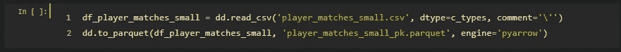

将文件插入 S3 就像创建一个存储桶、定义访问规则和用 AWS 控制台上传我的文件一样简单。由于文件读写请求将来自我自己的 AWS 帐户和同一个虚拟私有云(VPC)，我不需要编辑默认访问权限。

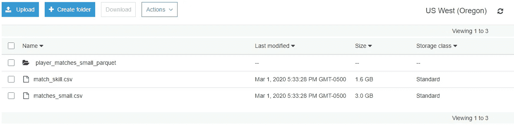

**2。初始化胶水数据库:**为了向胶水数据目录添加数据，我首先需要将胶水数据库定义为一个逻辑容器。我把我的命名为“gluedb”。

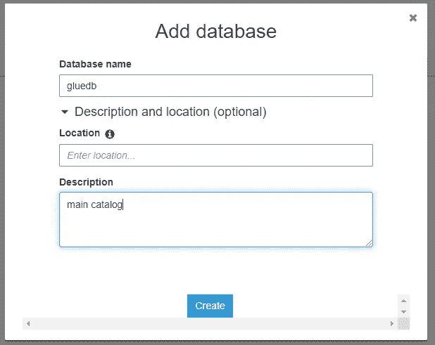

**3。创建粘合爬虫来构建数据目录:**接下来，我需要将我的数据“摄取”到模型中。我实际上并没有在这里移动任何数据，我只是要创建几个 Glue crawlers 来扫描我的 S3 桶，并从它们找到的文件中推断出我的数据的自然格式。我将为包含我的两个 csv 文件的文件夹定义一个，为保存我的所有 parquet 分区和元数据的子文件夹定义一个。这里很重要的一点是，每个爬虫都拥有对我的 S3 存储桶的读取和列表访问权限，我可以通过附加一个正确定义的 IAM 角色来授予它这种权限。

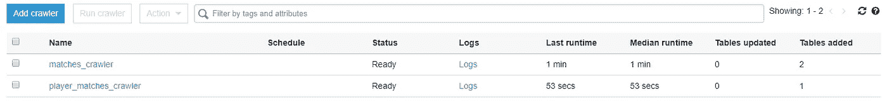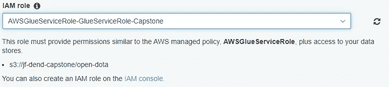

在运行每一个之后，我的 gluedb 数据库目录被填充:

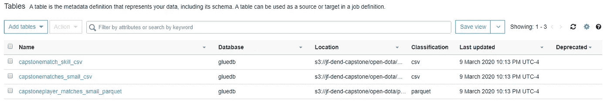

**4。为 S3 配置 VPC 端点:**因为我要将数据移出 S3，所以我需要创建一个 VPC 端点，这是一个允许传输文件的网关。我可以从 AWS 控制台 VPC 页面执行此操作，并确保与正确的子网相关联。

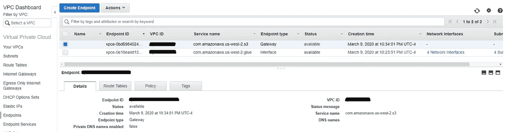

**5。竖起红移星团:**现在我们准备竖起一个红移星团来容纳我们的最终表。亚马逊通过控制台简化了这个过程——只要确保它和 S3 在同一个子网中。对于这个项目，我知道我的表相对来说很小，所以我将选择在 1 dc2.large 节点上托管它们，该节点带有 160gb 的 SSD。重要的是要确保我在这里附加了一个 IAM 角色，它授予适当的红移安全性和访问控制。

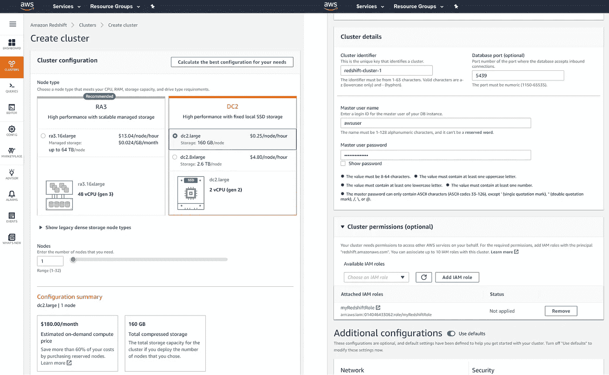

**6。定义 SQL 模式，创建表:**现在架构已经就绪，我可以编写实际的 ETL 过程，将数据从源文件传输到目标表中。首先，我将定义我的最终模式，并通过基于控制台的编辑器在我的 Redshift 集群上执行 SQL 查询来创建我的最终表。

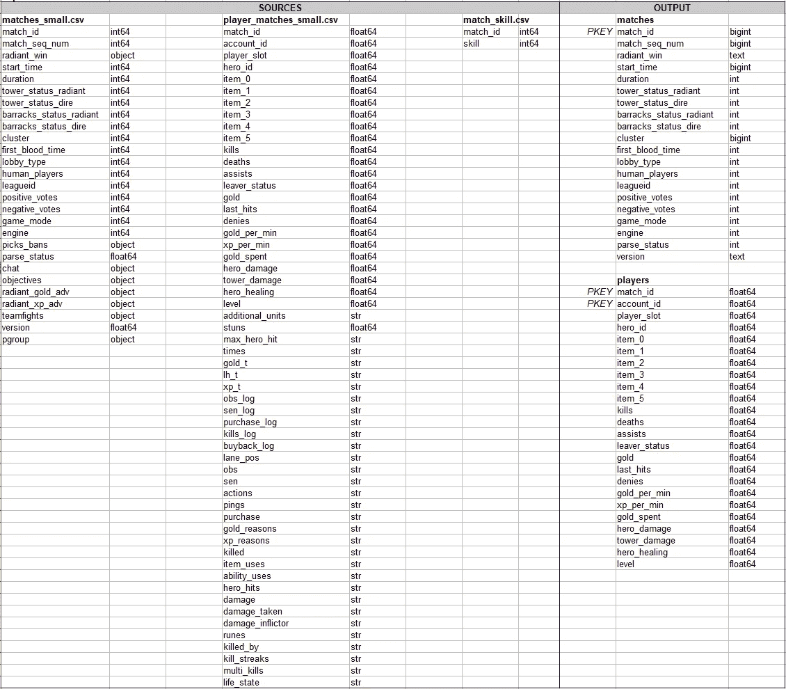

你会注意到我从‘matches’和‘player _ matches’中删除了大量字段。这有两个原因。“聊天”等一些字段包含大量非结构化文本，不适合存储在 SQL 表中；如果我想让它可供查询，我需要建立一个适当的数据存储。此外，我删除的大多数字段实际上都是 json 对象的字符串表示。例如，聊天字段是 json，遵循 OpenDoTA 文档中的结构:

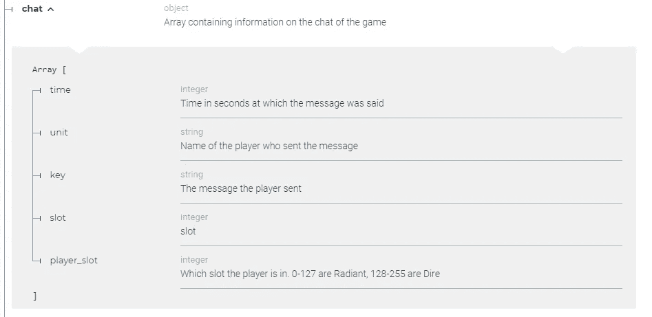

一个合适的解决方案是使用 pyspark 从这些字段中推断出 json 模式，然后使用它们填充一个完整的星型模式，该模式由少量维度表组成，这些维度表通过自然键和派生键连接到一组事实表。然而，对于这个项目的目的，我只是对 AWS 工作流的概念证明感兴趣，不会费心解析这些字段。

7 .**。定义粘合作业:**准备好最终的表格后，我就可以开始移动数据了。我可以通过创建胶合作业来实现这一点，胶合作业可以按计划、按触发或按需运行。创建 Glue jobs 的有趣之处在于，它实际上可以是一个几乎完全基于 GUI 的活动，只需点击几下按钮就可以自动生成必要的 python 代码。但是，我将做一些编辑，以便综合多个源文件并执行就地数据质量验证。默认情况下，Glue 使用 DynamicFrame 对象来包含关系数据表，并且它们可以很容易地来回转换为 pyspark 数据帧以进行自定义转换。我所有的 ETL 脚本都可以在这个项目的 GitHub 资源库中找到，链接在本文末尾。

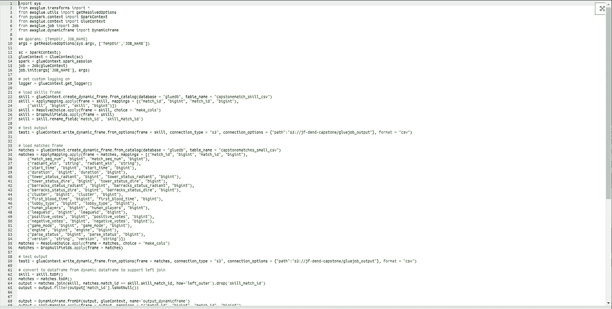

运行后:

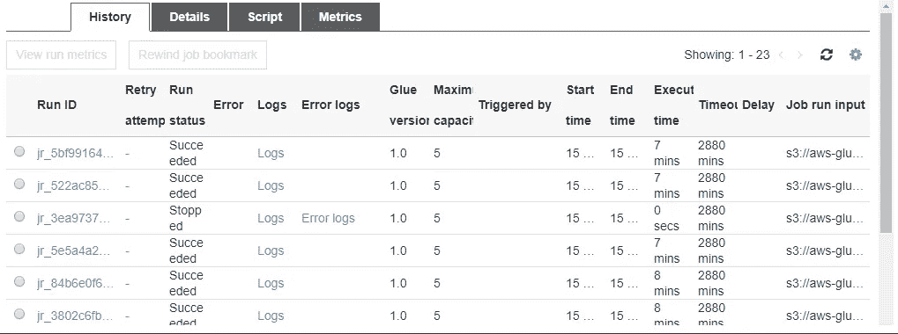

两个表都已完全填充并准备好进行 SQL 查询:

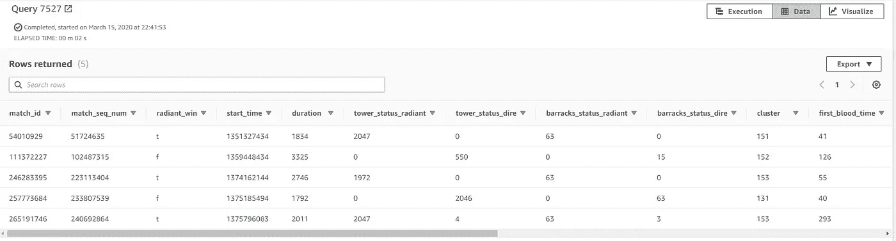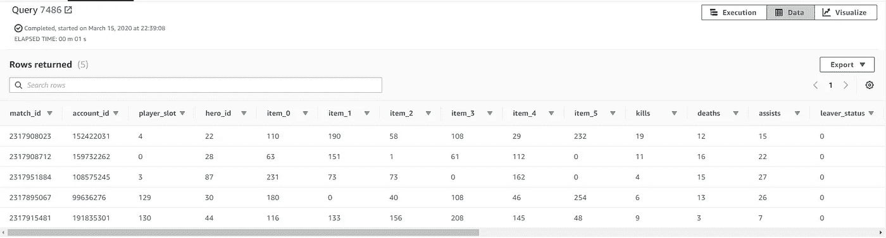

重申一下，我现在已经建立了一个过程，通过这个过程，我从自己的硬盘上加载数据，将它存放在云中，并将其转换成一对目的地事实来源表。基础云架构现在已经就绪，我可以发展和定制我的 ETL 流程，我在这里可以做的额外工作是真正生产这个数据流，这取决于我特定的分析需求。例如，通过对我的 ETL 作业进行一些修改，我可以改进这个过程，以便在我向 S3 上传额外文件时自动合并我的数据表，我还可以规范化我的目标表并包含我选择删除的字段。为了这个概念验证项目的目的，我的工作已经完成了！

我想特别感谢我的朋友兼同事[斯图尔特·明舒尔](https://www.linkedin.com/in/stuartminshull/)，他是亚马逊网络服务的高级云架构师，他就我在这个项目中采用的总体架构和最佳实践向我提供了咨询！

*Github:*[*https://github.com/jfreds91/DEND_Capstone*](https://github.com/jfreds91/DEND_Capstone)