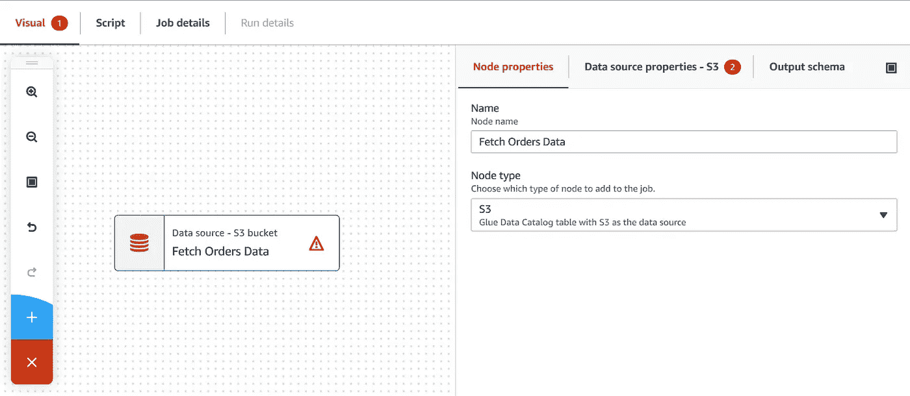

# AWS Glue Studio——没有火花技能——没问题

> 原文：<https://towardsdatascience.com/aws-glue-studio-no-spark-skills-no-problem-b3204ed98aa4?source=collection_archive---------27----------------------->

## 使用 AWS Glue Studio 轻松创建 Spark ETL 作业——不需要 Spark 经验


图片由[皮克斯拜](https://pixabay.com/?utm_source=link-attribution&utm_medium=referral&utm_campaign=image&utm_content=2167835)的 Gerd Altmann 提供

**AWS 胶水工作室**近日上线。有了 AWS Glue Studio，您可以使用 GUI 来创建、管理和监控 ETL 作业，而不需要 Spark 编程技能。用户可以通过可视地定义 ETL 作业的源/转换/目的节点来可视地创建 ETL 作业，该 ETL 作业可以执行诸如获取/保存数据、连接数据集、选择字段、过滤等操作。一旦用户组装了 ETL 作业的各个节点，AWS Glue Studio 就会自动为您生成 Spark 代码。

AWS Glue Studio 支持许多不同类型的数据源，包括:

*   S3
*   无线电数据系统
*   由外界刺激引起的不随意运动
*   卡夫卡

让我们尝试创建一个简单的 ETL 作业。这个 ETL 作业将使用 3 个数据集- *订单、订单细节和产品*。目标是连接这三个数据集，选择几个字段，最后过滤产品 MRSP 大于 100 美元的订单。最后，我们希望将结果保存到 S3。

当我们完成时，ETL 工作应该看起来像这样。


作者图片

让我们从下载本教程所需的数据集开始。将数据集保存在 S3。

```
$ git clone [https://github.com/mkukreja1/blogs](https://github.com/mkukreja1/blogs)$ aws s3 mb s3://glue-studio
make_bucket: glue-studio$ aws s3 cp blogs/glue-studio/orders.csv s3://glue-studio/data/orders/orders.csv
upload: blogs/glue-studio/orders.csv to s3://glue-studio/data/orders/orders.csv$ aws s3 cp blogs/glue-studio/orderdetails.csv s3://glue-studio/data/orderdetails/orderdetails.csv
upload: blogs/glue-studio/orderdetails.csv to s3://glue-studio/data/orderdetails/orderdetails.csv$ aws s3 cp blogs/glue-studio/products.csv s3://glue-studio/data/products/products.csv
upload: blogs/glue-studio/products.csv to s3://glue-studio/data/products/products.csv 
```

我们将把这些文件保存到 S3，并使用 Glue Crawler 将它们编入**订单**数据库。

```
$ aws glue create-database --database-input '{"Name":"orders"}'$ aws glue create-crawler --cli-input-json '{"Name": "orders","Role": "arn:aws:iam::175908995626:role/glue-role","DatabaseName": "orders","Targets": {"S3Targets": [{"Path": "s3://glue-studio/data/orders/"},{"Path": "s3://glue-studio/data/orders/"}]}}'$ aws glue start-crawler --name orders$ aws glue delete-crawler --name orders$ aws glue create-crawler --cli-input-json '{"Name": "orderdetails","Role": "arn:aws:iam::175908995626:role/glue-role","DatabaseName": "orders","Targets": {"S3Targets": [{"Path": "s3://glue-studio/data/orderdetails/"},{"Path": "s3://glue-studio/data/orderdetails/"}]}}'$ aws glue start-crawler --name orderdetails$ aws glue delete-crawler --name orderdetails$ aws glue create-crawler --cli-input-json '{"Name": "products","Role": "arn:aws:iam::175908995626:role/glue-role","DatabaseName": "orders","Targets": {"S3Targets": [{"Path": "s3://glue-studio/data/products/"},{"Path": "s3://glue-studio/data/products/"}]}}'$ aws glue start-crawler --name products$ aws glue delete-crawler --name products
```

使用 AWS 控制台打开 **AWS Glue** service，并使用左侧菜单点击 **AWS Glue Studio** 。确保您选择了空白图表。点击**创建**。


作者图片

首先创建第一个转换节点- **获取订单数据**



作者图片

确保**获取订单数据**指向之前在 Glue 中分类的订单表。


作者图片

使用与上述相同的原则创建转换节点- **获取订单明细数据**以及**获取产品数据**

现在我们将创建一个转换节点，它将把**提取订单数据**连接到**提取订单详细信息数据。**


作者图片

请注意两个表之间的连接条件是如何定义的，如下所示。

使用相同的原理创建一个转换节点，该节点将连接**连接订单**到**获取产品数据。**


作者图片

因为我们想从三个表中选择一个列的子集，所以我们可以使用**选择字段**节点


作者图片

请注意如何为应该包含在最终结果集中的字段选择复选框。


作者图片

现在我们要过滤 MRSP 大于 100 美元的产品。这可以通过创建如下的**过滤器产品 MRSP > 100** 节点来实现。


作者图片

请注意如何定义一个或多个过滤条件。


作者图片

最后，我们希望将结果表以拼花格式保存到 S3。对于 tis，我们创建一个目的节点- **保存结果**


作者图片


作者图片

使用“保存”按钮保存您的 ETL 作业。这时你应该可以看到 **AWS Glue Studio** 已经自动为你生成了 Spark 代码。点击**脚本**菜单查看生成的代码。

```
import sys
from awsglue.transforms import *
from awsglue.utils import getResolvedOptions
from pyspark.context import SparkContext
from awsglue.context import GlueContext
from awsglue.job import Job
import re## [@params](http://twitter.com/params): [JOB_NAME]
args = getResolvedOptions(sys.argv, ['JOB_NAME'])sc = SparkContext()
glueContext = GlueContext(sc)
spark = glueContext.spark_session
job = Job(glueContext)
job.init(args['JOB_NAME'], args)
## [@type](http://twitter.com/type): DataSource
## [@args](http://twitter.com/args): [database = "orders", table_name = "orders", transformation_ctx = "DataSource0"]
## [@return](http://twitter.com/return): DataSource0
## [@inputs](http://twitter.com/inputs): []
DataSource0 = glueContext.create_dynamic_frame.from_catalog(database = "orders", table_name = "orders", transformation_ctx = "DataSource0")
## [@type](http://twitter.com/type): DataSource
## [@args](http://twitter.com/args): [database = "orders", table_name = "products", transformation_ctx = "DataSource2"]
## [@return](http://twitter.com/return): DataSource2
## [@inputs](http://twitter.com/inputs): []
DataSource2 = glueContext.create_dynamic_frame.from_catalog(database = "orders", table_name = "products", transformation_ctx = "DataSource2")
## [@type](http://twitter.com/type): DataSource
## [@args](http://twitter.com/args): [database = "orders", table_name = "orderdetails", transformation_ctx = "DataSource1"]
## [@return](http://twitter.com/return): DataSource1
## [@inputs](http://twitter.com/inputs): []
DataSource1 = glueContext.create_dynamic_frame.from_catalog(database = "orders", table_name = "orderdetails", transformation_ctx = "DataSource1")
## [@type](http://twitter.com/type): Join
## [@args](http://twitter.com/args): [keys2 = ["ordernumber"], keys1 = ["ordernumber"], transformation_ctx = "Transform2"]
## [@return](http://twitter.com/return): Transform2
## [@inputs](http://twitter.com/inputs): [frame1 = DataSource0, frame2 = DataSource1]
Transform2 = Join.apply(frame1 = DataSource0, frame2 = DataSource1, keys2 = ["ordernumber"], keys1 = ["ordernumber"], transformation_ctx = "Transform2")
## [@type](http://twitter.com/type): Join
## [@args](http://twitter.com/args): [keys2 = ["productcode"], keys1 = ["productcode"], transformation_ctx = "Transform3"]
## [@return](http://twitter.com/return): Transform3
## [@inputs](http://twitter.com/inputs): [frame1 = Transform2, frame2 = DataSource2]
Transform3 = Join.apply(frame1 = Transform2, frame2 = DataSource2, keys2 = ["productcode"], keys1 = ["productcode"], transformation_ctx = "Transform3")
## [@type](http://twitter.com/type): SelectFields
## [@args](http://twitter.com/args): [paths = ["ordernumber", "orderdate", "requireddate", "shippeddate", "status", "productname", "msrp"], transformation_ctx = "Transform1"]
## [@return](http://twitter.com/return): Transform1
## [@inputs](http://twitter.com/inputs): [frame = Transform3]
Transform1 = SelectFields.apply(frame = Transform3, paths = ["ordernumber", "orderdate", "requireddate", "shippeddate", "status", "productname", "msrp"], transformation_ctx = "Transform1")
## [@type](http://twitter.com/type): Filter
## [@args](http://twitter.com/args): [f = lambda row : (row["msrp"] > 100), transformation_ctx = "Transform0"]
## [@return](http://twitter.com/return): Transform0
## [@inputs](http://twitter.com/inputs): [frame = Transform1]
Transform0 = Filter.apply(frame = Transform1, f = lambda row : (row["msrp"] > 100), transformation_ctx = "Transform0")
## [@type](http://twitter.com/type): DataSink
## [@args](http://twitter.com/args): [connection_type = "s3", format = "parquet", connection_options = {"path": "s3://glue-studio/results/", "partitionKeys": []}, transformation_ctx = "DataSink0"]
## [@return](http://twitter.com/return): DataSink0
## [@inputs](http://twitter.com/inputs): [frame = Transform0]
DataSink0 = glueContext.write_dynamic_frame.from_options(frame = Transform0, connection_type = "s3", format = "parquet", connection_options = {"path": "s3://glue-studio/results/", "partitionKeys": []}, transformation_ctx = "DataSink0")
job.commit()
```

我们都准备好了。让我们使用右上角的**运行**按钮运行作业。点击**运行详细信息**会显示正在运行的作业的状态。一旦作业状态变为**成功**，您就可以去 S3 查看作业的最终结果。


作者图片

此时，结果文件夹中应该会生成许多拼花文件。


作者图片

您可以使用 Apache Parquet 查看器检查文件的上下文。


作者图片

我希望这篇文章是有帮助的。 **AWS Glue Studio** 是由 [Datafence Cloud Academy](http://www.datafence.com) 提供的 AWS 大数据分析课程的一部分。课程是周末自己在网上教的。