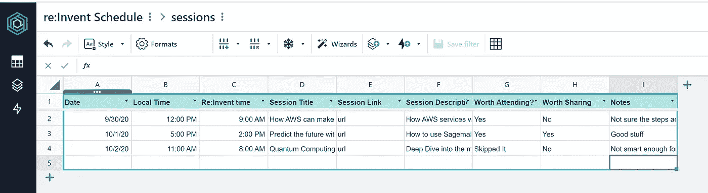

# AWS honey code—没有代码

> 原文：<https://towardsdatascience.com/aws-honeycode-take-away-the-code-1a90de96e00c?source=collection_archive---------41----------------------->

## 打造自己的 AWS re: Invent 2020 日程应用

图片由[皮克斯拜](https://pixabay.com/?utm_source=link-attribution&utm_medium=referral&utm_campaign=image&utm_content=3468244)的 Gerd Altmann 提供

AWS Honeycode 最近在[发布](https://aws.amazon.com/blogs/aws/introducing-amazon-honeycode-build-web-mobile-apps-without-writing-code/)，作为 AWS 提供的“无代码应用构建器”。对于熟悉微软 Power 应用的人来说，Honeycode 非常类似。该服务的重点是为团队协作设置工具。我没有看到在工具外部共享应用程序的选项。要想和朋友分享应用，看看 [AppSheet](https://www.appsheet.com/) 。我把它用于非盈利活动，给数百名儿童分发节日礼物。它在这方面做得很好。

我决定做一个演示来创建一个简单的 [AWS re: Invent 2020](https://reinvent.awsevents.com/) 会话调度器。今年的会议为期三周(并且是免费和虚拟的)。为我不想错过的会议做计划；我需要有条理！

## 在某种程度上是免费的

Honeycode 界面仍处于测试模式。我没有被要求提供任何付款信息来设置这个演示。您可以免费添加多达 20 个成员或多达 2500 个数据行。还不错。

## 入门指南

[登录蜜码](https://builder.honeycode.aws/):

这是**而不是**你的 AWS 账户，有趣点。我想象这个工具将在某个时候集成到 AWS 控制台中。

## 一切从你的数据开始。

我还没有会议时间表，所以我创建了一些感兴趣的话题。

我还设置了一个空白表来存放日程数据。我增加了一些额外的领域，在那里我可以思考好的和坏的。几天后，会议往往会变得模糊不清。

## 是时候“构建”应用程序了

[Amazon Honeycode](https://builder.honeycode.aws/) 包含基本模板，帮助您启动和运行。你总是可以从基本模板开始，然后在此基础上进行个性化和趣味化。

样本模板—作者截屏

我使用定制构建，而不是使用任何向导或模板。有一些试错的成分。如果你以前用过 Power Apps，那就非常类似了。

我的应用程序将有两个屏幕。主屏幕是我的个性化时间表。我想显示我的日程安排。第二个屏幕将列出我可以查看并添加到我的时间表中的所有会议。

我添加了两个带动作的按钮。一个是从我的日程表上删除一个时段。一个是在我的日程表上增加一节课。相当直接。

## 结果呢

嗯，它不会赢得任何设计奖。考虑到我只花了大约一个小时创建一个帐户和这个应用程序，这是足够体面的。

我的简历:发明日程表应用主页——作者截图

会话详细信息和选取器屏幕—作者截屏

我可以下载应用程序并在手机上使用。

作者手机截图

**结论**

如果你需要建立一个团队协作应用程序，并且不想乱搞代码，它与微软 PowerApps 兼容。它创造有用的结果。

如果你想开发一个供公众使用的无代码应用，你可能需要看看市场上的其他产品。