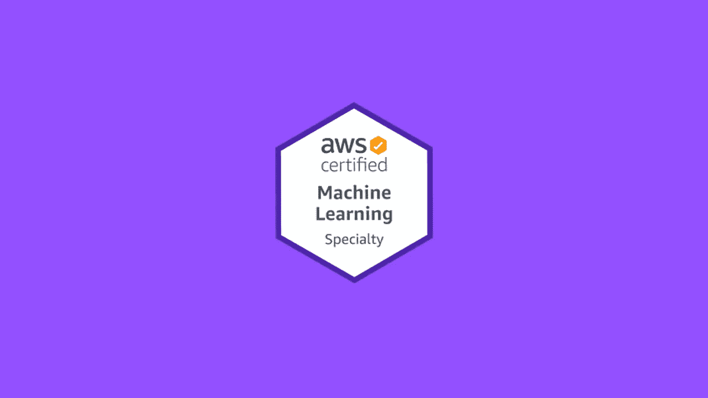

# 一个月后 AWS 机器学习专业认证

> 原文：<https://towardsdatascience.com/aws-machine-learning-speciality-certification-in-a-month-1a5987599927?source=collection_archive---------17----------------------->

## 我在一个月内决定参加、准备和通过 AWS 机器学习专业考试的经历

AWS 机器学习专业认证一个月通过[迪皮卡巴德](https://medium.com/u/cb4f6856d71b?source=post_page-----1a5987599927--------------------------------)

上周，我通过了 AWS 机器学习专业考试。我认为这将是我日常工作中值得学习和有用的东西。我提前一个月预定了日期，并相应地计划去实现它。如果你在这个领域，你的工作与 AWS 相关，我怎么推荐都不为过。在本帖中，我将分享我的备考经验和考试经验本身。

# 为什么我决定追求这个？

在攻读数据科学硕士学位之前和期间，我一直在数据科学领域工作。在我目前的工作中，我想专注于数据工程相关的工作，在 AWS 中为数据平台创建数据管道。在参加考试之前，我参加过数据科学项目，涉及生产中机器学习部署的项目和使用 AWS 服务的项目。我个人想通过 AWS 了解更多关于生产中的机器学习。我认为这将有助于我在 AWS 中交付端到端的机器学习产品。如今，大多数公司都在寻找这些技能，知道只有数据科学可能是不够的。

在 [AWS 网站](https://aws.amazon.com/certification/)上有不同级别的认证。我没有从助理级别证书开始，因为我已经有相关的经验来展示这一点，但人们可以通过这些来了解 AWS 提供的大多数服务。我正在寻找机器学习的具体和这个专业证书击中了现场非常好。这也是我直接瞄准机器学习专业考试的原因。就在那时，我决定去约会。我知道，如果我觉得我没有准备好，我可以在考试前 24 小时推迟考试。但是给自己更少的时间促使我坚持这个计划。

# 评估我是否准备好了

我做的第一件事就是检查他们[机器学习专业认证页面](https://aws.amazon.com/certification/certified-machine-learning-specialty/)上的样题，看看我是否能做到这一点。我不能马上知道答案，但是我知道哪些部分我可以通过学习掌握，哪些部分我已经知道了。机器学习相关的东西，比如 NLP，优化和我熟悉的模型。我认为 AWS 特定的解决方案和内置算法需要我做一些工作。这给了我一个想法，是否有可能在一个月内通过考试。

在[同一页](https://aws.amazon.com/certification/certified-machine-learning-specialty/)上，AWS 给出了考试指南，涵盖了考试将涉及的主要领域。这也能让你更好地了解你已经知道了多少，哪些需要更多的准备。对我来说，在我的一些项目中，我以这样或那样的方式接触过这些领域，所以这是一个很好的指标，表明我能够理解那些主题和用例。

# 用于准备的材料

以下是我准备时使用的主要资源:

1.  [关于 AWS 机器学习专业 2020 的 Udemy 课程——动手！](https://www.udemy.com/course/aws-machine-learning/learn/lecture/16643684#questions)
2.  [关于 AWS 机器学习专业实践考试的 Udemy 课程](https://www.udemy.com/course/aws-machine-learning-practice-exam/learn/quiz/4713424/results?expanded=281284626#overview)
3.  [面向合作伙伴的 AWS 解决方案培训:AWS 上的机器学习—技术(数字)](https://www.aws.training/Details/Curriculum?id=22327)
4.  [亚马逊 SageMaker:使用标记有地面真相的图像建立一个对象检测模型](https://www.aws.training/Details/Video?id=37702)
5.  [AWS SageMaker 开发者指南](https://docs.aws.amazon.com/sagemaker/latest/dg/whatis.html)

我完全可以推荐前两个备考资源，因为我觉得模拟考试对试题的设计有更好的了解，而且它还涵盖了考试领域的大部分类型和内容。第一门课程涵盖了考试的必要材料和提到的所有领域。这是很好的结构和考试的要点材料。他们没有涵盖 ML 的基础知识和 ML 模型的细节，因为假设如果你参加这次考试，你应该有在实践中使用数据科学的经验。

例如，作为一名经验丰富的机器学习实践者，你应该知道如何优化模型，需要调整哪些参数，以及如何清理数据以改进模型。包括深度学习内置算法何时何地使用。基于用例，您是否应该选择定制模型或在内置模型本身的基础上转移学习等等。但课程不会深入细节。根据考试的先决条件，这是有道理的。

对我来说，课程和考试对解决考试中的实际问题很有帮助。AWS 本身也提供很多数字课程和课堂课程。我发现上面第 3 点和第 4 点提到的一些课程很有用。课程 3 深入探讨了 Udemy 课程中没有的解决方案和各种用例。我喜欢它有几个实验室，这有利于获得一些实践，并对所使用的工具感到舒适。课程 4 是我出于兴趣观看的，如果你感兴趣并且有时间，你也可以浏览一下。

AWS SageMaker 开发人员指南是 SageMaker 的一个很好的参考资料，我发现除了这些课程之外阅读它也很有用。很难在一门课程中涵盖所有内容，所以如果时间允许的话，浏览一下文档是很有用的。特别是我深入研究了[内置](https://docs.aws.amazon.com/sagemaker/latest/dg/algos.html)算法的细节。

# 规划和准备

在最初的一周半时间里，我浏览了 Udemy 课程和一些与这些主题相关的阅读材料。我进行了第一次模拟考试，我很清楚有什么类型的问题，我需要在课程中注意什么。

在接下来的两个星期里，我一边复习课程，一边记下我发现需要明确记住的要点。除此之外，我还浏览了上面提到的一些 AWS 课程以及它们的文档。

在过去的 5 天里，我进行了多次测试。我还浏览了 AWS 的样题。那时我知道我完全可以参加这次考试，没有必要推迟。

# 考试经历

说实话，我觉得实际考试比我预想的或准备的要难。我真的很满意难度水平，因为他们认为你有关于实际实现的知识和一般的机器学习知识。我能够在一个半小时内完成考试，而不用回去复习问题。许多人喜欢标记几个问题来复习，你可以在最后不确定的地方回到那些问题上。

我以前从项目中学到的一些知识和我在机器学习方面的数学背景对解决这些问题很有用。这不是我前一个月准备的东西的一部分。人们应该根据基础数据知道选择哪个模型，以及背后的原因是什么。同样，您应该能够为给定的用例以及资源限制等选择正确的内置模型或服务。我觉得我在考试前练习的这个考试为我朝那个方向思考做好了准备，但也准备好发现一些与 ML 主题相关的问题，这些问题可能在上面提到的课程中没有涉及。

希望这份素材和策划经验对你有帮助如果你志在必得的话:)

一如既往——愉快的实验和探索！