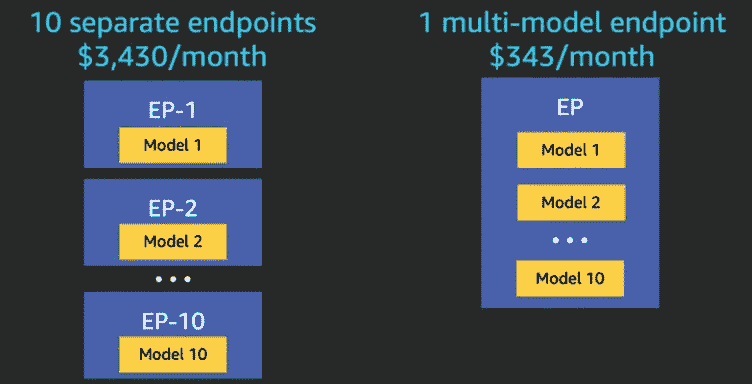
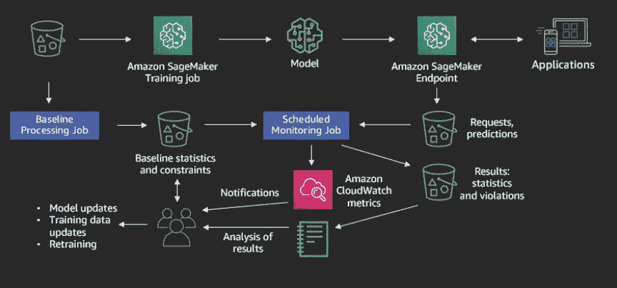
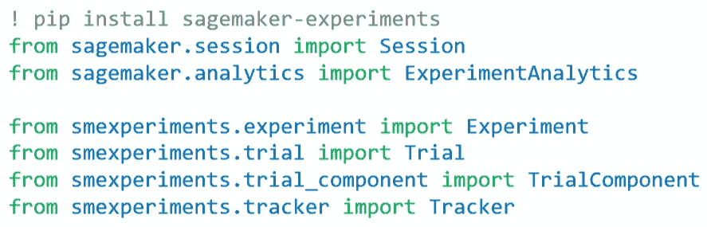
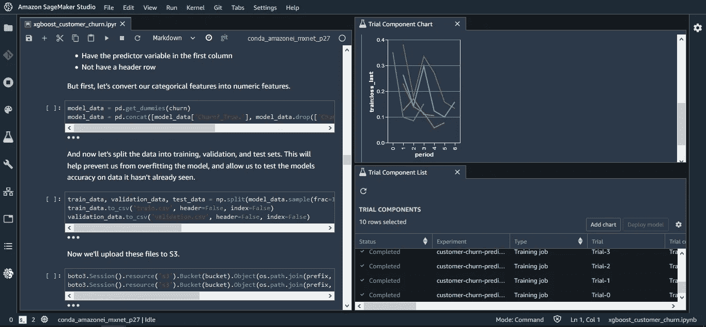
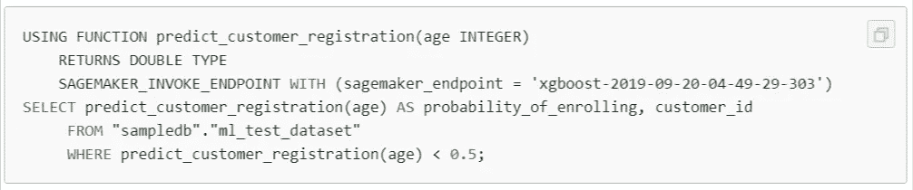

# AWS SageMaker 更新 2019

> 原文：<https://towardsdatascience.com/aws-sagemaker-updates-2019-307323d2c01c?source=collection_archive---------35----------------------->

## 2019 年 12 月 re:Invent 发布的新功能

AWS SageMaker 正迅速成为构建和部署机器学习模型的最受欢迎的工具之一。它以易于使用的 AWS 预制模型和一个将定制模型放在 web 端点后面的框架吸引了开发人员和数据科学家。

去年 12 月在 re:Invent 2019 上公布了许多更新。我总结了一些重要的，整理了链接，如果你想了解更多。

希望你觉得有用！

*注意:如果你是 SageMaker 的新手，有大量关于 Medium 的文章向你介绍它。(* [*从这里开始*](https://medium.com/towards-artificial-intelligence/aws-sagemaker-32af6c18d7f0) *)*

# 1.多型号集装箱

在发布多型号容器之前，每个 SageMaker 型号都将放在一个单独的 docker 容器中。这是低效的，原因有两个:1)有时你的应用程序有不止一个模型，你想把所有的模型组合成一个单元。2)许多 ML 应用程序将具有相同/相似的依赖关系，这可能没有意义旋转 4 个不同的 docker 容器，它们都具有相同的`requirements.txt`文件。

我提到成本节约了吗？([了解更多](https://aws.amazon.com/blogs/machine-learning/save-on-inference-costs-by-using-amazon-sagemaker-multi-model-endpoints/))

来源:[https://AWS . Amazon . com/blogs/machine-learning/save-on-inference-costs-by-use-Amazon-sage maker-multi-model-endpoints/](https://aws.amazon.com/blogs/machine-learning/save-on-inference-costs-by-using-amazon-sagemaker-multi-model-endpoints/)

# 2.部署监控

所以你建立了一个机器学习模型。然后你挣扎了几个月，试图找出如何让它在商业用户手中。在你最终想出如何将它整合到现有的软件和业务流程中之后…现在你就完成了，对吗？

不对。世界在不断变化。您不希望您的模型变得过时，或者意外地对错误的数据做出推论或建议。

队列 SageMaker 模型监视器。这将查看您的训练数据，并自动生成关于每个变量应该是什么样子的规则和统计数据(您也可以自己输入这些数据)，然后监控进入模型的输入数据。

来源:[https://docs . AWS . Amazon . com/sage maker/latest/DG/model-monitor . html](https://docs.aws.amazon.com/sagemaker/latest/dg/model-monitor.html)

如果有异常数据，它会给你发消息。如果变量开始偏离模型的训练目标，您可以让它自动触发一个重新训练任务。([了解更多](https://docs.aws.amazon.com/sagemaker/latest/dg/model-monitor.html)

# 3.萨格马克实验

已经有一些工具可以帮助跟踪 ML 实验(见 [Domino](https://blog.dominodatalab.com/announcing-domino-3-3-datasets-and-experiment-manager/) 和 [Cloudera](https://docs.cloudera.com/documentation/data-science-workbench/1-6-x/topics/cdsw_experiments.html) )，但是开源的并不多。许多数据科学家只是在(*在此插入您最喜欢的 ML 框架*)中编写他们自己的实验脚本或模块。

AWS 发布了 SageMaker 实验，以及一个 Python SDK 来帮助数据科学家建立和跟踪 ML 实验。下面是该框架中的一些主要概念，可以帮助您入门。([了解更多](https://github.com/aws/sagemaker-experiments))

**试验**:您希望比较的相关试验的集合

**试验**:多步骤 ML 工作流程的描述。每个步骤都由一个 TrialComponent 描述

**TrailComponent** :对 ML 工作流中单个步骤的描述

**Tracker** :用于记录单个 TrialComponent 信息的 python 上下文管理器

# 4.SageMaker 自动驾驶仪

一旦你使建立模型、运行实验、部署端点和监控生产 ML 应用变得容易；你也可以将整个过程自动化。AutoPilot 和其他 AutoML 软件最大的区别就是*透明*。曾经有一种二分法，一种是易于使用但难以信任的黑盒 AutoML，另一种是由数据科学家从零开始构建的模型，这种模型更容易信任但更难构建。

AutoPilot 对它正在做的算法、实验、参数和其他一切都是完全透明的。这应该有助于启动数据科学家的工作流程，而不是取代它。数据科学家现在将花更多的时间来解释结果，理解潜在的业务问题，并进行特征工程以改善结果；同时花费更少的时间来确定在随机森林中使用哪个分裂标准或者在支持向量机中使用哪个核。

# 5.SageMaker 工作室

最后，数据科学家的 IDE。SageMaker Studio 与其他 IDE 的区别在于它专注于可视化数据和跟踪 ML 实验。它利用了其他流行的工具，如 Jupyter 笔记本和与 git 的集成。数据科学家需要了解的一切都可以在单一控制台中获得。它似乎还能与其他 SageMaker 工具很好地配合，用于实验、部署和监控。([了解更多](https://aws.amazon.com/blogs/aws/amazon-sagemaker-studio-the-first-fully-integrated-development-environment-for-machine-learning/)

图片来自文档:[https://AWS . Amazon . com/blogs/AWS/Amazon-sagemaker-studio-the-first-fully-integrated-development-environment-for-machine-learning/](https://aws.amazon.com/blogs/aws/amazon-sagemaker-studio-the-first-fully-integrated-development-environment-for-machine-learning/)

# 6.SageMaker 算子

在引擎盖下，SageMaker 是一个 docker 容器。当你从头开始构建一个 SageMaker 模型时，你只是让你的 ML 应用程序结构符合 SageMaker 期望的容器结构[。这使得它非常适合 Kubernetes，这是一个非常流行的编排容器化应用程序的工具。](https://sagemaker-workshop.com/custom/containers.html)

SageMaker 运营商为公司和个人提供了一种将 SageMaker 完成的工作与他们的 K8 系统集成的方式。现在，您可以通过 Kubernetes API 或 kubectl 命令与 ML 训练、调优和推理容器进行交互。([了解更多](https://aws.amazon.com/about-aws/whats-new/2019/12/introducing-amazon-sagemaker-operators-for-kubernetes/))

# 7.从 SQL 命令调用 SageMaker

现在，您可以直接从 AWS (Athena 或 Aurora)中的 SQL 查询调用 SageMaker 模型。这意味着整个组织中的分析师、开发人员和商业利益相关者更容易访问 ML 模型。

文档示例:[https://docs . AWS . Amazon . com/Athena/latest/ug/query-ml model . html](https://docs.aws.amazon.com/athena/latest/ug/querying-mlmodel.html)

对于某些用例来说，这似乎很好。但是说实话，如果您的数据视图以 ML 模型可以接受的方式进行了清理，那么运行批处理预测作业更有意义，然后将预测值保存到另一列的表中。这样，每个记录只调用一次模型，而不是每次对每个记录运行查询时调用*。([了解更多](https://docs.aws.amazon.com/athena/latest/ug/querying-mlmodel.html)*

# 结论

当 SageMaker 在 2017 年推出时，它落后于其他一些早期的 MLops 数据科学家工具。从那以后，它在新特性和新功能方面取得了突飞猛进的进步。随着这些工具变得更加强大，人们只能期待事情以更快的速度变化。

感谢阅读！