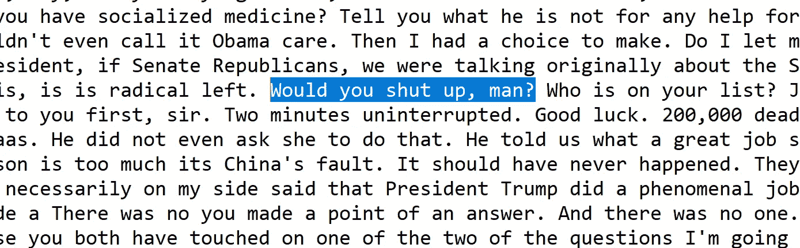
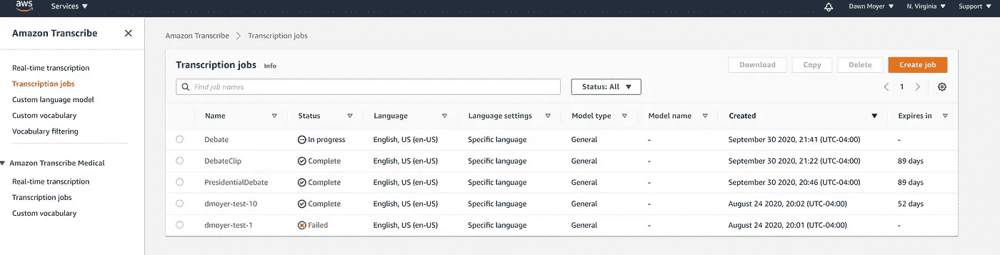
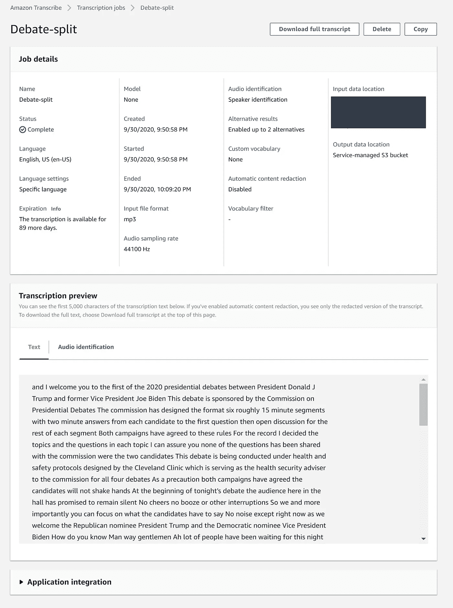
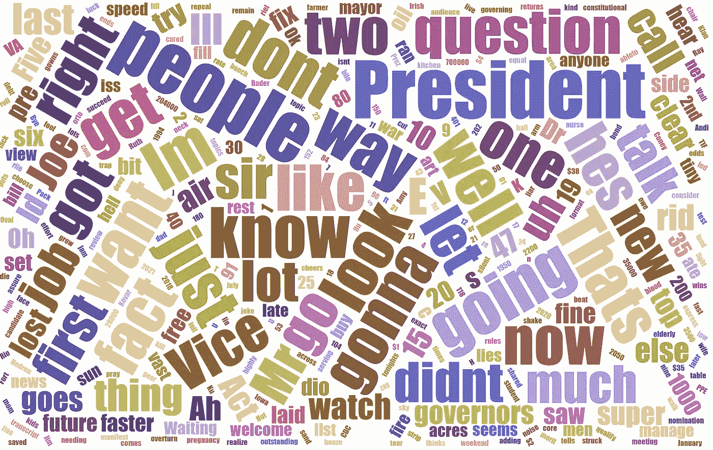

# AWS 转录总统辩论

> 原文：<https://towardsdatascience.com/aws-transcribes-the-presidential-debate-a9e7c5705fa?source=collection_archive---------45----------------------->

## 如何在 AWS 中设置多说话者声音转录



无论你的政治倾向如何，第一场 2020 年总统选举辩论都是一场垃圾大战。对于一个人来说，很难理解彼此在喊些什么。AWS 转录会怎么做？我们来设置一下，看一看。

## 数据

一个基本的谷歌搜索找到了音频剪辑。我不得不试了几个，直到我找到一个没有新闻评论的。

[https://wgnradio . com/news/audio-first-2020-总统-辩论-总统-唐纳德-特朗普-前副总统-乔-拜登/](https://wgnradio.com/news/audio-first-2020-presidential-debate-between-president-donald-trump-and-former-vice-president-joe-biden/)

## 设置

我已经有一个 AWS 账户，并在一个月前订阅了亚马逊转录。我所要做的就是点击创建工作。我选的是一般型号，要求多扬声器细分，一共三个扬声器。


转录作业设置-由作者截图一些可选设置，然后点击创建-由作者截图。

音频分割作业比常规作业运行时间长。有道理。考虑到文件长达 90 分钟，20 分钟的运行时间是合理的。



## 结果呢

我运行了两个任务，一个是多说话人识别，一个是无故障。你可以得到一个翻译预览，你可以下载整个脚本。



文字记录保存在一个 JSON 文件中。我把它转换成文本，并把两套都加载到 Kaggle 上，这样你就可以自己查看了。

[https://www . ka ggle . com/silverfoxdss/20-总统辩论-9 月 29 日-音频-文字稿](https://www.kaggle.com/silverfoxdss/20-presidential-debate-sept-29th-audio-transcript)

## 抄本

好吧，亚马逊直接从盒子里转录也不能解决这个问题！我强调了辩论中我记得有重叠对话的两个地方。是的，我不严谨地使用了“对话”这个词。

> “呃，副总统先生，如果参议院共和党人，我们最初在这里谈论的是最高法院，如果参议院共和党人继续下去并确认 Barrett 法官，呃，已经有人谈论结束阻挠议事或甚至打包法院，增加那里的 9 名法官。你称之为总统的干扰。但事实上，并不是总统提出来的。这是你的一些民主党同事在了解国会时提出来的。所以我的问题是你过去拒绝谈论它。今晚你是否愿意告诉美国人民，你是否会支持结束阻挠议事或打包我采取的任何立场，这将成为问题？
> 
> 问题是美国人民应该发言。你应该出去投票。你现在在投票。投票，让你的参议员知道你的感受有多强烈。让我们现在投票，确保你，事实上，让人们知道在哪里。
> 
> 参议员们，我不会回答这个问题，因为答案，因为这个问题是激进左派。你能闭嘴吗，伙计？谁在你的名单上？乔，这是你的先生们的。我认为这是不可印刷的。挤满了球场。我们没有付出。
> 
> 我们已经结束了这一部分。我们将进入第二部分。
> 
> 那真的很有成效。段亦琛**不住地瞎扯，伙计**。人民理解，乔。47 年了，你什么都没做。他们明白。好吧。
> 
> 第二个主题是秘密 19，这是一个非常严肃的主题，所以让我们认真对待它。

这是 JSON 上的一个小片段，它试图将对话分开。它似乎试图通过声音打断对话，但似乎无法识别是哪个说话者。这个 JSON 需要额外的代码来使它可读和有用。

```
{“transcript”:”gentleman. I think this is unprintable. Pack the court. We have not given. We have ended the segment. We’re gonna move on to the second segment. That was really productive. Segment wasn’t. Yeah.”,”items”:[{“start_time”:”1013.97",”confidence”:”0.368",”end_time”:”1014.8",”type”:”pronunciation”,”content”:”gentleman”},{“confidence”:”0.0",”type”:”punctuation”,”content”:”.”},{“start_time”:”1014.81",”confidence”:”1.0",”end_time”:”1014.93",”type”:”pronunciation”,”content”:”I”},{“start_time”:”1014.93",”confidence”:”1.0",”end_time”:”1015.38",”type”:”pronunciation”,”content”:”think”},{“start_time”:”1015.39",”confidence”:”0.998",”end_time”:”1015.57",”type”:”pronunciation”,”content”:”this”},{“start_time”:”1015.57",”confidence”:”0.998",”end_time”:”1015.75",”type”:”pronunciation”,”content”:”is”},{“start_time”:”1015.76",”confidence”:”0.861",”end_time”:”1016.76",”type”:”pronunciation”,”content”:”unprintable”},{“confidence”:”0.0",”type”:”punctuation”,”content”:”.”},{“start_time”:”1016.76",”confidence”:”0.5",”end_time”:”1017.01",”type”:”pronunciation”,”content”:”Pack”},{“start_time”:”1017.01",”confidence”:”0.782",”end_time”:”1017.11",”type”:”pronunciation”,”content”:”the”},{“start_time”:”1017.11",”confidence”:”0.907",”end_time”:”1017.5",”type”:”pronunciation”,”content”:”court”},{“confidence”:”0.0",”type”:”punctuation”,”content”:”.”},{“start_time”:”1017.51",”confidence”:”0.586",”end_time”:”1017.64",”type”:”pronunciation”,”content”:”We”},{“start_time”:”1017.64",”confidence”:”0.647",”end_time”:”1017.87",”type”:”pronunciation”,”content”:”have”},{“start_time”:”1017.88",”confidence”:”0.976",”end_time”:”1018.27",”type”:”pronunciation”,”content”:”not”},{“start_time”:”1018.27",”confidence”:”0.188",”end_time”:”1018.73",”type”:”pronunciation”,”content”:”given”},{“confidence”:”0.0",”type”:”punctuation”,”content”:”.”},{“start_time”:”1018.74",”confidence”:”0.456",”end_time”:”1018.93",”type”:”pronunciation”,”content”:”We”},{“start_time”:”1018.93",”confidence”:”0.978",”end_time”:”1019.09",”type”:”pronunciation”,”content”:”have”},{“start_time”:”1019.09",”confidence”:”1.0",”end_time”:”1019.56",”type”:”pronunciation”,”content”:”ended”},{“start_time”:”1019.57",”confidence”:”0.693",”end_time”:”1019.73",”type”:”pronunciation”,”content”:”the”},{“start_time”:”1019.73",”confidence”:”1.0",”end_time”:”1020.19",”type”:”pronunciation”,”content”:”segment”},{“confidence”:”0.0",”type”:”punctuation”,”content”:”.”},{“start_time”:”1020.19",”confidence”:”0.981",”end_time”:”1020.28",”type”:”pronunciation”,”content”:”We’re”},{“start_time”:”1020.28",”confidence”:”0.938",”end_time”:”1020.44",”type”:”pronunciation”,”content”:”gonna”},{“start_time”:”1020.44",”confidence”:”1.0",”end_time”:”1020.62",”type”:”pronunciation”,”content”:”move”},{“start_time”:”1020.62",”confidence”:”0.779",”end_time”:”1020.76",”type”:”pronunciation”,”content”:”on”},{“start_time”:”1020.76",”confidence”:”0.779",”end_time”:”1020.84",”type”:”pronunciation”,”content”:”to”},{“start_time”:”1020.84",”confidence”:”1.0",”end_time”:”1020.95",”type”:”pronunciation”,”content”:”the”},{“start_time”:”1020.95",”confidence”:”1.0",”end_time”:”1021.32",”type”:”pronunciation”,”content”:”second”},{“start_time”:”1021.32",”confidence”:”0.998",”end_time”:”1021.83",”type”:”pronunciation”,”content”:”segment”},{“confidence”:”0.0",”type”:”punctuation”,”content”:”.”},{“start_time”:”1021.84",”confidence”:”0.908",”end_time”:”1021.97",”type”:”pronunciation”,”content”:”That”},{“start_time”:”1021.97",”confidence”:”1.0",”end_time”:”1022.1",”type”:”pronunciation”,”content”:”was”},{“start_time”:”1022.1",”confidence”:”0.998",”end_time”:”1022.4",”type”:”pronunciation”,”content”:”really”},{“start_time”:”1022.41",”confidence”:”1.0",”end_time”:”1023.15",”type”:”pronunciation”,”content”:”productive”},{“confidence”:”0.0",”type”:”punctuation”,”content”:”.”},{“start_time”:”1023.15",”confidence”:”0.998",”end_time”:”1023.53",”type”:”pronunciation”,”content”:”Segment”},{“start_time”:”1023.53",”confidence”:”0.72",”end_time”:”1023.97",”type”:”pronunciation”,”content”:”wasn’t”},{“confidence”:”0.0",”type”:”punctuation”,”content”:”.”},{“start_time”:”1024.44",”confidence”:”0.024",”end_time”:”1024.5",”type”:”pronunciation”,”content”:”Yeah”},{“confidence”:”0.0",”type”:”punctuation”,”content”:”.”}]}]},{“start_time”:”1021.97",”end_time”:”1023.97",”alternatives”:
```

## 结论

唷！转录和 JSON 就像在电视直播中一样令人困惑。我给你们留下了辩论文本的文字云。在不同的辩论中比较它们会很有趣。在市政厅会议上，气氛变得更加乐观和乐观了吗？



辩论词云—作者截图