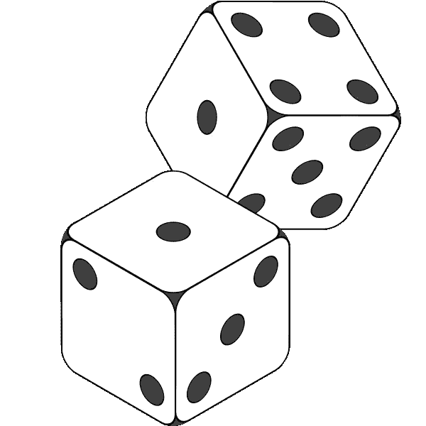
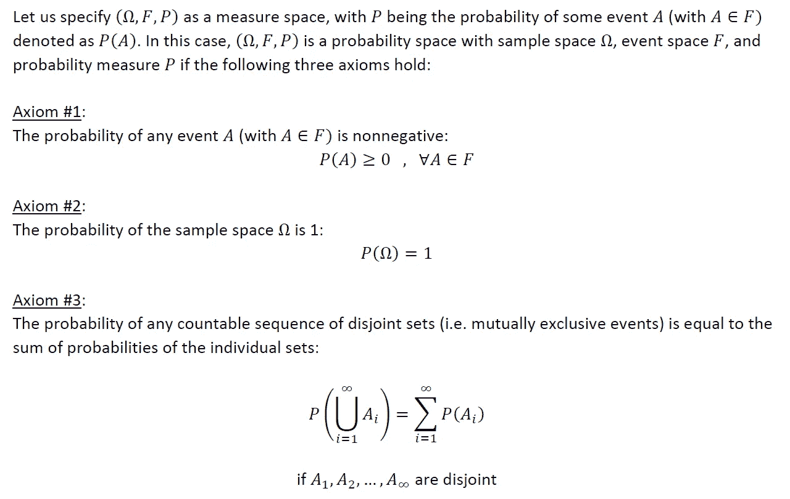
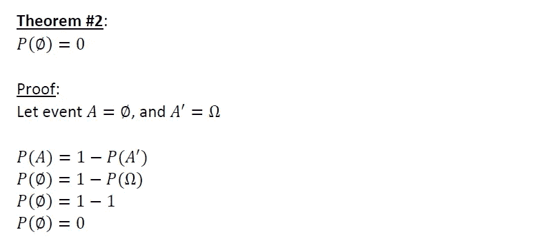
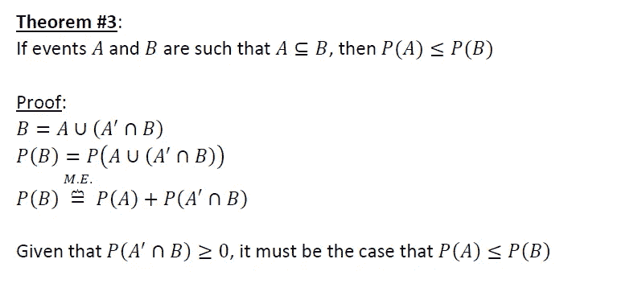
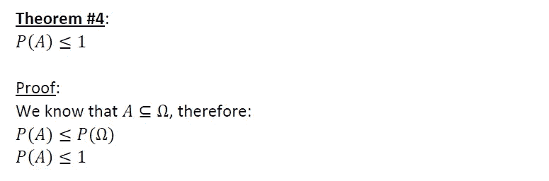
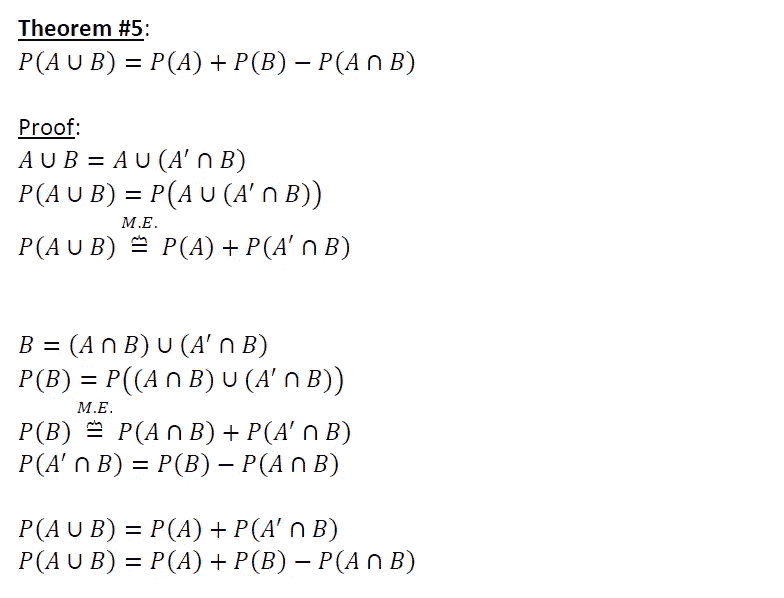

# 概率公理——理解基础

> 原文：<https://towardsdatascience.com/axioms-of-probability-understanding-the-foundations-52460fc05e99?source=collection_archive---------23----------------------->

## 概率论基础&几个证明

[来自“免费图标库”的图片](https://icon-library.com/icon/probability-icon-6.html)

这篇文章将会很简短。关于技术知识，我通常支持对正在使用的方法有坚实的基础和扎实的理解。我通常不喜欢记忆任何东西，并尽可能避免这样做。相反，我专注于发展概念的坚实基础，从这些基础中我可以用数学方法推导出我可能需要的任何东西。

下面是 Andrew Kolmogorov 在 1933 年提出的 Kolmogorov 公理。这三个公理构成了概率论的基础，概率中的其他定理或结果都可以从概率论中推导出来。我一直觉得有趣的是，不管一个概率定理或结果变得多么复杂，它都可以来源于这三个基本公理。我觉得简单迷人。下面是从这三个公理推导出的几个简单的概率定理。对 Medium 的快速搜索显示，这些证据和关系(据我所知)还没有被简单地组织在一篇文章中。这些都是值得了解的概念。

所以让我们开始吧:

# 三个概率公理:

# 示例定理和证明:

如上所述，这三个公理构成了概率论的基础，从这个基础上可以推导出概率中的其他定理或结果。下面是五个简单的**定理来说明这一点:**

*注意，在下面的证明中，M.E .代表“互斥”

# 最后的想法

希望以上有见地。正如我在以前的一些文章中提到的，我认为没有足够的人花时间去做这些类型的练习。对我来说，这种基于理论的洞察力让我在实践中更容易使用方法。我个人的目标是鼓励该领域的其他人采取类似的方法。我打算在未来写一些基础作品，所以请随时在 [**LinkedIn**](http://www.linkedin.com/in/andrew-rothman-49739630) 上与我联系，并在 Medium 上 [**关注我的更新！**](https://anr248.medium.com/)