# Azure Automated ML 倾听他们的设计师

> 原文：<https://towardsdatascience.com/azure-automated-ml-listens-to-their-designers-7f1c68d19eb4?source=collection_archive---------52----------------------->

## 本 autoML 系列的第 3 部分，微软，绝地大师

图片由[皮克斯拜](https://pixabay.com/?utm_source=link-attribution&utm_medium=referral&utm_campaign=image&utm_content=3382507)的 Gerd Altmann 提供

在这个 autoML 系列的第三部分中，我将继续测试各种 autoML 工具的易用性。专注于基本的开箱即用产品和寻找免费试用，我进入了微软的世界。我将我们的“沃森”训练文件发送到微软的 autoML 产品 Azure Automated ML 中。总的来说，Azure autoML 的用户体验比 [AWS AutoPilot](/is-aws-sagemaker-studio-autopilot-ready-for-prime-time-dcbca718bae7) 和 [Google autoML Tables](/experience-google-automl-tables-for-free-d5648ae3d0e5) 都要好得多。这种体验感觉更加完美，尽管它仍处于预览模式。你几乎可以感觉到设计师对屏幕的布局和导航有发言权。干得好！

# 为什么选择 Azure 自动化 ML？

微软是[绝地大师](https://www.wsj.com/articles/pentagon-affirms-microsoft-award-of-jedi-cloud-computing-contract-11599252361)！最近关于五角大楼云计算合同的裁决已经把投资和开发放回了首要位置。这种资金注入只能意味着机器学习/人工智能将获得一些高质量的关注。当 ML studio 处于“预览”状态时，它似乎可以正常工作。

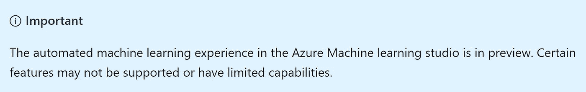

预告——作者截图

# 设置

如果您还没有帐户，您可以注册 Azure 免费订阅。这笔交易将给你 200 美元的信用额度，你可以在 30 天内使用。

我遵循了本教程中的设置。当它引导你完成各个步骤时，我发现屏幕非常直观。刚开始在门户—[https://portal.azure.com/#home](https://portal.azure.com/#home)。

自动化 ML 可通过机器学习服务访问。自动化 ML 需要一个企业版，所以当你遇到它的时候选择那个选项。

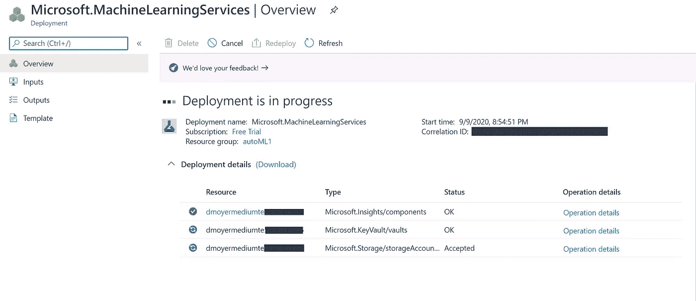

作者截图

一旦服务为你准备好了，工作室就可以使用了。主页上有明显的自动 ML 选项。

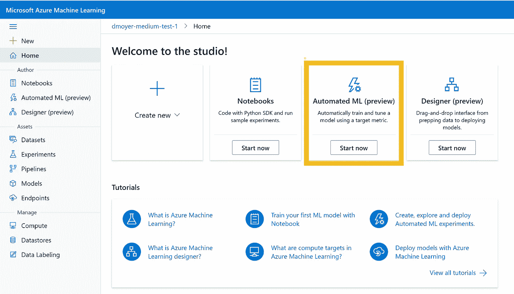

作者截图

# 数据

为了保持本系列中各种工具的平等性，我将坚持使用 Kaggle 培训文件。[矛盾，我亲爱的华生。使用 TPUs 检测多语言文本中的矛盾和蕴涵](https://www.kaggle.com/c/contradictory-my-dear-watson/data)。在这个入门竞赛中，我们将句子对(由一个前提和一个假设组成)分为三类——蕴涵、矛盾或中性。

6 列 x 13k+行— Stanford NLP [文档](https://nlp.stanford.edu/projects/snli/)

*   身份证明（identification）
*   前提
*   假设
*   朗 abv
*   语言
*   标签

# 模型培训成本

当谷歌挥舞着“免费”的 200 美元时，我没有对集群的成本进行太多研究。与此同时，定价也不像 AWS 和谷歌那样对我有利。好奇。我确实找到了一个 [doc，](https://docs.microsoft.com/en-us/azure/machine-learning/concept-plan-manage-cost)但是并不简单。

我在控制台上查看账单！检查您的账单！不，这是在更险恶的成本管理之下。训练这个例子让我的谷歌雄鹿总数减少了 50 美分。还不错。

作者截图

# 加载数据

这个工具的一个很好的特性是，您可以将数据作为当前工作流的一部分进行加载。不需要走出工作室去谷歌存储。不要在屏幕上跳来跳去。

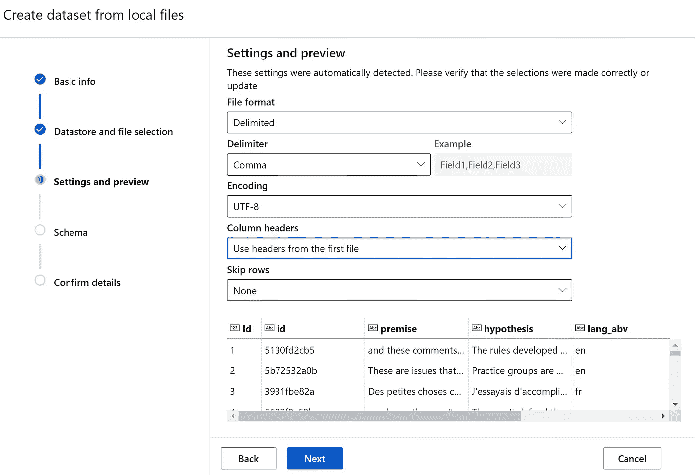

作者截图

# 训练您的模型

接下来，我必须配置训练运行。我使用低优先级设置而不是专用资源创建了一个新的计算集群。使用低优先级一般更便宜。我想尽可能地使用我的 200 美元。

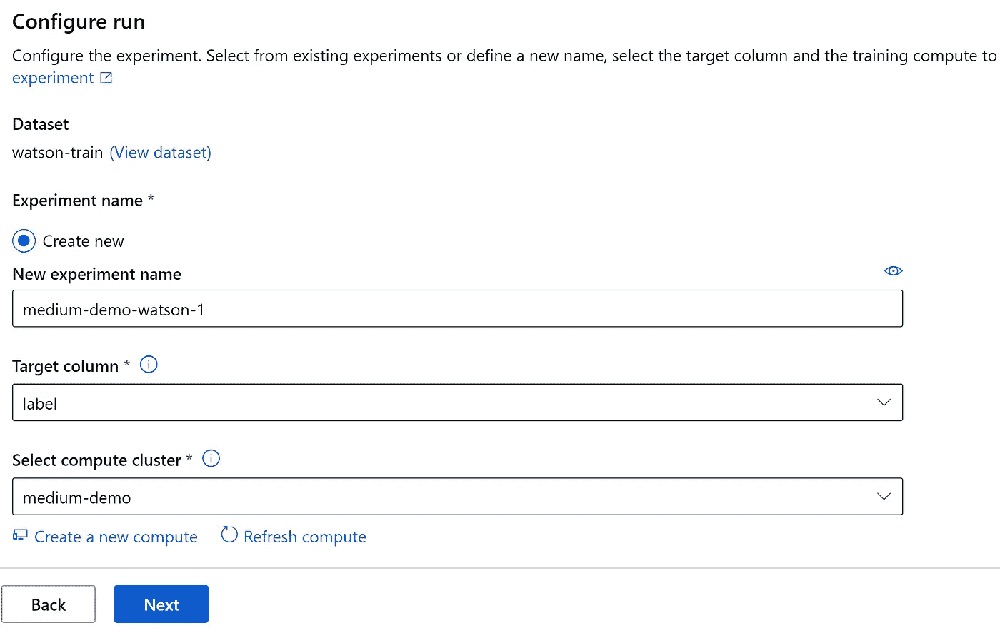

作者截图

在下一个屏幕上，分类被选中，我启用了深度学习。我应该仔细阅读一下附加的配置设置，因为我意识到我的最大运行时间是 24 小时。不用了，谢谢。

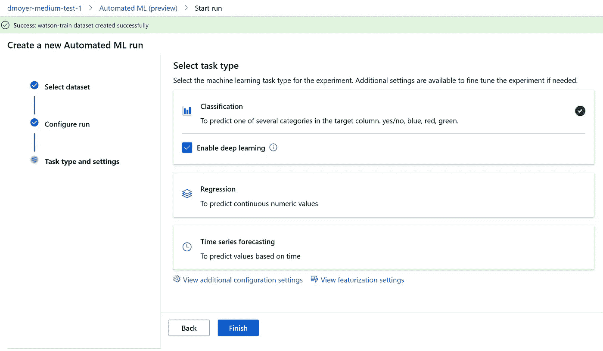

作者截图

有一个状态让您知道进程在哪里。我最喜欢的状态是生成数据集功能。什么样的特征？

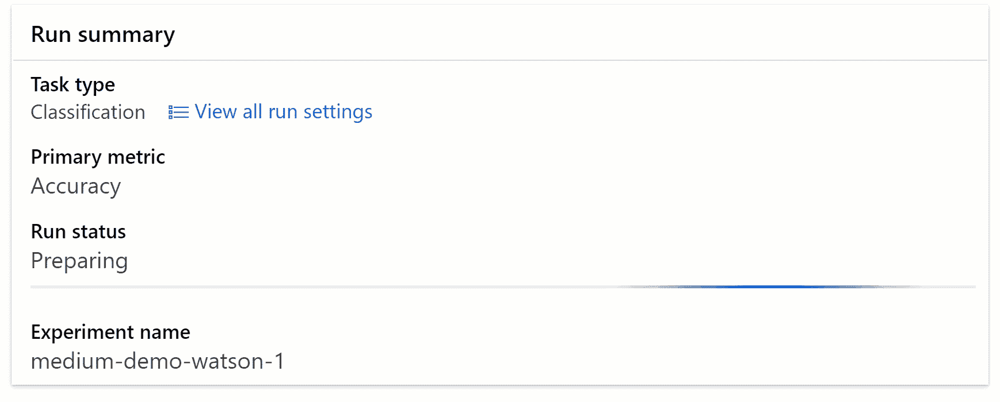

作者 gif

培训的时候，我在界面上戳来戳去。我能够看到输入文件的数据配置文件。

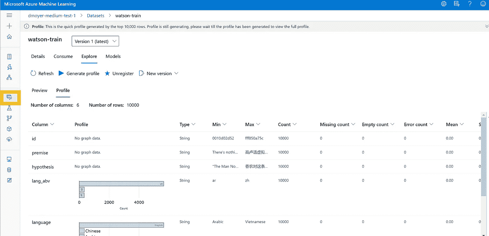

作者截图

# 评估培训结果

当模特们完成训练后，领队会被挑选出来并显示在仪表盘上。令我失望的是，算法名称并没有链接到那些算法的细节。他们只是把我带到一个类似的详细信息页面。我将不得不假设他们是`[sklearn.preprocessing](https://scikit-learn.org/stable/modules/classes.html#module-sklearn.preprocessing)`。MaxAbsScaler 和随机森林集合。

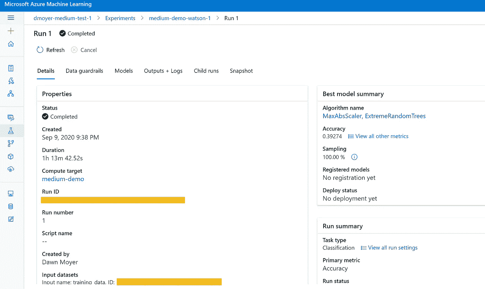

作者截图

有一个标签叫做数据护栏。概念不错，很高兴看到它被收录。我希望在这个页面上有更多信息的工具提示。我尝试搜索数据护栏，但很难找到细节。即使信息很少，我也喜欢。它会重新出现在我的幻想 autoML 工具。

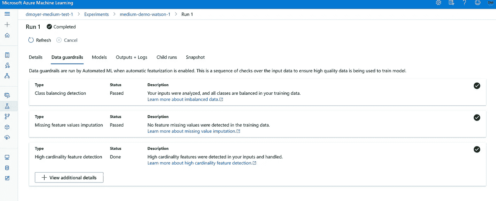

作者截图

> 点击 Go，看看会发生什么。

开箱即用的实际结果？这些模型的表现不如谷歌模型。我喜欢提供的图表，很明显，它的表现比机会好不了多少。据我和下一位数据科学家所知，即使对于 autoML，也需要进行超参数调优，但我并没有过多关注实际的指标结果。因此，我想坚持基本原则，以保持它跨平台。

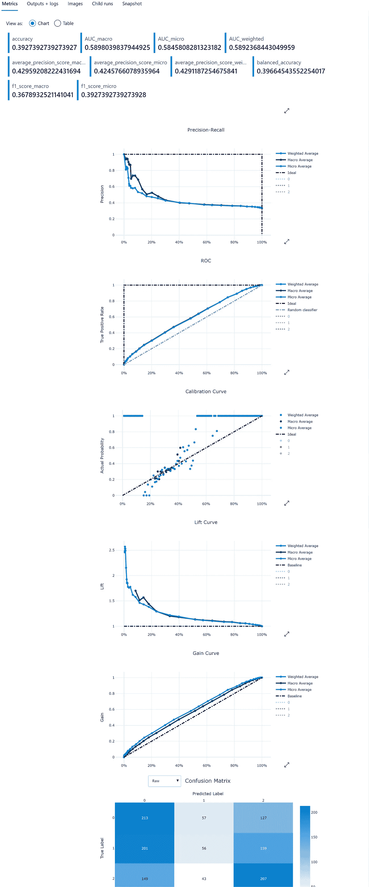

作者截图

我很喜欢他们列出了挑战者，而不仅仅是获胜的模特。挑战者的可用性是至关重要的，因为在某些情况下，您可能不得不放弃最准确的模型，而选择一个具有更好解释能力的模型。

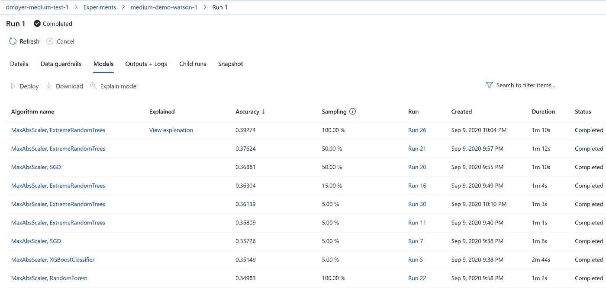

作者截图

说到可解释性，我很欣赏这个想法，但结果是缺乏的。

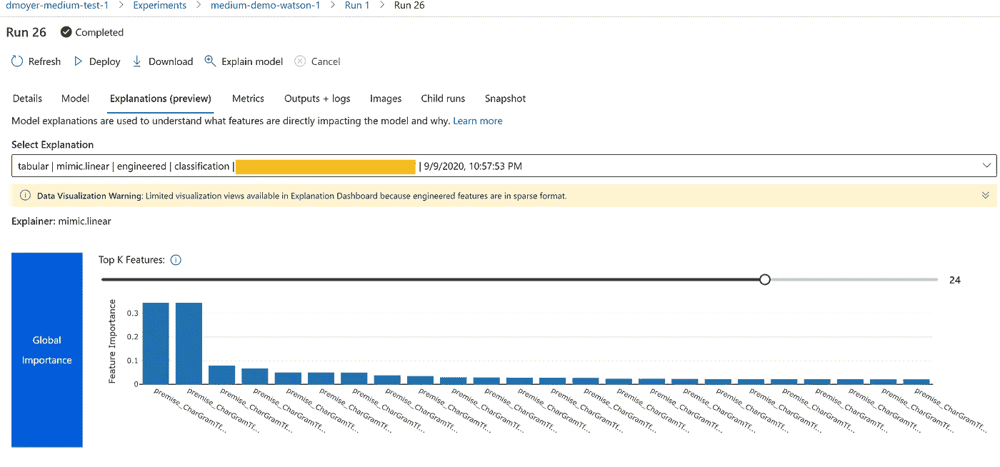

作者截图

# 结论

我可以看到自己再次使用 Azure 机器学习工作室。总的来说，我对这个工作流程非常满意。这种体验是无缝的，尽管 autoML 输出还有改进的余地。有用的可视化是必不可少的，特别是当我们试图说服我们的商业赞助商，我们有足够的东西来推进一个项目。

伟大的可视化的价值将在我的下一篇关于 DataRobot 的文章中强调。但是你为好东西付钱。这个工具对于没有企业预算的人来说是遥不可及的。H2O 自动驾驶仪也一样。但是它们很漂亮。

如果您错过了本系列的前两篇文章:

 [## AWS Sagemaker Studio 自动驾驶仪准备好迎接黄金时段了吗？

### 带有一些评论的自动驾驶界面演示

towardsdatascience.com](/is-aws-sagemaker-studio-autopilot-ready-for-prime-time-dcbca718bae7)  [## 免费体验 Google autoML 表格

### autoML 工具用户体验评论系列之二。

towardsdatascience.com](/experience-google-automl-tables-for-free-d5648ae3d0e5)