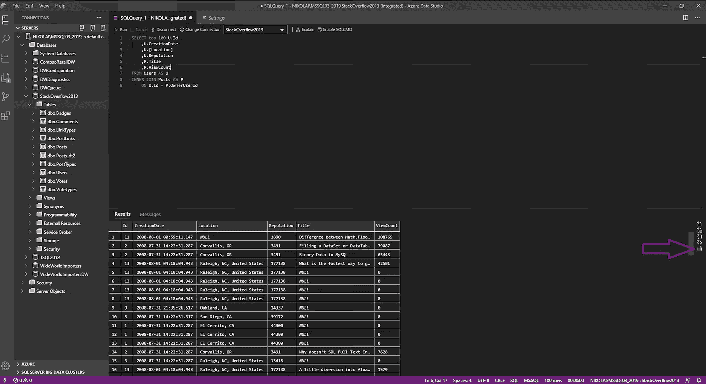

# Azure Data Studio 和 SSMS——我应该使用哪个？

> 原文：<https://towardsdatascience.com/azure-data-studio-or-ssms-which-should-i-use-1db49824a39?source=collection_archive---------7----------------------->

## Azure 数据工作室还是 SSMS？为什么不是 Azure Data Studio **和** SSMS？看看你如何能从两个世界中取长补短


照片由[哈伦·benli̇](https://www.pexels.com/@hbharun?utm_content=attributionCopyText&utm_medium=referral&utm_source=pexels)从[派克斯](https://www.pexels.com/photo/chessboard-game-3701276/?utm_content=attributionCopyText&utm_medium=referral&utm_source=pexels)拍摄

题目中的问题已经变得非常流行，而且会变得越来越久而久之化。由于微软在 2018 年 9 月推出了 Azure Data Studio 并在此期间大力投资于该工具的改进，看起来旧的 SQL Server Management Studio 注定要退休了(当之无愧)……

***但是，是那样的吗？***

作为一名 SQL 开发人员，他每天都在编写查询，我将尝试根据我迄今为止的发现给出一些观察结果，特别强调 *Azure Data Studio* ，因为我相信我们大多数人已经非常熟悉 *SSMS* 。

## Azure 数据工作室

在我深入了解“新街区小子”的一些很酷的功能之前，先做个简短的介绍。当我听到新工具的名字时，我并不打算深入测试它，因为“Azure”部分并没有引起我的特别兴趣。然而，在我听到 Ben Weissman 今年 1 月在 SQL Saturday Vienna 上的发言后，他解释说“Azure”word 并不一定意味着你需要将该工具与 Azure palette of products 结合使用，我决定尝试一下。


所以，我的第一印象是:微软给这个 IDE 命名相当误导！为什么称之为“ *Azure Data Studio* ”，连接 Azure 只是其中一个选项？您还可以连接到本地 SQL Server 数据库，就像之前的 *SSMS、*一样，但您也可以连接到大数据集群(SQL Server 的最新功能，在 2019 年版中推出)。

Azure Data Studio 的主要优势在于其可移植性——虽然 SSMS 只能在 Windows 平台上运行，但广告也可以在 Linux 和 macOS 上运行。这是一个巨大的进步，符合微软向非 Windows 世界的全面扩张。

与 SSMS 的另一个巨大区别是，你可以使用笔记本，并在其中编写 SQL、Python、Spark 或 Scala 脚本。我不能详细说明，因为我还没有使用这个特性(我是一个传统的 SQL 家伙)，但与 SSMS 相比，它无疑为更复杂的用法提供了更多的灵活性。

好了，关于 ADS 和 SSMS 的特征和区别的一般性描述已经足够了。我将尝试加粗一些 Azure Data Studio 提供的简洁功能:

## #1 对象定义

当我编写查询时，我经常需要检查数据库对象定义。例如，查看基础数据类型是[日期时间还是日期时间 2](https://data-mozart.com/tsql/datetime2-why-you-should-not-use-it/) 。当然，这可以在 SSMS 使用一些第三方插件来实现(顺便说一下，我喜欢 [SSMS 升压](https://www.ssmsboost.com))，但在广告中这很简单:


只需标记要检查的对象，右键单击，然后在“查看”下选择“查看定义”。您将立即看到所选对象的定义:


## #2 黑暗主题

据我所知，SSMS 仍然缺乏黑暗模式，我知道很多开发者都渴望这一点。在广告中，黑暗模式就在那里！

进入 ***文件- >首选项- >颜色主题*** ，选择您想要的布局:


看起来很酷，哈？

## #3 快速可视化查询结果

这真的很有用，我在使用 Azure Data Studio 时广泛使用了它。它可以让您对查询返回的数据有一个简要的了解，这样您就可以直接执行快速的数据分析，并检查有多少个空值，是否有一些异常值，等等。



运行该查询后，我可以选择右侧的图表图标，并立即可视化我的结果:


此外，正如您在上面的图片中所注意到的，我可以定义整套参数并调整结果的视觉外观。

## #4 源代码控制

Azure Data Studio 附带了 Git 源代码管理器(SCM ),因此与 SSMS 相比，源代码管理成为最大的优势之一！关于如何执行代码源代码控制的更多细节可以在官方的 Azure Data Studio 文档中找到。

## #5 轻松导出到 Excel/CSV/JSON

在许多情况下，您需要为用户提供快速的查询结果。现在，不需要复制/粘贴查询结果或使用一些外部插件来处理这些简单的请求。只需点击一下，你就可以开始了！


在右侧，您只需选择是将结果导出为 CSV、Excel、JSON、XML，还是将其可视化(如前一篇技巧文章)。

## #6 定制洞察/仪表板

这一个可以很容易地拿第一，但是我故意把它留到最后。想象一下，您可以在一个地方拥有所有相关的度量，比如当前运行的查询、死锁、索引碎片等的数量。！

我将演示如何为索引碎片检查创建一个仪表板，但是您可以使用与您的监视相关的查询轻松地扩展您的仪表板。

```
SELECT st.index_id
            ,name AS indexName
           ,avg_fragmentation_in_percent AS frgPrct
           ,fragment_count AS frgCnt
          , avg_fragment_size_in_pages AS frgPages
FROM sys.dm_db_index_physical_stats (DB_ID('StackOverflow2013'), NULL, NULL, NULL, NULL) AS st
INNER JOIN sys.indexes AS i ON st.object_id = i.object_id AND st.index_id = i.index_id
ORDER BY avg_fragmentation_in_percent DESC
```

一旦我执行了这个查询，我选择右边的图表图标:


我将把这个查询保存在桌面上(你可以把它保存在任何你喜欢的文件夹中)。然后，我选择表格图表类型，并单击结果集上方的 Create Insight:


一旦我这样做了，JSON 代码就会生成。然后，转到视图选项卡，选择命令调板，然后选择首选项:打开用户设置。

搜索*仪表板。Database.Widgets* 并在 settings.json 中选择编辑。


在“dashboard.database.widgets”键中，粘贴在前面某个步骤中创建的 JSON 代码。


保存 settings.json 文件，导航到 StackOverflow2013 数据库，右键单击它并选择“管理”。如您所见，我们新创建的小部件被固定在一个仪表板上，我们可以轻松地监视索引碎片的情况。


您可以创建多个不同的小部件，并将它们固定在一个仪表板上，这样您就可以快速了解数据库的关键指标。

## 定论

尽管 Azure Data Studio 确实是一个令人敬畏的工具，但它仍然缺乏一些关键功能，因此不能被视为 SSMS 的直接替代品。对于 DBA 任务来说尤其如此，SSMS 作为一个成熟的工具提供了更多的选择。


在我看来， ***这两个工具都将留在*** 这里，至少在未来一段时间内！

微软不断升级 Azure Data Studio，我将专门撰写单独的文章来介绍一些最近添加的功能，如 SQL 代理作业，或更常见的任务，如使用估计和实际的查询执行计划来优化您的查询。

老实说，我仍然比 ADS 更频繁地使用 SSMS(可能只是因为我更习惯它)，但我相信每个开发者都应该至少尝试一下 Azure Data Studio。

成为会员，阅读媒体上的每一个故事！

订阅[这里](http://eepurl.com/gOH8iP)获取更多有见地的数据文章！