# Azure 机器学习服务:第 1 部分—简介

> 原文：<https://towardsdatascience.com/azure-machine-learning-service-part-1-an-introduction-739620d1127b?source=collection_archive---------6----------------------->

## 在微软 Azure 公共云平台上开发和部署端到端人工智能解决方案的入门系列。

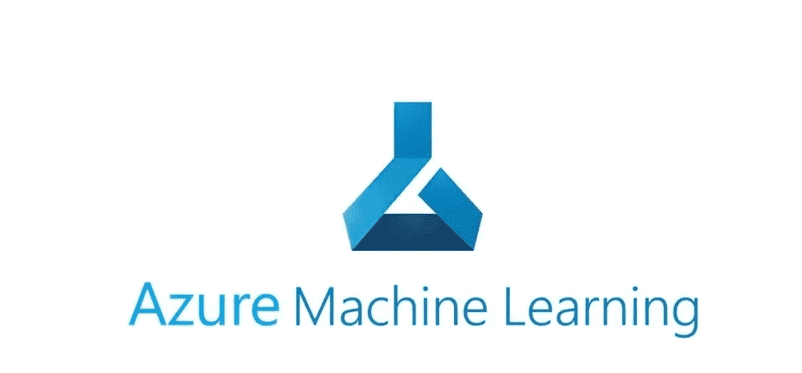

图文鸣谢:*微软为 Azure 机器学习*

# 前言

自从我成功通过了微软的 DP-100 考试认证，即“ [*在 Azure*](https://docs.microsoft.com/en-us/learn/certifications/exams/dp-100) 上设计和实现数据科学解决方案”。我很想以 KT 的形式写点东西，这样将来有一天它可以帮助别人。因此，在牢记这句格言的同时，我在此发表了关于 Azure 机器学习服务(Azure ML Service)的第一篇文章。因为这是第一篇文章，所以我将对这个完全由云管理的服务做一个非常基本的介绍。稍后，我会发表更多关于高级主题的文章，因此这将是一个系列。

> 请注意，对于那些对 Azure 和基础知识有所了解的人来说，这篇文章和接下来的一系列文章会非常直观，对于其他对 Azure 了解有限的人来说，这篇文章是一个知识来源，对 AI/ML 开发和部署的云方面有非常高的概述。此外，微软官方文档页面上有一些资源**可以帮助**开始使用这项服务。

 [## Pankaj Jainani -云解决方案架构师- LinkedIn

### 我是云解决方案架构师、人工智能工程师、DevOps 顾问、Scrum Master、技术经理……

www.linkedin.com](https://www.linkedin.com/in/p-jainani/) 

# 介绍

Azure Machine Learning(*Azure ML*)是一个基于云的服务，用于创建和管理机器学习解决方案。它旨在帮助数据科学家和机器学习工程师利用他们现有的数据处理和模型开发技能&框架。此外，帮助他们将工作负载扩展、分发和部署到云中。用于 Python 的 Azure ML SDK 提供了一些类，我们可以在 Azure 订阅中使用它们来处理 Azure ML。

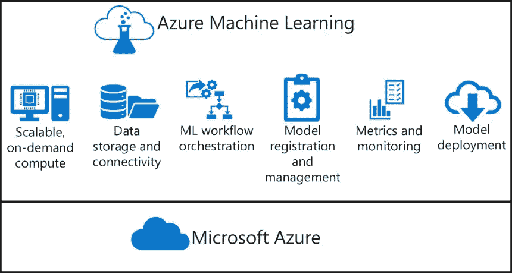

图形致谢:Microsoft Azure ML 服务文档

> 整篇文章改编自我自己的 **Kaggle 笔记本**——此处**。因此，如果有人想直接进入工作代码，请遵循相同的链接。**

# **入门指南**

## **Azure ML 资源的工作区**

**Workspace 是所有 AML 资产的逻辑容器:计算、存储、数据、脚本、笔记本、实验(他们的版本)、指标、管道和模型(他们的版本)。**

**Azure ML 的下图描述了逻辑工作区:**

**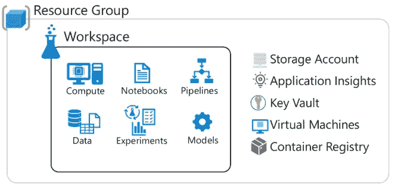**

**图形致谢:Microsoft Azure ML 服务文档**

**从 Azure Portal 或 AML SDK 创建工作空间后，我们必须连接到工作空间来执行我们的机器学习操作。因此，我们需要从从 SDK 导入以下包开始—**

**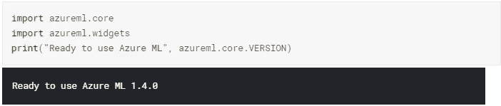**

**导入包和库**

**将所有包加载到笔记本后，我们必须通过传递 AML 服务名称、Azure 资源组名称和 AML 服务的 Azure 订阅 ID 的值，使用`Workspace.get()`方法实例化工作区对象`ws`。**

> **还有一种方法可以使用 config.json 文件实例化 Workspace 对象。这个方法在笔记本里有解释。**

**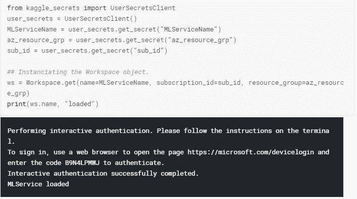**

## **实验**

**AML 服务*实验*是一个命名的过程，通常运行一个脚本或管道，它可以生成指标和输出，并在 Azure 机器学习工作区中被跟踪。我们可以用不同的数据、代码或设置多次运行相同的实验。该实验定义如下:**

**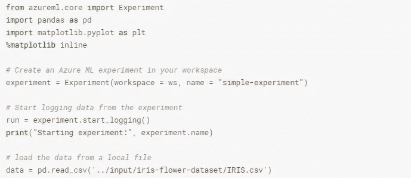**

**定义并开始实验**

**一旦提交了实验，`run context`用于初始化、跟踪和完成实验。在`run context`中，我们可以从实验的执行中捕获各种度量，这些度量与其`run`对象相关联。**

**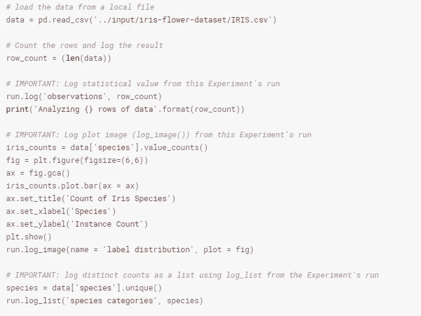**

**使用运行上下文从实验运行中获取指标。**

**在上面的代码中，我们可以使用`run.log()`捕获一个*单值*，使用`run.log_image()`捕获一个度量*图像的图形表示*，类似地，使用`run.log_list()`方法捕获一个*值列表*。**

## **实验细节**

**实验完成后，run 对象用于获取实验实例的信息和细节:**

**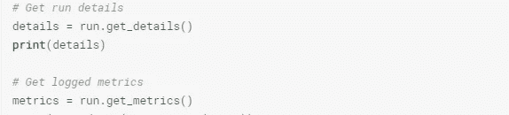**

**抓住实验的细节**

**这些语句将产生与实验、元数据、指标和日志相关的输出。**

**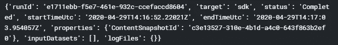**

## **实验仪表板**

**以下是 Azure Portal 中为每个实验运行提供的仪表盘:**

1.  **实验的名称是“简单实验”**
2.  **给出了每次实验的细节**

**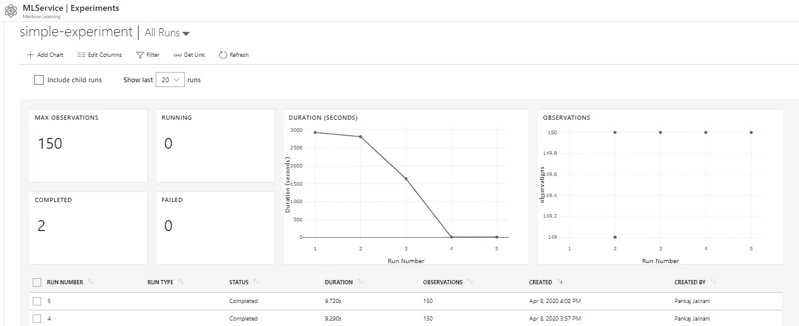**

**实验仪表板**

**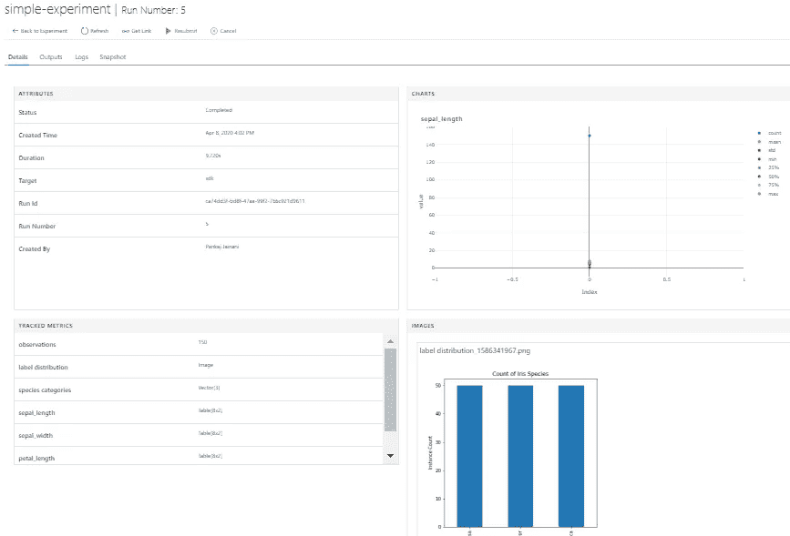**

**实验的细节**

# **接下来呢？**

**这是一系列博客帖子，包含各种 Azure 机器学习功能的详细概述，其他帖子的 URL 如下:**

*   **岗位 1 *(本)* : [蔚蓝机器学习服务:第一部分——简介](/azure-machine-learning-service-part-1-an-introduction-739620d1127b)**
*   **帖子 2: [Azure 机器学习服务——运行一个简单的实验](/azure-machine-learning-service-run-python-script-experiment-1a9b2fc1b550)**
*   **帖子 3: [Azure 机器学习服务——训练一个模型](/azure-machine-learning-service-train-a-model-df72c6b5dc)**
*   **帖子 4: [Azure 机器学习服务——我的数据在哪里？](/azure-machine-learning-service-where-is-my-data-pjainani-86a77b93ab52)**
*   **帖子 5: [Azure 机器学习服务——目标环境是什么？](/azure-machine-learning-service-what-is-the-target-environment-cb45d43530f2)**

> ***接我上*[***LinkedIn***](https://www.linkedin.com/in/p-jainani/)*进一步讨论***

** [## Pankaj Jainani -云解决方案架构师- LinkedIn

### 我是云解决方案架构师、人工智能工程师、DevOps 顾问、Scrum Master、技术经理……

www.linkedin.com](https://www.linkedin.com/in/p-jainani/) 

## 参考

[1]代码笔记本— [Azure 机器学习—简介](https://www.kaggle.com/pankaj1234/azure-machine-learning-introduction)，Kaggle。
【2】[Azure 机器学习服务](https://docs.microsoft.com/en-in/azure/machine-learning/)官方文档，微软 Azure。**