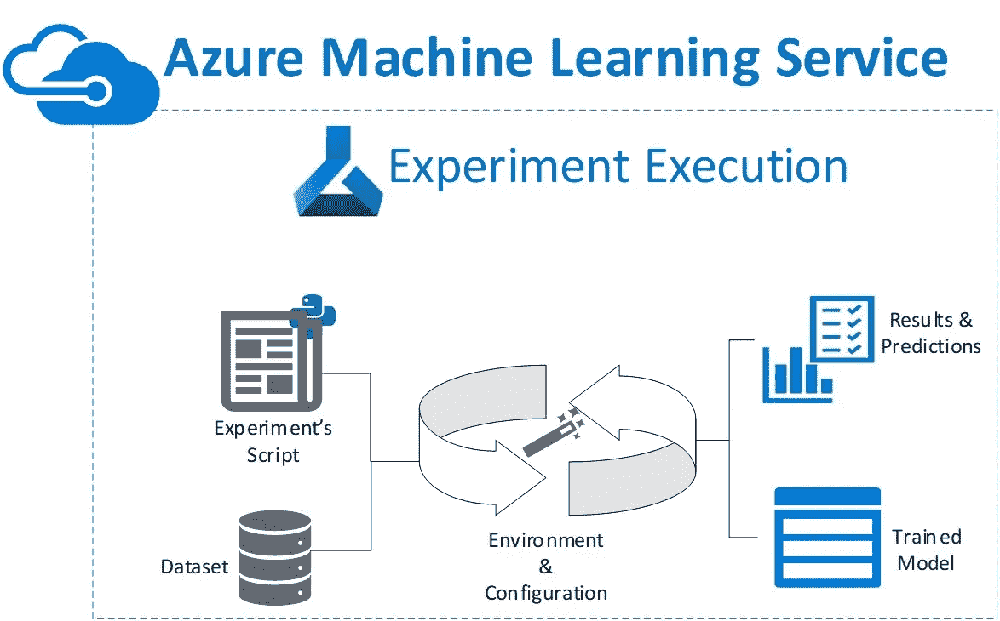
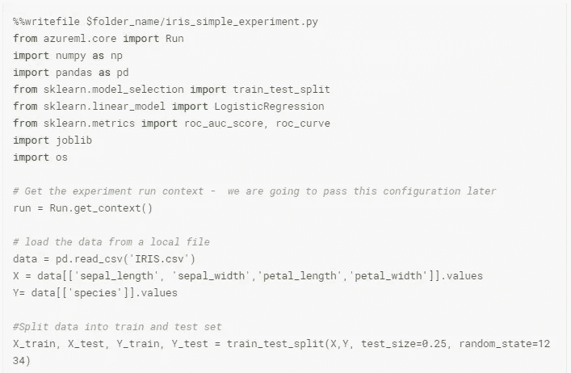
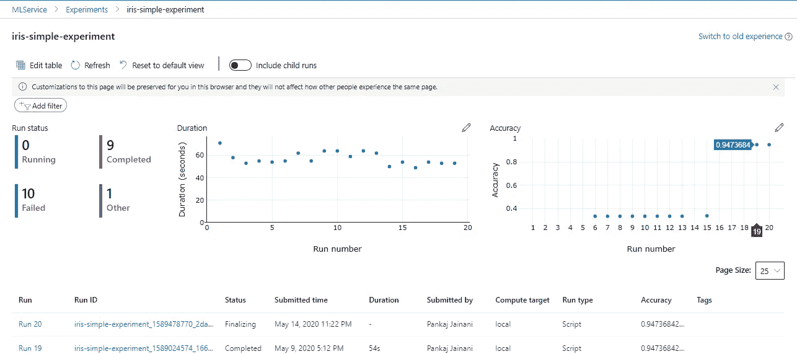
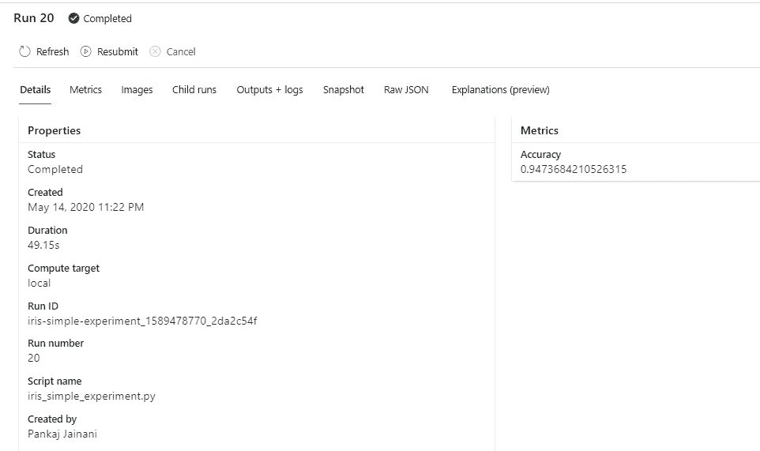
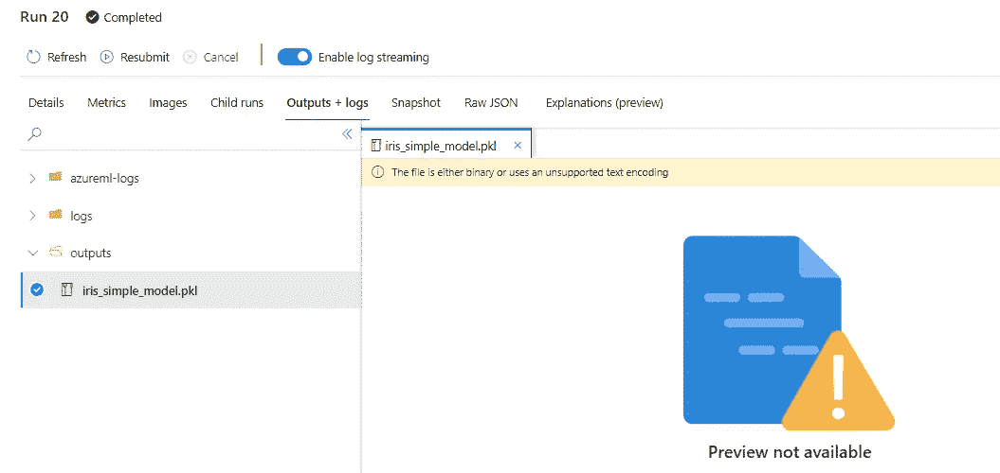

# Azure 机器学习服务——运行一个简单的实验

> 原文：<https://towardsdatascience.com/azure-machine-learning-service-run-python-script-experiment-1a9b2fc1b550?source=collection_archive---------54----------------------->

## 第 2 部分:如何使用 Azure 机器学习服务编写一个 ML 模型并执行实验。

# 摘要

在本系列的 [***第一部分***](https://www.kaggle.com/pankaj1234/azure-machine-learning-introduction) 中，我主要介绍了关于 Azure 机器学习(AML)服务的概述和介绍，在那篇文章中，我介绍了设置、配置和这种云管理服务提供的各种 OOB 功能。我还详细讨论了反洗钱工作区、反洗钱实验和反洗钱服务实验的仪表板。

在第 2 部分中，我将讨论如何创建一个独立的实验脚本来封装云上 ML 模型的核心实现，即通过重复实验运行进行训练和跟踪。此外，我将演示如何设置执行实验脚本所需的先决环境和配置。

> 这篇特别的帖子摘自 Kaggle 笔记本托管— [此处](https://www.kaggle.com/pankaj1234/azure-machine-learning-introduction-ii)。使用链接来设置和执行实验



# 机器学习实验脚本

一旦连接到 Azure 机器学习工作空间，下一步是定义一个模型实验脚本，这是一个非常通用的 python 脚本，它从实验的“工作空间”计算上下文中加载和执行。这还要求数据文件的根目录(文件夹)必须与加载该脚本的位置相同，如下所示



**图 1:** 实验脚本快照——必须导入 **azureml.core.Run** 类并执行其 **get_context()** 方法

**实验输出文件夹—** 大多数情况下，运行一个实验会生成一些输出文件，例如保存的模型，这些文件保存在工作区的**输出**文件夹中，如下图所示—

```
os.makedirs("outputs", exist_ok=True)
joblib.dump(value=model, filename='outputs/iris_simple_model.pkl')
*# Complete the run*
run.complete()
```

也可以在如下所示的实验文件代码中使用 **Run** 对象的 **upload_file** 方法，这使得在计算上下文中写入 **outputs** 文件夹的任何文件都可以在运行完成时自动上传到运行的 **outputs** 文件夹，例如

```
run.upload_file(name='outputs/IRIS.csv', path_or_stream='./sample.csv') # upload from local
```

# 进行实验

## 运行配置和脚本运行配置

在实现 ML 模型的脚本准备好之后，下一步是定义`*RunConfiguration*` 对象——它定义脚本将在其中运行的 Python 环境，以及`*ScriptRunConfig*` 对象*——*，它将运行环境与脚本相关联。下面的代码片段通过调用`RunConfiguration()`方法实例化了 Python 环境，并且`ScriptRunConfig()`封装了相同的脚本执行环境:

```
from azureml.core import Experiment, **RunConfiguration, ScriptRunConfig***# create a new RunConfig object*
experiment_run_config = **RunConfiguration()**
experiment_run_config.environment.python.user_managed_dependencies = True*# Create a script config*
src = **ScriptRunConfig**(source_directory=experiment_folder, 
                      script='iris_simple_experiment.py',
                      run_config=experiment_run_config)
```

> `*RunConfig*`对象还允许额外包含脚本执行所必需的 Python 包。

## 仪表板结果

访问[*Azure Machine Learning Studio*](https://ml.azure.com/)来导航样本实验运行，并在仪表板上的结果中验证结果。在这里，显示了*实验的*运行历史的全部细节，如下所示——运行*的统计、历史、结果、度量、日志、输出、错误、诊断等的细节..可从仪表板上轻松获得:*



**图 2:**Iris-sample-experiment 的仪表板结果视图，观察运行统计和其他可用指标。



**图 3:** 更详细的结果也可用于任何选定的实验，例如试验# 20



**图 4: Outputs** 文件夹中有一个使用实验脚本上传的模型文件

# 结论

在系列的这一部分，我试图涵盖 Azure 机器学习服务的最基本概念，即准备和执行机器学习实验并生成模型二进制文件。在下一篇文章中，我将介绍一种稍微高级一点的方法来设置和控制脚本的执行环境，安装或更新所需的依赖项和包。所以请保持关注！

# 接下来呢？

这是一系列博客帖子，包含各种 Azure 机器学习功能的详细概述，其他帖子的 URL 如下:

*   帖子 1: [Azure 机器学习服务:第一部分——简介](/azure-machine-learning-service-part-1-an-introduction-739620d1127b)
*   岗位 2 *(这个)* : [Azure 机器学习服务——运行一个简单的实验](/azure-machine-learning-service-run-python-script-experiment-1a9b2fc1b550)
*   帖子 3: [Azure 机器学习服务——训练一个模型](/azure-machine-learning-service-train-a-model-df72c6b5dc)
*   帖子 4: [Azure 机器学习服务——我的数据在哪里？](/azure-machine-learning-service-where-is-my-data-pjainani-86a77b93ab52)
*   帖子 5: [Azure 机器学习服务——目标环境是什么？](/azure-machine-learning-service-what-is-the-target-environment-cb45d43530f2)

> *与我连线*[***LinkedIn***](https://www.linkedin.com/in/p-jainani/)*进一步讨论*

## 参考

[1]笔记本&代码— [Azure 机器学习—简介](https://www.kaggle.com/pankaj1234/azure-machine-learning-introduction-ii)，Kaggle。
【2】[Azure 机器学习服务](https://docs.microsoft.com/en-in/azure/machine-learning/)官方文档，微软 Azure。