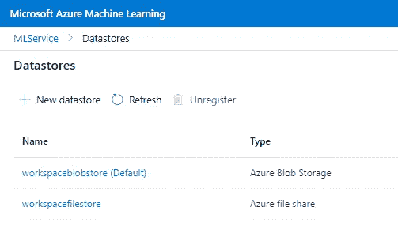
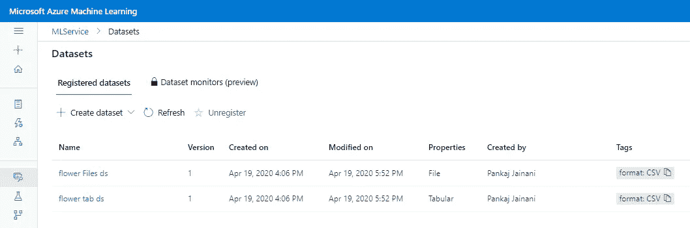

# Azure 机器学习服务—我的数据在哪里？

> 原文：<https://towardsdatascience.com/azure-machine-learning-service-where-is-my-data-pjainani-86a77b93ab52?source=collection_archive---------18----------------------->

## 第 4 部分:数据集和数据存储简介

# 摘要

或许这就是云机器学习平台的重要方面之一。每个机器学习问题的迫切需要是它的数据。这些数据大多来自各种不同的来源，然后经过提炼、修剪和处理，用于各种分析，并用于 ML 模型。由于这个原因，云机器学习定义了数据管理 SDK，它可以定义、保护和管理云平台中的数据源。

> 这篇特别的文章摘自 Kaggle 笔记本，这里是[这里是](https://www.kaggle.com/pankaj1234/azure-machine-learning-working-with-data)。使用设置的链接来执行实验。


来自[佩克斯](https://www.pexels.com/photo/person-holding-blue-ballpoint-pen-on-white-notebook-669610/?utm_content=attributionCopyText&utm_medium=referral&utm_source=pexels)的[卢卡斯](https://www.pexels.com/@goumbik?utm_content=attributionCopyText&utm_medium=referral&utm_source=pexels)的照片

# 数据存储和数据集

## 数据存储

数据存储是一种数据管理功能，是由 Azure 机器学习服务(AML)提供的 SDK。它使我们能够连接到各种数据源，然后这些数据源可以用于将它们摄取到 ML 实验中，或者写入来自相同实验的输出。Azure 提供各种平台服务，这些服务可以作为数据源，例如 blob store、data lake、SQL database、Databricks 等等。

Azure ML workspace 与 Azure 中定义的数据存储有着天然的集成，比如 Blob 存储和文件存储。但是，执行 ML 模型可能需要来自其他外部来源的数据及其依赖性。因此，AML SDK 为我们提供了将这些外部资源注册为模型实验数据源的方法。定义数据存储的能力使我们能够跨多个实验重用数据，而不管实验运行的计算环境如何。

## 注册数据存储

如前所述，数据存储有两种类型——默认和用户调配，如存储 Blobs 容器或文件存储。要获取工作区的默认数据存储列表，请执行以下操作:

```
***# get the name of defult Datastore associated with the workspace.***
default_dsname = ws.get_default_datastore().name
default_ds = ws.get_default_datastore()
print('default Datastore = ', default_dsname)
```

使用 AML SDK 注册数据库—

```
from azureml.core import Workspace, Datastore
ws = Workspace.from_config()**# Register a new datastore**
blob_ds = Datastore.register_azure_blob_container(workspace=ws,
    datastore_name='blob_data',
    container_name='data_container',
    account_name='az_store_acct',
    account_key='11223312345cadas6abcde789…')
```

要设置或更改默认数据存储—

```
ws.set_default_datastore('blob_data')
```



从 Azure ML 查看—数据存储

## 将文件上传到数据存储

将本地文件从本地系统上传到远程数据存储。这允许使用远程数据位置直接运行实验。*目标路径*是文件在远程数据存储位置的路径。一旦文件上传到数据存储，就会返回*‘引用路径’*。当您想要在实验脚本中使用数据存储时，我们必须向脚本传递一个数据引用

```
default_ds.upload_files(files=['../input/iris-flower-dataset/IRIS.csv'],**target_path**='flower_data/',overwrite=True, show_progress=True)**flower_data_ref** = default_ds.path('flower_data').as_download('ex_flower_data')
print('**reference_path** = ',flower_data_ref)
```

## 尝试数据存储

如上所述，一旦我们有了对数据存储的引用，我们需要将这个引用传递给一个实验脚本，作为来自估计器的脚本参数。此后，可以检索该参数的值，然后将其用作本地文件夹—

```
####run = Run.get_context()*#define the regularization parameter for the logistic regression.*
parser = argparse.ArgumentParser()
parser.add_argument('--reg_rate', type=float, dest='reg', default=0.01)***#define the data_folder parameter for referencing the path of the registerd datafolder.***
parser.add_argument('--data_folder', type=str, dest='data_folder', help='Data folder reference', default=0.01)
args=parser.parse_args()
r = args.reg
ex_data_folder = **args.data_folder**####
```

将估计值定义为—

```
####run = Run.get_context()estimator = SKLearn(source_directory=experiment_folder,
                      entry_script='iris_simple_experiment.py',
                      compute_target='local',
                      use_docker=False,
                      script_params = {'--reg_rate': 0.07, 
                                  '--**data_folder':flower_data_ref**} 
                              *# a****ssigned reference path value as   defined above.***
                  )####
```

> *' —数据文件夹'*接受数据存储文件夹引用；上传文件的路径。该脚本将从作为参数传递给它的数据引用中加载训练数据，因此我们需要设置脚本参数来传递文件引用以运行实验。

## 数据集

数据集是打包的数据对象，易于机器学习管道使用。这是处理数据的推荐方式。帮助启用数据标注、版本控制和漂移监控(将在后续帖子中讨论)。数据集是根据已经存储在“数据存储”中的数据的位置定义的

**数据集类型** —我们可以创建两种数据集

*   *表格:*一种结构化的数据形式，主要从数据存储中导入的表、CSV、RDBMS 等中读取。示例—回归问题的数据框架。
*   *File:* 这是针对非结构化数据类型的，文件路径列表可以通过数据存储使用。一个示例用例是读取图像来训练 CNN。

## 创建数据集

数据集首先从数据存储区创建，并且需要注册。以下示例显示了表格和文件数据集的创建。

```
*#* ***Creating tabular dataset*** *from files in datastore.*
tab_dataset = Dataset.Tabular.from_delimited_files(path=(default_ds,'flower_data/*.csv'))tab_dataset.take(10).to_pandas_dataframe()*# similarly,* ***creating files dataset from the files*** *already in the datastore. Useful in scenarios like image processing in deeplearning.*file_dataset = Dataset.File.from_files(path=(default_ds,'flower_data/*.csv'))for fp **in** file_dataset.to_path():
    print(fp)
```

## 注册数据集

定义数据集后，需要将其附加到 AML 工作区。此外，还附加了元数据，如数据集的名称、描述、标签和版本。数据集的版本化允许我们跟踪实验所基于的数据集。如果我们想要在任何特定的版本上训练模型，版本控制也是有用的。以下是注册表格和文件数据集的方法:

```
***# register tabular dataset***
tab_dataset = tab_dataset.register(workspace=ws, name='flower tab ds', description='Iris flower Dataset in tabular format', tags={'format':'CSV'}, create_new_version=True)
***#register File Dataset***
file_dataset = file_dataset.register(workspace=ws, name='flower Files ds', description='Iris flower Dataset in Files format', tags={'format':'CSV'}, create_new_version=True)
```



Azure 机器学习服务中注册的数据集

```
print("Datasets Versions:")
for dataset_name **in** list(ws.datasets.keys()):
    dataset = Dataset.get_by_name(ws, dataset_name)
    print("**\t**", dataset.name, 'version', dataset.version)**Output >>**
Datasets Versions:
	 flower Files ds version 1
	 flower tab ds version 1
```

## 用数据集做实验

*   在训练分类模型的训练脚本中，**表格数据集**作为**输入**传递给分类模型，方法是将数据集读取为熊猫数据帧

```
data = run.input_datasets['flower_ds'].to_pandas_dataframe()
```

*   使用 **SKLearn 估算器**的**输入**参数传递注册的数据集，该数据集将由训练脚本使用。

```
inputs=[tab_dataset.as_named_input(‘flower_ds’)]
```

*   此外，使用 *pip_packages* 附加参数使运行时环境能够提供支持 AML pandas 操作所需的包。由于脚本将需要使用一个**数据集**对象，你必须在脚本的计算环境中包含完整的 **azureml-sdk** 包或 **azureml-dataprep** 包以及 P **和 as** 额外的库。

```
pip_packages=[‘azureml-dataprep[pandas]’]
```

# 结论

在此，我们介绍了 AML 服务的一个最重要的方面，即模型和实验的数据管理。数据是任何机器学习工作负载中的基本元素，因此，在这里我们学习了如何在 Azure 机器学习工作区中创建和管理*数据存储库*和*数据集*，以及如何在模型训练实验中使用它们。

# 接下来呢？

这是一系列博客帖子，包含各种 Azure 机器学习功能的详细概述，其他帖子的 URL 如下:

*   帖子 1: [Azure 机器学习服务:第一部分——简介](/azure-machine-learning-service-part-1-an-introduction-739620d1127b)
*   帖子 2: [Azure 机器学习服务——运行一个简单的实验](/azure-machine-learning-service-run-python-script-experiment-1a9b2fc1b550)
*   帖子 3: [Azure 机器学习服务——训练一个模型](/azure-machine-learning-service-train-a-model-df72c6b5dc)
*   岗位 4 *(这个)* : [Azure 机器学习服务——我的数据在哪里？](/azure-machine-learning-service-where-is-my-data-pjainani-86a77b93ab52)
*   帖子 5: [Azure 机器学习服务——目标环境是什么？](/azure-machine-learning-service-what-is-the-target-environment-cb45d43530f2)

## 参考

[1]笔记本&代码— [Azure 机器学习—处理数据](https://www.kaggle.com/pankaj1234/azure-machine-learning-working-with-data)，Kaggle。
【2】Azure ML 服务，[数据参考指南](https://aka.ms/AA70zfl)，官方文档，微软 Azure。
【3】[Azure 机器学习服务](https://docs.microsoft.com/en-in/azure/machine-learning/)官方文档，微软 Azure。