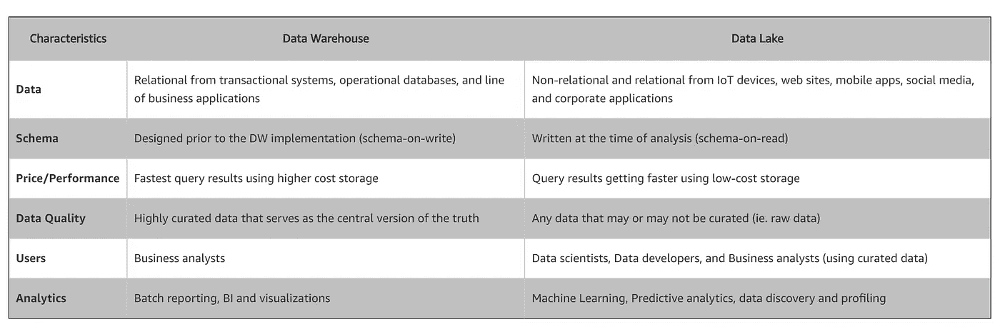

# Azure Synapse Analytics 作为云湖边小屋:一种新的数据管理范式

> 原文：<https://towardsdatascience.com/azure-synapse-analytics-as-a-cloud-lakehouse-a-new-data-management-paradigm-cdcbe2378209?source=collection_archive---------23----------------------->

## **企业数据湖&企业数据仓库(EDW)会共存吗？**

在数据仓库的早期，一个**数据仓库** ( **DW** 或 **DWH** )，也被称为**企业数据仓库** ( **EDW** )，是一个常见的用于[报表](https://en.wikipedia.org/wiki/Business_reporting)和[数据分析](https://en.wikipedia.org/wiki/Data_analysis)的系统，被认为是[商业智能](https://en.wikipedia.org/wiki/Business_intelligence)的核心组件。[提取、转换、加载](https://en.wikipedia.org/wiki/Extract,_transform,_load) (ETL)和[提取、加载、转换](https://en.wikipedia.org/wiki/Extract,_load,_transform) (E-LT)是构建数据仓库系统的两种主要方法。数据仓库是来自一个或多个不同来源的集成数据的中央存储库。它们将当前和历史数据存储在一个地方。这听起来可能非常类似于**数据湖的定义。**特别是，data lake 可以存储数据源提供的任何形式的结构化和非结构化数据。请参见[数据湖与数据仓库的比较——两种不同的方法](https://aws.amazon.com/big-data/datalakes-and-analytics/what-is-a-data-lake/) (AWS ),了解两者的详细特征。

[与数据仓库相比，数据湖是两种不同的方法](https://aws.amazon.com/big-data/datalakes-and-analytics/what-is-a-data-lake/) (AWS)

许多云解决方案提供商经常将这两种产品捆绑在他们提议的大数据架构中，将数据湖定位为存储层，将数据仓库定位为模型和服务层。

[AWS 大数据使用案例](https://aws.amazon.com/big-data/use-cases/)

[Azure 高级分析架构](https://docs.microsoft.com/en-us/azure/architecture/solution-ideas/articles/advanced-analytics-on-big-data)

现在的问题变成了**数据湖&企业数据仓库(EDW)会共存吗？**答案是肯定的！我们将这种新出现的模式称为**云湖库**，它将数据仓库和数据湖的优势结合在一起，简化了大数据架构。一些突出的优势包括:

*   AI + BI 支持。
*   支持结构化和非结构化。
*   端到端流式传输。
*   模式实施和治理。
*   提高生产力和效率。
*   降低数据仓库和数据湖整合及现代化的风险和成本。

[Cloud Lakehouse 启用云中的分析、人工智能和数据科学，来源:云数据仓库和数据湖现代化 2020 年 4 月 P.3 (Informatica)](https://blogs.informatica.com/2020/04/27/building-your-cloud-lakehouse-do-you-have-a-solid-data-management-foundation/)

与 AWS Redshift 或 GCP BigQuery 不同， **Azure Synapse Analytics 被认为是云湖边小屋的一个例子**。“Azure Synapse 使用工作空间的概念来组织数据和代码或查询工件。工作空间可以作为业务分析师的低代码/无代码工具，或者作为数据工程师和数据科学家在 Spark 中工作或应用机器学习模型的类似 Jupyter 的笔记本。在演示中，微软展示了如何使用两种途径开发相同的数据转换任务。体验上会有一些不同——例如，Synapse 继承了 Azure SQL 数据仓库功能来支持高并发性，而 Spark 环境通常涉及独狼数据科学家或数据工程师。在数据安全性级别上也有差异——在关系数据库方面，表、列和原生行级安全性的实践要成熟得多，但在数据湖方面却不那么成熟。这是 Cloudera 与 SDX 的不同之处，后者是其平台产品的一部分。”([细看微软 Azure Synapse Analytics](https://www.zdnet.com/article/a-closer-look-at-microsoft-azure-synapse-analytics/) ，[托尼·贝尔(dbInsight)](https://www.zdnet.com/meet-the-team/us/tony-baer/) 对于[大数据](https://www.zdnet.com/blog/big-data/)，2020 年 4 月 14 日)。“ [Databricks 平台](https://databricks.com/product/unified-data-analytics-platform)具有湖边小屋的建筑特征”。由于微软正朝着集成单一数据平台的方向发展，其他托管服务在未来很可能会以类似的模式发展。

点击了解更多详情[。](https://azure.microsoft.com/en-us/services/synapse-analytics/#overview)

**参考文献**

1.  [什么是湖边小屋？](https://databricks.com/blog/2020/01/30/what-is-a-data-lakehouse.html)
2.  [面向云分析的智能云湖边小屋数据管理(Informatica)](https://www.informatica.com/content/dam/informatica-com/en/collateral/executive-brief/intelligent-cloud-lakehouse-data-management-for-cloud-analytics_executive-brief_3877en.pdf)
3.  [与数据仓库相比，数据湖是两种不同的方法](https://aws.amazon.com/big-data/datalakes-and-analytics/what-is-a-data-lake/)
4.  [Azure Synapse 是由 Azure SQL 数据仓库演化而来](https://azure.microsoft.com/en-us/services/synapse-analytics/)

**免责声明**:以下内容并非本人雇主官方背书。本文表达的观点和意见仅代表作者的观点和意见，不一定反映当前或以前的雇主、组织、委员会、其他团体或个人的官方政策或立场。本文中进行的分析是基于有限日期的开源信息。分析中所做的假设并不反映任何前任或现任雇主的立场。