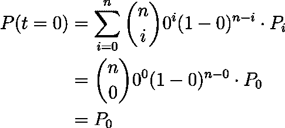
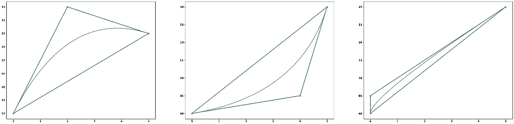

# 贝塞尔曲线

> 原文：<https://towardsdatascience.com/b%C3%A9zier-curve-bfffdadea212?source=collection_archive---------9----------------------->

## 理解贝塞尔曲线的数学

贝塞尔曲线在计算机图形学中被大量使用，经常用来产生平滑的曲线，然而它们是一个非常简单的工具。如果你曾经使用过 Photoshop，你可能会偶然发现一个叫做“锚点”的工具，在那里你可以放置锚点并用它们画一些曲线…是的，这些是贝塞尔曲线。或者，如果您使用基于矢量的图形，SVG，这些也使用贝塞尔曲线。让我们看看它是如何工作的。

# 定义

给定 ***n+1 个*** 点***【P0，…，Pn】***称为 ***控制点****由这些点定义的[贝塞尔曲线](https://en.wikipedia.org/wiki/B%C3%A9zier_curve)定义为:*

**

*情商。一*

*其中 **B(t)** 是[伯恩斯坦多项式](https://en.wikipedia.org/wiki/Bernstein_polynomial)，并且:*

**

*情商。2*

*你会注意到这个伯恩斯坦多项式看起来很像牛顿二项式公式中的 ***k(th)*** 项，即:*

**

*情商。3*

*其实伯恩斯坦多项式不过是 ***(t + (1 - t))^n = 1)展开式中的***【k(th)***项。*** 这就是为什么如果你把所有的*到*相加，你会得到 **1** 。任何方式。***

# ***二次贝塞尔曲线***

***二次贝塞尔曲线就是我们所说的具有 3 个控制点的贝塞尔曲线，因为 P(t)的次数将是 2。让我们计算给定 **3** 控制点的贝塞尔曲线，并探索我们可能找到的一些属性！记住，`eq. 1`为 ***n+1*** 分，所以在我们的例子中 ***n=2。******

****

**情商。四**

**注意 **P(t)** 返回的不是一个数字，而是曲线上的一个点。现在我们只需选择三个控制点，并评估范围`[0, 1]`上的曲线。我们可以很容易地在 Python 中做到这一点。**

****

**您会注意到曲线在第一个和最后一个控制点开始和结束。这个结果对任何数量的点都成立。由于 ***t*** 的范围是从 **0** 到 **1** ，我们可以通过在`t=0`和`t=1`处对 **P(t)** 求值来证明这一点。使用`eq. 1`:**

****

**情商。四**

****

**情商。5**

**因为曲线从 ***P0*** 到*，在这种情况下，*完全由决定曲线的形状*。*移动**P1你周围的人可能会注意到一些东西:******

****

**贝塞尔曲线总是包含在由控制点形成的多边形中。该多边形因此被称为 ***控制多边形*** *、*或贝塞尔多边形。这一特性也适用于任意数量的控制点，这使得在使用软件时它们的操作非常直观。**

****

# **矩阵表示**

**我们实际上可以使用矩阵乘法来表示贝塞尔公式，这在其他情况下可能很有用，例如分割贝塞尔曲线。如果我们回到我们的例子，我们可以重写 P(t)如下:**

****

**情商。6**

**因此，关于二次贝塞尔曲线的所有信息被压缩到一个矩阵中， ***M*** 。现在，我们可能想要找到该矩阵的系数，而不必执行所有这些步骤，并且以一种易于编程的方式。由于矩阵的系数只是每个 ***Pi*** 前面多项式的系数，所以我们要找的是伯恩斯坦多项式`eq. 2`的展开形式。**

**还有一点:如果展开 **Bi(t)** 我们会得到 **Pi** 前面的多项式，对应矩阵中的 **i(th)列**。然而，这并不方便，如果我们能得到行，编程会更容易。也就是说，你可能会注意到矩阵的 **i(th)行**与**反转(n-i)(th)** **列完全相同，**和反转(n-i)(th)列的系数只不过是按照**的递减幂取的 **B(n-i)(t)** 的系数。****

****

**情商。七**

**如果你遇到麻烦，你可能想参考`eq. 2`和`eq. 3`。**

**所以矩阵的系数无非就是 ***t*** 前面的系数，意思是:**

****

**情商。8**

# **插入文字**

**贝塞尔曲线的一个有趣的应用是绘制一条通过一组预定义的点的平滑曲线。之所以有趣，是因为 **P(t)** 的公式产生**点**，并且不是 **y=f(x)** 的形式，所以一个 ***x*** 可以有多个 ***y*** (基本上是一个可以“后退”的函数)。例如，我们可以画出这样的东西:**

****

**然而，产生这个结果的数学方法并不简单，所以我为此专门写了一篇文章:**

** [## 贝塞尔插值

### 使用贝塞尔曲线创建平滑形状。

towardsdatascience.com](/bézier-interpolation-8033e9a262c2)** 

**与此同时，以下是如何使用`eq. 1`为任意数量的控制点编写贝塞尔曲线的通用版本。**

**运行这个程序，你将得到显示在标题中的图表。**

**这就是贝塞尔曲线的介绍。我希望你学到了一些东西，不要犹豫地评论任何你可能有的问题！**