# 贝塞尔插值

> 原文：<https://towardsdatascience.com/b%C3%A9zier-interpolation-8033e9a262c2?source=collection_archive---------8----------------------->

## 使用贝塞尔曲线创建平滑形状。

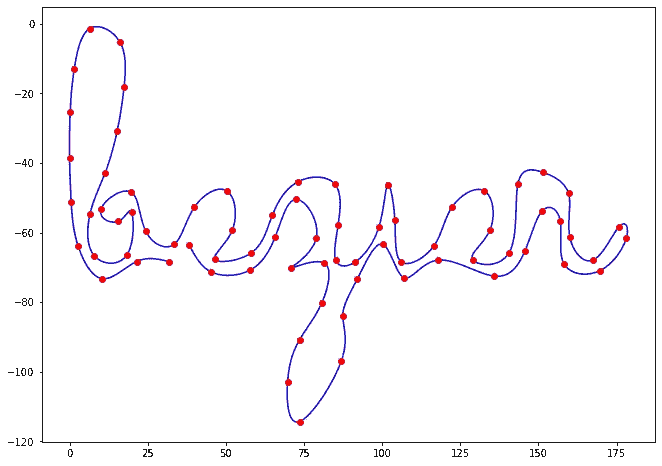

在本文中，我们将看到如何使用三次贝塞尔曲线来创建一条通过预定义的点集的平滑线。如果你不知道什么是贝塞尔曲线，你可能想看看我写的这篇文章，它可以作为一个介绍，或者只是浏览维基百科！

 [## 贝塞尔曲线

### 理解贝塞尔曲线的数学

towardsdatascience.com](/bézier-curve-bfffdadea212) 

# 三次贝塞尔曲线

目标是拟合 ***n+1*** 给定点 ***(P0，…，Pn)*** 。为了拟合这些点，我们将在每对连续的点之间使用一条三次贝塞尔曲线(4 个控制点)。

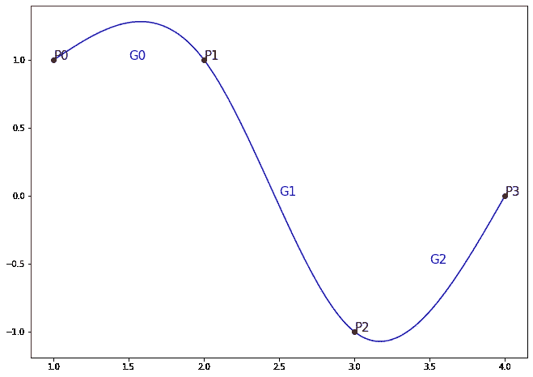

图一

所以在这个图中，***【G0】***、***【G1】、*** 和 *G2* 是三条不同的三次贝塞尔曲线，起点和终点分别是 ***(P0，P1)*** 、 ***(P1，P2)*** 和 ***(P2，P3)*** 因为任何贝塞尔曲线总是在第一个和最后一个控制点开始和结束，所以我们为每条曲线留下 2 个控制点，我们必须找到它们以使结果线看起来平滑。

*在本文中，您可能想回头参考* `*fig. 1*` *来理解我们将使用的指数。*

三次贝塞尔曲线的一般方程如下:

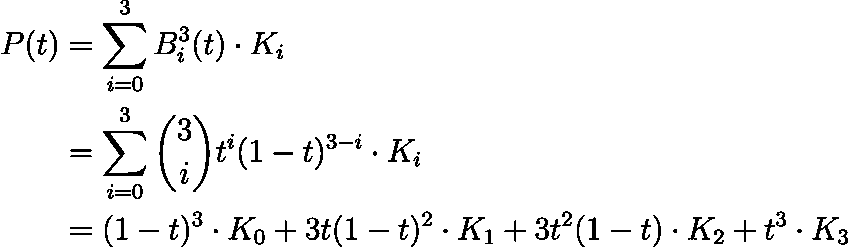

其中 ***K*** 为 4 个控制点。在我们的例子中， ***K0*** 和 ***K3*** 将是我们想要拟合的两个连续点(例如 ***P0-P1*** ，或者 ***P1-P2*** 等等)。)，而 ***K1*** 和 ***K2*** 是我们要找的剩下的 2 个控制点。

# **问题设置**

假设我们有 ***n+1*** 个点要拟合，我们将使用三次贝塞尔曲线来拟合每个连续的点。我们将符合 ***Pi*** 到 ***Pi+1*** 的贝塞尔曲线称为**γI***:*

*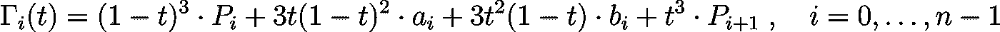*

*情商。2*

*哪里的 ***ai*** 和 ***bi*** 都是左找。注意这里有 n 条*曲线。**

**如果想要最终的曲线平滑，就需要保证**γI***和***γI+1*****在 ***Pi+1*** 周围平滑。换句话说，**γI***的曲率与***γI+1*****围绕 ***Pi+1 的曲率相匹配。*** 数学上，这意味着尊重以下条件:********

**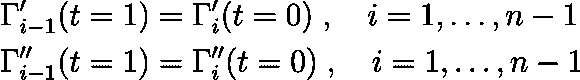**

**情商。3, 4**

**我们需要找到所有的 ***ai*** 和 ***bi*** 。由于我们在每条贝塞尔曲线中有一对这样的变量，并且由于我们有 ***n*** 条曲线，我们需要找到 ***2n*** 个变量。但是，这里我们有***【2(n-1)】***的方程式。我们缺少两个方程来解这个系统。因此，我们施加以下(任意)边界条件:**

**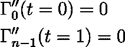**

**情商。5, 6**

# **编写系统**

**在解方程组之前，我们需要计算**γI**的一阶和二阶导数，把方程组写下来。**

**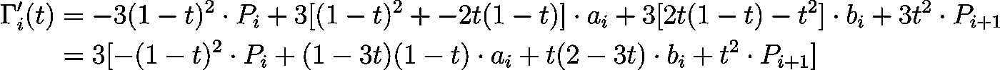**

**情商。七**

**而且，**

**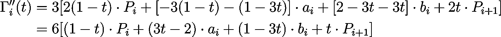**

**情商。8**

## **注入方程式**

**将`eq. 7`注入`eq. 3`:**

**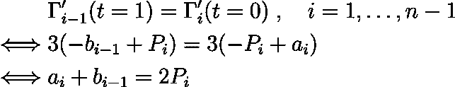**

**情商。9**

**将`eq. 8`注入`eq. 4`:**

**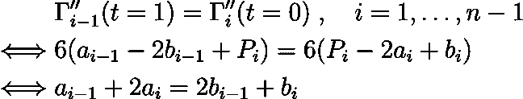**

**情商。10**

**将`eq. 8`注入`eq. 5`:**

**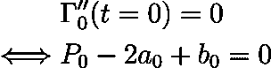**

**情商。11**

**最后，将`eq.8`注入`eq. 6`:**

**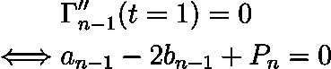**

**情商。12**

# **求解系统**

**综上所述，我们有以下 ***2n*** 等式:**

**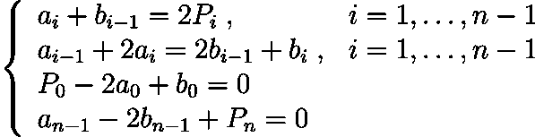**

**情商。9, 10, 11, 12**

**为了解决这个系统打算通过将`eq. 9`注入`eq. 10, 11, 12`来消除所有的*。使用`eq. 9`:***

***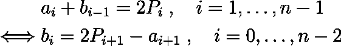***

***情商。13***

***将`eq. 13`注入`eq. 10`:***

***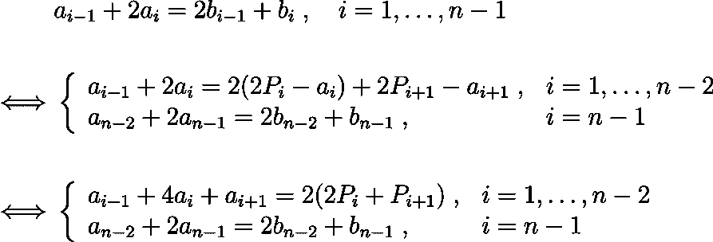***

***情商。13, 14***

***将`eq. 13`注入`eq. 11`:***

***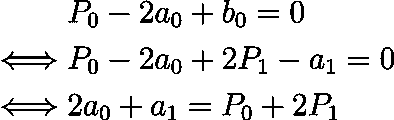***

***情商。15***

***快到了！我们现在需要将`eq. 13`代入第四个方程`eq. 12`。然而，`eq. 12`有 ***bn-1*** 但`eq. 13`保持到 ***bn-2*** 。好消息，我们可以用`eq. 14`去掉 ***bn-1*** 然后注入 ***bn-2*** *。****

**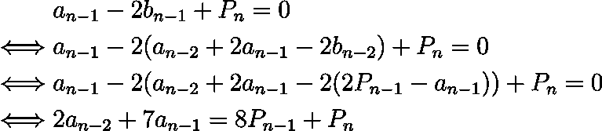**

**情商。16**

**好吧！总结一下，我们按照这个顺序`eq. 15, 13, 16`:**

**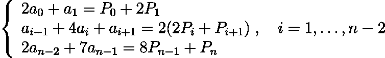**

**情商。15, 13, 16**

**我们可以把这个系统写成一个矩阵乘法来求解。坚持住，我们到了！**

**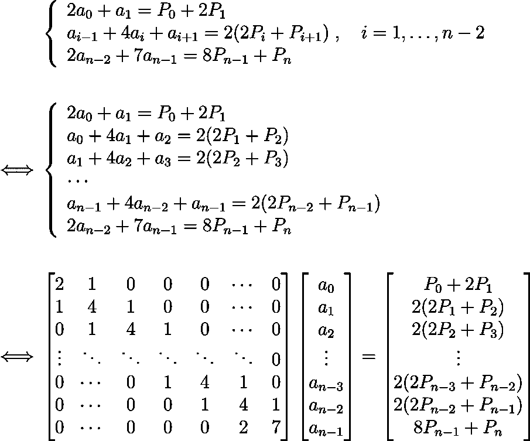**

**情商。17**

**如你所见，第一个矩阵只有 3 个对角线填充了值，其他都是零。这种矩阵被合理地称为三对角矩阵。存在有效解决这种类型系统的算法，例如在时间上线性运行的[托马斯算法](https://en.wikipedia.org/wiki/Tridiagonal_matrix_algorithm)。为了简单起见，我们不会进一步优化，我们将简单地使用 Python 中 Numpy 的内置函数来解决这个系统。**

**但是，我们仍然缺少了 ***bi*** 点。为了找到这些，我们简单地使用`eq. 13`来计算所有的*直到 ***bn-2*** ，然后使用`eq. 12`给出最后一项， ***bn-1*** 。***

**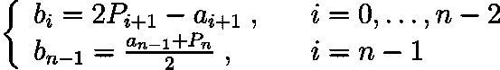**

**情商。13, 12**

**我们终于完成了！让我们看看如何用 Python 来编程。**

# **Python 代码**

**我尽了最大努力让代码尽可能清晰，我还添加了注释。如果你不能理解某事，不要犹豫发表评论！**

**最后，我们将这样使用这段代码:**

**对我来说，我得到了这个:**

**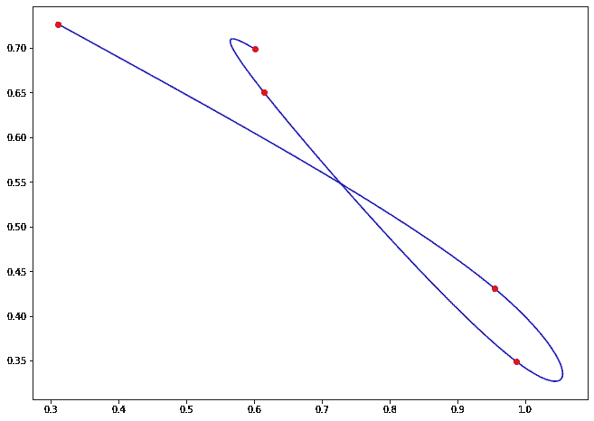**

**图 2**

**这篇文章到此为止！我希望你喜欢它，并且不要犹豫评论你可能有的任何问题！**