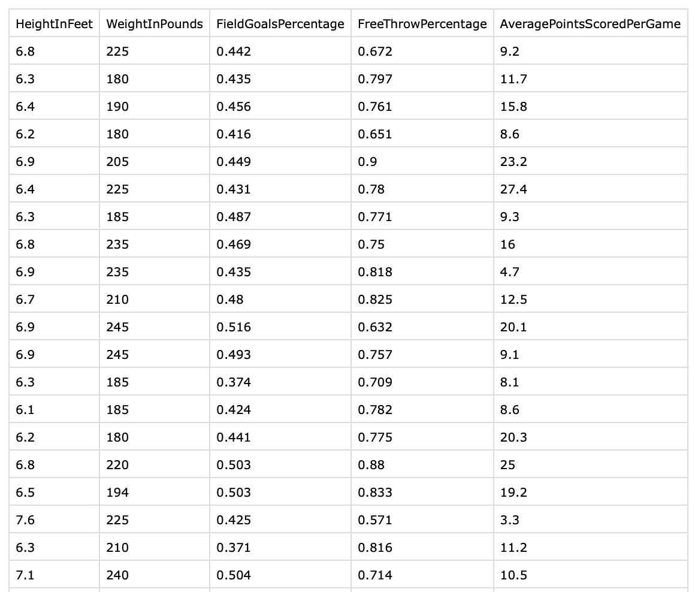
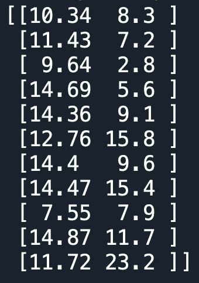

# 迈向数据科学的一小步:Python 中的多元线性回归

> 原文：<https://towardsdatascience.com/baby-steps-towards-data-science-multiple-linear-regression-in-python-add42dcfeca5?source=collection_archive---------38----------------------->

## 如何实施多元线性回归并解释结果？源代码和有趣的篮球运动员数据集已经提供。


图像来源:[交叉验证—堆栈交换](https://www.google.com/url?sa=i&url=https%3A%2F%2Fstats.stackexchange.com%2Fquestions%2F450846%2Fwhat-happens-when-we-introduce-more-variables-to-a-linear-regression-model&psig=AOvVaw0NTr33oDd111c_le1YAgXG&ust=1593917192446000&source=images&cd=vfe&ved=0CAMQjB1qFwoTCNiH0bzKsuoCFQAAAAAdAAAAABAS)

# 什么是多元线性回归？

让我直接进入主题。你上图看到的是多元线性回归的数学表示。图像中给出了所有必要的解释。

顾名思义，MLR(多元线性回归)是定义因变量平均行为的多个特征/变量的线性组合。

考虑 x1，x2，..xp 为自变量，Y 为因变量。所有β值对应于各自独立变量的系数。另一方面，β0 是截距值，类似于简单的线性回归。

**错误术语是什么？**

这是自然界存在的错误。还记得在我之前的文章中，我指出一个人永远无法预测准确的未来值吗？这是因为存在这个错误。误差包括我们的模型中没有记录/使用的所有数据。例如情绪、感觉等，它们不容易量化，或者仅仅是缺少数据/记录数据时的人为错误。

但是不用担心。一旦我们使用这种回归方法，我们只能得到 Y 变量的平均行为。与实际数据相比，这种平均行为可能大于、小于或等于 Y 的原始预测值。由于我们只处理 Y 的平均值，误差项相互抵消，最终我们得到一个没有误差项的估计回归函数。

如何减少误差？简单，多投点钱，多找数据。

**举例:**

让我们考虑公司的利润作为因变量(Y ),它的研发支出(x1 ),广告支出(x2)和营销支出(x3)作为自变量。假设在做了所有的数学计算后，我们得出了下面的回归方程或函数[任何回归的数学表示的另一个名称]。请记住下面的函数是假设的。

```
Profit = 10000 + 5(RnD) - 2(Advertising) + 1(Marketing)
```

**释义:**

1.  如果公司不投资研发、广告和营销，那么他们的平均利润将是 10，000 美元
2.  如果公司增加 10 万美元的研发支出，平均利润增加 50 万美元/5 个单位[这里变量的单位非常重要。基于单位，你可以正确地做出解释[所有变量都以 10 万美元为单位]，这是有意义的，因为更多的研发投资和更好的产品进入市场，从而更好的销售。
3.  如果公司增加 10 万美元的广告支出，那么平均利润减少 20 万美元/2 个单位。更多的广告支出可能会降低整体利润。
4.  如果公司增加 10 万美元的营销支出，那么每单位产品的平均利润增加 10 万美元。更多的营销支出可能会增加它的受欢迎程度，从而增加利润。

这些估计值是如何计算出来的？

有一种数学方法叫做 OLS(普通最小二乘法)。使用某些矩阵变换，你可以找到估计的系数值。解释 OLS 不在本文的范围之内。你可以很容易地在网上找到同样的教程，如果你真的想知道它是如何工作的，请浏览它们。然而，现代编程语言将帮助你计算这些估计。

# 用 Python 实现

让我们深入研究 python，构建一个 MLR 模型，并尝试预测篮球运动员的得分。


由[安德烈·克拉西尔尼科夫](https://unsplash.com/@krassmatraz?utm_source=medium&utm_medium=referral)在 [Unsplash](https://unsplash.com?utm_source=medium&utm_medium=referral) 上拍摄的照片

在您继续之前，请从我的 GitHub Gist 下载 csv 数据文件。

```
[https://gist.github.com/tharunpeddisetty/bc2508ab97c7c8460852f87ba4ad4efb](https://gist.github.com/tharunpeddisetty/bc2508ab97c7c8460852f87ba4ad4efb)
Once you open the link, you can find "Download Zip" button on the top right corner of the window. Go ahead and download the files.
You can download 1) python file 2)data file (.csv)
Rename the folder accordingly and store it in desired location and you are all set.If you are a beginner I highly recommend you to open your python IDE and follow the steps below because here, I write detailed comments(statements after #.., these do not compile when our run the code) on the working of code. You can use the actual python as your backup file or for your future reference.
```

***导入库***

```
import numpy as np
import matplotlib.pyplot as plt 
import pandas as pd
```

***导入数据并定义 X 和 Y 变量***

```
dataset = pd.read_csv('/Users/tharunpeddisetty/Desktop/PlayerStatsBasketball.csv') #paste your path inside the quatations #iloc takes the values from the specified index locations and stores them in the assigned variable as an arrayX = dataset.iloc[:,:-1].values
Y = dataset.iloc[:,-1].values
```

**让我们看看我们的数据，了解一下变量:**



作者图片

所有变量名都是不言自明的。在这个程序中，我们的任务是根据一个球员的身高、体重、投篮命中率和罚球命中率来预测他的平均得分。因此，您可以看到，我使用 python 中的 iloc 函数和一些独立切片，将最后一列隔离为我们的 Y 变量，并将所有其他变量隔离到 X 中作为特征数组。

***将数据拆分成训练集和测试集***

```
from sklearn.model_selection import train_test_split
X_train, X_test, Y_train, Y_test = train_test_split(X,Y,test_size=0.2,random_state=0)# test_size =0.2 tells the class that we are trying to split 80% of the data into train data and 20% into the test data. random_state=1 serves as a seed, this basically makes sure that same random process is chosen when splitting the data in different evironments. To be specific, you and I running this code in 2 different computers get same rows in both test and train data sets
```

ScikitLearn 是一个著名的 python 库，广泛用于机器学习。你可以检查出所有它的牛逼 API 供你参考。我们会经常用到它们。点击下面的链接

[https://scikit-learn.org/stable/modules/classes.html](https://scikit-learn.org/stable/modules/classes.html)

***训练模型***

```
from sklearn.linear_model import LinearRegression
regressor = LinearRegression()
regressor.fit(X_train,Y_train)#regressor is the object for class LinearRegression
```

***对测试集*** 进行预测

```
# Predicting new data i.e., test  data resuls using the model that is trained on our train datay_pred = regressor.predict(X_test)np.set_printoptions(precision=2)print(np.concatenate((y_pred.reshape(len(y_pred),1),Y_test.reshape(len(y_pred),1)),1))
#.reshape is to display the vector vertical instead of default horizontal. Second parameter axis =0 is vertical concatenation, axis =1 is horizontal concatenation
```

***结果***



作者图片

这些结果与我们上次发表的声明一致。第一列值是我们的模型预测的平均进球，第二列显示了球员的实际进球。

***打印系数和截距值***

```
print(regressor.coef_)
print(regressor.intercept_)
```

我相信你可以把这些打印出来，然后根据我之前举的例子做你的解释。

# 结论

嗯，正如你所看到的，我们的模型没有预期的那么好。只有一个值，即 7.55，与实际值 7.9 非常接近。我选择这个数据集来解释多元线性回归是有原因的，也就是说没有一个模型是完美的，没有人能够建立一个完美的模型。你必须知道它性能不达标背后的原因。我们的数据可能存在某些问题，例如:

1.  数据集可能存在潜在问题。
2.  很可能，我们没有足够的训练数据供模型处理和预测。
3.  数据中可能存在不一致，例如输入了错误的值(由于人为或计算机错误)。
4.  考虑的独立变量可能不是解释玩家在游戏中平均进球的显著变量。

以上几点都重合在一点:误差。我们可以说我们的数据有很多错误。我们可能需要更多关于球员在比赛中的体能、动机、情绪等方面的数据。

那么这是否意味着我们未能实现多元线性回归呢？当然不是，因为作为一名数据科学家，你必须明白编写代码和实现模型的能力并不是主要目标。他/她必须深入了解数据。你是怎么做到的？只需与提供数据的人交谈，也可能与数据来源领域的行业专家交谈(在我们的案例中是篮球)，并尝试找出数据中是否有任何潜在的错误。

除非你理解数据，否则建立模型并不那么简单。人们必须知道他们的目标是什么。没有一个完美的模型可以用不同的数据集一直预测 95%的准确率。如果有人声称他们的模型是最好的，那个人是个傻瓜。

嗯，我的目的达到了。我已经展示了如何对多元线性回归建模，还展示了在开始回归建模之前需要仔细考虑的问题。人们必须改变必要的参数，以便该模型最佳地为企业/个人的特定目的而工作。尝试相同的方法，用不同的数据集编码，识别 X 和 Y 变量，检查结果，你可以得到大量的在线数据集。相同的代码在各种其他数据集上运行得非常好，所以它毕竟不是真的没用。机器学习快乐！