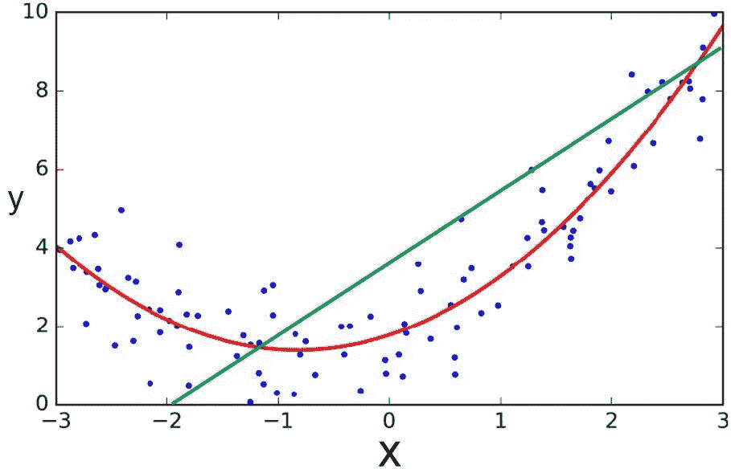
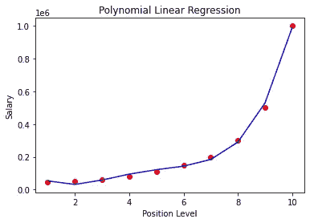
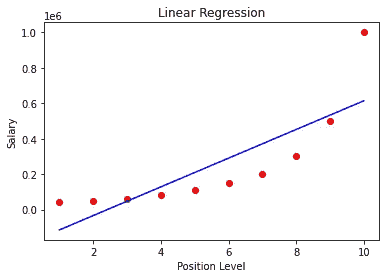

# 迈向数据科学的一小步:Python 中的多项式回归

> 原文：<https://towardsdatascience.com/baby-steps-towards-data-science-polynomial-regression-in-python-a75f371bd984?source=collection_archive---------52----------------------->

## 理解多项式回归背后的直觉，并用 python 实现。提供源代码和数据集。



图片来源 [Animoid](https://animoidin.wordpress.com/2018/07/01/polynomial-regression/)

# 什么是多项式回归？

在上图中，你可以看到多项式曲线的例子。大多数实时数据实际上并不是线性的，而是非线性的。上图中所有蓝色的点代表数据点，绿线是线性回归线，而红线是多项式回归线。你可以立即看到哪条线是完美的。它是红线，即代表给定范围内数据的总体趋势。

现在，让我们理解什么是多项式回归:你可以从初等数学中联系你对多项式的理解。它是一个正整数幂的变量。因此，多项式回归归结为使用多项式函数来对数据建模。如何知道何时使用这种类型的回归？简单地看一下数据分布，如果它与你在上图中看到的接近，你可以尝试使用多项式回归。数据科学是关于在真实世界场景中使用数学和统计知识，而不是像我们在学校里学到的那样，是一个假设的作业问题。

# 多项式回归函数的表示

```
Y = b0+ b1x +b2 x²+b3 x³ + ….+bn x^n 
```

你可以看到它不同于线性函数，线性函数的形式是:

```
 Y = b0 + b1 x1 + …+ bn xn
```

# 用 Python 实现

让我们深入研究 python，建立一个多项式回归模型，并尝试预测一个 6.5 级别的员工的工资(假设)。


由[活动创作者](https://unsplash.com/@campaign_creators?utm_source=medium&utm_medium=referral)在 [Unsplash](https://unsplash.com?utm_source=medium&utm_medium=referral) 上拍摄的照片

在您继续之前，请从我的 GitHub Gist 下载 csv 数据文件。

```
[https://gist.github.com/tharunpeddisetty/22447d5446928f864b55e096b4aac995](https://gist.github.com/tharunpeddisetty/22447d5446928f864b55e096b4aac995)
Once you open the link, you can find "Download Zip" button on the top right corner of the window. Go ahead and download the files.
You can download 1) python file 2)data file (.csv)
Rename the folder accordingly and store it in desired location and you are all set.If you are a beginner I highly recommend you to open your python IDE and follow the steps below because here, I write detailed comments(statements after #.., these do not compile when our run the code) on the working of code. You can use the actual python as your backup file or for your future reference.
```

***导入库***

```
import numpy as np
import matplotlib.pyplot as plt
import pandas as pd
```

***导入数据并定义 X 和 Y 变量***

```
dataset = pd.read_csv(‘/Users/tharunpeddisetty/Desktop/Position_Salaries.csv’) #add your file path#iloc takes the values from the specified index locations and stores them in the assigned variable as an array
X = dataset.iloc[:,1:-1].values
y = dataset.iloc[:, -1].values
```

**让我们看看我们的数据，了解一下变量:**


作者图片

该数据描述了员工的职位/级别及其工资。你可以看到，随着工作级别的提高，工资的增长是非线性的。

***可视化数据***


作者图片

你可以看到绘制的数据是非线性增长的，因此，我们可以尝试多项式回归方法。请注意，我是说我们可以“尝试”，但不是说这是最好的模式。你会在我以后的文章中看到其中的道理。

***训练模特***

```
from sklearn.preprocessing import PolynomialFeatures
poly_reg = PolynomialFeatures(degree=4)
X_poly=poly_reg.fit_transform(X) #regressor is the object for class PolynomialFeatures
#degree=4 defines that the function must have x, x^2 , x^3 and x^4 terms
#fit_transform() returns a new data set with x, x^2 , x^3 and x^4 terms as the input data set
```

我们将使用模型中的全部数据，因此您不需要将数据分成训练和测试数据。

***可视化多项式回归的结果***

```
plt.scatter(X,y,c=’red’)
plt.plot(X,lin_reg2.predict(X_poly), c=’blue’)
plt.title(‘Polynomial Linear Regression’)
plt.xlabel(“Position Level”)
plt.ylabel(‘Salary’)
plt.show()
```



作者图片

你可以看到 4 次多项式函数给了我们合适的回归线。

***可视化线性回归的结果***



作者图片

您可以通过阅读我的线性回归文章来实现线性回归并将其可视化。以上图片已添加供您参考。不过你在我的要点文件里有它的代码。你可以立即看到回归线的巨大差异。

***使用多项式线性回归预测 6.5 级结果***

```
print(lin_reg2.predict(poly_reg.fit_transform([[6.5]]))) 
# we need to enter x1,x2,x3,x4 and this is the efficient model
# predict method expects a 2D array thats the reason you see [[6.5]]
# we use poly_reg.fit_transform because we want to transform our value 6.5 into a 3 other columns values with degree 4\. We need to enter the input exactly how we transformed it for using in the model
```

***结果***

多项式线性回归:158862.45

线性回归预测:330378.79(请自行尝试)

# 结论

我们可以看到，我们的多项式模型预测的实际工资介于 6 级和 7 级工资之间。看看线性回归的表现有多差。现在你可能会想，为什么我只考虑了这个问题的 4 度。好吧，我鼓励你尝试不同的程度，看看你的结果。尝试度=2、3、4、5、6 等

我希望这对你来说是有趣的。恭喜你！您已经用最少的代码行实现了多项式回归。当我说婴儿迈向数据科学时，我是认真的。现在您有了代码模板，可以在其他数据集上实现它，并通过更改想要使用的多项式函数的次数来观察结果。机器学习快乐！