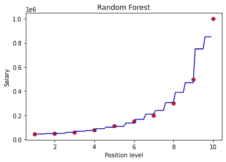
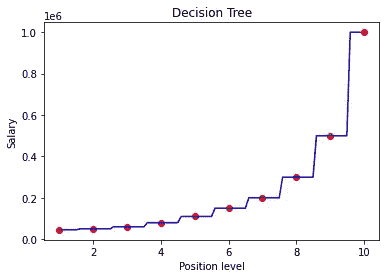

# 迈向数据科学的一小步:Python 中的随机森林回归

> 原文：<https://towardsdatascience.com/baby-steps-towards-data-science-random-forest-regression-in-python-d896fca5665a?source=collection_archive---------52----------------------->

## 理解随机森林回归背后的直觉，并用 python 实现。提供源代码和数据集。


基思·琼森在 [Unsplash](https://unsplash.com?utm_source=medium&utm_medium=referral) 上的照片

# 什么是随机森林回归？

随机森林算法是我的最爱之一。它可用于分类和回归。用更简单的语言来说，随机森林收集来自各种决策树的预测，并给出这些预测的平均值。这样，预测就有可能实际上收敛到真实值。每个决策树仅在数据子集上实现。该子集由算法随机选择，其中随机选取一个观察值并替换回数据集中，随机选择另一个观察值，添加到数据子集；这就是通常所说的自举。因此，您可以理解，单个观察可以多次成为决策树的一部分，因为我们替换了数据集中的观察并进行随机选择。对于多个决策树，这个过程重复多次。所有这些决策树统称为随机森林，现在，你确切地知道为什么使用随机和森林这两个词了。

这里的基本思想是在不同的数据样本上训练每棵树，并使用它们预测的平均值作为最终输出。这个输出的方差很小，很容易理解。

我可以强烈地说，随机森林比单一决策树更好。为什么？这是因为结果更加稳健。每一棵决策树都有自己的信息，并做出相应的预测。当我们组合所有这样的树时，结果预计会更加准确，并且接近平均真实值。

我将使用我在决策树文章中使用的相同数据集，这样您可以看到预测中的差异。

# 用 Python 实现

让我们深入研究 python，建立一个随机森林回归模型，并尝试预测一个 6.5 级别的员工的工资(假设)。

在您继续之前，请从我的 GitHub Gist 下载 CSV 数据文件。

```
[https://gist.github.com/tharunpeddisetty/8c3213de90fdc50c5814dbadcba181ac](https://gist.github.com/tharunpeddisetty/8c3213de90fdc50c5814dbadcba181ac)
Once you open the link, you can find "Download Zip" button on the top right corner of the window. Go ahead and download the files.
You can download 1) python file 2)data file (.csv)
Rename the folder accordingly and store it in desired location and you are all set.If you are a beginner I highly recommend you to open your python IDE and follow the steps below because here, I write detailed comments(statements after #.., these do not compile when our run the code) on the working of code. You can use the actual python as your backup file or for your future reference.
```

***导入库***

```
import numpy as np
import matplotlib.pyplot as plt
import pandas as pd
```

***导入数据并定义 X 和 Y 变量***

```
dataset = pd.read_csv(‘/Users/tharunpeddisetty/Desktop/Position_Salaries.csv’) #add your file pathX = dataset.iloc[:,1:-1].values
y = dataset.iloc[:, -1].values#iloc takes the values from the specified index locations and stores them in the assigned variable as an array
```

**让我们看看我们的数据，了解变量:**


该数据描述了员工的职位/级别及其工资。这与我在决策树回归文章中使用的数据集相同。

***训练模型***

```
from sklearn.ensemble import RandomForestRegressor
regressor = RandomForestRegressor(random_state=0,n_estimators=10)
regressor.fit(X,y)#random_state is the seed value, just to make sure we both get same results.
#n_estimators defines the number of trees you want to implement 
```

***可视化决策树回归的结果***

```
X_grid = np.arange(min(X), max(X), 0.1)
X_grid = X_grid.reshape((len(X_grid), 1))
plt.scatter(X, y, color = 'red')
plt.plot(X_grid,regressor.predict(X_grid), color = 'blue')
plt.title('Random Forest Tree')
plt.xlabel('Position level')
plt.ylabel('Salary')
plt.show()
```



作者图片



作者图片(不包括代码)

这个可视化没有太多需要解释的。为了让你更好的理解和比较，我已经把我上一篇文章中决策树的可视化和预测结果包括进来了。

***使用决策树回归预测 6.5 级结果***

```
print(regressor.predict([[6.5]]))
# predict method expects a 2D array thats the reason you see [[6.5]]
```

***结果***

随机森林回归:167000

决策树回归:150000(不属于代码的输出)

# 结论

你可以亲眼看到随机森林回归比决策树预测的结果更真实。决策树对一个 6.5 级的员工预测了同样的工资，这似乎不太公平。当您查看随机森林预测时，它预测了 16.7 万美元，介于第 6 级和第 7 级之间，只要查看它，您就会发现它是有道理的。记住一件事，回归是所有关于平均行为和因素如何平均影响解释变量。

恭喜你！您已经用最少的代码行实现了随机森林回归。这很简单，对吗？。现在您有了代码的模板，您可以在其他数据集上实现它并观察结果。机器学习快乐！