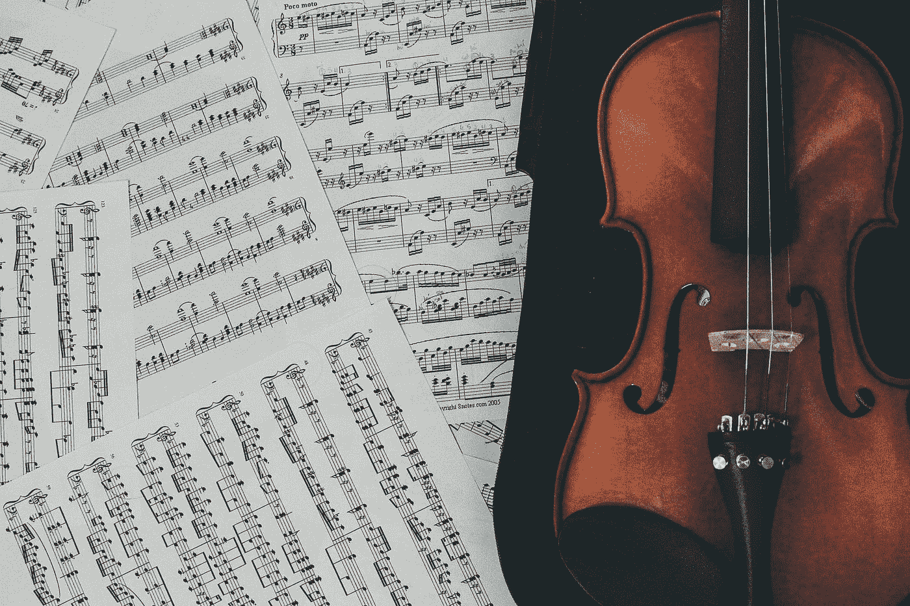
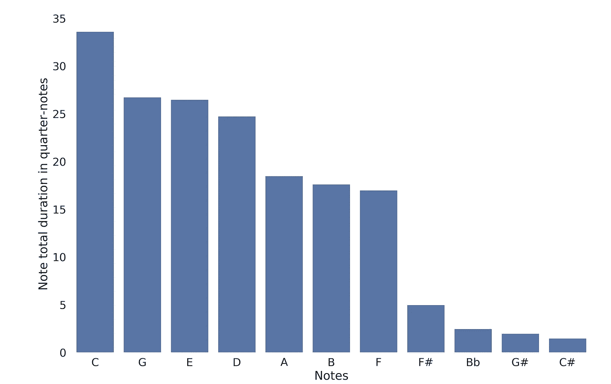
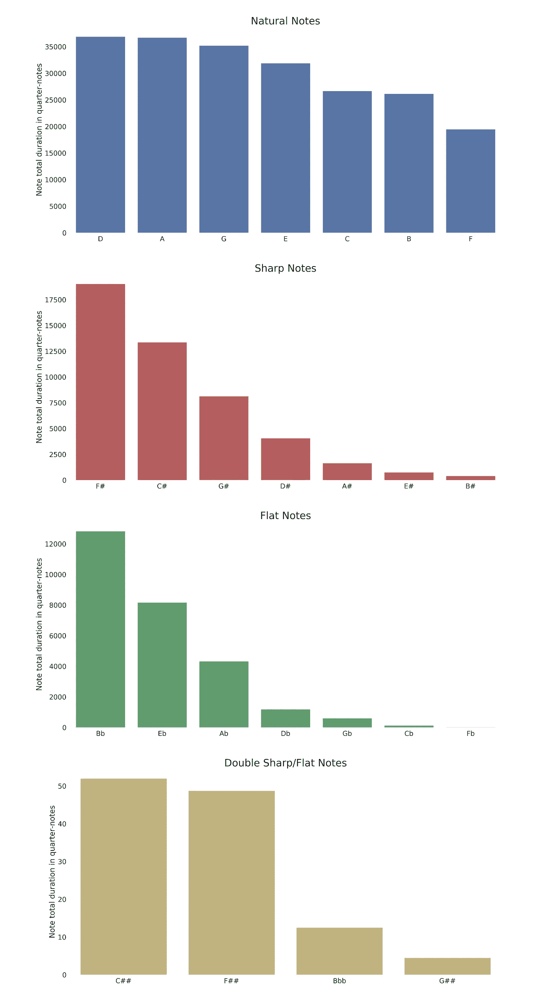
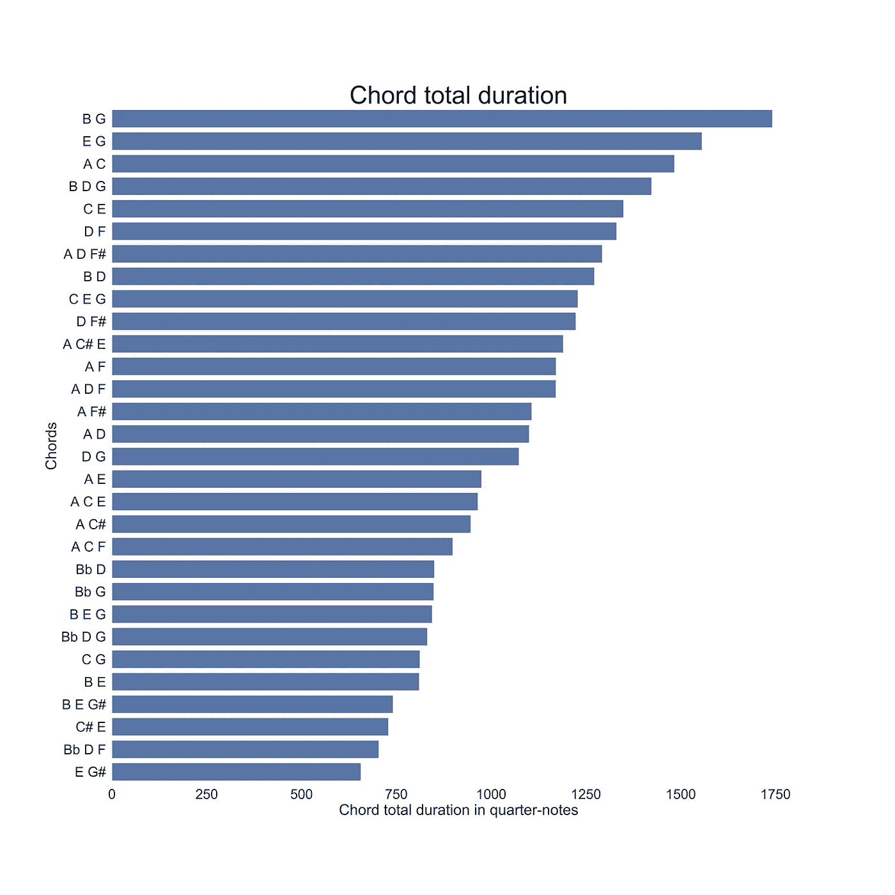
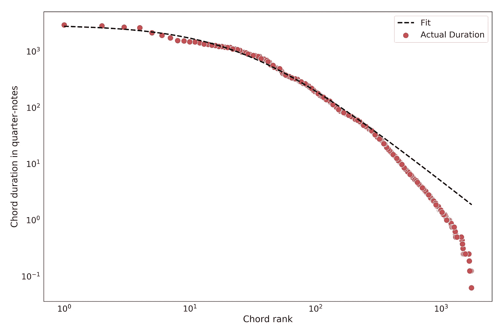
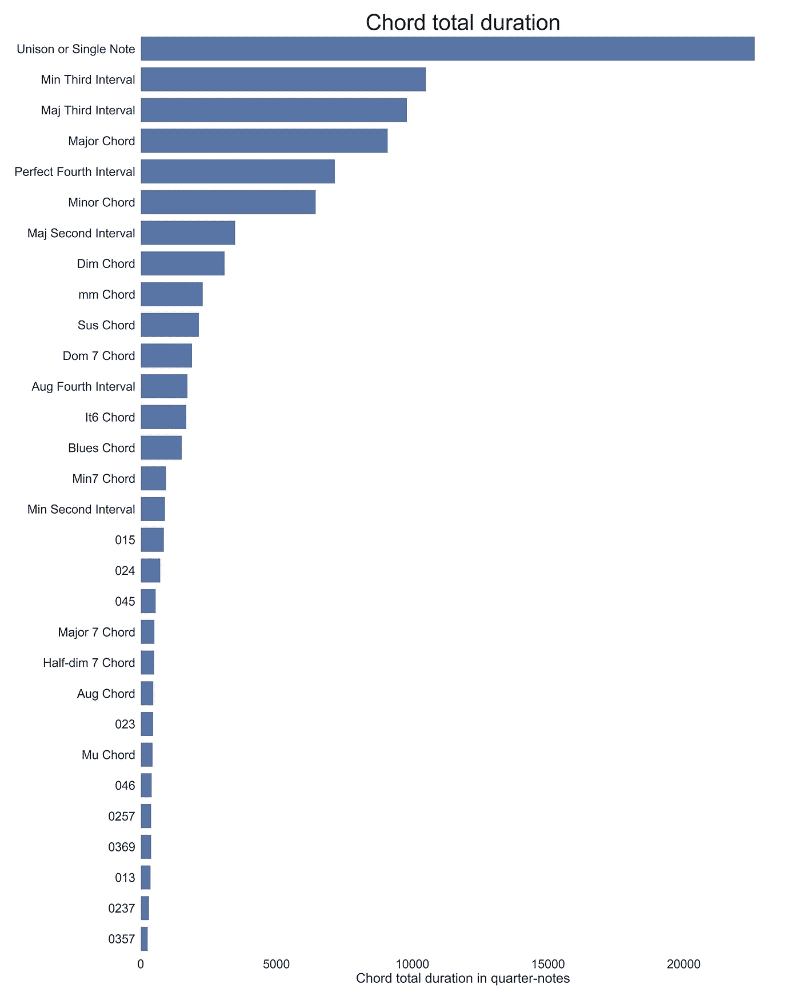
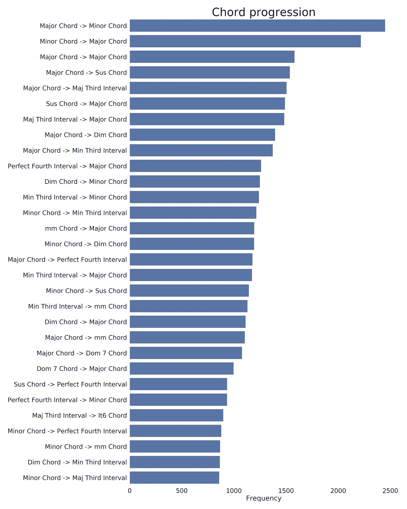
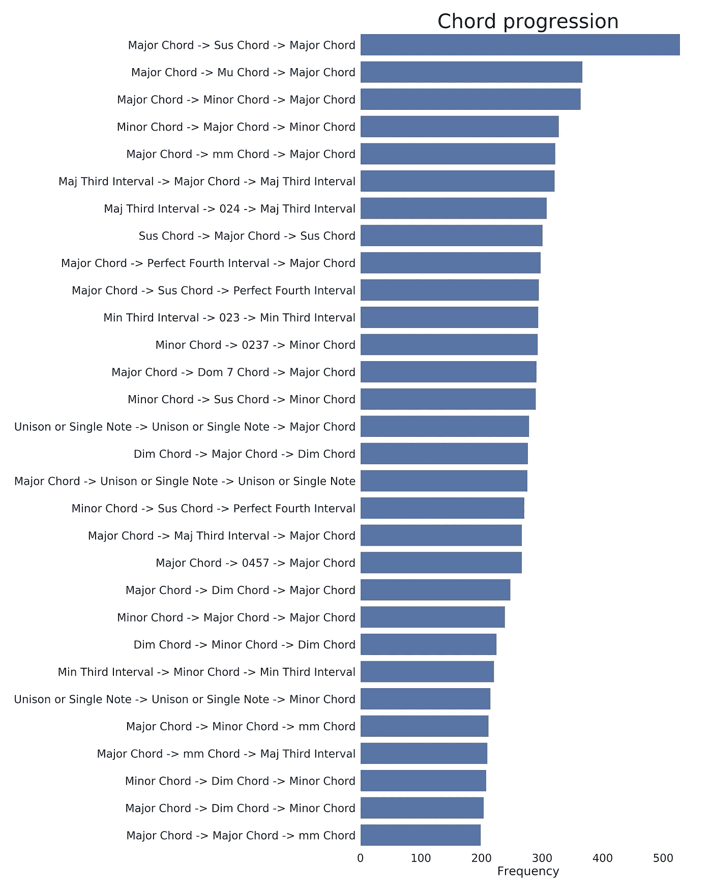

# 巴赫最喜欢的音符

> 原文：<https://towardsdatascience.com/bachs-favorite-note-b0542ba4f8f5?source=collection_archive---------11----------------------->

斯蒂芬尼·安德拉德在 [Unsplash](https://unsplash.com?utm_source=medium&utm_medium=referral) 上的照片

我一直喜欢古典音乐。小时候，我花了大约 10 年时间学习乐理，拉小提琴。当然，我最大的爱好是科学和数据。我总是试图找到结合两者的方法，用数据科学来分析古典音乐。我不想分析古典作品的声音，我想把我的分析集中在音乐理论上。我想研究音乐作曲家是如何创作音乐的，而不是音乐是如何演奏的。本质上，我在寻找一种将乐谱转换成结构化数据的方法。

我选择巴赫的音乐有几个原因。首先，巴赫被认为是音乐天才，是最伟大的古典音乐作曲家之一，所以分析他的音乐总是很有趣。其次，巴赫写了 1000 多首曲子，所以有大量的数据需要分析。第三，巴赫的音乐是非常严格地遵循调性体系和对位法的规则来创作的，这使得音乐更加结构化，也更容易从和弦分析的角度来分析。最后，我真的很喜欢巴赫的音乐，所以也有一些个人偏好。

在本文中，我不深入分析背后的代码的技术细节，但如果感兴趣，读者可以在这里找到完整的代码。

# 数据

如上所述，我的第一个问题是获得能让我分析音乐理论的数据。音频文件如`.wav`、`.aiff`或压缩音频文件如`.wma`、`.mp3`等。不适合这种分析。从整个管弦乐队的原始音频到特定的音符、和弦、音乐调等。这将是一个更加困难的项目，一个我不知道如何在合理的时间内完成的项目。

不过，有一种格式可以用于我的分析。[。midi 格式](https://en.wikipedia.org/wiki/MIDI)，用于控制电子或数字乐器。使用`.midi`，音符(音高)的演奏、音符的持续时间以及演奏音符的乐器(通道)都是直接指定的。此外，我有一个简单的方法来转换。midi 文件到`.csv`文件，即结构化数据，此时我可以用熟悉的方式分析它，就像任何其他结构化数据一样。

我发现了[muto pia 项目](https://www.mutopiaproject.org/)，它收集了大量的古典音乐作品，全部都在公共领域。我在网站上搜寻 J.S .巴赫的作品。网站上有 417 首巴赫的作品，但有些有多个文件，所以文件总数是 529。我使用我在这里找到的代码[将所有的`.midi`文件转换为`.csv`文件。在我拿到`.csv`的文件后，我可以开始我的分析。分析是用 Python 完成的，我的代码可以在这里找到](http://www.archduke.org/midi/)。

# 数音符

关于一首音乐作品，我想回答的第一个问题是，它是由哪些音符组成的。哪一个音符用得最多？哪张纸币用得最少？音符的分布或多或少是均匀的，还是有些音符比其他音符用得多？

换句话说，计算一个音符出现的次数，一个新音符出现的事件可以给我们这样的分布。另一方面，一些音符可能持续一个完整的小节，而另一些音符在快速段落中仅作为十六分音符出现。我认为音符的持续时间应该作为分布中的一个权重，这样较长的音符比持续时间较短的音符更重要。

在`.midi`文件中，乐器在特定时间内演奏一个或多个音符。记录音符开始播放的时间和音符停止播放的时间。这给了我们音符的持续时间，这是用时钟滴答来衡量的。它可以通过转换因子(一个四分音符中的节拍数)转换为常规音符长度，该转换因子也包含在文件中。因此，我们可以提取传统乐谱中音符的持续时间，即四分音符、八分音符等。

将一个音符在音乐作品中的所有持续时间相加，将得出该音符的总持续时间。我们可以对每个音符都这样做，所以最后，我们可以比较所有音符的总持续时间，看看哪个音符被演奏得最多。

作为一个例子，我们来看看巴赫的《c 大调第一发明》(BWV 772) 。在这里可以找到[的活页乐谱](https://www.mutopiaproject.org/ftp/BachJS/BWV772/bach-invention-01/bach-invention-01-a4.pdf)。我们可以看到这首曲子是用 c 大调写的，没有升半音，所以自然音符都有更高的持续时间。此外，C 键的主音，是使用最多的音符，不出所料，第五个(G)和第三个(E)，分别位于第二和第三位。尽管这首曲子只有 22 小节长，但 G 大调、A 小调、F 大调都有调式，这也是降 B 调、升 F 调和升 C 调的由来。

这可以扩展到我们数据集中所有巴赫的作品。将每首乐曲中每个音符的值相加，我们得到所有音符持续时间的总和。结果可以在下图中看到。音符 D 是巴赫使用最多的音符，使用频率比 A 稍高，A 排在第二位，其余的自然音符紧随其后。

在图表中，我们分别标出了自然音符、降半音和升半音。这样做是为了证明一个惊人的观察。自然音符确实显示出一些可变性，演奏最多的音符(D)的持续时间几乎是演奏最少的音符(F)的两倍。然而，该分布类似于均匀分布。另一方面，高音符的持续时间变化很大，演奏最多的音符(升 F)的持续时间是演奏最少的音符(升 B)的 46.5 倍。这同样适用于公寓。

然而更有趣的是，从第一场到最后一场比赛的升半音的顺序*确切地说是*升半音在[调号符号](https://en.wikipedia.org/wiki/Key_signature#Scales_with_sharp_key_signatures)中的顺序:F♯、C♯、G♯、D♯、A♯、E♯、B♯.同样，降半音的顺序与调号符号中的降半音顺序完全一致:B♭、E♭、A♭、D♭、G♭、C♭、F♭.最后，双升半音的持续时间比自然音低几百倍。

> 从第一个到最后一个升半音的顺序与调号符号中升半音的顺序完全匹配

# 计算和弦

到目前为止，我们一直在数单个的音符。然而在音乐中，几个音符可以同时发出声音，形成和弦。如果各种乐器或声部同时演奏不同的音符，或者同一种乐器同时演奏多个音符，就会出现这种情况。

这里，我们将和弦定义为一起演奏的任意数量的音符。因此，三个音符一起演奏，例如 C、E、G，是一个和弦，但是仅仅两个音符一起演奏(例如 G)或者甚至一个音符单独演奏(E)也被认为是一个和弦。还有，我们会把不同八度的音符当做同一个音符，在和弦中只算一次。例如，如果 C4、E4、C5 和 E5 一起发音，我们将把它视为(C，E)和弦。此外，和弦中音符的顺序并不重要。例如，和弦 C4、E4、G4 会被认为与 E3、G3、C4 相同。更正式地说，我们对和弦的定义是音乐理论中的一组和弦。

我们希望将我们用于音符的相同方法应用于和弦。但是我们如何测量和弦的持续时间呢？为了做到这一点，我们将乐曲拆分为最小的节奏值，即第六十四个音符。对于每个第 64 个音符音程，我们收集在该音程弹奏的所有音符，形成一个和弦。我们将每个和弦的第 64 个音符音程的所有实例相加，得出每个和弦在第 64 个音符中的总持续时间。最后，我们将持续时间转换为四分音符。

有成千上万种方法可以将音符组合成一个和弦，但大多数在实践中使用起来都很不和谐。此外，许多作品只为一种乐器创作，如小提琴、大提琴或鲁特琴，所以它们的完整乐谱通常只有单个音符，没有和弦出现。这使得数据偏向单个音符。因此，这里我们只展示两个或两个以上音符的和弦。尽管如此，巴赫的作品中仍然使用了数千种音符组合，即使其中一些只使用了一次，或者只使用了很短的时间。在下面的情节中，我们展示了巴赫作品中最常用的 30 个和弦。

我们注意到，音程(B，G)占第一位，后面是音程(E，G)和(A，C)。第一个全和弦，即包含主音、第三和第五音的和声三和弦，是(B、D、G)或 G 大调，出现在第四个位置。接下来的和声三和弦是 D 大调，C 大调，A 大调，D 小调和 A 小调。

## 和弦排名

如前所述，我们在巴赫的作品中发现了数以千计的音符组合，但其中大多数很少使用，而另一些则一直在使用。这类似于自然语言中单词的使用。Zipf 定律描述了这种排列数据的行为。具体来说，Zipf–Mandelbrot 定律是 Zipf 定律的扩展，描述了排名数据的分布。我们拟合了 Zipf–Mandelbrot 定律形式的函数，得到了相对较好的拟合。我们应该强调的是，与上一张图表不同，这张图表中包含了单音符和弦。

有一篇由胡安·伊格纳西奥·佩罗蒂和奥兰多·维托·比罗尼撰写的论文，他们描述了当齐夫定律应用于音乐作品中的音符和和弦时的类似发现。

## 和弦类型

另一个有趣的发现是所有第一位置的全和弦不是大调就是小调和弦。我们想进一步探索这个想法，并确定巴赫使用的所有和弦类型。为了做到这一点，我们需要将和弦从音符的常规和弦转换成[音高等级集](https://en.wikipedia.org/wiki/List_of_pitch-class_sets)。音高类别集是一组数字，表示组成和弦的音符与第一个音高的相对差异，第一个音高被赋予数字 0。差异是用半音来衡量的。例如，大和弦三和弦对应于集合(0，4，7)，因为第一个和第二个音符相隔 4 个半音(大三度)，第一个和第三个音符相隔 7 个半音(完全五度)。

这样，我们可以将和弦的类型分组在一起，因为所有的主和弦都对应于同一个集合。同样，所有小和弦都对应于集合(0，3，7)。其他常见的集合也有传统的名称，例如，集合(0，2，7)被称为悬弦，集合(0，1，4，7)被称为减大七和弦。

一组音符通常对应于一个以上的音高标准组。例如，集合(C，E，G)可以对应于集合(0，4，7)，也可以对应于集合(0，3，8)，这取决于音符的顺序。我们总是采用集合的最紧凑形式，即第一个和最后一个音高之间的距离最小的形式，作为音高类集合。此外，可能存在一个以上的最紧密集合。在这种情况下，我们选择按缩短顺序排在第一位的集合。例如，在集合(0，1，5)和(0，4，5)之间，我们选择第一个。

我们在下图中展示了结果。只要有可能，我们就用传统的和弦名称来代替数字集合。

很快，我们注意到所有的第一位置都对应众所周知的音程和和弦。在这里，我们用现代术语识别了大七和弦、悬和弦和其他类型。当然，在巴洛克音乐中，作曲家们并不这样想。除了大和弦、小和弦、减和弦和增和弦之外，其余都是一个声部用“非和弦”音符演奏旋律，然后将其余声部加入到一个辅音和弦中。

此外，我们注意到单音符和双音符音程比全和弦更常见。这也是因为一些作品是为独奏乐器创作的，所以它们包含了更多的单音符。另一个有趣的观察是，大和弦的使用率几乎是小和弦的 1.5 倍。

# 和弦进行

我们现在开始和弦进行。从音乐理论的角度来看，一段音乐可以被认为是一系列的和弦，一个接一个。这被称为和弦进行，是音乐理论中的一个主要话题。我们需要澄清的是，巴洛克时代的作曲家并没有按照和弦进行来思考，这是一种现代的解释。然而，从现代音乐理论的角度来看巴赫作品中的和弦进行是很有趣的。

这一次，和弦的持续时间并不重要。我们只关心接下来的和弦。如前所述，我们将和弦转换为音高等级集合。对于每首曲子，我们都按照和弦的顺序创建一个列表，从第一个和弦到最后一个和弦。然后我们按两个或更多和弦的顺序将和弦分组。这个过程相当于一段文本的 [n-grams](https://en.wikipedia.org/wiki/N-gram) ，其中和弦可以被认为是文本的单词，音乐片段可以被认为是文档。实际上，在代码中，我们使用了与自然语言处理完全相同的方法。

在这一点上，我们将搜索限制在至少有一个三和弦的和弦进行上。这样做是因为，正如我们之前注意到的，数据偏向于单音符和双音符和弦，但为了更好地理解音乐作品的和声，我们需要研究完整的和弦。如果我们不使用这个限制，第一个位置都是单音符和双音符的级数。在下图中，我们展示了前 30 个双弦序列(二元模型)。

我们注意到巴赫通常是从大调和弦转到小调和弦，然后回到大调和弦，或者从一个大调和弦转到另一个。我们也注意到悬弦的使用。对位法中一个常见的技巧是将一个音符从前一个和弦带到下一个和弦，最后分解到第三个或主音。我们可以概括所有不和谐的和弦——至少根据巴洛克的标准——比如悬和弦、七和弦等等。我们可以看到，这些和弦总是解析为一个协和和弦(比如大调或小调和弦)。

接下来，我们绘制三和弦序列(三元组)。这一次，我们注意到进展变得更加具体。我们不太可能找到三个和弦的特定顺序。例如，级数(大调->小调->大调)与(小调->大调->小调)不同。尽管很明显，在这两个进行中，我们只是从大调和弦到小调和弦，然后再回到大调和弦，我们可以有几种进行顺序的排列，都会导致不同的进行。如果我们把它扩展到更长的序列(n-gram ),这种进展会变得更加具体和不那么频繁。因此，我们在这里停止分析。也许以后，我们可以尝试对排列进行分组，以获得更有趣的长序列结果。

# 结论

在这篇文章中，我试图用数据科学的方法来分析巴赫的音乐。这些发现，结合巴赫创作音乐时期的历史知识，从音乐理论的角度来看，符合众所周知的事实。

首先，巴赫使用的音符频率几乎完美地契合了良好的调律和[惯例](https://en.wikipedia.org/wiki/Common_practice_period)调性。巴赫在展示调和调音的可能性方面发挥了重要作用，这种调音后来演变为所有西方音乐中使用的标准平均律系统。此外，巴赫对和弦的使用，主要是大调和小调和弦以及这些和弦的相关音程，与巴洛克音乐形式相一致。更复杂的和弦，如第七和弦，被认为是不和谐的，在巴洛克时期被避免使用。在巴赫的作品中，这种不和谐的和弦大多发生在其中一个声部在大调或小调和弦上演奏一段旋律时。这段的音符与主和弦相结合可能会产生更不和谐的和弦，但在巴赫的时代，这甚至不会被认为是和弦。最后，和弦进行分析与通常的和弦进行是一致的。我们观察到，最常见的进行方式是从大调到小调和弦，然后再转回来，甚至偶尔用一些附加音符来维持大调和弦。我们还注意到，大多数不和谐和弦会立即分解为大调或小调和弦。

如果有足够的数据，这种分析可以扩展到古典时期任何其他作曲家的作品，甚至可以扩展到同一时期几个作曲家的作品集合。也可以探索其他想法，例如将作品分组以揭示有趣的模式，或者使用这种分析来识别音乐作品的作曲家。

这个分析的完整代码可以在[这里](https://github.com/dmanolidis/bachmidi)找到。