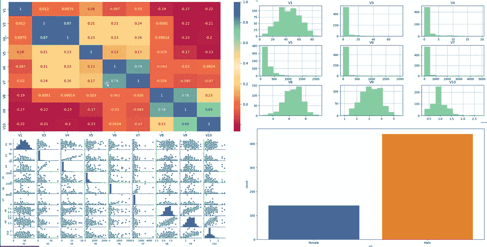
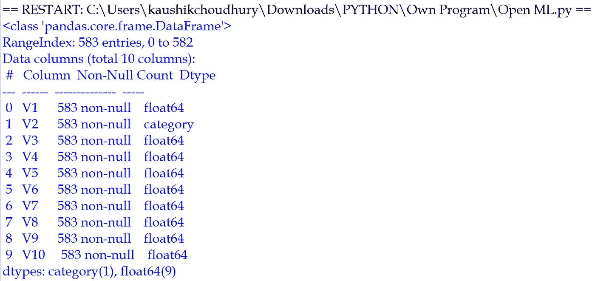
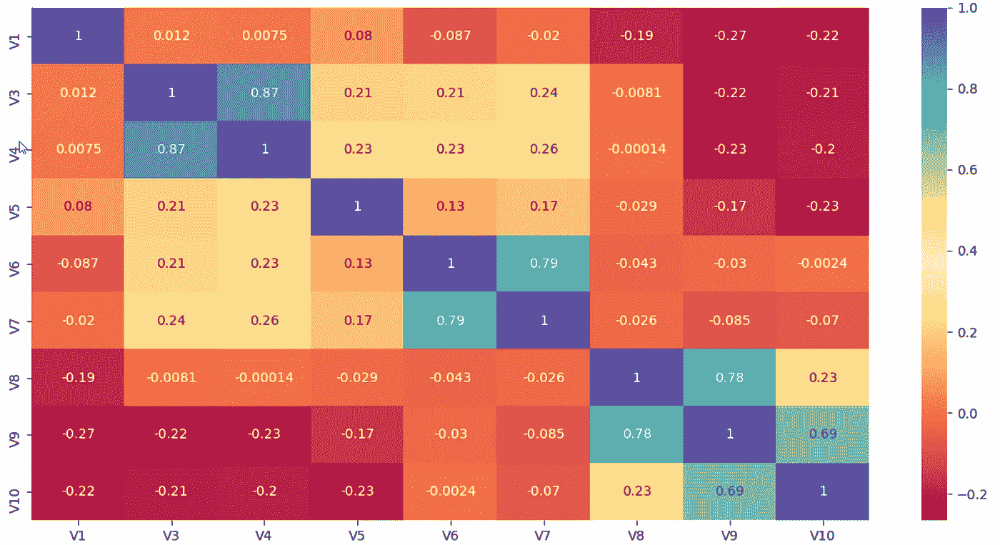
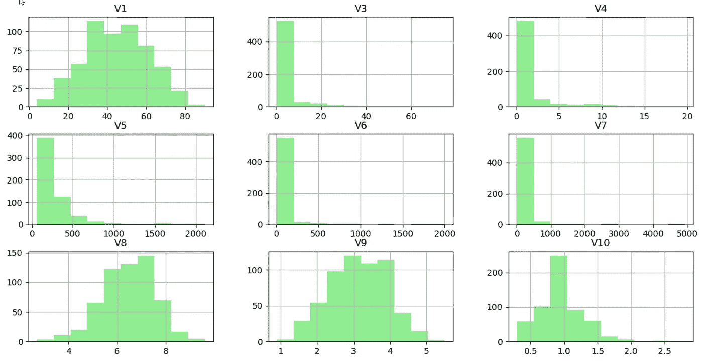
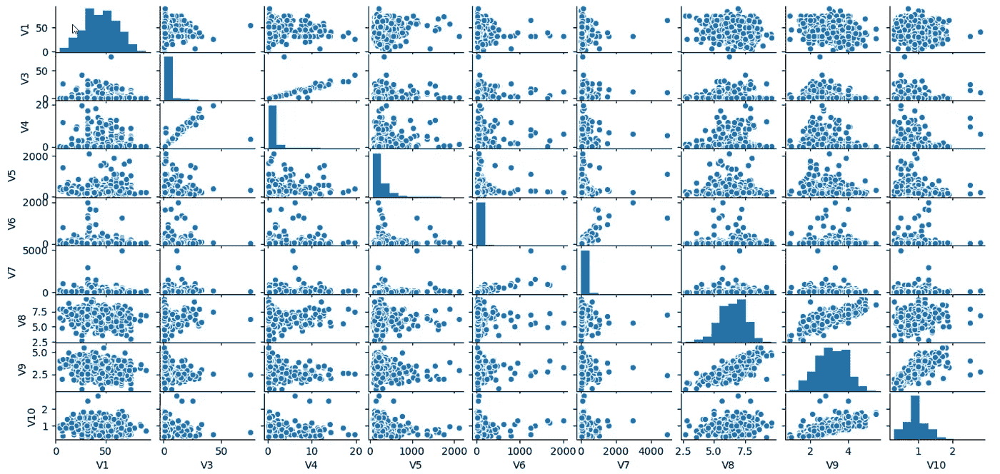
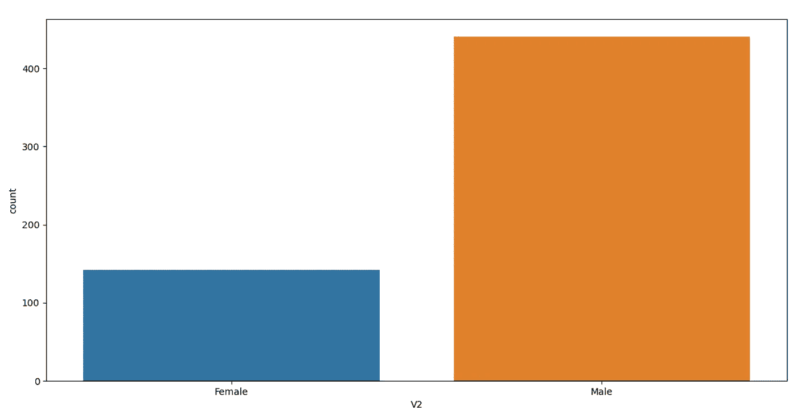

# 信封背面快速数据分析

> 原文：<https://towardsdatascience.com/back-of-the-envelope-quick-data-analysis-3e0c614595ec?source=collection_archive---------47----------------------->

## [内部 AI](https://towardsdatascience.com/data-science/home)

## “一个眼神胜过千言万语。”这些快速数据分析有可能提高模型预测精度和集中数据预处理



基于本文讨论的代码的数据可视化——图片来自作者

数据分析是任何机器学习工作流的重要元素。任何机器学习模型预测的性能和准确性都取决于数据分析和后续的适当数据预处理。每个机器学习专业人员都应该擅长数据分析。

在这篇文章中，我将讨论四种非常快速的数据可视化技术，它们可以用几行代码实现，并且可以帮助规划所需的数据预处理。

我们将使用来自 open ML 的印度肝病患者数据集来学习快速有效的数据可视化技术。
该数据集包含分类和数字独立特征的混合，以及肝脏和非肝脏状况的诊断结果。

```
from sklearn.datasets import fetch_openml
import pandas as pd
import matplotlib.pyplot as plt
import seaborn as sns
```

我觉得使用 Pandas dataframe 比默认的 bunch 对象更容易和高效。参数“as_frame=True”确保数据是 pandas 数据帧，包括具有适当数据类型的列。

```
X,y= fetch_openml(name="ilpd",return_X_y=True,as_frame=True)
print(X.info())
```

由于独立数据在 Pandas 中，我们可以通过“info”查看特性的数量、具有空值的记录的数量以及每个特性的数据类型。



独立的特性、计数和数据类型—基于上面讨论的代码(图片由作者提供)

它只用一行代码就立即提供了大量关于自变量的信息。

考虑到我们有几个数字特征，理解这些变量之间的相关性是谨慎的。在下面的代码中，我们创建了一个没有分类变量“V2”的新数据帧 X_Numerical。

```
X_Numerical=X.drop(["V2"], axis=1)
```

很少有机器学习算法在处理高度线性相关的独立变量时表现不佳。此外，目标始终是用最少的所需变量/维度构建一个机器学习模型。

我们可以使用熊猫的“corr”函数来获得所有数值特征之间的相关性。

使用 seaborn 软件包，我们可以绘制相关性的热图，从而快速直观地了解独立变量之间的相关性。

```
relation=X_Numerical.corr(method='pearson')
sns.heatmap(relation, annot=True,cmap="Spectral")
plt.show()
```

粗略地看，我们可以得出结论，自变量 V4 和 V3 具有密切的关系，并且像 V1 和 V10 这样的特征很少是松散负相关的。



基于上述代码讨论的独立特征的相关矩阵(图片由作者提供)

接下来了解特性之间的相关性后，快速了解数值特性的值分布将会非常有用。

就像相关函数一样，Pandas 有一个本地函数“hist”来获得特征的分布。

```
X_Numerical.hist(color="Lightgreen")
plt.show()
```



基于上面讨论的代码的独立特性的分布(图片由作者提供)

直到现在，熊猫的力量和多才多艺才被清楚地展示出来。我们只需要两行代码就可以得到数字特征之间的关系和特征的分布。

接下来，通过所有数值变量组合之间的散点图来更好地理解数值自变量将会很有趣。

```
sns.pairplot(X_Numerical)
plt.show()
```

借助于观想，我们可以识别出正相关或负相关的变量。此外，只要看一眼，就可以识别出彼此之间没有关系的特征。



基于上述代码的独立特征散点图(图片由作者提供)

最后，我们可以通过计数图了解分类特征的分布。

```
sns.countplot(x="V2", data=X)
plt.show()
```

我们知道，与女性相比，男性在数据集中的比例过高。了解我们是否有不平衡的数据集并采取适当的措施是至关重要的。

你可以阅读更多关于 [4 种管理不平衡分类情况的独特方法](/4-unique-approaches-to-manage-imbalance-classification-scenario-7c5b92637b9c)



基于上述代码的分类特征计数(图片由作者提供)

> 关键要点和结论

我们可以用不到 15 行代码快速获得许多信息，如不同特征之间的相关性、它们的分布和散点图。

这些快速可视化有助于在开始任何复杂的建模练习之前，将注意力集中在数据预处理区域。

在这些可视化的帮助下，即使没有正式的建模或高级统计分析，我们也可以了解大量的数据并做出推断。

您可以了解更多关于 [5 用于探索性数据分析(EDA)的高级可视化](/5-advanced-visualisation-for-exploratory-data-analysis-eda-c8eafeb0b8cb)和 [5 用于数据预处理的熊猫强大可视化](/5-powerful-visualisation-with-pandas-for-data-preprocessing-bbf6a2033efd)

```
**"""Full Code"""****from sklearn.datasets import fetch_openml
import pandas as pd
import matplotlib.pyplot as plt
import seaborn as sns****X,y= fetch_openml(name="ilpd",return_X_y=True,as_frame=True)
print(X.info())****X_Numerical=X.drop(["V2"], axis=1)****relation=X_Numerical.corr(method='pearson')
sns.heatmap(relation, annot=True,cmap="Spectral")
plt.show()****X_Numerical.hist(color="Lightgreen")
plt.show(****sns.pairplot(X_Numerical)
plt.show()****sns.countplot(x="V2", data=X)
plt.show()**
```