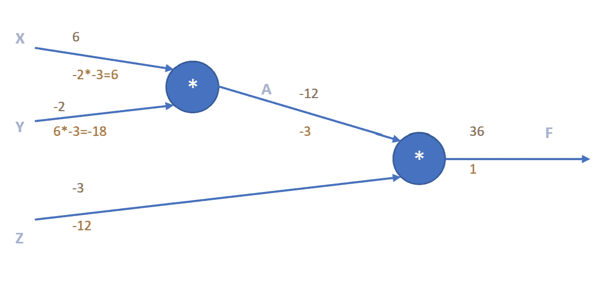
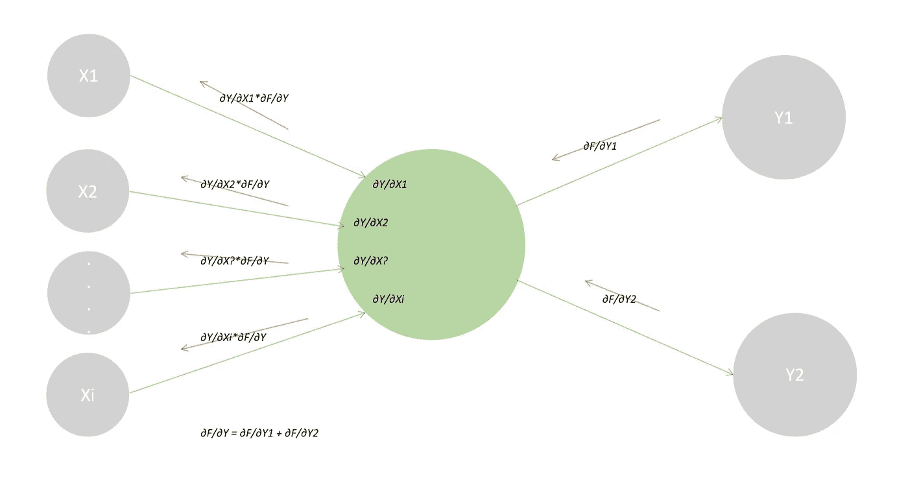
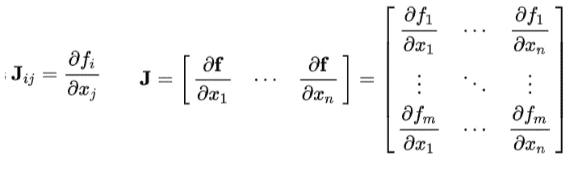
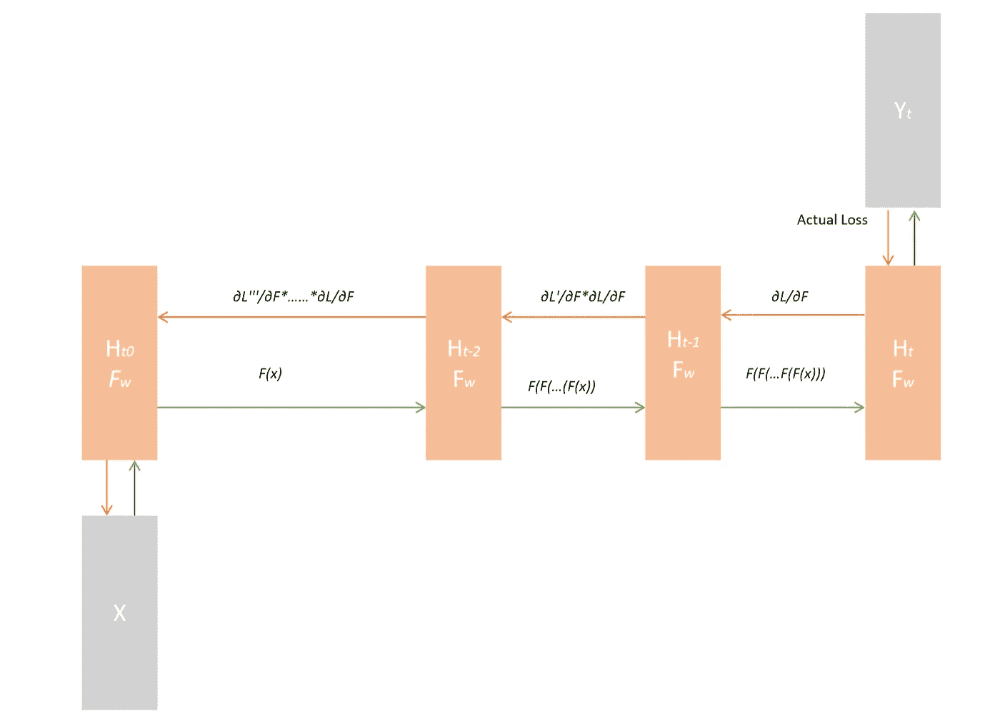
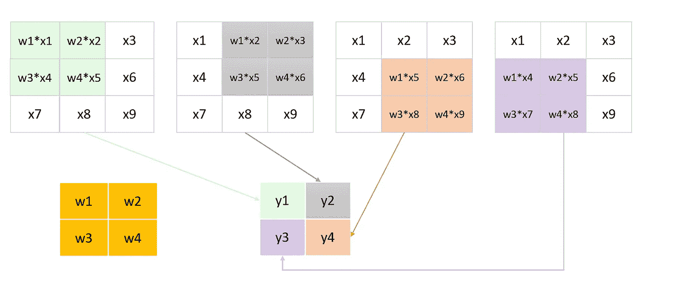
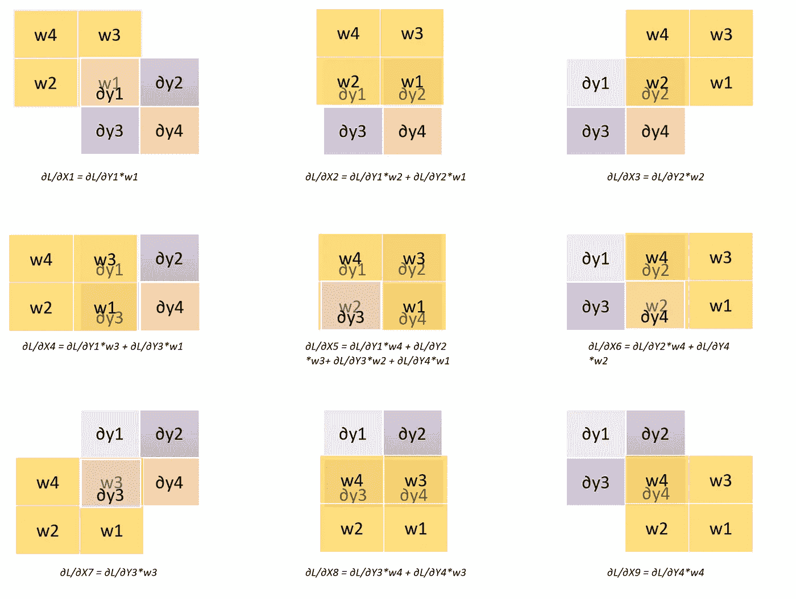

# 是的，你应该听安德烈·卡帕西的，并且理解反向传播

> 原文：<https://towardsdatascience.com/back-propagation-721bfcc94e34?source=collection_archive---------17----------------------->

## 不是穿着闪亮盔甲的骑士，但绝对是我们人工智能战斗卡中的无名英雄

罗马法师在 [Unsplash](https://unsplash.com?utm_source=medium&utm_medium=referral) 上拍摄的照片

如果你问周围的任何人，他们会告诉你人工智能是最热门和发展最快的领域。我们在监督学习方面取得了巨大的进步——自然语言处理和计算机视觉。这两个领域解决非常不同的问题，并且没有很多共同的文献。在一个方面表现出色的模型在另一个方面表现不佳。但在内心深处，它们确实有一些共同点，那就是反向传播——这种机制有助于我们从输出到输入反向传播损失——在模型的训练阶段发挥着非常关键的作用。

但是首先让我们看看每一个监督学习模型将会有什么:

*   ***一个架构*** :可以是 CNN/RNN/NN。此外，层数、每层的激活函数和维数、学习速率等。
*   ***一个损失/成本函数*** :当一个 ML 模型做一个预测的时候，我们需要一个方法来计算我们离地面真相有多远。
*   ***一个优化器*** :一旦我们有了损失，我们需要更新我们的模型的权重，以便最小化我们的损失。

那么反向传播在这幅图中处于什么位置呢？它连接了损失函数和优化器。损耗在输出层计算，然后我们使用反向传播将损耗以其梯度的形式传播回去，一直传播回输入层的输入(因此称为反向传播)。一旦 back prop 完成，我们知道每个节点的损失梯度，然后我们使用优化器来更新权重，试图在下一次迭代中最小化损失。Back prop 是本地的

# 如何计算渐变？

计算 F=X*Y*Z 的梯度

设 *F= X*Y*Z* 并要求你计算 ***∂F/ ∂X，******∂f/ ∂z***。
我们很容易弄清楚，
*∂f/ ∂x*=*y * z*=-2 *-3 = 6，
*∂f/ ∂y*=*x * z*= 6 *-3 =-18，
和 *∂F/ ∂Z = X*Y* = 6*-2。

但是我们如何使用上面的[计算图](https://www.youtube.com/watch?v=d14TUNcbn1k&list=PL3FW7Lu3i5JvHM8ljYj-zLfQRF3EO8sYv&index=4)来计算呢？

1.  从最终输出开始， *F* 。∂F/ ∂F 是 1。所以回流到乘法节点( *A*Z* )的上游梯度为 1。
2.  计算节点输入的局部梯度 *F=A*Z，∂F/∂A* = *Z* 和 *∂F/∂Z = A.* 将为输入回流的上游梯度将是来自特定节点输出 的 ***局部梯度*上游梯度。因此，a 的上游梯度将为 *∂F/∂A * ∂F/∂F = Z*1 = -3* ，而 z 的上游梯度将为 *∂F/∂Z * ∂F/∂F = A*1 = -12。****
3.  对节点 *A = X*Z.* 上游坡度= -3 重复步骤 2。
    x 的局部梯度: *∂A/∂X = Y = -2。* y 的局部梯度: *∂A/∂Y = X= 6。* 上游梯度回流 x:*localgradientx * upstreamgradientfromputput*=*∂a/∂x * ∂f/∂a = ∂f/∂x =-2 *-3 = 6。* 上游梯度回流 y:*localgradienty * upstreamgradientfromputput*=*∂a/∂y * ∂f/∂a = ∂f/∂y = 6 *-3 =-18。*

# 神经网络中的反向传播

这里唯一改变的是每个节点上发生的计算。不是简单的乘法运算，每个节点都有一个*激活* *函数，Y =H(X1，X2，…，Xi)。* 在正向传递本身中——当我们计算 *Y* 时——我们还会计算并存储当地的梯度 *∂Y/∂X1、∂Y/∂X2、∂Y/∂X？*和 *∂Y/∂Xi.*

神经网络中梯度流和计算的示例。红色箭头显示渐变的流向。绿色箭头显示了向前传递的值的流向。

当我们得到反向传播中的上游梯度时，我们可以简单地将其与对应于每个输入的局部梯度相乘，并将其传回。在上面的例子中，我们从 2 个节点获得上游梯度，因此绿色节点接收的总梯度只是所有上游梯度的相加——在这种情况下是两个上游梯度。然后，我们将每个局部梯度乘以总的上游梯度，并将其向后传递给相应的输入。

雅可比矩阵。每一列都是某个输入向量的局部梯度。[来源](https://en.wikipedia.org/wiki/Jacobian_matrix_and_determinant)。

在神经网络中，节点的输入 *X* 和输出是向量。函数 *H* 是一个矩阵乘法运算。 *Y =H(X) = W*X，其中 W* 是我们的权重矩阵*。*局部梯度为[雅可比矩阵](https://en.wikipedia.org/wiki/Jacobian_matrix_and_determinant)—*Y*wrt*X*各元素的微分。

实际上，输入向量 *Xi* 只影响输出向量中的 *Fi* 。

# RNN 的反向支持——递归神经网络

在 RNNs 中事情变得有点棘手，因为与 NNs 不同，在 NNs 中，节点的输出和输入彼此独立，当前步骤的输出作为输入被馈送到下一步骤中的相同节点。理论上，它对我们的反向传播流没有任何影响，但在实践中，它导致了臭名昭著的消失梯度和爆炸梯度问题。

未卷起的 RNN 中的梯度流。注意，每个时间步长的 Fw 保持不变。由于相互依赖，每个时间步的输出和输入都是变化的。

考虑上面的普通 RNN，在每个时间步的向前传递中， *F(xi) = W*xi，其中 xi* 是第 *i* 时间步的输入， *W* 是权重矩阵*，W* 对于每个步骤保持不变。在反向传播期间，每个节点的局部梯度被称为 *h(xi)。*到达输入节点的梯度将是 L* *h(xt)*h(xt-1)*..*h(x1)。*如果所有的 *h(xi)* 大于 *k* ，那么输入处的梯度大于 *L*k^t.* 对于深度 RNNs *t* 可能很大，在这种情况下，如果 k > 1，梯度继续呈指数增加，导致梯度变得太大的爆炸性梯度问题。
类似地，在输入节点处的所有 *h(xi) < k，*梯度将小于 *L*K^t* 的情况下，如果 k < 1，梯度在到达输入层时将几乎变为 0——消失梯度问题，其中梯度变得太小而无法引起任何有意义的更新。

由于 *F(xi)* 本质上是一个矩阵乘法，*h(Xi)= F’(Xi)也就是~ W* 。对于具有 *t* 时间步长的 RNN，在反向传播期间，局部梯度将是 *h(xi)，即*权重矩阵——或其一部分——并且在每一步，当我们计算*local gradient * upstream gradient*时，它将一次又一次地与自身相乘，因为上游梯度是某个局部梯度(本质上是 *W* 或其一部分)及其在每个先前时间步长的相应上游梯度的递归乘积。根据 *W* 中元素的值，我们将面临两种梯度问题中的任何一种，大于 1 的元素会爆炸，更小的元素会消失。

# CNN —卷积神经网络中的反向传播

CNN 的情况与其他案例略有不同，但基本概念保持不变。我们仍将通过乘以上游和局部梯度来计算梯度，但在这种情况下事情有点复杂。在前向传递中，这里的输入不像在 NN 中那样贡献给所有的输出，同时，它们也不像在 RNN 中那样只贡献给单个输出。在正向传递中，如下图所示，每个输出总是接受四个不同输入的贡献，而一个输入可以贡献的输出数量取决于其位置。

CNN 中的向前传递:一个 2x2 内核(显示为黄色)以步长 1 覆盖输入层(3x3 ),以给出一个 2x2 输出——具有四种不同的颜色，每种颜色突出显示在其计算中起作用的输入。

在回柱过程中，我们将知道上游的坡度: *∂L/ ∂y1、∂L/ ∂y2、∂L/ ∂y3* 和 *∂L/ ∂y4* 。当地梯度: *∂y1/ ∂x1* 、∂y1/ ∂x2、∂y1/ ∂x3、∂y1/ ∂x4、∂y1/ ∂x5、∂y1/ ∂x6、∂y1/ ∂x7、∂y1/ ∂x8 和∂y1/ ∂x9。

我们知道 *y1 = w1*x1 +w2*x2 +w3*x4 +w4*x5。*因此，
*∂y1/ ∂x1 = w1。*从上图可以看出 *x1* 只对 *y1* 有贡献，所以*∂l/ ∂x1 = ∂l/ ∂y1*∂y1/ ∂x1 = ∂l/ ∂y1 * w1。*

对于 **∂L/ ∂x5** ，由于 *x5* 对四路输出都有贡献，
*∂l/ ∂x5 = ∂l/ ∂y1*∂l/ ∂y1*+∂l/ ∂y2*∂y2/ ∂x5+∂l/ ∂y3*∂y3/ ∂x5+∂l/ ∂y4*∂y4/ ∂x5，* ∂y1/ ∂x5 = *w4，
∂y2/ ∂x5 = w3，
≈y1/≈X5 = w1*
*≈y1/≈X5 = w2。*

实际上，我们可以通过将核旋转 180 度并使用旋转后的核对输出矩阵执行完全卷积来计算梯度。

执行全卷积以计算梯度。[参考](https://medium.com/@2017csm1006/forward-and-backpropagation-in-convolutional-neural-network-4dfa96d7b37e)。

在他关于反向传播的文章中，Andrej Karpathy 描述如下:

> 反向传播是一种有漏洞的抽象；这是一个具有重要后果的信用分配方案。如果你因为“TensorFlow 自动让我的网络学习”而试图忽略它在幕后是如何工作的，你将没有准备好应对它所带来的危险，你在构建和调试神经网络方面的效率将会低得多。

虽然您可能在不了解反向传播的情况下训练一个 ML 模型并获得良好的结果，但是理解它将使您在训练神经网络时占上风，这将使您能够更好地理解工作，从而提高其性能。

## 参考资料:

*   [deep grid](https://www.jefkine.com/general/2016/09/05/backpropagation-in-convolutional-neural-networks/)——阅读更多关于 CNN 的信息。
*   了解全卷积:[https://medium . com/@ 2017 CSM 1006/卷积神经网络中的前向和后向传播-4dfa96d7b37e](https://medium.com/@2017csm1006/forward-and-backpropagation-in-convolutional-neural-network-4dfa96d7b37e)
*   安德鲁·卡帕西的斯坦福笔记
*   在斯坦福大学的讲座中，点击查看更多关于计算图的信息。

> 我很高兴你坚持到了这篇文章的结尾。*👏我希望你的阅读体验和我写这篇文章时一样丰富。*💖**
> 
> 请点击这里查看我的其他文章。
> 
> 如果你想联系我，我会选择推特。