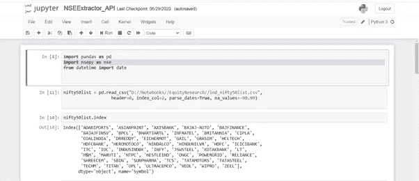
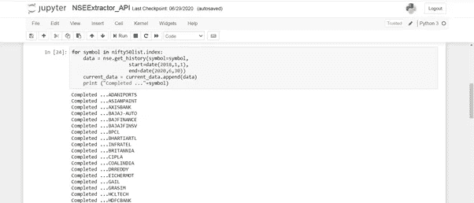
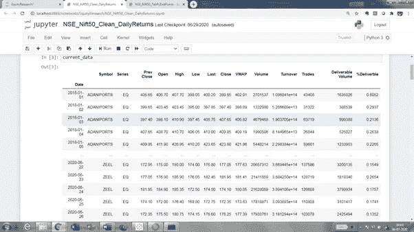
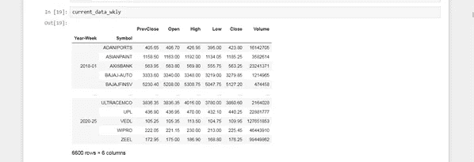
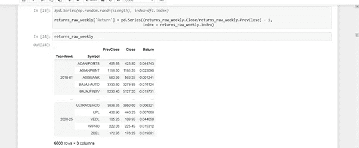
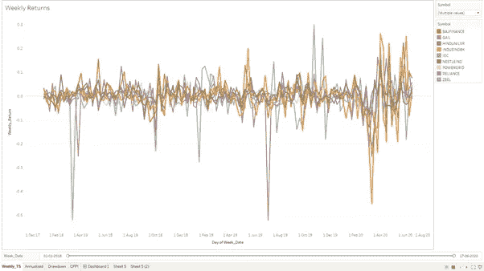
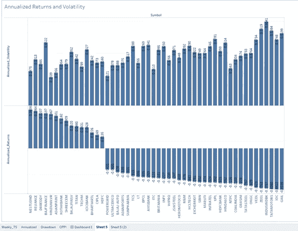
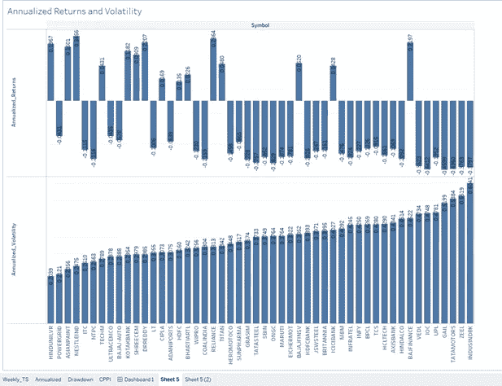

# 使用 CPPI 策略对 NIFTY 50 股票进行回测分析:一种数据科学方法

> 原文：<https://towardsdatascience.com/back-test-analysis-of-nifty-50-stocks-using-ccpi-strategy-a-data-science-approach-c4a258943b5e?source=collection_archive---------45----------------------->

## 介绍

本文试图通过分析新冠肺炎疫情对 NIFTY-50 股票的影响，使用数据科学方法来解决现实世界的投资管理问题。

像新冠肺炎这样的疫情事件是“黑天鹅”事件，因为它们无法预测，而且没有任何分散投资策略可以保护投资免受这种系统性风险的影响。正如专家所说，“多样化会在你最需要的时候让你失望”。在 2008 年金融危机或我们现在面临的新冠肺炎疫情等事件中，即使是非常多元化的投资组合也会亏损。那么，当市场在此类事件中崩盘时，你如何保护自己的财富，同时又能参与上涨，在不失去你的财务目标的情况下，两全其美呢？答案是，在建立投资组合时，要有一个“保险”或“安全网”之类的策略。曾经这样的“安全网”策略就是固定比例投资组合保险(CPPI)。

尽管这类策略在行业中以多种形式和技术使用，但在这里，我们尝试通过一步一步的数据科学方法，从相关来源提取足够的数据，对其进行清理、转换和建模，实施动态 CPPI 算法，获得回溯测试结果，并使用高级数据可视化方法对策略进行交互分析。在接下来的几节中，我们将更多地讨论用户交互性、直观性和 CPPI 计算的算法复杂性之间的平衡，而不是 CPPI 作为投资组合策略的本质。关于 CPPI 如何运作的更多细节和它是什么的一个外行例子，看一看 https://www.investopedia.com/terms/c/cppi.asp。我们使用 Python/Anaconda 实现数据工程&算法，使用 Tableau 实现数据可视化，使用分析扩展库 TabPy 作为解决方案的技术工具。

## 确定数据源和数据准备步骤

我们研究的主要数据来源是 NSE 印度网站，我们试图使用网络抓取来提取 NIFTY-50 股票的历史价格。然后我们发现了一个非常有用的库/API‘NSEPY ’,它以一种更优雅的方式提取给定股票代码的历史价格。因此，我们首先创建了 50 只股票的列表，并调用 NSEpy 库/API(【https://github.com/swapniljariwala/nsepy/tree/master/nsepy】)来提取 2018 年 1 月至 2020 年 6 月的数据。

从 NSE 提取的原始数据如下所示:

这些数据点基本上是股票在某一天的各种价格点。为投资组合分析处理每日频率数据可能有些过分，为了简单起见，我们将每周汇总数据。从每日价格中，我们会发现周价格点，如开盘价、收盘价、最高价和最低价。我们还应该注意列标题，确保它们看起来干净，中间没有任何空格或特殊字符。一旦你转换成每周时间序列数据，数据框架应该像下面这样:

在每周分组后，计算每周收益，这是相对于前一周的价格变化百分比。

上述数据框的可视化表示应类似于 Tableau 中的下图或任何数据可视化工具。正如我们所见，在 2020 年 2 月至 5 月期间，每周回报非常繁忙，导致波动很大。

## CPPI 的逻辑

> 在这一节中，我们将看到如何用 Python 实现 CPPI 算法的伪代码。实现它的步骤基本上不多，用 python 实现也不复杂。

对于给定的一组周收益时间序列数据，我们需要遍历尽可能多的步骤来计算和存储每个时间点的各种指标。

初始化并设置 CPPI 参数

*#设置 CPPI 参数*

*n_steps = len(每周回报数据集)*

*account_value = start(你投资的起始值)*

*floor _ value = start * floor(floor 是一个输入参数，通常在 0.1-1.0 之间)*

*peak = account_value*

然后，对于每周回报时间序列中的每一步，计算以下步骤

*第一步:缓冲=(账户值-下限值)/账户值*

*第二步:计算风险重量和安全重量:*

*risky_weight = m * cushion (m 是一个输入参数，它是一个乘数，基本上表示投资者的风险状况，是一个标准化值，介于 0-1 之间)*

*safe _ weight = 1—risky _ weight*

*risky _ allocation = account _ value * risky _ weight*

安全分配=账户价值*安全重量

*第三步:重新计算账户值*

*account _ value = risky _ allocation *(1+risky _ week _ return)+safe _ allocation *(1+safe _ week _ return)*

*其中 risky_weekly_return 是作为输入接收的股票的时间序列每周回报，safe_weekly_return 通常使用安全净产品(如国债)的假定无风险利率计算。*

第四步:使用累计乘积法计算风险财富，因为每个时间段的回报都需要复合。

*risky _ wealth = start *(1+risky _ r[step])* risky _ wealth _ prev*

*risky _ wealth _ prev =(1+risky _ r[step])* risky _ wealth _ prev*

第五步:将每个时间段的所有指标存储在后验容器中。

# 年化回报率与年化波动率

现在我们已经有了 CPPI 算法，让我们挑选一些回报率较高的股票和一些波动性较大的股票，观察 CPPI 策略的回溯测试结果。

雀巢印度公司表现最好，盖尔表现最差

印度斯坦联合利华的年波动率最低，而印度银行的年波动率最高

我们可以很容易地观察到，波动性对业绩不利，很明显，高绩效股票(高年回报率)的波动性低，反之亦然。

## 为什么 CPPI 是一个安全网战略

雀巢印度公司是 2018 年 1 月至 2020 年 6 月期间表现最好的股票，使用 CPPI 策略，1000 卢比的初始投资回报了 1522.36 英镑的最终财富。如果我们在没有任何策略的情况下投资所有的 1000 卢比，我们最终会得到 2119 卢比。很明显，在形势大好的时候，我们遵循 CPPI 的策略是在吃亏。

但 CPPI 策略的优势在于，当黑天鹅出现时，当情况不妙时。当我们观察盖尔，这是表现最差的股票，我们将能够体会到这一战略的好处。

正如我们所看到的，如果我们没有实施 CPPI 策略，把所有的钱都投资到高风险账户，我们最初的投资 1000 卢比，最终的价值是 210.4 卢比。这会粉碎投资者的财务目标，不是吗？。相反，如果我们遵循 CPPI 策略，我们的损失不会低于我们之前设定的最低价值，我们最终会获得 807.62 卢比，从而保护我们的财务目标，在很大程度上减少损失，保护资本。

由于我们必须进行再平衡，CPPI 战略还有其他局限性，这反过来会增加交易成本，这是必须考虑的因素。

## 与 Tableau 整合

Tableau 为 python 提供了一个名为 Tabpy 的分析扩展，这是一个有用的工具，可以将 Python 中的数据工程和算法任务与 Tableau 中的高级可视化功能集成在一起。在 Jupyter 中可以很容易地部署 python CPPI 算法，如下所示

*client.deploy('run_cppi '，run_cppi，'运行 CPPIstrategy 的回溯测试，给定风险资产的一组回报'，override = True)*

在 Tableau 中，端点的返回值以计算字段的形式接收，如下所示:

*SCRIPT _ STR(" Return tabpy . query(' run _ cppi '，_arg1，_arg2，_arg3，_arg4，_arg5)['response']"，SUM([Weekly_Return])，cppi_m，cppi_start，cppi_floor，cppi_rfrate)*

*##def run_cppi(risky_r，m=3，start=1000，floor=0.8，riskfree_rate=0.03):*

## 结论

尽管 Tableau 和 Python 在金融服务公司中被广泛使用，但是集成它们并利用它们各自优势的能力提供了“思维速度”的分析能力，这是仅使用其中一种工具所无法实现的。分析扩展为数据科学家提供了设计和实施解决方案的机会，这些解决方案对于为投资策略(如 CPPI)提供建议非常有用。尽管这个解决方案的实现并非没有技巧和变通方法，但我们将把它留到以后讨论。

## 信用

Coursera 和 EDHEC Business School 提供了 Python 和机器学习在投资管理专业课程中的知识