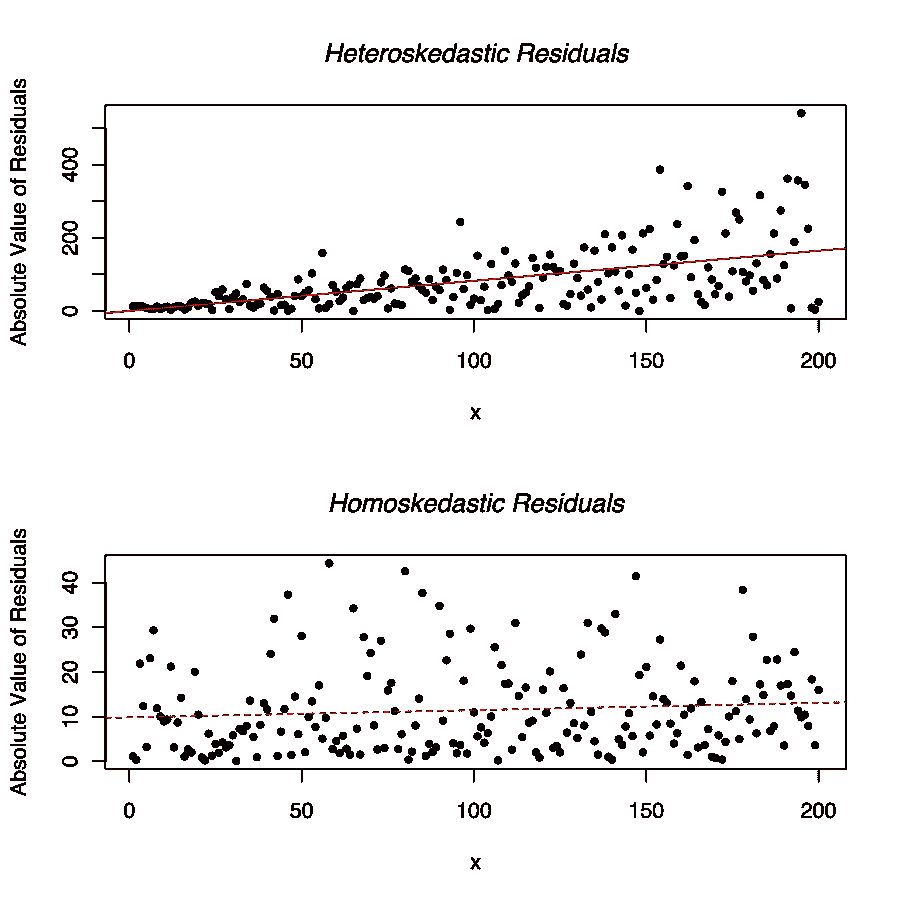
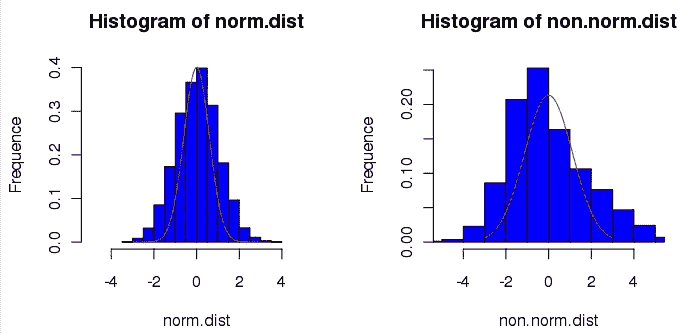
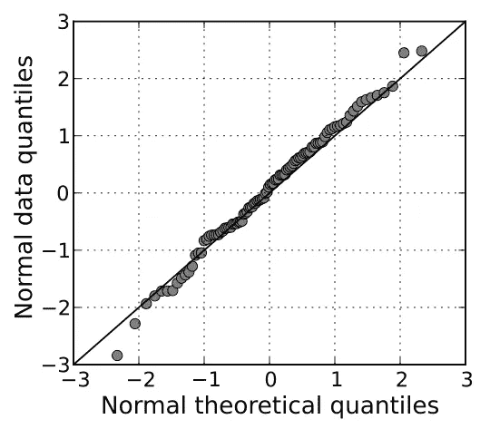
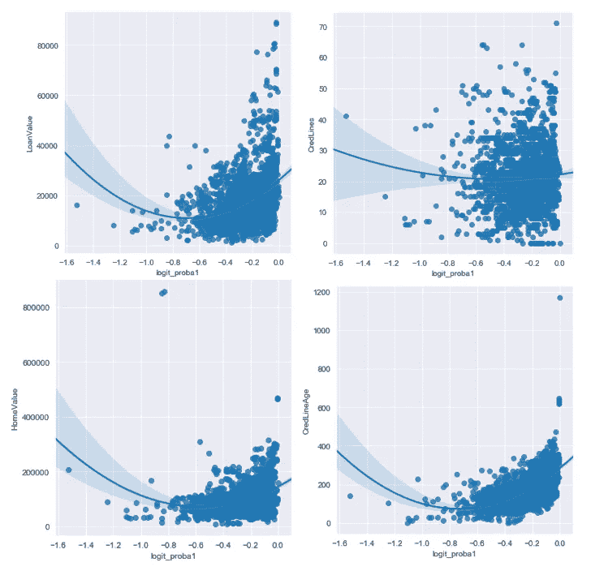

# 回归基础:常见机器学习模型的假设

> 原文：<https://towardsdatascience.com/back-to-basics-assumptions-of-common-machine-learning-models-e43c02325535?source=collection_archive---------22----------------------->

照片由[思想目录](https://unsplash.com/@thoughtcatalog?utm_source=medium&utm_medium=referral)在 [Unsplash](https://unsplash.com?utm_source=medium&utm_medium=referral)

暂时忘记深度学习和神经网络。

随着越来越多的人开始进入数据科学领域，我认为重要的是不要忘记这一切的基础。

**统计。**

如果你是分析领域的新手，没关系！我们都是从某处开始的！

但重要的是 ***意识到*** 我将在这篇文章中分享的机器学习模型假设的存在。

我很幸运在我的大学时代就已经研究了所有这些概念，所以我认为回到基础上写一些关于它们的东西会令人耳目一新。

关心就是分享。😃

我们开始吧！

# 线性回归又称普通最小二乘(OLS)回归

OLS 回归试图解释自变量(预测值)和因变量(目标值)之间是否存在关系。

它通过最小化残差的平方和来拟合你的数据。

> 残差是观察值和预测值之间的差值。残差用于指示模型与数据的拟合程度。

然而，为了能够信任和对结果有信心，在建模之前必须满足一些假设。

满足所有这些假设将允许您为您的模型创建可能的最佳估计。

OLS 回归模型中有 5 个关键假设。

## 假设 1:自变量和因变量之间存在线性关系。

当我第一次在统计课上听到这个假设时，我措手不及。

我记得当我回顾我的考试成绩时，我感到如此的被欺骗和被欺骗，这已经深深地刻在了我的记忆中。

精神食粮。

这些等式中的哪一个符合这个假设？

`Y = β₀ + β₁X₁+ β₂X₂`

`Y = β₀ + β₁X₁+ β₂X₂²`

原来**两者都是线性的。**

对于被认为是*线性方程*的东西，经常会有**的曲解**。

> 线性方程组=直线
> 非线性方程组=曲线
> 这是错误的。

当统计学家说一个方程是线性的时，他们指的是参数的线性，并且这个方程有一定的格式。

这是格式:

`**Y = Constant + Parameter1 * Variable1 + Parameter2 * Variable2 …**`

注意:

1.  必须有一个常数
2.  其他项遵循“*参数*变量*”的模式，所有项都加在一起。

***变量*** 是否非线性(即平方)并不重要，只要 ***方程*** 遵循这种指定格式，就是线性方程。任何其他不遵循这种格式的方程都是非线性的。

这也意味着一些线性方程线在拟合时是弯曲的。

所以从技术上来说…单独使用散点图并不能真正告诉你你看到的拟合曲线是否是线性的。你可能需要看看曲线的方程式。

## 假设 2:没有多重共线性

多重共线性是指自变量之间的高度相关性。

多重共线性是一个问题，因为它会产生冗余信息，导致回归模型的结果不可靠。

为了避免这个问题，您可以部署两种技术:

1.  对你所有的自变量进行相关性分析。
2.  删除具有高方差通货膨胀系数的独立变量(VIF)*。作为一般的经验法则，a `VIF > 10`是多重共线性的强烈指示。

> `*VIF = 1 ÷ (1-R²)`

## 假设 3:没有自相关

自相关是指残差不是相互独立的。即先前的观测残差导致当前观测残差的系统增加/减少。

因此，它会导致你低估你的方差，这将影响你的置信区间或假设检验的结果。

为了检查自相关性，您可以使用 Durbin-Watson 'D '测试。`1.5 < d < 2.5`之间的任何值都满足这个假设。

否则，要修正自相关，您应该在计算标准差时应用“*自相关-稳健标准差(HAC)* ”公式来修正自相关。

> 注意:你可能会遇到“HAC”作为“纽维-韦斯特估值器”。

## 假设 4:残差应该是同方差的

同质性是指你的残差图应该在所有观察值上显示一个 ***甚至*** 和 ***随机模式*** 。

换句话说，残差的方差在所有观测中应该是一致的，不应该遵循某种形式的系统模式。

在下图中，第一个图显示了残差图中的系统模式。这也被称为异方差；推翻了这个假设。

下图显示了同方差残差图应该是什么样子。

2010 年 7 月 29 日，由 Protonk ( [CC3.0](https://creativecommons.org/licenses/by-sa/3.0/) ) ( [来源](https://en.wikipedia.org/wiki/File:Hsked_residual_compare.svg))提供的同质性示例

那么异方差到底有什么问题呢？

1.  你的无偏估计将不再是最好的。
2.  它会影响标准误差的计算，而标准误差会无意中影响任何假设检验的结果。

要解决异方差的第一个问题，一个好方法是增加样本量。

对于第二个问题，你应该应用“*稳健标准误差*”公式来解释异方差对你的误差的影响。

> 注:“稳健标准误差”也称为“异方差一致性标准误差”(HC)。编程的时候可能会遇到“HC”。

## 假设 5:所有自变量都是正态分布的

就产生最佳无偏估计而言，这个假设是可选的。

但是，如果您想要执行假设检验以产生*置信区间*或*预测区间*，则需要使用它。

> 注:你可以在这里回顾一下两个[的区别。](https://stats.stackexchange.com/questions/16493/difference-between-confidence-intervals-and-prediction-intervals)

检查正常性有两种方法:

1.  为每个独立变量创建直方图。

直方图示例，Gbdivers 于 2009 年 3 月 16 日( [CC2.0](https://creativecommons.org/licenses/by-sa/2.0/deed.en) ) ( [来源](https://commons.wikimedia.org/wiki/File:Normality_histogram.png))

2.在残差上运行 Q-Q 图。如果残差是正态的，所有的观测值都应该遵循一条直线。

QQ 图示例，2009 年 10 月 19 日，作者[Skbkekas](https://commons.wikimedia.org/wiki/User_talk:Skbkekas)([cc 3.0](https://creativecommons.org/licenses/by-sa/3.0/deed.en))([来源](https://en.wikipedia.org/wiki/File:Normal_normal_qq.svg))

如果你需要满足这个假设，但是你的变量不是正态分布的，你可以转换你的变量。

# 逻辑回归

逻辑回归假设与 OLS 回归的不同之处在于:

1.  自变量和因变量之间不需要线性关系。
2.  残差不需要是正态的。
3.  不需要满足同伦假设

那么逻辑回归需要满足哪些假设呢？

以下是逻辑回归的 5 个关键假设。

## 假设 1:适当的因变量结构

这个假设简单地说明了二元逻辑回归要求因变量是二分的，而有序逻辑回归要求它是有序的。

此外，因变量既不能是区间，也不能是比例。

## 假设 2:结果的 logit 与各个自变量之间存在线性关系。

logit 函数由下式给出:

`logit(p) = log(p/(1-p)), where p is the probability of an outcome`

为了检验这一假设，您可以通过在散点图上绘制每个独立变量和 logit 值来直观地进行检验。

检验逻辑回归的线性假设

在上图中，Y 轴是独立变量，而 X 轴显示的是 logit 值。然后看曲线的方程，看是否满足线性假设。

请记住，线性存在于参数中。只要方程满足上述线性方程形式，就满足线性假设。

> 注意:我在 x 轴标签上犯了一个错误，应该是“Logit”而不是“Logit Probability”

## 假设 3:没有多重共线性

与 OLS 回归的假设一样，这里也可以这么说。

*(详见 OLS 回归部分。)*

## 假设 4:没有有影响的异常值

有影响的异常值是影响逻辑回归模型质量的极端数据点。

**并非所有的离群值都有影响力。**

在移除或变换点以进行分析之前，您需要检查哪些点是有影响的点。

要检查异常值，可以对数据值运行 Cook 距离。高库克距离值表示异常值。

标记出有影响力的异常值的经验法则是`Cook’s Distance > 1.`

## 假设 5:观察独立性

这种假设要求逻辑回归观测值相互独立。

也就是说，观察结果不应来自*重复测量设计*。

*重复测量设计*是指在不同的实验条件下或跨时间对同一个人进行的同一变量的多次测量。

重复测量的一个很好的例子是纵向研究——跟踪一个主题多年的进展。

# 支持向量机(SVM)

SVM 没有需要验证的模型假设。

# 基于树的模型

对于基于树的模型，如*决策树*、*随机森林*、&、*梯度推进*，没有模型假设需要验证。

与 OLS 回归或逻辑回归不同，基于树的模型对异常值是稳健的，并且不需要因变量满足任何正态假设。

为什么基于树的模型对异常值具有鲁棒性？

点击[这里](https://www.quora.com/Why-are-tree-based-models-robust-to-outliers)查看来自 Quora 的详细解释。

# 结尾注释

嗯，就是这样！

我认为这里的关键要点是，你计划使用**回归**或任何**广义线性模型(GLM)** ，在建立你的模型之前，你必须验证一些模型假设。

对于 SVM 或基于树的模型，没有任何模型假设需要验证。

希望这篇帖子有所帮助！

下期帖子再见！

안녕히 계세요！

领英简介:[谭震东](https://www.linkedin.com/in/timothy-tan-97587190/)

# 参考

1.  [https://www.lexjansen.com/wuss/2018/130_Final_Paper_PDF.pdf](https://www.lexjansen.com/wuss/2018/130_Final_Paper_PDF.pdf)
2.  [https://www . statistics solutions . com/assumptions-of-logistic-regression/](https://www.statisticssolutions.com/assumptions-of-logistic-regression/)
3.  [http://www . sth da . com/English/articles/36-class ification-methods-essentials/148-logistic-regression-assumptions-and-diagnostics-in-r/# logistic-regression-assumptions](http://www.sthda.com/english/articles/36-classification-methods-essentials/148-logistic-regression-assumptions-and-diagnostics-in-r/#logistic-regression-assumptions)
4.  [http://SPH web . bumc . bu . edu/otlt/MPH-Modules/BS/R/R5 _ Correlation-Regression/R5 _ Correlation-Regression 4 . html](http://sphweb.bumc.bu.edu/otlt/MPH-Modules/BS/R/R5_Correlation-Regression/R5_Correlation-Regression4.html)
5.  [https://www . statistics solutions . com/assumptions-of-linear-regression/](https://www.statisticssolutions.com/assumptions-of-linear-regression/)
6.  [https://www . quora . com/Why-are-tree-based-models-robust to-outliers](https://www.quora.com/Why-are-tree-based-models-robust-to-outliers)