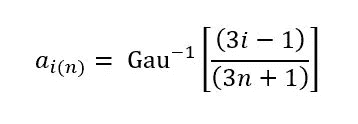
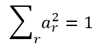

# 回到数据分析的未来:Tukey 真空的整洁实现

> 原文：<https://towardsdatascience.com/back-to-the-future-of-data-analysis-a-tidy-implementation-of-tukeys-vacuum-87c561cdee18?source=collection_archive---------19----------------------->

约翰·图基的一篇里程碑式的论文“数据分析的未来”包含了一套很大程度上被忽视的分析技术，就好像它们藏在众目睽睽之下一样。

多种来源认为 Tukey 的论文是数据科学史上的一个开创性时刻。*《福布斯》*([《数据科学简史》](https://www.forbes.com/sites/gilpress/2013/05/28/a-very-short-history-of-data-science))和《史丹福》([《数据科学 50 年》](http://courses.csail.mit.edu/18.337/2015/docs/50YearsDataScience.pdf))都发表过以论文为起点的历史。斯普林格将其收录在他们的作品集 [*统计学的突破*](https://link.springer.com/chapter/10.1007%2F978-1-4612-4380-9_31) 。我自己也在微软关于数据科学的文章中引用过 Tukey 的话(“[用 Azure 去理解 Azure](https://medium.com/data-science-at-microsoft/using-azure-to-understand-azure-1c8f5dc60a0a?source=friends_link&sk=a06d217d929140ed1377aa11f9f90319) ”)。

独立于论文，Tukey 对数据科学的影响是巨大的:他是《探索性数据分析》的作者。他开发了快速傅立叶变换(FFT)算法、箱线图和多种以他的名字命名的统计技术。他甚至创造了“比特”这个术语

但是直到我真正阅读了《数据分析的未来》之后，我才发现了 Tukey 被遗忘的技术。当然，我已经知道这篇论文很重要。但我也知道，如果我想理解*为什么*——理解图基思想的突破——我必须亲自阅读。

Tukey 没有让人失望。他以一个强有力的宣言开始:“很长一段时间以来，我一直认为自己是一名统计学家，对从特殊到普遍的推论感兴趣。但是当我看到数理统计的发展时，我有理由感到惊奇和怀疑”(第 2 页)。就像贝多芬第五交响曲的开头一样，这个声明是直接而大胆的。“总而言之，”他说，“我开始觉得我的主要兴趣在*数据分析……*”(第 2 页)。

尽管图基使用了第一人称，但他的开场陈述是*而不是*关于他自己。他将个人和职业兴趣放在一边，做出更大胆的断言，即*统计学*和*数据分析*是不同的学科。他承认这两者是相关的:“统计学为数据分析做出了很大贡献。在未来，它能够而且我认为应该做出更大的贡献”(第 2 页)。

此外，Tukey 认为统计学是纯粹的数学。并且，用他的话说，“……数学不是一门科学，因为其有效性的最终标准是一种公认的逻辑一致性和可证明性”(第 6 页)。然而，*是*一门科学，以其“依赖经验测试作为有效性的最终标准”(第 5 页)而著称。

# 没有克兰的消息

然而，在报纸上没走多远，我就被绊倒了。在(第 22 页)大约三分之一的地方，图基介绍了 FUNOP，一种自动解释情节的技术。我向前翻了一页，发现了一些方程式。我担心——在我能理解这些方程式之前——我可能需要对 FUNOP 有一个直观的理解。我向前翻页，发现了第二种技术，FUNOR-FUNOM。我很快意识到，这两种技术，加上我还没有意识到的第三种技术，占了论文的将近一半。

为了理解“数据分析的未来”，我肯定需要学习更多关于 FUNOP 和 FUNOR-FUNOM 的知识。不过，我很快就意识到了这一点，因为我很久以前就知道，数据科学充满了我还不知道的术语和技术，而且将永远如此。我会做我的研究，然后回到图基的论文。

但是我在网上搜 FUNOP 的时候，发现几乎什么都没有。更令人惊讶的是，克兰什么也没有。考虑到 CRAN 中数以千计的软件包和 Tukey 技术的广泛采用，我期望如此重要的论文中的技术会有多个实现。反而什么都没有。(直到现在…)

# FUNOP

幸运的是，Tukey 详细描述了 FUNOP 和 FUNOR-FUNOM 的工作原理。幸运的是，他提供了它们如何工作的例子。不幸的是，他只提供了这些过程及其对示例数据的影响的书面描述。因此，为了理解这些过程，我在 r 中实现了它们。)为了进一步阐明他们做了什么，我生成了一系列图表，以便更容易地可视化正在发生的事情。

以下是 Tukey 对 FUNOP(全正常情节)的定义:

*   (b1)设 *aᵢ₍ₙ₎* 为来自单位正态分布的 *n* 样本中第 *i* 次有序观察的典型值。
*   (b2)设*y*₁≤*y*₂≤…*t5≤*y*ₙ为待检查的有序值。设 *y̍* 为他们的中值(或者设 *ӯ* ，读作“ *y* 修剪”，为 *yᵢ* 与⅓*n***I*≤⅓(2*n*的平均值)。
*   (b3)仅对于 *i* ≤ ⅓ *n* 或> ⅓(2 *n* )，让*zᵢ*=(*yᵢ*-*y̍*)/*aᵢ₍ₙ₎*(或让
    *zᵢ*=(*yᵢ*-*か*/)
*   (b4)设 *z̍* 为这样得到的 *z* 的中间值(关于⅓(2 *n* 的个数)。
*   (b5)特别注意*z*s 其中*既*|*yᵢ*-*y̍*|≥*a**z̍*和*zᵢ*≥*b**z̍*其中 *A* 和*b*
*   *(b5*)特别是对于小 *n* ， *zⱼ* 与 *j* 比一个 *i* 更极端，其中(b5)选择 *zᵢ* 也值得特别关注……(p23)。*

*基本思想非常类似于 Q-Q 图。*

*Tukey 给了我们一个 14 个数据点的例子。在正常的 Q-Q 图上，如果数据呈正态分布，它们会形成一条直线。但是在下面的图表中，根据示例数据，我们可以清楚地看到一些点距离直线相对较远。他们是局外人。*

**

*FUNOP 的目标是通过*自动化*解释来消除目视检查的需要。*

*FUNOP 过程中的第一个变量( *aᵢ₍ₙ₎* )简单地给出了理论分布，其中 *i* 是范围 1 中的序数值.. *n* 和 Gau⁻是正态分布的分位数函数(即 Q-Q 图中的“q”):*

**

*FUNOP 的关键创新是计算每个点相对于中位数的斜率。*

**

*如果 *y̍* 是样本的中间值，我们假设它位于分布的中点(其中 *a* ( *y* ) = 0)，那么每个点的斜率可以计算为:*

**

*上图说明了一个点(1.2，454)相对于中值(0，33.5)的斜率是如何计算的。*

**

*任何一个点的斜率比其他点的斜率要陡得多，则该点必然离直线更远。为此，FUNOP 简单地将每个斜率( *zᵢ* )与所有*计算的*斜率( *z̍* )的中间值进行比较。*

*但是，请注意，FUNOP 只计算排序后人口的顶部和底部三分之一的斜率，部分原因是因为 *zᵢ* 在人口的内部三分之一不会有太大变化，还因为内部三分之一的 *aᵢ₍ₙ₎* 的值将接近 0，并且在计算 *zᵢ* 时除以≈0 可能会导致不稳定。*

*重要性 Tukey 称之为“特别注意”——部分由两个预定值(或超参数)之一 *B* 决定。对于他的例子，Tukey 推荐一个介于 1.5 和 2.0 之间的值，这意味着 FUNOP 简单地检查任意点相对于中点的斜率是否比中值大 1.5 或 2.0 倍。*

*另一个预定值是 *A* ，它大致等于 *yᵢ* 与 *y̍* 的标准偏差数，并作为显著性的第二个标准。*

*下图显示了 FUNOP 的工作原理。*

**

*我们的原始值沿着 *x* 轴绘制。绿色的点构成了我们样本的*内*三分之一，我们用它们来计算 *y̍* ，这些点的中间值，用绿色垂直线表示。*

*绿色的点*而非*构成了我们样本的*外三分之一(即顶部和底部三分之一)，我们用它们来计算 *z̍* ，即这些点的中值斜率，用黑色水平线表示。**

*我们的第一选择标准是*zᵢ*≥*b*t30】z̍。在他的例子中，Tukey 设置 *B* = 1.5，所以我们的兴趣阈值是 1.5 *z̍* ，用蓝色水平线表示。我们会认为这条线以上的任何一点(蓝色阴影区域)都值得“特别关注”。我们只有一个这样的点，红色的。*

*我们的第二个标准是|*yᵢ-**y̍*|≥*a**z̍*。在他的例子中，Tukey 设置了 *A* = 0，所以我们的兴趣阈值是| *yᵢ -* *y̍* | ≥ 0 或者(更简单一点)*yᵢ*≦*y̍*。基本上，绿线上的任何一点*不是*。蓝色阴影区域中的一点不在绿线上，所以我们还有一点。*

*我们最后的标准是任何比迄今为止选择的任何一个 *i* 更极端的 *zⱼ* 。基本上，这是任何比已经确定的值更极端的值。在这种情况下，我们有一个比我们的红点大的值(在*x*-轴的更右边)。那个点是橙色的，我们把它添加到我们的列表中。*

*FUNOP 确定的两个点与我们在图表 1 中直观确定的点相同。*

# *技术*

*FUNOP 代表了论文中的一个转折点。*

*在第一部分中，Tukey 从更加哲学的角度探索了各种主题:判断在数据分析中的作用，教学分析中的问题，实践该学科的重要性，面对不确定性，等等。*

*在第二部分，土耳其将他的注意力转向“参差不齐的数据”及其挑战。小节变得越来越专业，许多方程式中的第一个出现了。就在他介绍 FUNOP 之前，Tukey 探索了“自动化考试”，在那里他讨论了技术的作用。*

*尽管图基在近 60 年前就写了他的论文，但他预计技术将继续发挥双重作用:它将使分析民主化，使普通用户更容易获得分析，但它也将推动该领域的进步:*

*“(1)大多数数据分析将由非高级数据分析师完成。对于拥有计算机的人来说，完全自动化的工具是最容易使用的。*

*“(2)……[成熟的数据分析师]必须有时间和动力去尝试新的分析程序；因此*已知的*程序必须尽可能让他们容易申请。再次要求自动化。*

*"(3)如果我们要研究和比较程序，如果程序已经被充分规定，那就容易得多，因为在使程序常规化和自动化的过程中必然会发生这种情况"(第 22 页)。*

*“自动化考试”和“FUNOP”的并列让我想知道 Tukey 在他的论文中包含该技术的原因。他开发 FUNOP 仅仅是为了证明他关于技术的观点吗？它有效地识别异常值，但是它足够复杂，可以从自动化中受益。*

*如果您对代码不感兴趣，请随意跳过:*

# *FUNOR-FUNOM*

*识别异常值的一个常见原因是对它们做些什么，通常是通过修剪或 Winsorizing 数据集。前者只是从排序数据集的上端和下端删除相同数量的值。Winsorizing 类似，但不删除值。相反，它用最接近的原始值*而不是受过程影响的*来代替它们。*

*Tukey 的 FUNOR-FUNOM(完全正常拒绝-完全正常修改)提供了一种替代方法。该过程的名字反映了它的目的:FUNOR-FUNOM 使用 FUNOP 来识别异常值，然后使用单独的*拒绝*和*修改*过程来处理它们。*

*这项技术提供了许多创新。首先，与影响排序数据集顶端和底端所有值的修剪和 Winsorizing 不同，FUNOR-FUNOM 使用 FUNOP 来识别要处理的*个别*异常值。第二，FUNOR-FUNOM 利用数据集的统计属性来确定那些离群值的*个体*修改。*

*FUNOR-FUNOM 是专门为在双向(或应急)表上操作而设计的。类似于在列联表上操作的其他技术，它使用表的大平均值( *x..*)和行列的意思( *xⱼ.)*和 *x.ₖ* ，分别计算表格中条目的期望值。*

*下面的等式显示了这些效应是如何组合的。因为期望值不太可能与表中的实际值完全匹配，所以该等式包含一个残差项( *yⱼₖ* )来解释任何偏差。*

**

*FUNOR-FUNOM 主要感兴趣的是偏离期望值最大的值，即具有最大残差的值。因此，要计算残差，只需将上面的等式互换一下:*

**

*FUNOR-FUNOM 从重复应用 FUNOP 开始，寻找异常残差。当找到它们时，它通过应用以下修改来修改具有最大偏差的异常值:*

**

*在哪里*

**

*回忆斜率的定义(来自 FUNOP)*

**

*δ*xⱼₖ*方程的第一部分简化为仅仅是 *yⱼₖ -* *y̍* ，残差与中值的差。等式的第二部分是一个因子，仅基于表的大小，意在补偿异常值对表的总计、行和列平均值的影响。*

*当δ*xⱼₖ*应用于原始值时， *yⱼₖ* 项相互抵消，有效地将异常值设置为其期望值(基于列联表的综合影响)加上中值残差的一个因子(~ *xⱼ.)* + *x.ₖ* + *x..* + *y̍* )。*

*FUNOR-FUNOM 重复同样的过程，直到它不再找到“值得特别关注”的值。*

*在最后一个阶段，FUNOM 阶段，该程序使用较低的感兴趣阈值(FUNOP 具有较低的 *A* )来识别最终的异常值组进行治疗。调整变成了*

**

*这里有一些变化。首先，包含(–*b*ₘ*z̍*)有效地将异常值的残差设置为 FUNOP 的感兴趣阈值，很像 Winsorizing 将受影响的值设置为相同的截止阈值的方式。不过，FUNOM 只将受影响值的剩余值 T33 设置为该阈值:该值的大部分是由 grand、row 和 column 平均值的综合影响决定的。*

*其次，因为我们已经处理了最大的异常值(其调整会对表的平均值产生更大的影响)，所以我们不再需要补偿因子。*

*下图显示了将 FUNOR-FUNOM 应用于 Tukey 论文表 2 中的数据的结果。*

**

*黑点代表受程序影响的原始值。它们的处理值的颜色取决于它们是否由程序的功能或功能部分确定。灰点代表不受程序影响的值。*

*FUNOR 处理最大的调整，Tukey 通过设置 *Aᵣ* = 10 和 *Bᵣ* = 1.5 来完成这部分过程，FUNOM 通过设置 *Aₘ* = 0 和 *Bₘ* = 1.5 来处理更精细的调整。*

*同样，由于该过程利用了数据的统计特性，因此每个调整结果都是唯一的。*

*代码如下:*

# *“不使用它是愚蠢的！”*

*在描述了 FUNOR-FUNOM 之后，Tukey 断言它服务于一个真正的需求——一个以前没有解决的需求——他邀请人们开始使用它，探索它的特性，甚至开发竞争对手。与此同时，他说，人们会“……不使用它是愚蠢的”(第 32 页)。*

*在他的论文中，Tukey 使用斜体来强调重点。在这里，他重复了早先关于反对采用新技术的论点。他让同事们建议，在给出新技术的[功能](https://www.merriam-webster.com/dictionary/power%20function)之前，不要发表新技术，更不要说使用新技术了。图基意识到了讽刺，因为许多应用统计学依赖于学生的测试。他在论文中指出:*

*“当然，建议的知识量也不足以让任何人保证*

*"(c1)当该程序应用于实际数据时，出错的可能性正好相当于显著性或置信度的名义水平，或*

*“(c2)当应用于真实数据时，该程序在任何特定意义上都是最优的。*

*“但是我们从来没有能够对学生的“t”(第 20 页)做出这两种说法。*

*这是 Tukey 唯一一句全大写的句子。显然，他想抓住要点。*

*而且，很明显，FUNOR-FUNOM 并不是作为理论上可能的技术的例子。Tukey 打算用它。*

# *真空吸尘器*

*FUNOR-FUNOM 通过识别和最小化过大的残差来处理列联表的异常值，这是基于大、行和列的平均值。*

*Tukey 在他的真空吸尘器中进一步发展了这些概念，其输出是一组残差，可用于更好地了解数据中的差异来源，并进行更明智的分析。*

*为了分离残差，Tukey 的真空吸尘器使用回归将列联表中的值分解为其组成成分(第 51 页):*

**

*这个想法与基于宏大、行和列的方法非常相似。事实上，真空吸尘器的第一级产生的结果与从原始值中减去平均值的组合效果相同。*

*要做到这一点，真空吸尘器需要根据我们表中的值( *yᵣₖ* )以及行( *aᵣ* )和列( *bₖ* )的载体(或回归量)来计算每一行和每一列的回归系数。[很抱歉对列使用“k ”,但 Medium 有其局限性。]*

*下面是用于计算列的回归系数的公式。*

**

*方便的是，当我们设置
*aᵣ* ≡ 1:*

**

*其中 *nᵣ* 是行数。实际上，该方程遍历每一行(σ*ᵣ*)，对同一列中的单个值求和( *c* )并除以行数，与计算平均值( *y.ₖ* )相同。*

*然而，请注意， *aᵣ* 是一个向量。所以要设置 *aᵣ* ≡ 1，我们需要我们的向量来满足这个等式:*

**

*对于长度为 *nᵣ* 的向量，我们可以简单地赋予每个成员相同的值:*

**

*我们最初的回归变量是两组向量，一组用于行，一组用于列，包含行的√(1/ *nₖ* )或列的√(1/ *nᵣ* )。*

*最后，与所有行平均值或所有列平均值的平均值可用于计算总体平均值的方式相同，行系数或列系数可用于计算双重回归(或“总体”)系数:*

**

*计算所有这些系数的原因，而不是简单地从我们的表的原始值中减去总计、行和列的平均值，是因为 Tukey 的真空吸尘器*在下一个过程中重用了这个阶段的系数作为回归量。(为了确保下一阶段的 *aᵣ* ≡ 1 和 *aₖ* ≡ 1，我们对两组新回归变量进行归一化处理。)**

*第二阶段是真正的创新。它采用了 Tukey 的早期思想，一个非可加性的自由度，并将其分别应用于每一行和每一列。Tukey 告诉我们，“……提取‘列平均值减去大平均值’的逐行回归和‘行平均值减去大平均值’的逐列回归”(第 53 页)。*

*结果是一组残留，真空清除系统的影响。*

*以下是整个过程的代码:*

# *外卖食品*

*当我开始这个练习时，我真的以为这是一次考古努力:我以为我会挖掘一件 1962 年的文物。相反，我发现了一些令人惊讶的创新技术。*

*然而，这三种程序都没有以其原始形式保存下来。甚至图基在 15 年后出版的《探索性数据分析》中也没有提到它们。也就是说，这本书关于双向桌子的章节包含了 FUNOR_FUNOM 和吸尘器的明显继承者。*

*也许它们已经淡出使用的一个原因是基础过程 FUNOP 需要定义两个参数， *A* 和 *B* 。图基自己承认“选择 Bₐ将是一个判断的问题”(第 47 页)。当我尝试在其他数据集上应用 FUNOR_FUNOM 时，很明显使用该技术需要调优。*

*另一种可能性是，这些程序有一个盲点，这篇论文本身就证明了这一点。Tukey 的目标之一是避免“……将错误的符号归因于产生的相关或回归系数的严重错误”(第 58 页)。因此，具有讽刺意味的是，图基的系数示例表(表 8，第 54 页)中有一个值的符号相反。*

*我测试了 Tukey 的每一个程序，没有一个程序能发现错别字:误差(-0.100)和修正值(0.100)都太接近相关的中间值和平均值，所以不容易被注意到。我发现它只是因为打印的行和列的意思与我计算的不一致。*

*这个缺陷不是致命的。最终，这些程序的效用是无关紧要的。我写这篇文章的真正目的只是鼓励人们阅读 Tukey 的论文，并通过提供我自己想要的直观解释来使这项任务变得简单一些。*

*明确地说，任何人都不应该把我的解释和我对 Tukey 技术的实现误解为阅读他的论文的替代品。“数据分析的未来”包含了比我在这里讲述的更多的内容，Tukey 的许多观点今天仍然是新鲜的，也是相关的，包括他的著名格言:“对经常模糊的*正确*问题的近似答案，远比对错误问题的*精确*答案好得多”(第 14-15 页)。*