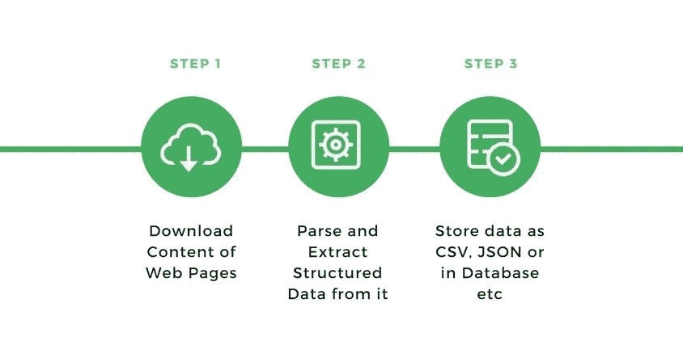
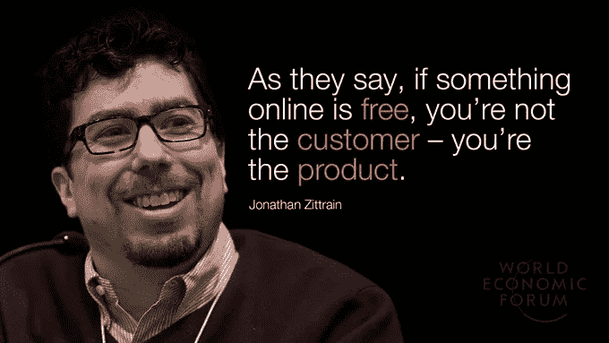
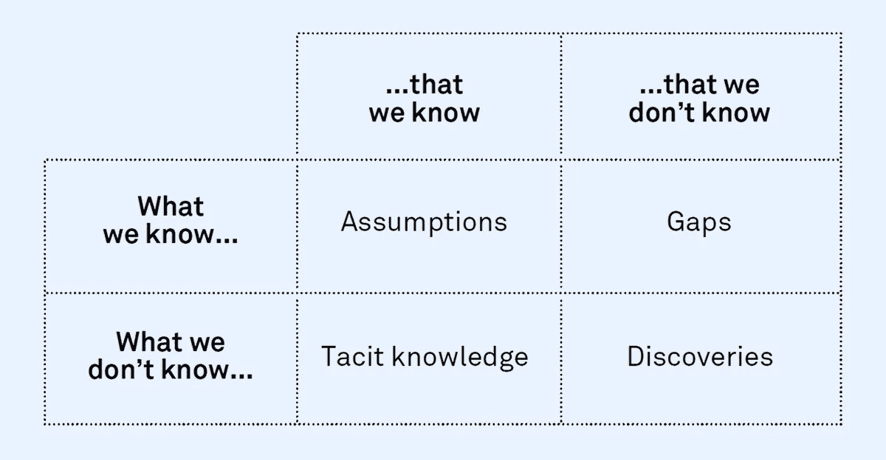

# 回到金字塔

> 原文：<https://towardsdatascience.com/back-to-the-pyramids-cda5c4b1099a?source=collection_archive---------67----------------------->

数据分析师/科学家对数据工程的思考。

建造金字塔的第一步是选择一个合适的地点——西蒙·伯杰在 [Unsplash](https://unsplash.com/s/photos/pyramid?utm_source=unsplash&utm_medium=referral&utm_content=creditCopyText) 上的照片

# 前言

*耗尽权力的他意识到他有多不能没有权力。*

电工建造系统所基于的金字塔的基石。这个电力基础已经变得如此普遍，以至于它不再是一个竞争优势；就像它第一次出现时一样。由于这个原因，今天每个人都认为电是理所当然的。在这种程度上，可以说没有人质疑它是如何工作的，或者它从何而来。然而，有史以来所有最伟大的建筑师都是通过学习电气服务开始他们的教育的。

数据爱好者喜欢从事各种与数据相关的活动。如今，网上有无限量的免费资料，学习变得前所未有的容易和容易。然而，尽管尝试所有这些狂热的新技术可能很诱人，但踩下刹车、温习基础知识无疑是无害的。事实上，虽然时间会证明所有当前流行的数据科学包是否会持续下去，但可以肯定的是，从 20 世纪 70 年代开始流行的 [ETL 作业(提取、转换和加载)](/data-engineering-101-for-dummies-like-me-cf6b9e89c2b4)将在 50 年后仍然存在——根据[林迪效应](https://medium.com/@tanayj/the-lindy-effect-and-betting-on-things-that-never-change-130880ec35af)理论。这就是为什么我决定建立使数据金字塔项目长期存在的基础。

# 让有数据

这一切都是从我的一个朋友开始的，他希望运用他新学到的财务分析技能，来评估一家公司是否得到了公平的评估。为此，他需要综合运用众所周知的指标和一些工程指标。为了收集他的数据，人们浏览了金融媒体和新闻渠道，寻找有助于公司发展的历史数据。

这些数据集可以免费(合法)下载，任何人都可以很容易地阅读 Excel 文件。尽管这些网站大多数都是可靠的，但它们不提供进行大规模下载的可能性。API 本质上提供实时市场数据(相对于公开填写的财务报表)。

结果，我的朋友一个接一个地手工整理这些公司的文件。对这些 excel 文件应用一些常规程序，在最终分析之前一起计算出度量标准。

换句话说，所采用的方法是乏味的(至少可以说是无聊的)和耗时的(至少可以这么说)。

*因此有了这个问题:*

*如何自动化这一过程并设计可扩展的解决方案？*

# 提取、转换和加载

> “在[计算](https://en.wikipedia.org/wiki/Computing)、**提取、转换、加载** ( **ETL** )是将数据从一个或多个源复制到目标系统的一般过程，目标系统以不同于源的方式表示数据[…]。ETL 过程在 20 世纪 70 年代成为一个流行的概念，并且经常用于数据仓库。— [维基百科](https://en.wikipedia.org/wiki/Extract,_transform,_load)

最简单的解决方案是构建一个 ETL 管道。该程序将从源网站抓取数据，处理数据，并将它们加载到关系数据库中。我不打算详述如何做，因为已经有无数的资源在讨论这个问题。相反，我将分享一些我在处理不同的阻碍时的想法，这些阻碍使你离最终目标更远。除此之外，我将包括我从该过程中获得的跨学科知识。

使用的 Python 库和服务:

*   用[请求提取数据](https://pypi.org/project/requests/)和[美汤](https://pypi.org/project/beautifulsoup4/)
*   用[熊猫](https://pypi.org/project/pandas/)转换和清理数据
*   用 [PyMySQL](https://pypi.org/project/PyMySQL/) 和 [SQLAlchemy](https://pypi.org/project/SQLAlchemy/) 将`.csv`加载到 MySQL 中
*   云计算平台: [EC2](https://aws.amazon.com/ec2/)

基本 ETL 流程的表示

# 当心黑天鹅

> “黑天鹅是一种不可预测的事件，超出了正常情况下的预期，可能会产生严重的后果。黑天鹅事件的特点是极其罕见，影响严重，而且人们普遍坚持认为事后才明白。— [纳西姆·尼古拉斯·塔勒布](https://en.wikipedia.org/wiki/Nassim_Nicholas_Taleb)

简单地说，黑天鹅被视为不太可能发生的事情。从统计学上来说，不太可能发生的是发生概率低的事情。所以，某个时刻最终会发生的事情！因此，问题并不是预测什么或者什么时候会发生，而是*如何为此做好准备？*

在我们的例子中，黑天鹅是指会阻止程序正确执行任务的东西，因此可能会损害进程。因此，我们的想法是识别并列出最终的威胁，并使第一个支柱稳固。在商业战略中，这种方法也被称为[事后分析](https://redbooth.com/blog/premortems-postmortems)。接下来的两点假设你对你处理的数据有信心，并且[知道如何处理坏的/丢失的数据](/working-with-missing-data-in-machine-learning-9c0a430df4ce)。

**A .关于数据源的重要性**

Jonathan Zittrain 在推特上的照片

数据源将为项目提供燃料；因此，使用最可靠的方法至关重要。除了确保它是否是合法来源，最基本的健康检查将是确保您处理的是原始数据源(而不是第三方从其他地方获取的数据)。

还有，你肯定不想破坏目标网站。这就是为什么您应该避免同时发送太多 GET 请求的原因。或者，你可以设置一个睡眠功能来延迟你的请求。有人可能会说使用代理会更快，但是你猜怎么着:[代理不安全](https://www.wired.com/2015/07/proxy-services-totally-unsecure-alternatives/)。你不仅会暴露自己的数据被盗和被非法使用，而且，大多数免费代理会修改目标 HTML 以插入恶意广告或其他一些废话。

b .理论上，一切正常

正常的做法是连续运行代码，看看它是否工作。一旦你的产品发布了，你就永远无法避免以后会出现的事情。万一发生什么事情，您需要尽快识别和理解错误并修复它。为了确保这个过程是快速的，请确保您的代码足够自我解释。谁也不知道下一个需要你阅读的人是谁。

当您持续测试您的程序时，您会理解您的程序如何对外部事物(源代码、包依赖、SQL 客户端等等)做出反应，并对未来可能发生的灾难保持警惕。[尝试/除](https://www.w3schools.com/python/python_try_except.asp)功能对它有很大的帮助。除了让程序运行之外，它还可以列出并记录现有的错误。

下面是 Try/Except 的一个片段，它返回关于就绪错误的信息

## 剥猫皮有许多方法

有趣的是，我们都知道一个事实，关于堆栈溢出的问题总是由一个伟大的社区来回答。如此多的答案，以至于对于每一个问题，都有许多有效的可能性。

没有真理。尽管有无数种方法可以算出 2，但什么会让 1+1 比 2 x1 更合理呢？越不复杂越好。最升级的答案提出最有效的代码来优化处理能力。然而，解决你的问题的另外 10 个答案当然也有效。所有这些贴出的答案展示了初学者和专家之间的巨大差异。这是新手不应该回避破解的原因。质量代码将伴随多年的实践而来。

所以因为没有冒名顶替者，你的主要目标应该是让它工作，然后你会改进它。首先，你交付，然后你迭代。[不要让完美成为生产力的敌人](https://hbr.org/2020/03/dont-let-perfection-be-the-enemy-of-productivity)。

即使在高级数据科学级别，这种能力也是一项很强的技能。事实上，许多数据科学家抵制了为他们的 ML 模型获取更多精确点的渴望，而不是现在部署它，以后再迭代。

也就是说，人们应该一路学习并尊重 python 的约定、风格指南和指导原则。

# 自动化枯燥的东西

一切都可以(或者应该)自动化。时间是最昂贵的资源。考虑到这一点，我很容易想象出一种符合*“如果不能自动化，就不要做/外包”*的企业价值观。

正是带着这个目的，VBA 复活了。尽管如此，事实证明这对大多数 excel 用户来说很难。从这个意义上说，我只能鼓励人们学习一些编程的基础知识，尤其是在科技公司。除了教育员工一个好的流程应该是什么样子，这将节省分析师做同样的日常工作的时间。

## 不要把鸡蛋都放在一个篮子里

我们已经看到了易变性是如何危及项目的。有趣的是，观察到在更高的水平上，这也是真的。无论你是项目经理还是企业领导，你都应该考虑运营是否无懈可击，这样才能有几个投资回报流。例如，新冠肺炎证明了大多数商业计划是多么脆弱，而几乎每家公司都有能力利用其数据来获得一些收入。

## 同理心很重要

昨天我读了一篇文章,解释了像其他领域一样，数据管理走向全栈配置文件。一言以蔽之，数据科学家应该更像数据工程师，数据工程师应该更像数据科学家。所以，因为两个领域重叠，这意味着两个功能是同一个硬币的两面。因此，这两种技能的完美组合需要对它们以及这个角色需要什么有一个坚实的理解。

> 欣赏你的队友的工作会带来更好的同理心。

西蒙·西内克在他的书《[领导者最后吃](https://www.amazon.co.uk/gp/product/0670923176/ref=as_li_tl?ie=UTF8&camp=1634&creative=6738&creativeASIN=0670923176&linkCode=as2&tag=lvillepinte-21&linkId=09b6fdcf4f3c481df2c9147cbdd8c903)》中强调了同理心是如何通过化合物在同事关系中发挥作用的，以及这些化合物是如何增强协作的。基本上，我们大脑中的化学物质(多巴胺、内啡肽、催产素、血清素)有许多方法发挥作用。成就感和爱是这些分子的两个主要触发因素。当人们喜欢一起工作时，他们自然会愿意付出更多的努力，并停留更长的时间来互相帮助。这通常突出了那些齐心协力并获得最佳结果的团队。

除了扩大人们的视野之外，将同事放在彼此的位置上只会提高同理心和团队合作。同理心是关系金字塔的基础，团队合作是巨大成功的基础。

# 吉萨的大**金字塔**充满了有待发现的财富

知识矩阵。一个好的项目有助于解决已知的未知问题；一个伟大的项目揭示未知-未知。

原本应该是一个基本的练习，最终变成了一个平稳的旅程，并帮助我发现了一堆未知的未知。它也揭示了许多现实生活中的问题，这些问题甚至在一开始都没有被怀疑。

ETL 活动从未被证明是有用的，因此总是值得一次又一次地引用。另一方面，新的数据技术每天都在涌现，并将数据科学提升到另一个水平。坚实的数据管道是任何使用开源软件库的项目成功背后的重复分母。基础工程不仅经得起时间的考验，而且由于更复杂和非结构化数据的增加而不断发展。

> "好书不会一下子泄露所有的秘密。"—斯蒂芬·金

# 参考

[1] Sangeet Moy Das，[像我这样的傻瓜的数据工程 101](/data-engineering-101-for-dummies-like-me-cf6b9e89c2b4)(2019)，towardsdatascience.com

[2]塔奈·杰普瑞亚，[《林迪效应和赌永远不变的东西》](https://medium.com/@tanayj/the-lindy-effect-and-betting-on-things-that-never-change-130880ec35af) (2018)，medium.com

[3]【wikipedia.com】提取、转换、加载(最后编辑于 2020 年 5 月 14 日，)

[4]纳西姆·尼古拉斯·塔勒布，[黑天鹅](https://www.amazon.co.uk/Black-Swan-Impact-Highly-Improbable/dp/0141034599) (2007)

[5] [预验和后验](https://redbooth.com/blog/premortems-postmortems)(2018)[redbooth.com](https://redbooth.com/)

[6]towardsdatascience.com，伯颜·安杰洛夫，[在机器学习中处理缺失数据](/working-with-missing-data-in-machine-learning-9c0a430df4ce)

[7] [代理服务不安全。尝试这些替代品](https://www.wired.com/2015/07/proxy-services-totally-unsecure-alternatives/) (2015)，Wired.com

[8] [蟒试除](https://www.w3schools.com/python/python_try_except.asp)，w3schools.com

[9]爱丽丝·博耶斯，《哈佛商业评论》，不要让完美成为生产力的敌人

[10]阿尔·斯威加特，[用 Python 自动化枯燥的东西](https://www.amazon.co.uk/Automate-Boring-Stuff-Python-Programming/dp/1593275994) (2015)

[11]西蒙·西内克，[领导者吃最后的](https://www.amazon.co.uk/Leaders-Eat-Last-Together-Others/dp/0670923168) (2014)

[12]杰西·安德森[数据工程师与数据科学家](https://www.oreilly.com/radar/data-engineers-vs-data-scientists/) (2018)，奥赖利