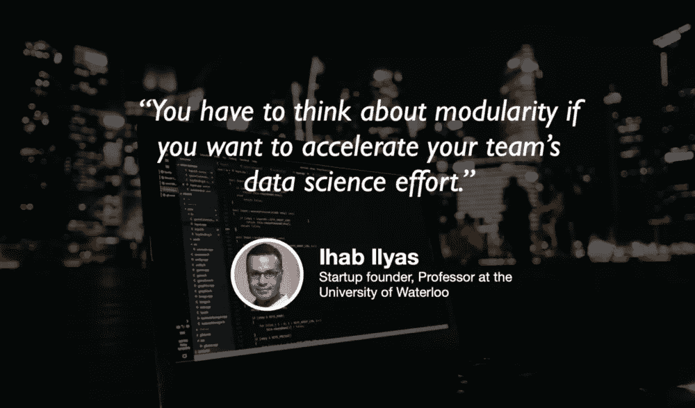

# 回到一切开始的地方

> 原文：<https://towardsdatascience.com/back-where-it-all-started-e24b4438a6af?source=collection_archive---------47----------------------->

## [我将如何重新开始学习机器学习(3 年后)](/how-id-start-learning-machine-learning-again-3-years-in-55c52aaee52a)

由[丹尼尔·伯克](https://medium.com/u/dbc019e228f5?source=post_page-----e24b4438a6af--------------------------------) — 10 分钟阅读

我在地下，回到一切开始的地方。坐在我第一次遇见迈克的隐蔽咖啡馆里。在过去的 9 个月里，我一直在我的卧室里学习，并决定走出洞穴。我一半担心早餐要付 19 美元(除非是圣诞节，周末开车去优步不是很赚钱)，另一半担心我在网上做的这项研究是否有意义。

Hannah Wright 在 Unsplash 上拍摄的照片

## [自然语言处理中的标记化算法概述](/overview-of-nlp-tokenization-algorithms-c41a7d5ec4f9)

到[时，读取 8 分钟](https://medium.com/u/b250300b3b8?source=post_page-----e24b4438a6af--------------------------------)

本文是对标记化算法的概述，从词级、字符级和子词级标记化，重点是 BPE、单字 LM、词块和句子块。这意味着专家和初学者都可以阅读。如果有任何概念或解释不清楚，请与我联系，我很乐意澄清任何需要。

pixabay.com/杰拉尔特

## [是什么让数据分析师变得优秀？](/what-makes-a-data-analyst-excellent-17ee4651c6db)

凯西·科济尔科夫(Cassie Kozyrkov)—6 分钟阅读

在剖析卓越分析的本质之前，让我们先快速总结一下[第 1 部分](http://bit.ly/quaesita_hallows)中关于分析的三个常见误解:

1.  分析就是统计。(编号)
2.  分析是数据新闻/营销/讲故事。(编号)
3.  分析就是决策。(不！)

## [数据清理终于实现自动化](/data-cleaning-is-finally-being-automated-8cc964ea2e12)

杰瑞米·哈里斯(Jeremie Harris)——听 40 分钟🎧

说数据清理占数据科学家工作的 80%是老生常谈，但这在方向上是正确的。

这太糟糕了，因为像数据探索、可视化和建模这样有趣的事情是大多数人进入数据科学的原因。因此，行业内正在大力推动尽可能自动化数据清理，这是一件好事。

我们的每日精选将于周一回归！如果你想在周五收到我们的 [*每周文摘*](/receive-our-newsletters-681049ffa0cf) *，很简单！跟随* [*我们的出版物*](http://towardsdatascience.com/) *，然后进入你的设置，打开“接收信件”您可以在此* *了解有关如何充分利用数据科学* [*的更多信息。*](/how-to-get-the-most-out-of-towards-data-science-3bf37f75a345)