# 旧足迹的背景估计

> 原文：<https://towardsdatascience.com/background-estimation-of-old-footages-6643f96b532d?source=collection_archive---------68----------------------->

## 有时候没有人看镜头也一样好看！

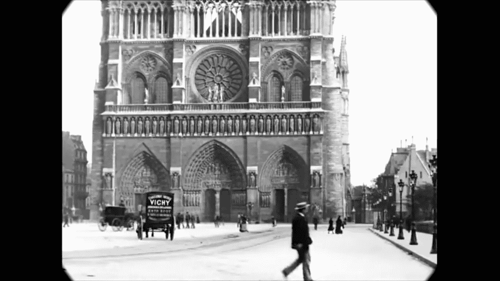

巴黎圣母院。来自盖伊·琼斯通过 T2 的 youtube 上传的视频

这种拍摄于上个世纪的镜头并不少见，镜头是静止的，记录着人们的日常生活，给我们展示了这个时代生活的美丽景象，一个永远存在的景象！。

由于相机是静止的，它为我们提供了包含两个元素的帧；静止的背景(例如建筑物)和移动的物体。这个特性使得它非常适合于**背景估计**算法。

在本文的其余部分，我将探索这个用例，旨在看看如果场景是空的，没有任何存在，这些镜头会是什么样子。

幸运的是，有简单而直观的方法来执行这项任务，只需使用 [**意味着**](https://en.wikipedia.org/wiki/Mean) 和 [**中值**](https://en.wikipedia.org/wiki/Median) 的力量就足以交付足够好的结果。

请注意，为了便于说明，本文中的所有例子都是从这个伟大的频道[盖伊·琼斯](https://www.youtube.com/channel/UCpUBuSn_Io93AMpOSw88afQ)的这个镜头中摘录的。

比方说，如果我们从某些片段中随机选取三帧。

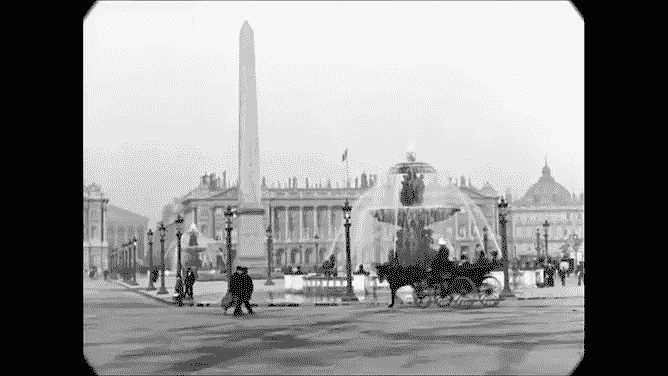

三个随机帧。

你可以看到在所有的里面，持久的是背景，移动的是人和马车(或者更抽象一点，**物**)。因此，通过计算所有帧的平均值来估计背景听起来是合理的。

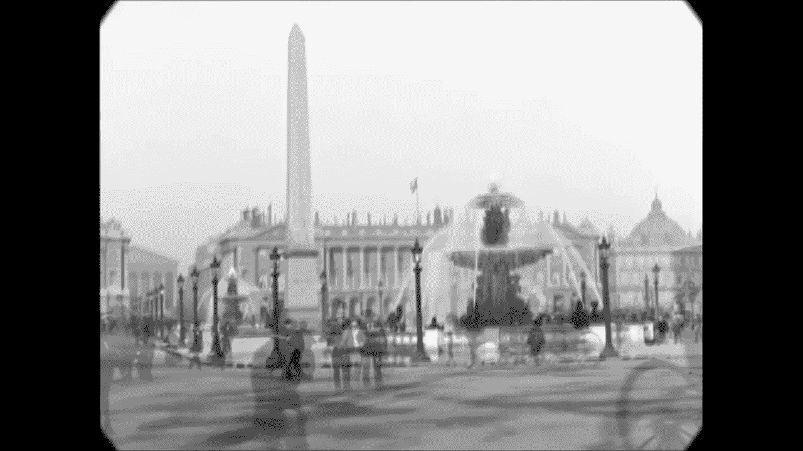

三个随机帧平均值。

如您所见，这种均值变换的幸存者是具有相似值的像素。此外，应用中间值也有类似的效果:

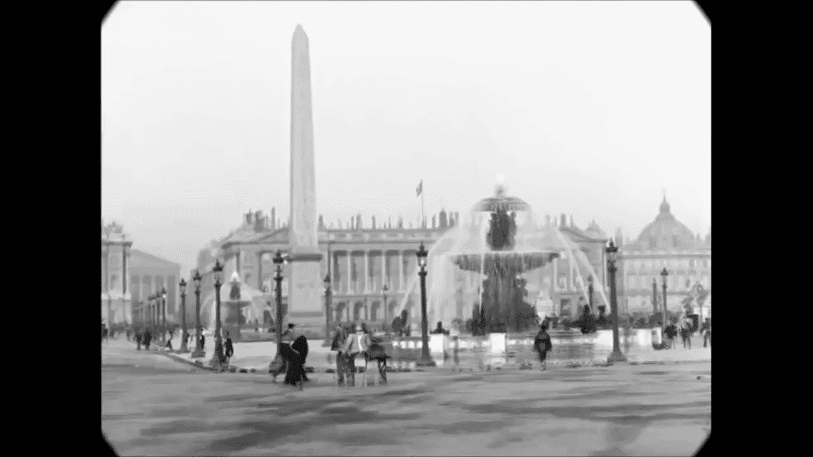

三个随机帧的中间值。

**均值**方法具有在图像上产生**鬼影状伪像**的趋势，另一方面，**中值**更加修剪，以在像素之间提供**非平滑过渡**。

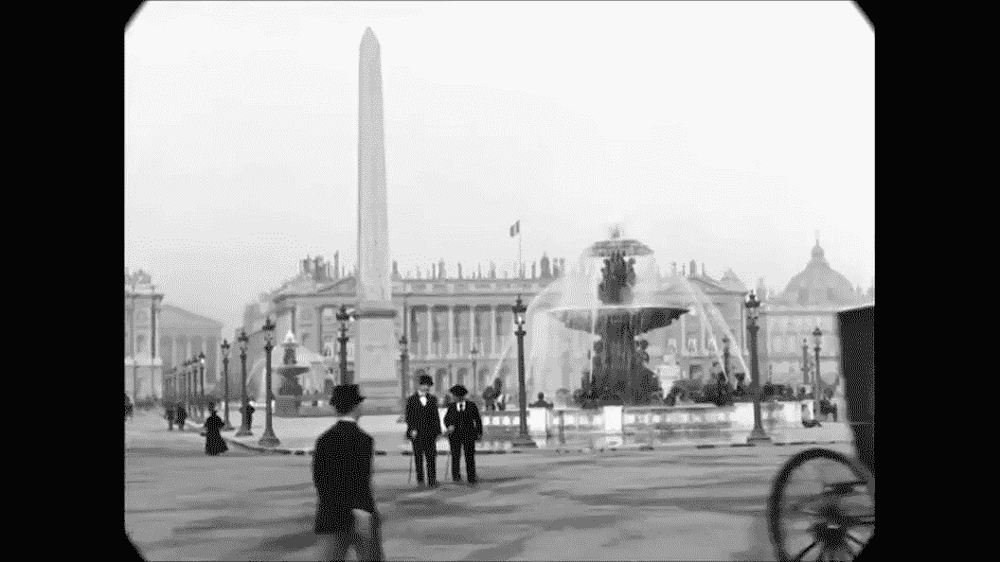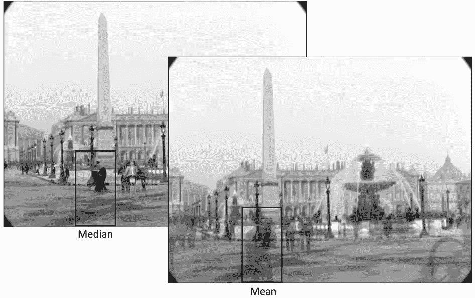

平均值和中间值对左下方男人的影响。

中位数通常比平均值更受欢迎，主要是因为它对异常值更稳健，这可以通过观察左下方的人来看出。对于矩形内的像素(上图)，这个人是一个离群值，因为他只出现在一帧中，所以他无法通过中值方法生存。而在中庸的方法中，尽管他相对来说是一个局外人，但他将一直存在(但强度不大)。

正如您可能已经猜到的，从几帧移动到整个视频更有可能产生更好的结果，因为随着时间的推移，假设非背景对象将持续移动，每个像素成为背景像素的机会将更高。

以下是将同样的方法应用于一些不到一分钟的场景后的一些结果。在顶部，您可以看到原始场景，在左侧，您可以看到它的运行平均值(到当前帧为止的所有帧的平均值)，在右侧，您可以看到它的运行中值(到当前帧为止的所有帧的中值)。

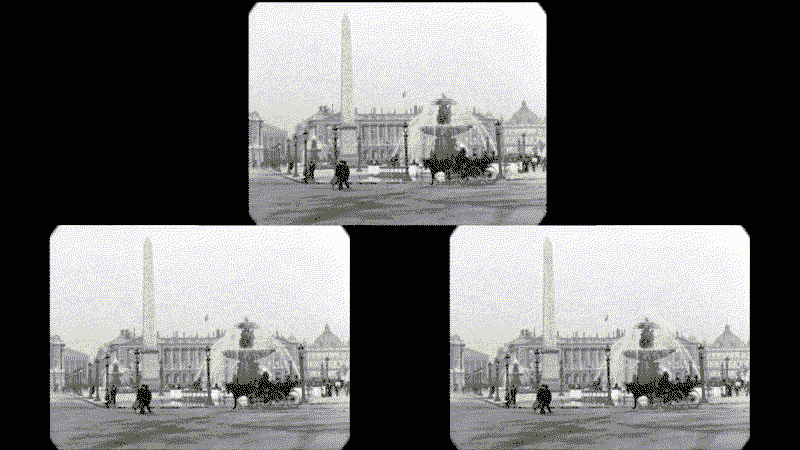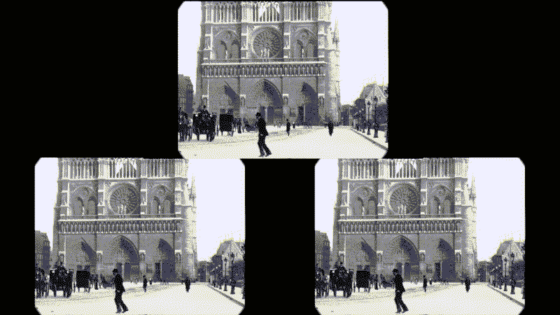

上面这一个突出了使用中间值的主要缺陷，因为在如此短的视频中，马车在场景中一致地在同一位置移动，这给了它们被预测为背景的高机会。然而，在这种情况下，平均似乎更好。

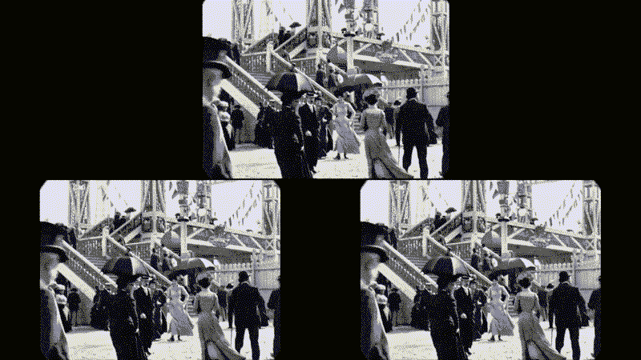

这是迄今为止对均值和中值最具挑战性的一个，因为有人会说有些区域的实际背景根本没有出现在场景中。如果你仔细看，你几乎看不到楼梯的前几级。

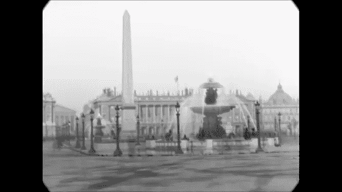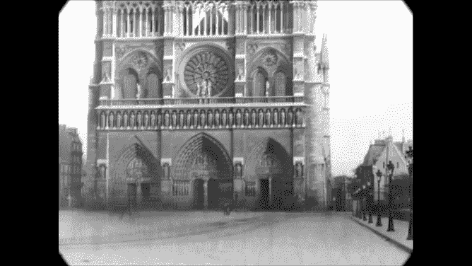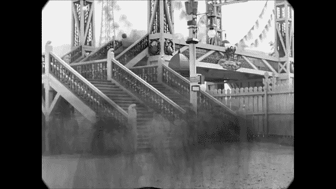

方法

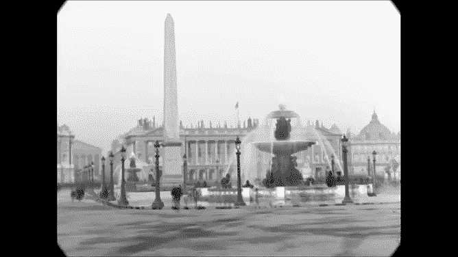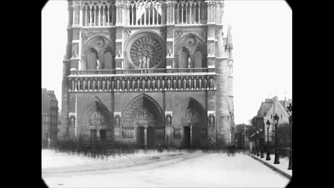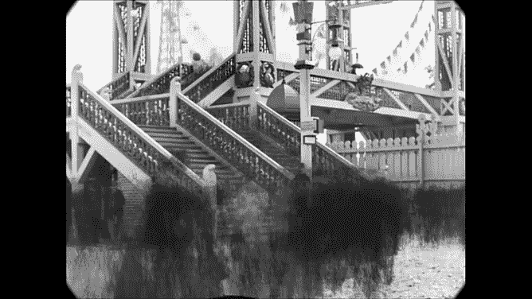

中位数

我希望这能让你对背景估计的潜在应用有所了解，如果你想进一步了解这个主题，我建议从这些[幻灯片](http://www.cs.utexas.edu/~grauman/courses/fall2009/slides/lecture9_background.pdf)开始。