# 用 U -Net 去除背景

> 原文：<https://towardsdatascience.com/background-removal-with-u%C2%B2-net-2819b8e77078?source=collection_archive---------27----------------------->

去除图像的背景是许多应用程序的老问题。在我的使用中，我需要在各种环境下擦除一张居中家具照片的背景，同时保持物体本身完整。

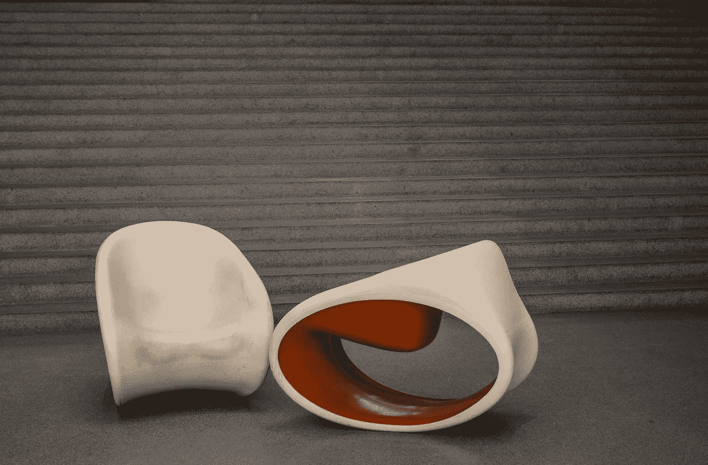

在这里，我们想保留两把椅子，同时删除灰色背景。

虽然在大多数情况下，这项任务可以通过经典的计算机视觉算法来实现，如图像阈值处理(例如使用****【1】**)，但如果没有特定的预处理或后处理，一些图像可能会非常困难。如果对象具有与背景非常相似的颜色，那么由于边缘或阴影较弱，要找到一个清晰的轮廓会非常困难。**

**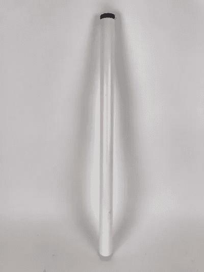**

**边缘和阴影较弱的图像示例。**

**相反，如果背景是不同于对象的特征颜色，则很容易构造遮罩来去除背景。这就是**色度键控**背后的原理，使用绿色和蓝色屏幕擦除背景，并用另一个场景替换，这是娱乐业广泛使用的效果。**

**我没有使用绿色屏幕的奢侈，但对我来说幸运的是，由于过去十年深度学习的最新进展，这个问题正在被专门为这项任务设计的新模型再次探索。**

**与这个问题相关的具体子任务叫做**显著性物体检测。****

**听起来不错，但是显著性到底是什么意思呢？**

**这里是维基百科对**显著图的定义:****

> **在计算机视觉中，显著图是显示每个像素的独特质量的图像。显著图的目标是简化和/或改变图像的表示，使其更有意义和更易于分析。**

**通俗地说，**显著性**就是从图像的其余部分中脱颖而出的能力。显著图允许将图像的重要部分(通常是前景中的对象)与其余部分(背景)区分开来。**

**非常适合我们的使用案例！**

**因为我想快速解决这个问题，因此制作自己的数据集是毫无疑问的，所以我寻找一个预训练的模型，它无需进一步微调就能满足我的需要。**

**最近针对这项任务发布了许多不同的模型，我选择了[**U-Net**](https://github.com/NathanUA/U-2-Net)**【2】**，因为根据基准测试，它表现很好，并且代码很容易修改，可以根据我自己的图像进行推断。**

**这个名字来源于众所周知的 **Unet[3]** ，它借用了这个名字的一般架构。我不会深入探讨这个问题，但这两个网络都是“U 形”,具有一系列卷积和下采样层，向下到一个低点，在该点开始一系列卷积和上采样层，直到原始输入形状。**

**[**U -Net**](https://github.com/NathanUA/U-2-Net) 的主要区别在于“层”本身就是带有向下和向上采样层的“U-结构。**

**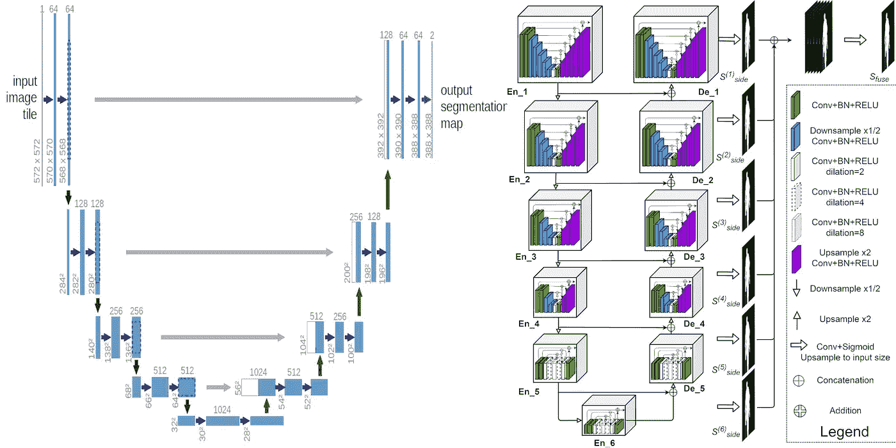**

**Unet(左)与 U -Net(右)的网络架构**

**现在，在对原始代码做了一些轻微的修改后，我们可以直接从模型中可视化显著性图:**

**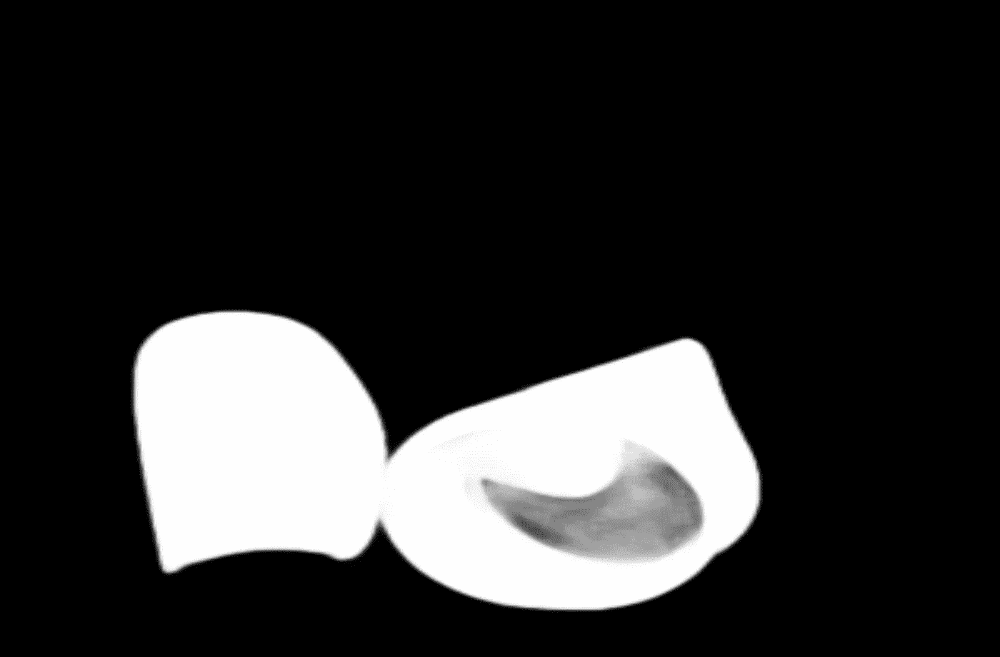**

**unet2 预测的掩码**

**每个单独的像素是一个介于 0 和 1 之间的浮点数，这意味着这个显著图处理透明度！**

**没有任何进一步的修改，我们可以通过使用 **numpy** 的简单矩阵乘法，将**显著图**作为遮罩应用于我们的图像。**

**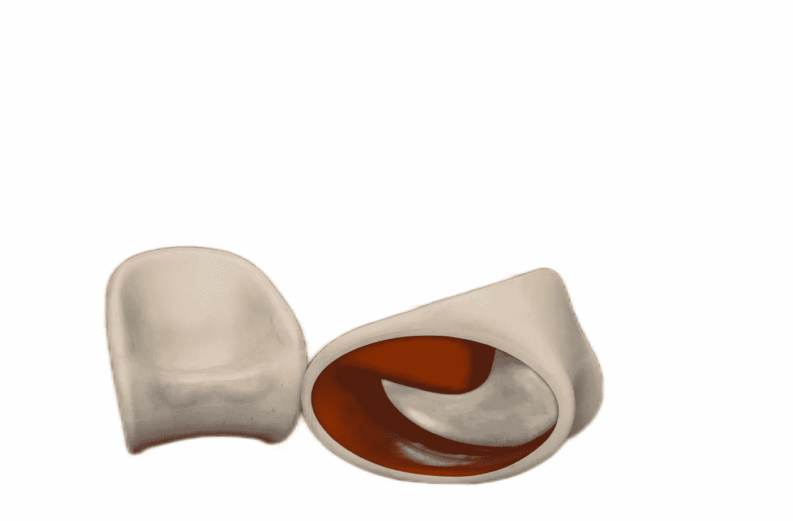**

**在应用显著图作为掩模之后**

**模型表现很好。我们仍然可以透过椅子看到一点地板，但在我们的情况下这不是问题。总的来说，效果非常好，但可能会留下一些伪像，尤其是像这把椅子这样有“空隙”的物体。**

**这个结果是在没有对图像进行任何预处理或后处理的情况下获得的。例如，您可以将较高的值向上舍入为 1，将较低的值向下舍入以避免图像周围的“模糊”，或者只是锐化图像。**

**该型号还配备了另一种更小的架构( **u2netp** )，与原始的 **176 mb** 相比，重量仅为 **4.7 mb** 以获得类似的结果！**

**当我们想要将我们的模型部署到一些基于云的平台上，而这些平台可能对模型大小有一些限制时，这就变得很方便了。例如 **Amazon Lambda，**它允许你运行一个无限可扩展的 API，而不需要建立你自己的服务器，它对内存使用和磁盘空间有很大的限制。**

**以下是不同设置下的图像样本的结果:**

**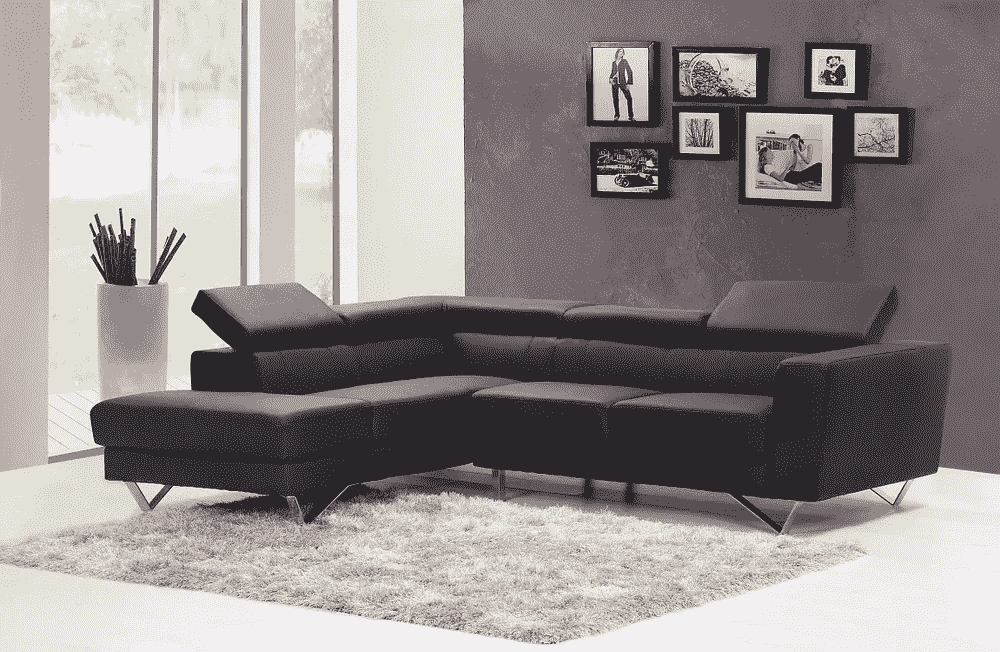****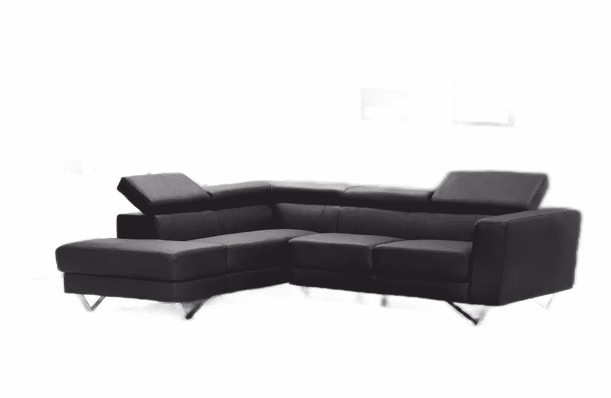****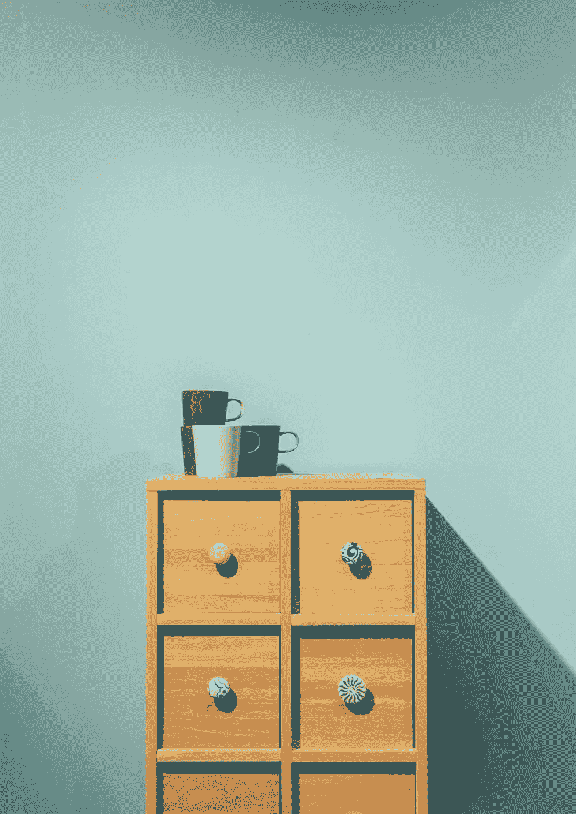****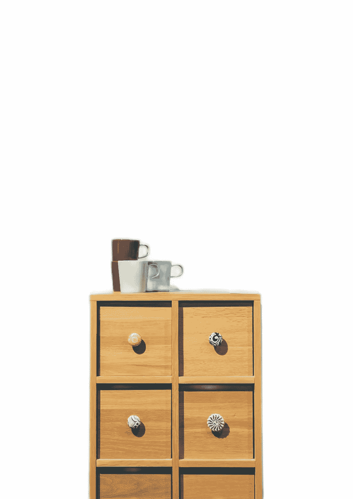****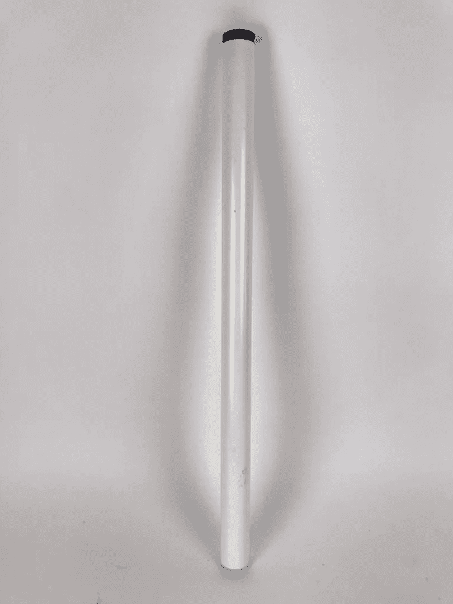****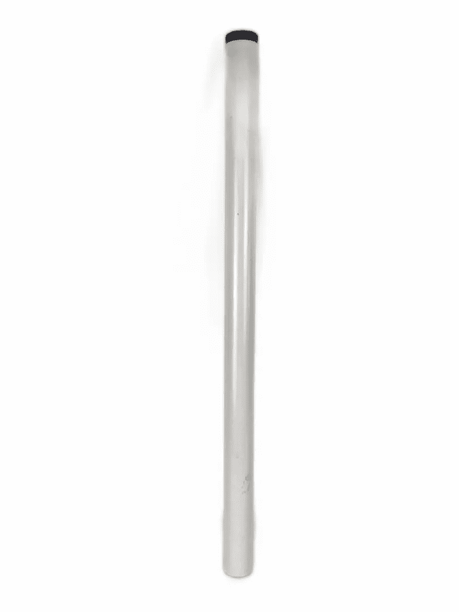****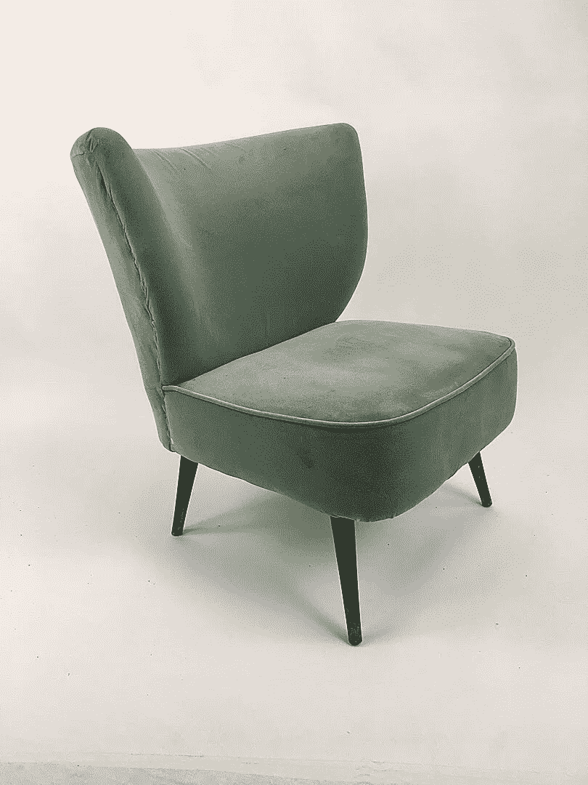****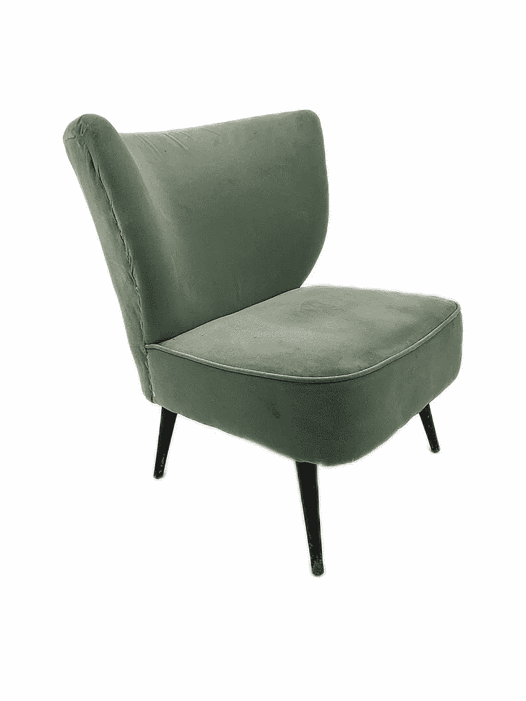**

****来源:****

**[1][https://docs . opencv . org/master/D7/d4d/tutorial _ py _ thresholding . html](https://docs.opencv.org/master/d7/d4d/tutorial_py_thresholding.html)**

**[2] [U2-Net:使用嵌套的 U 结构进行更深入的显著对象检测](https://www.sciencedirect.com/science/article/abs/pii/S0031320320302077?dgcid=author)**

**[3] [U-Net:用于生物医学图像分割的卷积网络](https://arxiv.org/abs/1505.04597)**