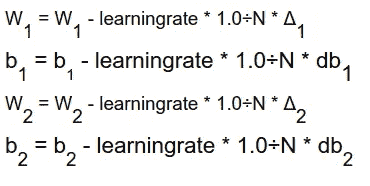

# 在小批量上从头开始反向传播

> 原文：<https://towardsdatascience.com/backpropagation-from-scratch-on-mini-batches-e6efdaa281a2?source=collection_archive---------9----------------------->

## 逐步执行方程的小批量反向传播算法的实现。

约翰·福斯特在 [Unsplash](https://unsplash.com/s/photos/conveyerbelt?utm_source=unsplash&utm_medium=referral&utm_content=creditCopyText) 上的照片

你一定在想，又一个从头开始的博客？是的，但我想通了，想出了一些东西，你可以用它来修改，还有一些容易理解的方程，你通常会写下来理解算法。

本博客将重点关注在小批量数据集上逐步实现反向传播算法。有大量的教程和博客来详细演示反向传播算法以及微积分和代数背后的所有逻辑。所以我将跳过这一部分，直接讨论数学中的方程和使用 Python 的实现(为什么不呢)。

# 为什么从零开始？

这是一个很长时间的社区问题，为什么我们要从头实现一个算法，即使它已经可以被几乎所有的框架使用。显然，在使用某些高级框架时，你甚至不会注意到反向传播的神奇之处。为了彻底理解它，你应该试着用这个东西弄脏你的手。反向传播是可以边玩边做实验的东西。

# 为什么是小批量？

小批量背后的原因很简单。它通过将数据分成小批来节省内存和处理时间，并在训练循环的每次迭代中向算法提供数据集的一部分。一次进给一个 10000x10000 的矩阵不仅会耗尽内存，而且需要很长时间来运行。相反，将它降低到每次迭代 50 次不仅会减少内存使用，而且您可以跟踪进度。

**注-** 这与随机方法不同，在随机方法中，我们从每个类别的数据中抽取分层样本，并在此基础上假设模型可以推广。

# 实施时间！

这是我将在这个实现中使用的数据的头部。

这里的目标变量是占有率，它是一个分类变量(0/1)。这将是我们将要编码的架构。

## 算法:

对于 i:=1 至 i:=m:

1.  执行前向传播或前向传递，以计算每层神经元的激活值。

2.反向传播步骤:

*   使用数据中的标签计算误差项(MSE 或 LogLoss 或您的愿望):

*   隐藏层中的误差项计算如下:

*   设置渐变:
    初始化δ= 0

3.梯度下降和重量更新步骤:

## 现在实现:

如前所述，这将是一个三层网络。我们保持层数简洁，以便以更好和更容易的方式识别梯度和误差方程。之后，我们将定义一个函数，它将被用作网络中的转发传播器。

*这里需要注意的一点是，我认为输入层是我的第 0 层。可能有其他博客/教程认为它是第一。所以怎么索引完全是你自己的选择。*

现在，在初始化权重和偏差并定义前向传播函数后，我们将定义小批量的后向传播函数，大小=数据集大小/N。您可以调整 N 来调整所需的批量大小。

让我们一环一环地分解它

*   如上所述，Ist 循环迭代你想要让模型遍历你的数据的次数，简单地把它放在神经网络术语“时期”中。
*   第二次循环:在指定批次数量后，该循环对每个时期“I”的每个小批次进行迭代
*   第三个循环遍历该小批量中的每个训练示例，并计算梯度和误差值
*   最后，对于每个批次，执行梯度下降步骤，并对重量矩阵进行更改。

就是这个！！你终于自己完成了小批量反向传播的实现。这里需要注意的一点是，我对网络中的每一层都使用了一个矩阵变量，当你的网络规模增长时，这是一个愚蠢的举动，但同样，这样做只是为了了解事情实际上是如何工作的。
如果您想增加隐藏层的数量，您可以简单地使用 3d 矩阵进行误差和梯度计算，其中第三维度将保存层值。例如，dim(δ)=(2，3，2)，这表示您正在计算第二个隐藏层中 W(2，3)的梯度。
另外，我正在开发一个带有贝叶斯初始化的博客，希望很快会有这样的博客。

感谢阅读！继续实验！

**编辑**:在这里 *可以在 Github repo [*中找到使用过的数据集以及 ipython 笔记本。*](https://github.com/theAayushbajaj/Backpropagation_MiniBatches)*