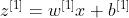
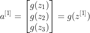
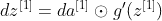

# 反向传播变得容易

> 原文：<https://towardsdatascience.com/backpropagation-made-easy-e90a4d5ede55?source=collection_archive---------15----------------------->

## 反向传播在机器学习中是如此基础，却又如此令人生畏。但实际上，这比看起来容易。

照片由[杰米街](https://unsplash.com/@jamie452?utm_source=medium&utm_medium=referral)在 [Unsplash](https://unsplash.com?utm_source=medium&utm_medium=referral)

学习机器学习(ML)并不需要数学天才。基本上，你所需要的只是大学一年级水平的微积分、线性代数和概率论，你已经准备好了。但是在 ML 看似良性的第一印象背后，有大量与 ML 相关的数学理论。对于许多人来说，学习 ML 的第一个真正障碍是反向传播(BP)。这是我们用来推导神经网络(NN)中参数梯度的方法。训练模型是梯度下降算法中的一个必要步骤。

BP 是任何 NN 训练中非常基础的一步。它涉及链规则和矩阵乘法。但很多 ML 课程或教程中 BP 的引入方式并不尽如人意。当我第一次在 Coursera 的机器学习课上学习 BP 时，我对它的计算过程非常困惑，以至于暂停了几个月。同时，我搜索了更多关于 BP 的解释。我设法通过了这门课程。我完成了编码作业。但是英国石油公司在我的脑海中仍然是一个非常混乱和令人困惑的模糊形象。

如果你完全不了解 BP，简单地把它当成一个黑箱，其实也没什么坏处，因为 Tensorflow 或者 Pytorch 可以自动为你执行 BP。但是最近我在复习关于 ML 的笔记，我开始正确理解 BP。我的方法是建立一个简单的神经网络，明确地写下每个参数和变量矩阵/向量，并通过链式法则逐步写下每个参数矩阵/向量的梯度计算。最终，BP 比我最初想象的要容易得多。

# 使用两层 NN 和单个输入样本作为例子

我的内涵是基于 Coursera 的深度学习规范课程 1。我将用一个两层神经网络作为例子。两层刚好“足够深”，因为计算层 1 中的梯度的技术可以重复用于任何附加层。让我们看到关于每层神经元数量的参数的维数也是有帮助的，例如，注意输入是一个 2 维向量，第 1 层中有三个神经元，因此 w[1]是一个 3*2 矩阵。第 2 层或输出层有两个神经元。如果神经网络用于二值分类，输出层是一个神经元；如果神经网络用于多重分类，输出层的神经元数量与类别相同。为了概括我们的分析，我们只考虑一个双神经元输出层作为例子。

简单的两层神经网络(图片由作者提供)

在输入层，即第 0 层，我们有一个 2*1 的输入向量 x，现在我们只关注单个样本输入。如果我们想把输入看作一批 m 个样本，那么输入的维数实际上是 2*m .但是我们这里只考虑一个输入实例。

在第一层，我们有三个神经元，矩阵 w[1]是一个 3*2 的矩阵。在这个 NN 中，每层也有一个偏置向量 b[1]和 b[2]。b[1]是一个 3*1 向量，b[2]是一个 2*1 向量。在正向传递中，我们有以下关系(以矩阵形式和矢量化形式书写):

第一层运算的矩阵乘法

第一层操作的矢量化表达

类似地，第 2 层的矢量化运算可以写成:

第二层操作的矢量化表达。请注意，a^[1]作为这一层的输入。

> **暂且忽略激活功能和损耗功能的细节。**

对于每一层，我们将使用非线性激活函数 g(z)，例如 sigmoid 函数或 ReLU。为了简单起见，我们省略了 g(z)的细节，只是继续使用 g(z)。

a[1]和 z[1]之间的关系

请注意，一旦我们决定使用哪个 g(z ), g(z)对 z 的导数是已知的。

g'(z)是我们已知的。

在神经网络的输出端，我们有一个损失函数 J()，我们将努力使其最小化。通常是交叉熵。为了简单起见，我们暂时不讨论 J()的细节。同样，它是 a[2]和 y 的函数，所以我们可以直接计算它对 a[2]的导数。

损失函数

> **从最后一层开始，得到部分方向的 dz[2]。**

要执行 BP，我们需要从最后一层向后到第一层。在最后一层，我们可以直接从损失函数 J 得到 da[2]的偏导数，因为 J 是 a[2]的函数。假定我们知道导数 g'(z)，通过下面的函数从 da[2]获得偏导数 dz[2]也是直接的。请注意，最后一个等式中的运算符(圆圈中的点)表示元素级乘法。

> **一旦我们获得了 dz[2]，我们将试图找到 dw[2]和 db[2]。**

以 w[2]中的 w7 为例，这个参数乘以 a1，然后加到 z4。根据链式法则，dw7 等于:

因此，w[2]和 dz[2]之间的关系如下:

可以看到 dw[2]无非是 dz[2]的向量相乘和 a[1]的转置。db[2]就是 dz[2]本身。

> **然后，我们可以进入第 1 层，计算 da[1]和 dz[1]。**

以 a[1]中的 a1 为例。请注意，a1 乘以 w7 和 w8，并分别与 z4 和 z5 相加。根据链式法则，da1 也将由这两部分组成。da[1]和 dz[1]的细节如下所示:

请注意，da[1]是用第 2 层的参数 w[2]和 dz[2]计算的。

> **使用 dz[1]，我们可以获得 dw[1]和 db[1]，就像在第 2 层中一样。**

我们可以看到 dw[1]的计算是 dz[1]向量和 x 的转置相乘，你也可以把 x 想象成“0”层的输出向量 a[0]。因此得到 dw[l]=dz[l]*a[l-1]的一致表达式。t(。t 表示转置，l 是随机层数)。

通过以上步骤，我们获得了 dw[2]、db[2]、dw[1]和 db[1]。对于超过 2 层的 NN，可以对每一层重复上述步骤:对于任何一层，我们只需要获得 dz[l](或者直接从 J 获得，或者从上一层获得)，用它来计算 dw[l]和 db[l]；得到 da[l-1]和 dz[l-1]，进行到 l-1 层。

对于具有 L 层的 NN，BP 归结为以下四个主要步骤:

1.  **从最后一层**，从损失函数 J 计算 da[L]；然后从 da[L]得到 dz[L]；设 l= L，
2.  **用 dz[l]** 计算当前层参数的梯度:计算 dw[l]=dz[l]a[l-1]。t；db[l]= dz[l]；
3.  **用 dz[l]** 计算上一层输出的梯度:用 da[l-1] = w[l]计算 da[l-1]。T * dz[l]，从 da[l-1]得到 dz[l-1]。
4.  设置 l=l-1，从第二步**开始重复，直到到达第一层**。

总之，在每一层，我们都想找出 dz[l]，一切都从那里开始。

**然后我们来看 J()和 g()的细节。**我们假设 g(z)是 sigmoid 函数，J()是交叉熵。它们的格式和渐变如下所示。

在我们 NN 的情况下，J 是 a[2]和 y 的函数，我们可以从下面的函数得到 dz[2]。一旦我们有了 dz[2]的显式表达式，我们就可以用上面的步骤执行 BP。

最后，我们来看看多个输入实例的情况。如果输入包含 m 个实例，那么输出和中间矩阵 A[1]，A[2]，Z[1]和 Z[2]都有 m 列。

x，Y，A[1]，A[2]，Z[1]，Z[2]有 m 列

如果损失函数 J 是预期的交叉熵，则 dw 和 db 的计算需要包括 1/m 项，但其他一切基本上仍然相同:

就是这样。我们使用简单明了的两层神经网络作为例子，并对单个输入和多个输入执行 BP。希望这个简单的教程能帮助你更好地了解 BP。

参考:

[1] Coursera 深度学习规范课程 1:神经网络和深度学习

[2][https://www.youtube.com/watch?v=ibJpTrp5mcE&feature = youtu . be](https://www.youtube.com/watch?v=ibJpTrp5mcE&feature=youtu.be)

[3][http://speech . ee . NTU . edu . tw/~ tlkagk/courses/ML _ 2016/Lecture/BP . pdf](http://speech.ee.ntu.edu.tw/~tlkagk/courses/ML_2016/Lecture/BP.pdf)