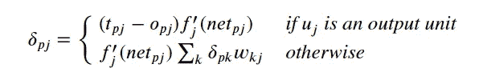
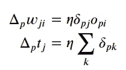
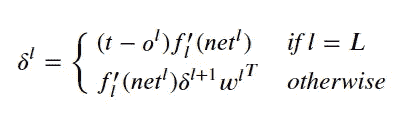
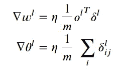

# 从头开始反向传播纸张

> 原文：<https://towardsdatascience.com/backpropagation-paper-from-scratch-796793789248?source=collection_archive---------49----------------------->

## [实践教程](https://towardsdatascience.com/tagged/hands-on-tutorials)

## 理解深度学习的基本基础，通过演练脚本传播错误

由 [Mirko Blicke](https://unsplash.com/@mirkoblicke?utm_source=medium&utm_medium=referral) 在 [Unsplash](https://unsplash.com?utm_source=medium&utm_medium=referral) 上拍摄的照片

神经网络结构依靠反向传播来获得梯度以减少误差，然后通过在隐藏层中形成内部表示来学习输入/输出模式的映射。反向传播的概念对于理解神经网络如何学习的基础知识至关重要。

这个想法是在著名的(1986) [*通过错误传播*](https://apps.dtic.mil/dtic/tr/fulltext/u2/a164453.pdf) 学习内部表征中以*广义 Delta 规则*的名义引入的，这是来自 [David Rumelhart](https://en.wikipedia.org/wiki/David_Rumelhart) 、 [Geoffrey Hinton](https://en.wikipedia.org/wiki/Geoffrey_Hinton) 和 [Ronald Williams](https://en.wikipedia.org/wiki/Ronald_J._Williams) 的经典。今天，我将为这篇文章提供一个简单的代码脚本和笔记本。论文本身讨论了在*问题*部分结尾的两个类似的概念表述，其中之一是大卫·帕克的 [*学习逻辑:在硅中铸造人脑的皮层*](https://books.google.com.tr/books/about/Learning_logic.html?id=2kS9GwAACAAJ&redir_esc=y) (1985)和杨乐存的 [*不对称阈值网络的学习方案*](http://yann.lecun.com/exdb/publis/pdf/lecun-85.pdf) (1985)。虽然这不是唯一一篇引入这一概念的论文，但这篇论文获得了更大的关注，并在深度学习研究中掀起了热潮。可能正是因为这个原因，这是当时深度学习领域取得的最大里程碑。如今，我们当然可以讨论更大的里程碑。

本文不仅给出了广义 delta 规则，而且给出了合理数量问题的模拟结果，最后还有一个*递归网*部分。这里，我们只涉及反向传播概念和前馈神经网络结构。

**项目回购:**[https://github . com/devrimcavusoglu/learning _ internal _ presentations](https://github.com/devrimcavusoglu/learning_internal_representations)

## 目标是什么？

我在这里提供的是一个基本前馈神经网络架构的 Python 实现，以及对广义 delta 规则的解释。或许这个(Jupyter)笔记本和脚本的一个独特之处在于，我把它们设计成可以在任何地方传达原始符号的形式。因此，我们的主要目标是通过实现来浏览本文，而不要让读者因不同的符号和等式而感到困惑。我知道，概念本身对于一个初学者来说已经很难理解了，或者最近有人跳到了深度学习领域。然而，我认为，反向传播概念对于理解神经网络的基础是必须的。我相信这个笔记本让人们更容易理解纸上的符号。在这一点上，让我说纸符号不是目前常用的符号。然而，我提供了一个简单的字典来使转换到通用符号变得更容易。

已经有一篇关于论文的反向传播算法[从杰夫·辛顿](/learning-backpropagation-from-geoffrey-hinton-619027613f0)学习反向传播的好文章，作者是[瑞安·戈特斯曼](https://medium.com/u/9008d963bf1f?source=post_page-----796793789248--------------------------------)，有更简单的解释、图表和方程。因此，如果你想检查一个快速写作和一些没有实现，但进一步解释的概念，请参考该职位。当然，笔记本包括大量的信息和解释。

## 这个项目是为了谁？

我知道你对基本前馈神经网络的代码实现有什么想法。是的，有几百甚至几千个。我非常肯定，任何人都开始学习深度学习，神经网络可能已经完成了他/她的实现。然而，正如我在上一节中提到的，我们的目标是直接使用论文中的符号和方程来提供一个合适的实现。

基本上任何人都想了解神经网络的基础，并从谁至少有一个像样的微积分和线性代数的理解。该项目是为任何人谁没有阅读论文，但愿意阅读，或目前正在阅读，或已经阅读论文。在阅读的任何阶段，你都可以看一下这个演练代码。

让我们进入回购和代码。

[法托斯 Bytyqi](https://unsplash.com/@fatosi?utm_source=medium&utm_medium=referral) 在 [Unsplash](https://unsplash.com?utm_source=medium&utm_medium=referral) 上的照片

# 项目内容

虽然这是原论文的一个实现，但是实现上略有不同。例如，神经网络的笔记本实现是以矢量化的方式设计的。网络组件对本文中介绍的方程使用矢量化。要理解矢量化，请参考[这篇](https://stackoverflow.com/questions/35091979/why-is-vectorization-faster-in-general-than-loops#:~:text=Vectorization%20is%20a%20type%20of,the%20computation%20is%20done%20faster.)讨论，或者查看 [Jalal Mansoori](https://medium.com/u/46d7fc45cea8?source=post_page-----796793789248--------------------------------) 的[这篇](/what-is-vectorization-in-machine-learning-6c7be3e4440a)帖子。

**资源库:**[https://github . com/devrimcavusoglu/learning _ internal _ presentations](https://github.com/devrimcavusoglu/learning_internal_representations)

该项目的组成部分是:

1.  **learning _ internal _ presentations . ipynb**
2.  **nnet.py**
3.  **example_datasets.ipynb**
4.  **nb_utils.py(侧面组件)**

## 建造

到目前为止，我们已经讨论了内容和方法。让我们继续学习实现前馈神经网络的基础知识。下面，你可以看到一个伪代码式的代码片段和神经网络基本训练的步骤。

反向传播部分是我们使用输出和层网络以及激活函数来获得梯度的部分，然后我们使用该梯度来更新权重以降低成本。让我们快速浏览一下反向传播过程的方程式和步骤。本文提出的广义 delta 规则如下:

广义德尔塔法则

权重和偏差的更新规则为

我自己为 *t_j* (偏置向量)添加了更新规则(不要与代表目标的第 *j* 分量的 *t_pj* 混淆)，这篇文章没有单独写。上述规则可以转换成矢量化形式，

GDR 的矢量化版本

利用矢量化更新规则，

其中上标代表层 *l* ，而 *L* 是总层数减 1，这是由于索引从 0 开始。注意，对于 f 素数，为了方便起见，我们使用下标 *l* 而不是上标。

记住这些，您可以在下面的代码片段中看到一个反向传播过程，其中 backward_pass 是从层 l+1 到层 l 的反向传播的一个步骤。

我希望这些组件能让读者更容易理解神经网络基础的概念。你可以更进一步，尝试自己去完善这些，或者只是为项目回购做点贡献。

## 最后的话

实现一篇论文或者一个众所周知的方法的概念，并不是一件找不到的事情。事实上，有一个优雅的项目[论文，代码为](https://paperswithcode.com/about)，旨在用机器学习论文、代码和模拟结果创建完全免费和开放的资源。该项目为许多论文提供了代码，您可能还想查看不同论文的不同实现。这里实现的文件也存在(提交于 2020 年 11 月 9 日),具有相同的实现。

在那之前，我希望笔记本可以带你了解这篇论文的主要概念，反向传播算法。在回顾了这个项目之后，我强烈建议初学者实现自己的项目，对于有经验的人，我建议实现一篇论文来贡献开源。有几点需要考虑，

*   **用你自己的话写/重写主要过程** 这确实有助于实现过程更能适应不期望的构建部分，并且有助于计划的设计。
*   **改进/即兴发挥你实现的方法**
    例如，实现一个矢量化版本是一个很好的即兴发挥，适合最近的条件，或者添加一个单独的偏差向量。对于方程，LaTeX 永远是好朋友。
*   **首先实现一个演练笔记本，然后继续执行脚本** 一步一步地实现一个演练笔记本/脚本使概念更容易被吸收。此外，本演练是针对您的反复试验的，就像操场笔记本/脚本，它直接改进您的最终版本的实现。

顺便说一下，不要犹豫分享你的想法，任何反馈都是值得赞赏的。此外，因为这是开源的，所以请随意公开问题，或者创建 pull-request 来贡献代码、文档等。