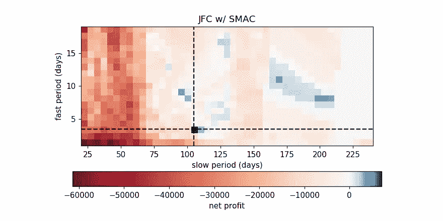
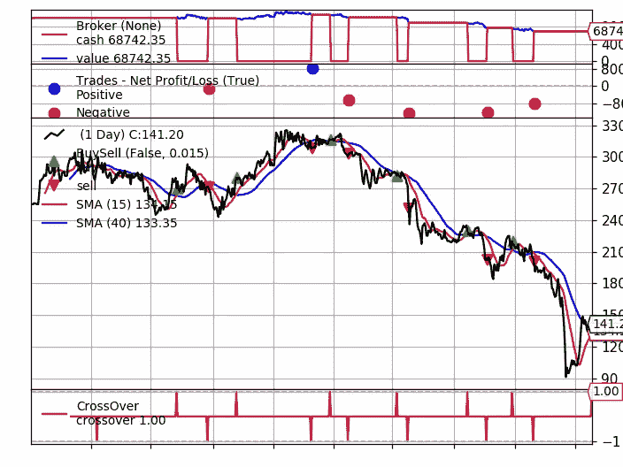
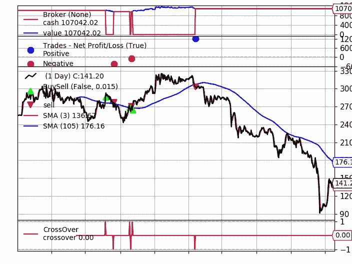

# 用三行代码优化你的交易策略

> 原文：<https://towardsdatascience.com/backtest-with-grid-search-using-only-3-lines-of-code-on-fastquant-551615fdaf69?source=collection_archive---------19----------------------->

## 使用 fastquant 自动轻松优化您的交易策略参数！



回溯测试的目标是了解空间中的哪些区域会产生更好的结果

如果你想通过投资持续赚钱，回溯测试是评估交易策略有效性的最好方法之一——当然，前提是你要正确实施。这个想法是，你可以为你选择的策略试验不同的参数，看看哪个组合能给你的投资带来最好的回报。

> 然而，这很容易变得乏味，因为您必须手动运行数百甚至数千个参数组合。

为了解决这个问题，我们可以使用 [fastquant](https://github.com/enzoampil/fastquant) 来实现一种称为“网格搜索”的技术，它基本上允许您对您想要为您的策略运行的每个参数组合运行回溯测试。

在本文的其余部分，我将演示如何在回溯测试您的交易策略时应用自动网格搜索。

*注意:如果你还不熟悉如何用 fastquant 做基本的回溯测试，你可能想看看我以前的* [*文章*](/backtest-your-trading-strategy-with-only-3-lines-of-python-3859b4a4ab44?source=friends_link&sk=ec647b6bb43fe322013248fd1d473015) *中关于如何用 3 行代码做这件事。*

顺便说一句，如果你对执行这种类型的分析感兴趣，甚至不需要编码，请注册[我正在构建的这个新工具](https://hawksight.co/)以使高级投资分析更容易使用！

好的，让我们从通过 pip 安装 fastquant 开始。

```
# Run this on your terminal
pip install fastquant

# Alternatively, you can run this from jupyter this way
!pip install fastquant
```

例如，让我们使用 Jollibee Food corp .(JFC)2018 年 1 月 1 日至 2019 年 12 月 31 日的股票作为我们的样本数据。

*注:* `*get_stock_data*` *支持从* [*雅虎财经*](https://finance.yahoo.com/) *和 PSE 访问的所有公司。*

```
from fastquant import get_stock_data
df = get_stock_data("JFC", "2018-01-01", "2019-12-31")
df.head()#         dt  close
# 2018-01-03  255.4
# 2018-01-04  255.0
# 2018-01-05  255.0
# 2018-01-08  256.0
# 2018-01-09  255.8
```

假设你想在 JFC 股票上用 15 天的快速周期和 40 天的慢速周期来回溯测试一个简单的移动平均交叉(SMAC)策略。

```
from fastquant import backtest
backtest("smac", df, fast_period=15, slow_period=40)# Starting Portfolio Value: 100000.00
# Final Portfolio Value: 68742.36
```

你会注意到，你的最终投资组合价值下降了很多(~31%)，通过查看下面的图表，你会发现这是因为当股票处于整体下降趋势时，该策略仍在推荐交易(绿色和红色箭头)。



即使股票整体下跌，你也会看到交易发生(绿色和红色箭头)

所以现在，我们想看看是否有一个“慢速期”和“快速期”的组合会导致 SMAC 策略知道不要在整体下降趋势中交易。

一种方法是尝试大量可能的快速周期和慢速周期组合。在这个例子中，我们将慢速周期设置为取 20 到 241 范围内的值(每隔 5 秒跳过一次)，而快速周期可以取 1 到 20 范围内的值。

这意味着快速周期可以取 20 个可能值，而慢速周期可以取 45 个可能值。总的来说，这意味着 900 (20 x 45)种可能的组合！想象一下这样一个一个做对。

幸运的是，我们可以通过使用迭代器(例如`list`、`range`)而不是单个数字作为输入，使用 fastquant 的内置网格搜索功能来轻松实现这一点。

```
results = backtest("smac", df, fast_period=range(1, 21), slow_period=range(20, 241, 5))
results[["fast_period", "slow_period", "final_value"]].head()# fast_period slow_period final_value
#0          3         105   107042.02
#1          8         205   103774.66
#2         11         170   103774.66
#3          8         200   103774.66
#4          9          95   103388.12
```

注意“backtest”返回一个 pandas data frame(“results”)，其中包含每行上每次迭代的结果。数据帧的每一列对应于所使用的一个参数(如`fast_period`)或策略的一个性能指标(如`final_value`)。

方便的是，这些行根据每次迭代的投资组合回报按降序排列，因此“最佳”参数组合是在数据框顶部的那些。

在这种情况下，似乎最上面的参数组合是:fast_period=3，slow_period=105，投资组合收益为 7，042.02。这表明，当我们在 JFC 股票上使用 SMAC 策略时，我们可能要使用这个参数组合。

*注意:很有可能该参数组合仍然过度适合所选的周期。参见之前* [*文章*](/backtest-your-trading-strategy-with-only-3-lines-of-python-3859b4a4ab44?source=friends_link&sk=ec647b6bb43fe322013248fd1d473015) *中回测的注意事项和保障措施。*

现在，让我们运行我们的最优策略！

```
from fastquant import backtest
backtest("smac", df, fast_period=3, slow_period=105)# Starting Portfolio Value: 100000.00
# Final Portfolio Value: 107042.02
```

如下图所示，上面的参数组合会建议我们在整体下跌趋势之前卖出我们的股票——看到下跌之前的红色向下箭头。这解释了它如何能够避免我们在本文开始时看到的在我们最初实施 SMAC 战略时的损失。



有了结果数据框架，您甚至可以用如下热图来直观显示每个参数组合的有效性！


查看本[技术教程](https://enzoampil.github.io/fastquant-blog/grid%20search/backtest/2020/04/20/backtest_with_grid_search.html)以了解如何绘制该热图

恭喜你！现在，您应该熟悉如何使用 fastquant 内置的网格搜索功能自动优化您的交易策略。下次您发现自己手动插入参数组合到`backtest`时，请考虑使用这种自动化方法！

同样重要的是要注意，这是一个改编自 [backtrader](https://github.com/mementum/backtrader) 包的功能，fastquant 就是建立在这个包之上的。不同之处在于 [fastquant](https://github.com/enzoampil/fastquant) 允许您用更少的代码行(少至 3 行)来完成这项工作，这样您就可以花更多的时间来测试您的假设，而不是设置代码。

要查看以上示例的更详细版本和完整代码，包括没有“内置网格搜索”时的代码演示，请查看 Jerome de Leon 的技术教程。

如果你对这份材料有任何问题，请随时在下面发表评论，或者在 [Twitter](https://twitter.com/AND__SO) 或 [Linkedin](https://www.linkedin.com/in/lorenzoampil/) 上给我发消息。

最后，如果你想对这个软件包有所贡献，或者想了解更多关于其他人如何使用 fastquant 的信息，请加入我们的社区 [Slack workspace](https://join.slack.com/t/fastquant/shared_invite/zt-gaaoahkz-X~5qw0psNOLg1iFYKcpRlQ) ，在这里我们每两周与其他 quant 成员会面一次！

# 想完全不用编码就做到这一点？

如果你想让这种分析变得更加简单，而根本不需要编码(或者想避免做所有必需的设置的痛苦)，你可以订阅这个[我正在构建的新的无代码工具](https://hawksight.co/)来使数据驱动的投资大众化。

希望让更多的人能够接触到这些强大的分析！

***注来自《走向数据科学》的编辑:*** *虽然我们允许独立作者根据我们的* [*规则和指导方针*](/questions-96667b06af5) *发表文章，但我们不认可每个作者的贡献。你不应该在没有寻求专业建议的情况下依赖一个作者的作品。详见我们的* [*读者术语*](/readers-terms-b5d780a700a4) *。*