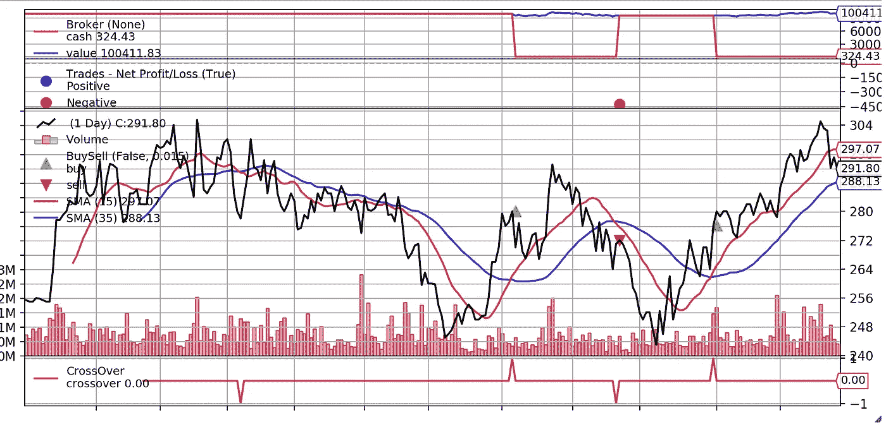
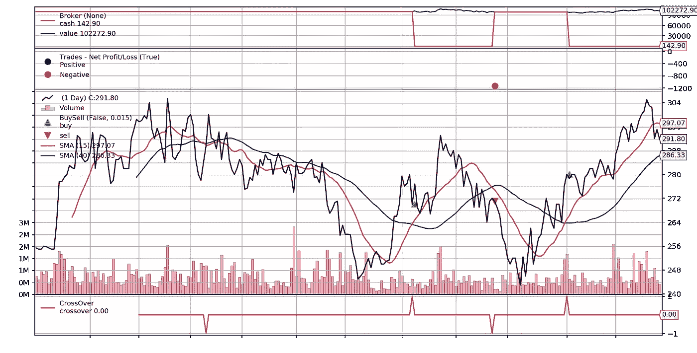
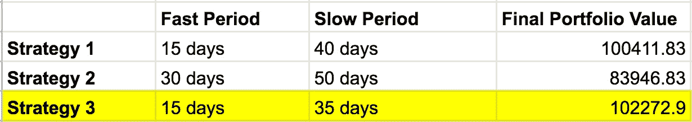

# 仅用 3 行 Python 代码回溯测试你的交易策略

> 原文：<https://towardsdatascience.com/backtest-your-trading-strategy-with-only-3-lines-of-python-3859b4a4ab44?source=collection_archive---------2----------------------->

## 介绍 *fastquant* ，一个面向数据驱动型投资者的简单回溯测试框架


由[卢克·切瑟](https://unsplash.com/@lukechesser?utm_source=unsplash&utm_medium=referral&utm_content=creditCopyText)在 [Unsplash](https://unsplash.com/s/photos/finance-chart?utm_source=unsplash&utm_medium=referral&utm_content=creditCopyText) 上拍摄的照片

自从我在大学开始投资以来，我接触到了不同的股票分析方法——*技术分析*和*基本面分析*。我甚至读过关于这些技术的书籍和无数文章。

简而言之，*技术分析*认为，你可以利用基于股票历史价格和成交量变动的*技术指标*来确定买卖股票的正确时机。另一方面，基本面分析认为，你可以根据公司财务报表中的基本面信息来衡量股票的实际内在价值。

这两种分析对我都有意义，我渴望用它们来指导我的交易；然而，我总是对一件主要的事情感到沮丧:

> 有许多可能的策略，但没有系统的方法来选择一个。在实践中，大多数交易仍然以“直觉”决定告终，而不是由数据驱动。

那么我们如何评估这些策略呢？我们可以通过比较每种方法的预期投资回报(ROI)来做到这一点。最好的方法是使用一种叫做*回溯测试的方法，这种方法是通过模拟你过去使用策略时的表现来评估策略。*

现在，已经有相当多的回溯测试框架，但是大多数都需要高级的编码知识。一个简单的 hello world 实现通常需要大约 30 行[代码](https://www.backtrader.com/home/helloalgotrading/)。

为了填补这一空白，我决定创建 [*fastquant*](https://github.com/enzoampil/fastquant) ，目标是通过尽可能简化回溯测试，使其成为主流。**用**[***fast quant***](https://github.com/enzoampil/fastquant)**，我们可以用少至 3 行的代码回测交易策略！**

fastquant 本质上是流行的 [backtrader](https://www.backtrader.com/home/helloalgotrading/) 框架的包装器，它允许我们大大简化回溯测试的过程，从 backtrader 上至少需要 30 行代码，到 fastquant 上只有 3 行代码。

在本文的其余部分，我将带您了解如何通过 Jollibee Food Corp .的历史数据对简单的移动平均交叉(SMAC)策略进行回溯测试。

此外，如果你有兴趣在无需编码的情况下进行这种类型的分析，一定要尝试一下[鹰眼](https://hawksight.co/)，这是我最近开发的一个新工具，它让高级投资分析变得更容易使用——即使对于非编码人员来说也是如此！

我们开始吧！

# 回溯测试我们的第一个策略

## 安装 fastquant

就像使用 pip install 一样简单！

```
# Run this on your terminal
pip install fastquant

# Alternatively, you can run this from jupyter this way
!pip install fastquant
```

## 获取股票数据

从 fastquant 导入 get_stock_data 函数，用它拉取 Jollibee Food corp .(JFC)2018 年 1 月 1 日到 2019 年 1 月 1 日的股票数据。注意，我们有对应于日期(dt)和收盘价(close)的列。

```
from fastquant import get_stock_data
jfc = get_stock_data("JFC", "2018-01-01", "2019-01-01")
print(jfc.head())

#           dt  close
#   2019-01-01  293.0
#   2019-01-02  292.0
#   2019-01-03  309.0
#   2019-01-06  323.0
#   2019-01-07  321.0
```

## 回溯测试你的交易策略

使用 fastquant 的回溯测试功能，通过 Jollibee Food Corp. (JFC)的历史股票数据对简单的移动平均交叉(SMAC)策略进行回溯测试。

在 SMAC 策略中，快速周期(fast_period)是指用于快速移动平均线的周期，而慢速周期(slow_period)是指用于慢速移动平均线的周期。当快速移动平均线从下方穿过慢速移动平均线到上方时，这被认为是“买入”信号，而如果它从上方穿过到下方，这被认为是“卖出”信号。关于如何工作的更多信息，请查看我以前的[文章](/access-philippine-stock-data-with-only-2-lines-of-python-309780382b8d)中的解释。

首先，让我们将 fast_period 和 slow_period 分别初始化为 15 和 40。

您应该会在日志底部看到最终的投资组合价值。这个价值可以被解释为你的投资组合在回溯测试期结束时(在这种情况下是 2019 年 1 月 1 日)的价值。如果你得到了“最终投资组合价值”和“初始投资组合价值”之间的差额，这将是你基于回溯测试的同期预期收益(在本例中为 PHP 411.83)。

```
from fastquant import backtest
backtest('smac', jfc, fast_period=15, slow_period=40)# Starting Portfolio Value: 100000.00
# Final Portfolio Value: 100411.83
```

## 将所有这些放在一起——用 3 行 Python 代码进行回溯测试

下面的代码展示了我们如何只用 3 行 python 代码就能执行上述所有步骤:

```
**from** **fastquant** **import** backtest, get_stock_data
jfc = get_stock_data("JFC", "2018-01-01", "2019-01-01")
backtest('smac', jfc, fast_period=15, slow_period=40)# Starting Portfolio Value: 100000.00
# Final Portfolio Value: 100411.83
```



简单移动平均线交叉(15 日均线对 40 日均线)

# 改进我们的 SMAC 战略

## 增加快周期和慢周期

这显示了微小的变化是如何迅速将一个成功的策略变成一个失败的策略的。在将 fast_period 和 slow_period 分别增加到 30 和 50 之后，我们的最终投资组合价值从 100，412 菲律宾比索下降到 83，947 菲律宾比索(下降了 16，465 菲律宾比索)。

```
backtest('smac', jfc, fast_period=30, slow_period=50)# Starting Portfolio Value: 100000.00
# Final Portfolio Value: 83946.83
```

## 缩短慢周期，同时保持快周期不变

在这种情况下，我们的策略的性能实际上提高了！我们的最终投资组合价值从 100，412 菲律宾比索上升到 102，273 菲律宾比索(增加了 1，861 菲律宾比索)，在此之前，将慢速期减少到 35，快速期保持在 15。

```
backtest('smac', jfc, fast_period=15, slow_period=35)# Starting Portfolio Value: 100000.00
# Final Portfolio Value: 102272.90
```



简单移动平均线交叉(15 日均线对 35 日均线)

下表比较了我们 3 种 SMAC 战略的绩效:



基于我们的回溯测试，策略 3(用黄色突出显示)是最准确的 SMAC 策略！

# 克服回溯测试的局限性

现在，这是不是意味着我们应该继续用最好的 SMAC 策略交易 JFC？也许还不是时候。

回溯测试有相当多的限制，克服这些限制通常需要额外的步骤来增加我们对回溯测试结果和建议可靠性的信心。

下面是回溯测试的两个局限性，以及克服这些局限性的安全措施:

**过拟合**

这是指这样一种情况，即您得出的“最佳参数”与前一个时间段的模式过于吻合。这意味着当你决定使用你的策略时，你的策略的预期盈利能力不会转化为实际盈利能力。

对此的一个保障是在样本外测试你的策略，这类似于在机器学习中使用“测试集”。这个想法是，你拿出一些数据，当你想评估你的交易策略的盈利能力时，你只使用一次。这样，你就很难过度调整你的参数，因为你没有根据数据集来优化你的策略。

**前瞻偏差**

这是由于在回溯测试中利用了在测试期间不可用的信息而产生的偏差。例如，您可以在 JFC 上测试一个策略的有效性，该策略假设您在它实际公开之前一个月就已经知道它的财务表现(例如净收入)。这会让你对自己的策略产生不可靠的信心，这可能会让你以后损失很多钱。

在这种情况下，避免这种偏见的最好方法之一就是彻底验证你在回溯测试策略时所做的假设。严格评估你的策略和正确执行策略所需的信息是值得的。

这些只是回溯测试带来的众多限制中的两个。我确实计划在将来写一篇文章来更详细地讨论这些，所以请继续关注！

在解决了上述限制之后，我们应该对我们选择的策略更有信心；然而，请记住，虽然我们可以对我们的策略更有信心，但它在未知的真实世界中的表现永远不会是 100%确定的。

我建议，一旦你在现实世界中采用了一个策略，开始时投入相对较少的资金，只有当这个策略显示出更加持续的成功时，才增加投入；否则，如果它在现实世界中被证明效果不佳，就要做好消灭它的准备。

# 记下 fastquant 的默认参数

## “获取股票数据”功能

为了使“get_stock_data”函数尽可能简单易用，我们将它设计为只返回股票的收盘价(用于大多数交易策略)，它遵循格式“c”(c =收盘价)。但是，如果您想要更多的定价数据点(例如，OHLCV 表示“开盘价”、“最高价”、“最低价”、“收盘价”、“成交量”)，只需将“get_stock_data”中的“格式”参数设置为您想要的数据格式。

下面是 Tesla 股票的格式(OHLCV)示例:

```
tsla = get_stock_data("TSLA", "2018-01-01", "2019-01-01", format="ohlcv")
```

*注:对于在* [*雅虎金融*](https://finance.yahoo.com/) *e 上市的国际股票，这种格式特征应该是稳定的。对于来自*[*【PSE*](https://www.pesobility.com/stock)*的符号，我们建议坚持默认的“c”格式。*

## “回溯测试”功能

对于“回溯测试”函数，我们还假设您买入时使用的现金比例(buy_prop)为 1 (100%)，您卖出时持有的股票比例(sell_prop)为 1 (100%)，每笔交易的佣金(commission)为 0.75%。您可以通过设置括号中参数的值来编辑这些默认值。

下面的例子中，我回测特斯拉，假设 buy_prop = 50%，sell_prop = 50%，commission_per_transaction = 1%。

```
backtest("smac", tsla, buy_prop=0.50, sell_prop=0.50, commission=0.01)
```

# 为 fastquant 贡献更多策略

记住 *fastquant* 的策略和它现有的策略库中的策略一样多。到目前为止，有 8 种策略可供选择，包括简单的移动平均交叉(SMAC)，相对强弱指数(RSI)，甚至还有基于情绪分析的策略！

正如我在这篇文章的引言中提到的，有很多不同的策略可以用于交易。有了这个，fastquant 开发团队和我真的可以利用一些帮助来将更多这些策略添加到 *fastquant 中。*如果你有兴趣投稿，请务必查看 [fastquant](https://github.com/enzoampil/fastquant) 包中的 [*策略模块*](https://github.com/enzoampil/fastquant/tree/master/python/fastquant/strategies) 。

如果你不熟悉财务概念或正在使用的低级回溯测试框架，不要担心！我们有一个强大的贡献者社区，一旦你发送了你的第一份 PR，他们就可以帮助你。只要遵循这些关于投稿的[文档](https://github.com/enzoampil/fastquant/blob/master/CONTRIBUTING.md)，你应该会很顺利！

如果你想直接与我们互动，你也可以通过[鹰眼不和](https://discord.gg/BHMCw2C6VP)联系我们。欢迎在#反馈建议和#错误报告频道中询问有关 fastquant 的问题。

在 fastquant 系列的下一篇文章中，我将讨论如何应用网格搜索来自动优化您的交易策略，超过数百个参数组合！

感谢您阅读这篇文章，如果您对[*fast quant**或任何与将数据科学应用于金融相关的问题有任何进一步的疑问，请随时在下面评论或通过电子邮件( *lorenzo.ampil@gmail.com)、**](https://github.com/enzoampil/fastquant) *[twitter](https://twitter.com/AND__SO) 或 [linkedin](https://www.linkedin.com/in/lorenzoampil/) 与我联系！*

# *想完全不用编码就做到这一点？*

*如果你想让这种分析变得更简单，而根本不需要编码(或者想避免做所有必要的设置的痛苦)，你可以尝试一下[hawk sight](https://hawksight.co/)——这是我最近为民主化数据驱动投资而开发的新的无代码工具。*

*我们刚刚推出了开放测试版，所以任何人都可以注册，并免费使用该工具。希望让更多的人能够接触到这些强大的分析！*

****注来自《走向数据科学》的编辑:*** *虽然我们允许独立作者根据我们的* [*规则和指导方针*](/questions-96667b06af5) *发表文章，但我们不认可每个作者的贡献。你不应该在没有寻求专业建议的情况下依赖一个作者的作品。详见我们的* [*读者术语*](/readers-terms-b5d780a700a4) *。**