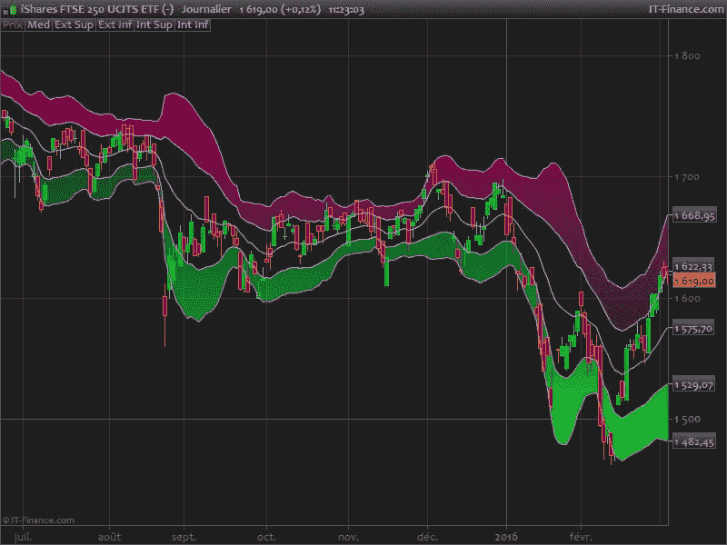
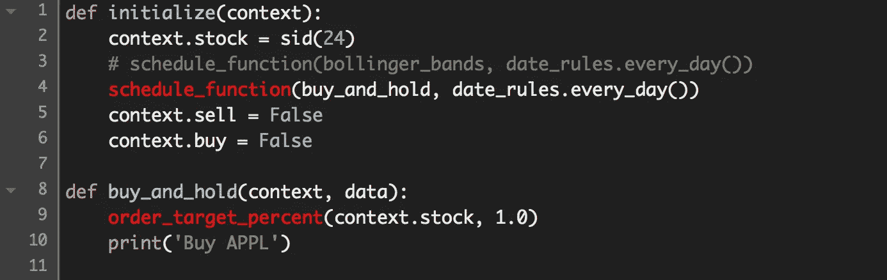
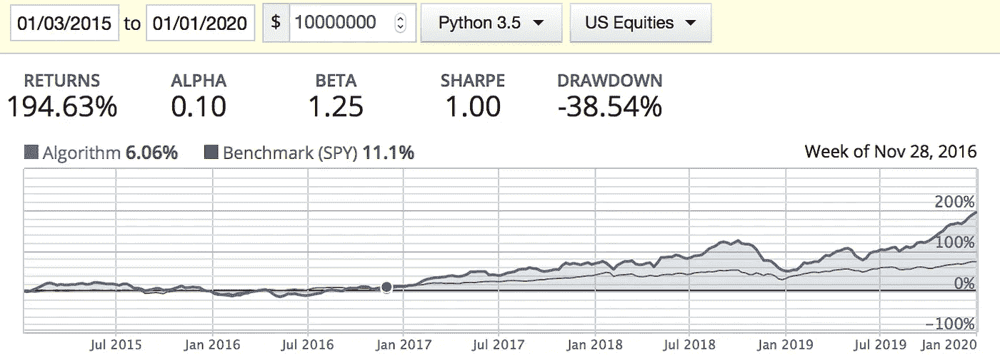
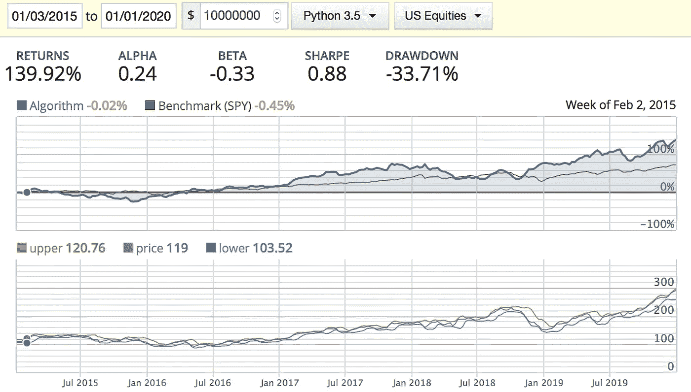
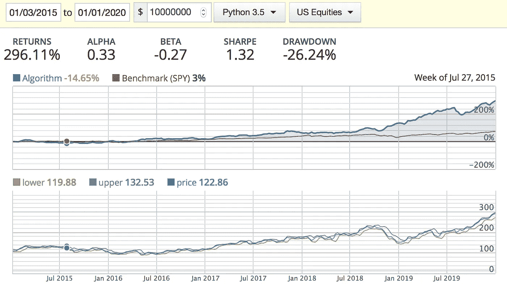

# 使用 Quantopian 对苹果股票的布林线进行回溯测试

> 原文：<https://towardsdatascience.com/backtesting-bollinger-bands-on-apple-stock-using-quantopian-6be2e4824f43?source=collection_archive---------19----------------------->

## 我们将创建一个使用双布林线策略交易 APPL 股票的机器人，并用 5 年的数据进行回溯测试，将其与买入并持有进行比较。


尼古拉·切尔尼琴科在 [Unsplash](https://unsplash.com?utm_source=medium&utm_medium=referral) 上拍摄的照片

学习技术分析的最大挑战之一(如果不是最大的话)是*把你的钱押在一个策略上，而你并不知道这个策略是否有效。互联网上有很多好的和坏的信息，但通过经济损失找出什么有效什么无效是一个难以下咽的药丸。幸运的是，我们不再需要拿我们辛苦赚来的钱去测试我们在网上学到的东西了。我们可以在开始操作前用量子力学进行回溯测试。*

*我想提出一个简单的练习:用一个最著名的指标来交易 2015 年到 2020 年的苹果股票。是双布林线策略。这是我们要做的:*

***1-计算 2 组布林线。***

*一组距离 20 天简单移动平均线(SMA 20)1 个标准差，另一组距离 SMA 20 2 个标准差。*

**

*[https://www . pro real code . com/pro real time-indicators/blai 5-b b-double/](https://www.prorealcode.com/prorealtime-indicators/blai5-bb-double/)*

***2-定义操作区域***

*两个上部带之间的区域将是*‘购买区’*(上图中的红色区域)。两个较低带之间的区域将是*‘销售区’*(绿色区域)。以及中央区域，即*‘中性区域’*。*

***3-实施战略***

*   *如果当前价格在*买入区*，我们在 APPL 上做多。*
*   *如果当前价格处于“中性区”*，我们就按兵不动。**
*   **如果当前价格在“*卖出区*”内，我们做空 APPL。**

**除此之外，我们还将测试该算法的不同参数。但是首先我们需要一个基准。让我们看看购买 APPL 并持有 5 年的表现。**

****

**在 APPL (sid=24)上，每天重新平衡投资组合，使其为 100%多头**

****

**APPL 买入并持有业绩**

**不算太坏，5 年内 194.63%的回报率或每年大约 15%。然而，贝塔系数和下降幅度非常高。同样，希望增加α和夏普比率。让我们编写一个机器人来执行双布林线策略，并在相同的时间内对其进行回测:**

```
**# Original Double BB strategyimport numpy as npdef initialize(context):
    context.stock = sid(24)
    schedule_function(buy_and_hold, date_rules.every_day())
    context.sell = False
    context.buy = Falsedef bollinger_bands(context, data):
    period = 20
    current_price = data.current(context.stock, 'price')
    prices = data.history(context.stock, 'price', period, '1d')
    avg_20 = prices.mean()
    std = prices.std()

    upper_band1 = avg_20 + std
    upper_band2 = avg_20 + 2*std
    lower_band1 = avg_20 - std
    lower_band2 = avg_20 - 2*std

    stop_loss = 0.0

    if ((current_price > upper_band1) and (current_price < upper_band2)) and not context.buy:
        order_target_percent(context.stock, 1.0)
        context.buy = True
        context.sell = False
        print('Long position')

    elif ((current_price < lower_band1) and (current_price > lower_band2)) and not context.sell:
        order_target_percent(context.stock, -1.0)
        context.buy = False
        context.sell = True
        print('Short position')

    elif (current_price < (1 - stop_loss) * lower_band1) and context.buy:
        order_target_percent(context.stock, 0)
        context.buy = False
        context.sell = False
        print('Stop loss on long')

    elif (current_price > (1 + stop_loss) * upper_band1) and context.sell:
        order_target_percent(context.stock, 0)
        context.buy = False
        context.sell = False
        print('Stop loss short')

    record(upper = upper_band2, lower = lower_band2, price = current_price)**
```

**在这个代码中，使用了 SMA20 和 0%的止损。除此之外，一旦当前价格脱离买入或卖出区域，算法就会平仓。让我们看看这段代码将如何执行:**

****

**原创双 BB 性能**

**回报率大幅下降，但所有其他基本面都有所改善。让我们看看是否可以通过稍微调整我们的算法来做得更好。我提议 3 个改变:**

**1-不要用 SMA20，我们试试 SMA13。*互联网*会告诉你在 8 到 12 之间选择一个 SMA，但我认为最好对它进行回溯测试，选择一个最适合你想要使用的安全性的。我测试了几个，13 是最好的。**

**2-允许当前价格有更多的空间来“T2”呼吸“T3”。让价格在简单移动平均线(上下带)的 2 个标准差内反弹。**

**3-设置 2%的止损。**

```
**# Modified Double BB strategyimport numpy as npdef initialize(context):
    context.stock = sid(24)
    schedule_function(bollinger_bands, date_rules.every_day())
    context.sell = False
    context.buy = False

def buy_and_hold(context, data):
    order_target_percent(context.stock, 1.0)
    print('Buy APPL')def bollinger_bands(context, data):
    period = 13
    current_price = data.current(context.stock, 'price')
    prices = data.history(context.stock, 'price', period, '1d')
    avg_20 = prices.mean()
    std = prices.std()

    upper_band1 = avg_20 + std
    upper_band2 = avg_20 + 2*std
    lower_band1 = avg_20 - std
    lower_band2 = avg_20 - 2*std

    stop_loss = 0.02

    if ((current_price > upper_band1) and (current_price < upper_band2)) and not context.buy:
        order_target_percent(context.stock, 1.0)
        context.buy = True
        context.sell = False
        print('Long position')

    elif ((current_price < lower_band1) and (current_price > lower_band2)) and not context.sell:
        order_target_percent(context.stock, -1.0)
        context.buy = False
        context.sell = True
        print('Short position')

    elif (current_price < (1 - stop_loss) * lower_band2) and context.buy:
        order_target_percent(context.stock, 0)
        context.buy = False
        context.sell = False
        print('Stop loss on long')

    elif (current_price > (1 + stop_loss) * upper_band2) and context.sell:
        order_target_percent(context.stock, 0)
        context.buy = False
        context.sell = False
        print('Stop loss short')

    record(upper = upper_band2, lower = lower_band2, price = current_price)**
```

**让我们回测一下这段代码:**

****

**改进的双 BB 性能**

**很好！我们能够提高回报率、阿尔法和夏普比率，同时降低贝塔和下降。**

# **结论**

**在本文中，我们研究了苹果股票的双 BB 策略与买入并持有策略的绩效。**

**与买入并持有相比，自动双 BB 的回报率增加了 100%以上，同时降低了市场风险β和提款。此外，机器人增加了阿尔法和夏普比率。**

**我很想在评论区听到你关于如何改进这个算法的想法。**

**谢谢！**

*****来自《走向数据科学》编辑的提示:*** *虽然我们允许独立作者根据我们的* [*规则和指导方针*](/questions-96667b06af5) *发表文章，但我们并不认可每个作者的贡献。你不应该在没有寻求专业建议的情况下依赖一个作者的作品。详见我们的* [*读者术语*](/readers-terms-b5d780a700a4) *。***