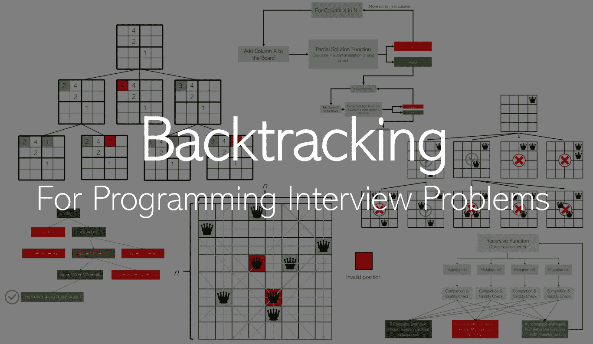
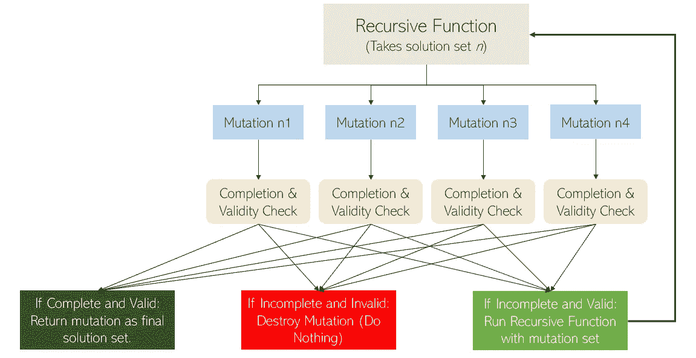
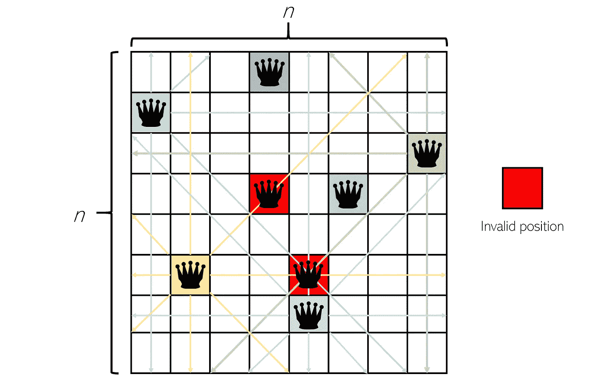
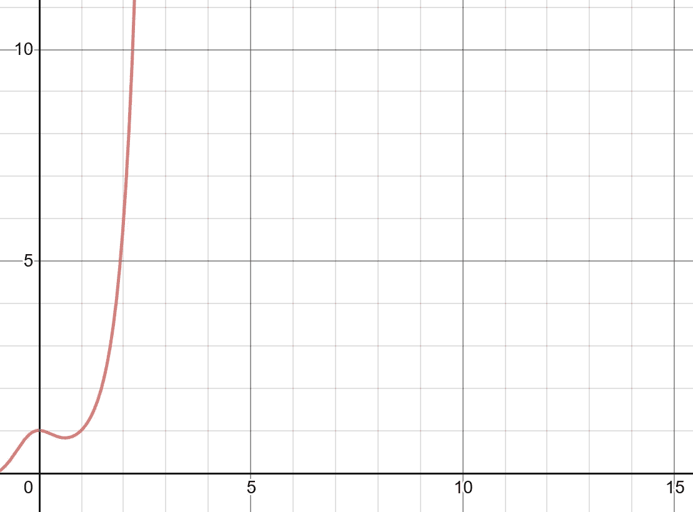
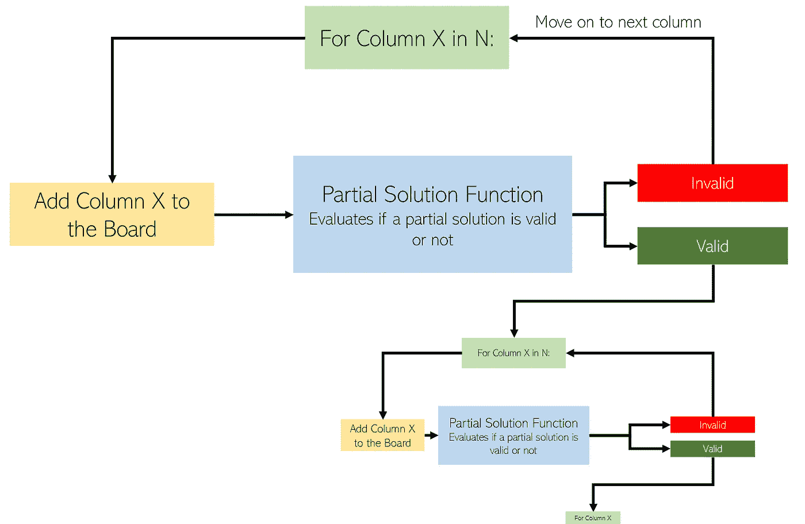
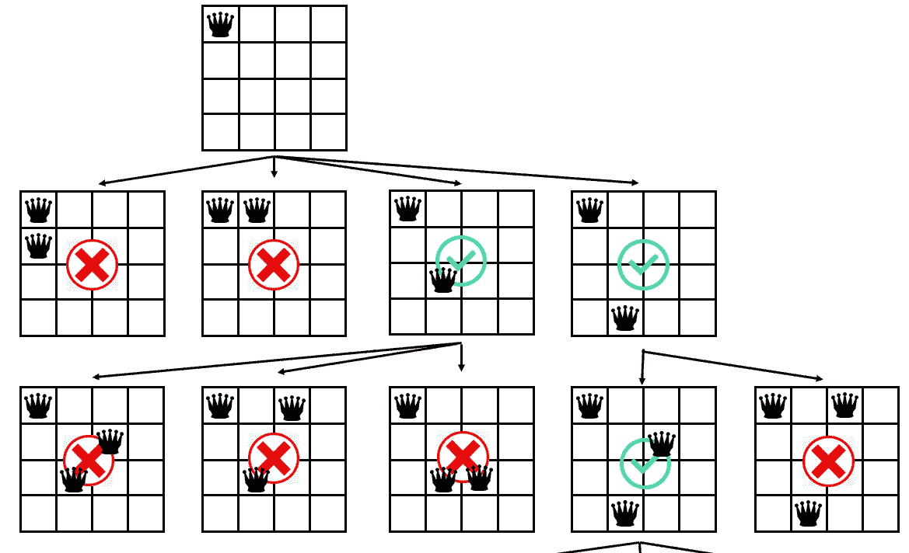
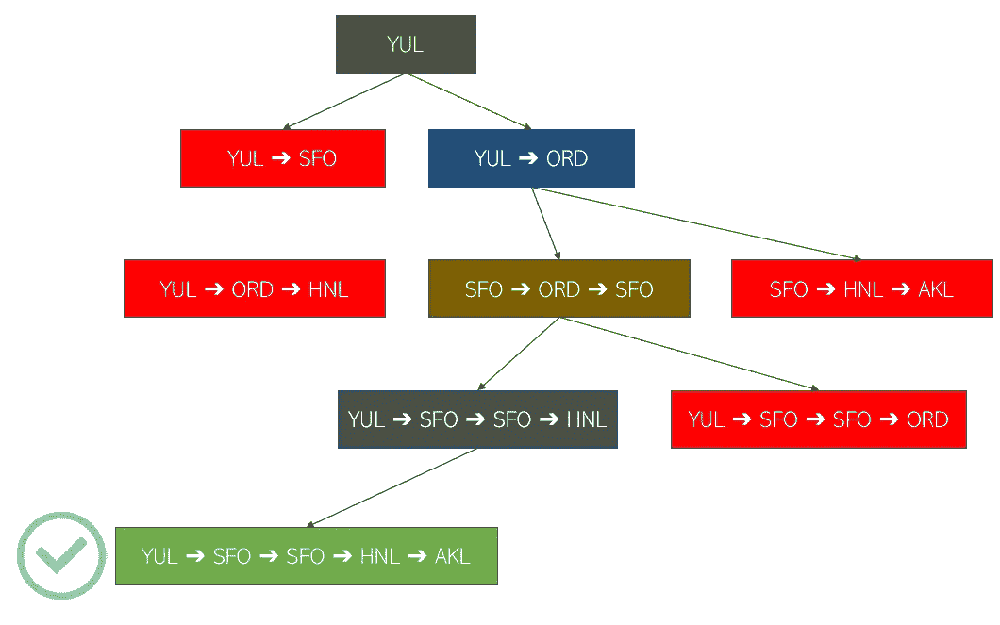
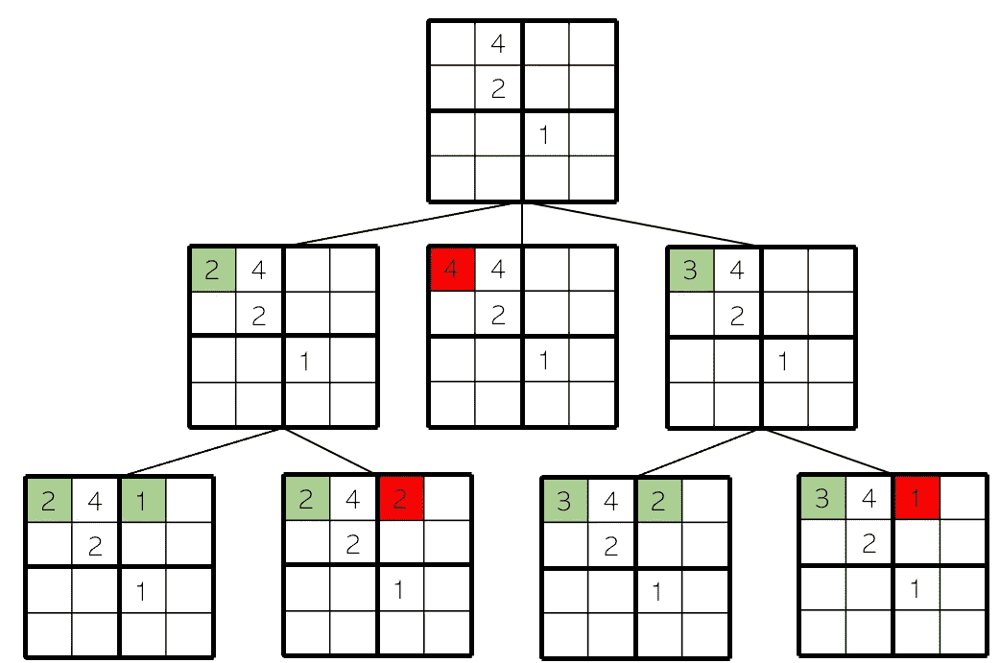

# 回溯:如何处理搜索编程面试问题

> 原文：<https://towardsdatascience.com/backtracking-how-to-approach-search-programming-interview-questions-647a742197?source=collection_archive---------29----------------------->

## 用三个例子直观地解释:N 皇后、飞行路线和数独



图片来源:作者

回溯是解决常见编程面试算法问题的有效方法。回溯深度——搜索解决方案，然后一到达终点就回溯到最近的有效路径(也就是说，我们不能再前进了)。这种方法减少了搜索空间，因为我们知道的无效路径都从解空间中排除了。

然而，使用回溯需要测试部分解决方案的能力——如果没有进度指标表明我们当前的解决方案路径是否通向一个解决方案，该方法就不能找到全局最优。然而，像数独这样的事情可以用回溯来解决——比方说，如果在一行、一列或一个正方形中有两个相同的数字，那么当前的解决路径是否无效就一目了然了。

回溯由三部分组成:一个递归函数，它接受一个解集(可能是不完整的 *n* )，一个对 *n* 的变异或添加，它添加到集合 *n* ，以及一个完成和有效性检查，它检查一个解集变异的完成(解是完整的吗？)和有效性(是否符合有效性的要求？对于当前填写的值，这是一个可接受的解决方案吗？).



图片来源:作者

回溯基于非常简单的元素自动创建一个干净且计算高效的搜索树。

在本文中，我将通过视觉演示回溯如何被用来解决三个经典的编程面试式搜索问题。

# n 皇后问题

*N*-皇后问题是一个经典的回溯问题:给定一个 *N* 乘 *N* 大小的棋盘，你可以用多少种方式排列 *N* 个皇后棋子，使它们不会互相威胁(一个不在一个皇后的列、行或对角线上)？

举例来说，这个格子是一个无效的移动，因为八个皇后中至少有两个在另一个的行、列或对角线上，用红色方块标记。



这个问题的强力解决方案是尝试在每个 *N* 乘 *N* 地点中的 *N* 个皇后的每一个组合— *N* 选择 *N* 种可能性。

画出来，其中 *x* 代表 *N* 和 *y* 代表搜索的可能性的数量，它扶摇直上。



图片来源:作者

仅仅对于一个标准的 8 乘 8 网格，就有 4，426，165，368 种组合，慢得令人痛苦。这可以通过不将两个皇后放在同一行或列中得到部分改善，但我们仍然需要迭代每一行和每一行中的每个单元格——运行时间为 *O* ( *N* )，不够快。

现在，让我们通过一个问题清单来确定回溯是否有帮助。

## 可以构造部分解吗？

是的，可以构建部分解决方案。通过在棋盘上放置一定数量的皇后，我们可以部分地构建一个解。

## 那些部分解决方案可以被验证为有效或无效吗？

是的，我们可以通过检查任意两个皇后是否相互威胁来验证部分解决方案是否有效。这可以通过承认原来的女王不互相威胁来加速，并且只检查新增加的女王是否威胁任何其他女王。

## 可以验证解决方案是否完整吗？

是的，当所有的 *N* 皇后都被放到棋盘上时，解决方案就完成了。回溯的伟大之处在于，当解决方案完成时，它也是正确的，因为所有不正确的解决方案路径都已被事先排除。

让我们构造一个回溯方法来更快地解决 N 皇后问题。

功能`n_queens`:

1.  摄入`N`和`board`，一串数字。
2.  如果没有指定，将`board`初始化为空列表，并将`count`初始化为 0。
3.  对于`*N*`中的每列`*X*`，
4.  >>将列`*X*` *'* 的索引添加到`board`。
5.  >>如果`board`有效，将`n_queens`的输出与输入`N`和`board`相加到`count`(这将初始化函数的另一个循环，是回溯的隧道或树构建过程。由于在这种情况下部分解决方案被认为是有效的，它启动了函数`n_queens`的另一个实例。
6.  >>否则，删除列`*X*` *。*
7.  返回`count`。



伸缩式树型建筑

评估电路板是否有效的函数如下:

1.  入口`board`，一个数字列表，其中每个数字对应一列。
2.  最近添加的皇后行是棋盘的当前长度减一(因为索引从 0 开始)，当前皇后列是棋盘的最后一个元素。
3.  对于棋盘中的每一行`R`和每一列`C`(仅由放置的皇后组成)，
4.  >>找出新添加的皇后列和当前列的区别`C`。如果等于 0(两列相同)，返回`False`并从函数中中断。
5.  >>找出新添加的女王排和当前排`R`的区别。如果等于 0(两行相同)，返回`False`并从函数中中断。
6.  否则，返回`True`。



通过在一个构建函数中递归迭代一个构建函数的新实例，回溯能够构建一个智能树，在情况无望时不再继续:它是基于过程而不是基于结果的。

结果，其中索引指示 *N* 的值:

```
1, 1, 0, 0, 2, 10, 4, 40, 92, 352
```

# 航班路线问题

给定某人的航班的无序列表，每一个都用(起点、目的地)对和起始机场表示，计算此人的行程。如果不存在，返回 na-必须在旅程中使用所有航班。

让我们以这些航班为例:

*   HNL ➔ AKL
*   尤尔·➔订单
*   SFO ➔ HNL
*   订单➔ SFO

这个问题的强力解决方案是尝试航班的每一种排列，并验证它是否是一个有效的旅程，使它成为 *O* ( *n* ！)时间。

让我们再问一下使用回溯的三个问题清单。

## 可以构造部分解吗？

是的，部分解决方案可以通过列出一个不完整的行程来构建，比如 SFO ➔ HNL ➔奥德➔？。

## 那些部分解决方案可以被验证为有效或无效吗？

如果没有从旅程中的最后目的地出发的航班，并且仍然有剩余的航班可以乘坐，则该解决方案可以被验证为无效。因为必须使用所有航班，所以我们到达了终点。

## 可以验证解决方案是否完整吗？

是的，当旅程使用所有航班时，解决方案就完成了。

构建解决方案的逻辑:

一个功能`get_itinerary`:

1.  获取一个无序列表`flights`，其元素形式为`(origin, destination)`和`current_itinerary`，即一个旅程列表(其中第一个元素是起始机场，第二个元素是第一个航班的目的地和第二个航班的出发地，依此类推)。
2.  如果`flights`已经用完，返回`current_itinerary`。
3.  `last_stop`将等于`current_itinerary`的最后一个元素。
4.  对于航班中的每个`(origin, destination)`对，
5.  >>将`destination`添加到`current_itinerary`中。
6.  >>如果`origin`等于`last_stop`(这是检查，确保航班是有效的连接)，
7.  >> >>用除当前`(origin, destination)`对之外的所有航班返回另一个`get_itinerary`运行，并退出该功能。
8.  >>否则，删除最近的`destination`。
9.  如果先前的树搜索都不能返回任何解决方案，则返回`None`。



回溯构建的树的简化版本

您可能会观察到，实现回溯的很大一部分与多次使用一个函数和构建一个自动化的递归搜索树有关。

注意，对于这个特殊的问题，有一个更有效的方法来解决它。我们只是用回溯作为例子。实际上，更快的方法是选择出发机场(例如 SFO)，在航班中找到中转机场(SFO 到 HNL)，然后将目的地添加到旅程中，循环进行。

# 九宫格游戏

我们能用回溯法解决一个标准的数独难题吗？

## 可以构造部分解吗？

是的，我们可以部分填充数独板上的位置。

## 那些部分解决方案可以被验证为有效或无效吗？

是的，如果部分解决方案中有任何数字在行、列或正方形中具有相同的数字，则该解决方案无效。否则有效。

## 可以验证解决方案是否完整吗？

是的，当整个数独板被填满时，解决方案就完成了。

让我们尝试一个接一个地填充每个空单元格，一旦遇到无效状态就返回。看起来会像这样:

功能`sudoku`:

1.  获取变量`board`，这是一个数组，每个值代表数独棋盘上的一个单元格。
2.  如果`board`完成，返回`board`并退出该功能。
3.  设`r`和`c`代表板上第一个空值的行和列。
4.  对于`[1, 2, 3, 4, 5, 6, 7, 8, 9]`中的每个值`i`，
5.  >>将第`r`行第`c`列单元格设置为`i`。
6.  >>如果`board`至今有效，
7.  >> >>给定`board`，运行`sudoku`的另一个实例。



数独的 4x4 版本如何与回溯一起工作

使用回溯法来解决像困难的数独棋盘这样复杂的事情，简单而又干净，这是非常美妙的。只要勾勒出一个递归函数、一个部分解检查和一个评估解是否完整的函数，程序就会自动为你构建一棵树，找到最佳解(如果有的话)。

# 结论

我希望这篇文章能够让你理解，概述回溯的三个简单组成部分如何能够概述程序的规则，以便自己进行排序并找到最佳解决方案。