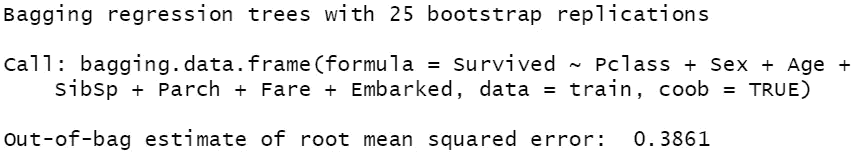
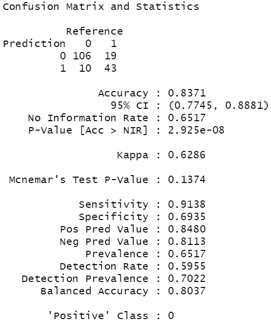

# 袋装树:每个数据科学家都需要的机器学习算法

> 原文：<https://towardsdatascience.com/bagged-trees-a-machine-learning-algorithm-every-data-scientist-needs-d8417ec2e0d9?source=collection_archive---------35----------------------->


图片由 [lumix2004](https://pixabay.com/users/lumix2004-3890388/?utm_source=link-attribution&utm_medium=referral&utm_campaign=image&utm_content=1873078) 来自 [Pixabay](https://pixabay.com/?utm_source=link-attribution&utm_medium=referral&utm_campaign=image&utm_content=1873078)

# 袋装树简介

在还没有深入细节的情况下，对决策树有一些基本的了解是很重要的。

从每个算法的评估方法到算法本身，都有很多相似之处。

如果你还不熟悉决策树，我推荐你快速复习一下[这里](/decision-tree-essentials-for-every-data-scientist-9d2cbb1f3ae9)。

也就是说，准备好成为袋装树专家吧！袋装树以提高单个决策树的预测能力而闻名，是一种非常有用的机器学习工具带算法。

# 什么是袋装树&是什么让它们如此有效？

## 为什么使用袋装树

袋装树之间的主要思想是，你不是依赖于单个决策树，而是依赖许多许多决策树，这允许你利用许多模型的洞察力。

## 偏差-方差权衡

当考虑模型的性能时，我们通常会考虑我们输出的偏差-方差权衡。方差与我们的模型处理小错误的方式有关，也与我们的模型偏离的程度有关，偏差会导致拟合不足。该模型实际上对变量之间的关系做出了不正确的假设。

你可以说，变异的问题是，虽然你的模型可能是方向正确的，但它不是非常准确，而如果你的模型非常有偏差，那么变异可能很小；它可能完全方向不正确。

一般来说，决策树的最大问题是它们有很高的方差。这带来的问题是，数据的任何微小变化都可能导致模型和未来预测的重大变化。

这在这里起作用的原因是袋装树的好处之一，它有助于在保持偏差一致的同时最小化变化。

# 为什么不用袋装树

袋装树的一个主要问题是它们难以解释。在决策树的课程中，我们了解到决策树的一个主要优点是它们非常容易解释。袋装树在这方面证明是相反的，因为它的过程增加了复杂性。我稍后会对此进行更深入的解释。

# 什么是装袋？

Bagging 代表引导聚集；这就是所谓的集成方法——这是一种有效地将不同的模型、数据、算法等分层的方法。

所以现在你可能会想…好吧，酷，那么什么是引导聚合…

所发生的是，模型将对数据的子集进行采样，并将训练决策树；到目前为止，与决策树没有什么不同…但接下来发生的是获取额外的样本(替换，这意味着相同的数据可以被多次包含)，训练新的模型，然后对预测进行平均。一棵袋装树可以包括 5 棵树、50 棵树、100 棵树等等。集合中的每棵树可能有不同的特征、终端节点数、数据等。

可以想象，一棵袋装的树是很难解读的。

# 培养一棵袋装树

首先，我们将开始训练和测试。这里就不多说火车测试拆分了。我们将用`titanic`包中的泰坦尼克号数据集来做这件事

```
n <- nrow(titanic_train)n_train <- round(0.8 * n)set.seed(123) 
train_indices <- sample(1:n, n_train) 
train <- titanic_train[train_indices, ] 
test <- titanic_train[-train_indices, ]
```

现在我们已经有了训练和测试集，让我们加载`ipred`包。这将允许我们运行装袋功能。

需要记住的几件事是，公式表明我们想通过(`~` ) `Pclass + Sex + Age + SibSp + Parch + Fare + Embarked`来理解`Survived`

从这里您可以看到，我们正在使用训练数据集来训练这个模型。&最后可以看到这个参数`coob`。这是为了确认我们是否想测试袋外样品的性能。

还记得我说过每棵树都重新采样数据吗？这个过程会留下一些记录，这些记录永远不会用于训练&组成一个优秀的数据集来测试模型的性能。这个过程发生在`bagging`函数中，当我们打印模型时你会看到。

```
library(ipred) 
set.seed(123) 
model <- bagging(formula = Survived ~ Pclass + Sex + Age + SibSp + Parch + Fare + Embarked, data = train, coob = TRUE) 
print(model)
```



如你所见，我们在袋装树模型中训练了默认的 25 棵树。

我们使用与决策树相同的过程来预测我们的测试集。

```
pred <- predict(object = model, newdata = test, type = "class") print(pred)
```

# 性能赋值

现在，我们已经训练了我们的模型，预测了我们的测试集，现在是时候分解不同的性能评估方法了。

# ROC 曲线和 AUC

ROC 曲线或受试者工作特征曲线是一种可视化二元分类模型正确诊断或预测能力的方法。ROC 曲线绘出了不同阈值下的真阳性率与假阳性率的关系。

我们对于 ROC 曲线的目标是真阳性率 100%，假阳性率 0%。那条曲线会落在图的左上角。

AUC 旨在确定可分性的程度，或正确预测类别的能力。AUC 越高越好。1 是完美的，0.5 是随机的。

我们将使用`metrics`包来计算数据集的 AUC。

```
library(Metrics) 
pred <- predict(object = model, newdata = test, type = "prob") auc(actual = test$Survived, predicted = pred[,"yes"])
```

在这里，您可以看到我将`type`更改为`"prob"`以返回百分比可能性，而不是分类。这是计算 AUC 所需要的。

这返回了 0.89 的 AUC，一点也不差。

## 截止阈值

在分类中，临界值的概念意味着给定一个给定结果的一定百分比的可能性，你会相应地对它进行分类。哇，这是一个满嘴。换句话说，如果你预测 99%的存活率，那么你可能会把它归类为存活率。好吧，假设你看着另一个乘客，你预测他有 60%的可能性活下来。嗯，他们仍然更有可能幸存，所以你可能会把他们归类为幸存。选择`type = "pred"`时，您可以灵活指定自己的截止阈值。

# 准确(性)

这个指标很简单，你的预测有多少是正确的。`caret`的混淆矩阵函数就包含了这个。

# 混淆矩阵

`caret`包中的`confusionMatrix`功能非常有用。用于评估分类模型性能。加载这个包，把你的预测和实际数据传给它。

```
library(caret) 
confusionMatrix(data = test$pred, reference = test$Survived)
```



这个函数向你展示的第一件事就是所谓的混淆矩阵。这将向您显示一个预测值和实际值如何匹配的表格。所以预测值和参考值相同的对角线单元格代表我们得到的正确值。将这些记录加起来 149 (106 + 43)并除以记录总数，178；我们达到了 83.4%的准确率。

True positive:象限中引用和预测都为 1 的单元格。这表明你预测了存活，而他们确实存活了下来。

假阳性:这里你预测为阳性，但你错了。

真阴性:当你预测为阴性，并且你是正确的。

假阴性:当你预测为阴性，而你是不正确的。

需要记住的几个关键指标是灵敏度和特异性。敏感度是您正确预测的真实记录的百分比。

另一方面，特异性是衡量实际错误记录中你正确预测的部分。

在不平衡数据集上进行预测时，要记住特异性。一个非常常见的例子就是对垃圾邮件进行分类。99%的情况下它不是垃圾邮件，所以如果你预测没有垃圾邮件，你有 99%的准确率，但你的特异性是 0，导致所有的垃圾邮件都被接受。

# 结论

总之，我们已经了解了使用袋装树的正确时间，以及使用它们的错误时间。

我们定义了什么是装袋以及它如何改变模型。

我们建立并测试了自己的模型，同时定义和评估了各种性能指标。

我希望你喜欢这个关于袋装树的快速课程。让我知道你是否想要更多的信息，或者你是否想要我在另一篇文章中报道一些事情。

祝数据科学快乐！