# 基于低方差模型的 Bagging

> 原文：<https://towardsdatascience.com/bagging-on-low-variance-models-38d3c70259db?source=collection_archive---------33----------------------->

## [入门](https://towardsdatascience.com/tagged/getting-started)

## *简单线性回归装袋的奇特案例*

Bagging(也称为 bootstrap aggregation)是一种技术，在这种技术中，我们根据均匀的概率分布重复地采取多个样本进行替换，并在其上拟合一个模型。它将多个预测组合在一起，通过多数投票或汇总预测来给出更好的预测。这种技术对于倾向于过度拟合数据集的模型(高方差模型)是有效的。Bagging 减少了方差而不会使预测有偏差。这项技术是许多合奏技术的基础，所以理解它背后的直觉是至关重要的。

如果这种技术这么好，为什么我们只在显示高方差的模型上使用它？当我们将它用于低方差模型时会发生什么？让我们借助演示来理解潜在的问题。

我们将在决策树上使用 bagging 来证明 bagging 提高了高方差模型的准确性，并将其与基于简单线性回归的 bagging 进行比较，后者因数据集而有偏差。当预测值与目标变量不完全相关时，简单线性回归是有偏差的。

# **偏差和方差**

我们将在整篇文章中讨论偏差和方差，所以让我们先了解一下它是什么。

## **偏置**

高偏差是指模型过于简化。即当我们不能捕捉数据的真实关系时。我们创建模型的目的是捕捉数据的真实性质，并根据趋势进行预测，这使得高偏差成为一种不受欢迎的现象。

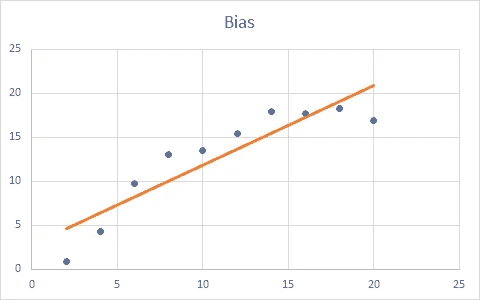

在这种情况下，正在使用的模型并不合适。*作者图片*

## **差异**

高方差指的是模型过于复杂的情况。即，在捕捉模型的真实性质的过程中，我们正在创建一个模型，该模型很好地学习了训练数据，以至于它的准确性在任何其他数据集上都恶化了。这种情况也是不希望的，因为我们的目标是对看不见的数据进行预测。

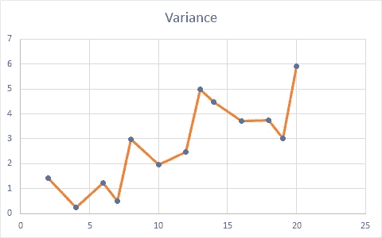

在这种情况下创建的模型不适用于训练数据集中不存在的数据。*作者提供的图片*

## **偏差-方差权衡**

当我们创建一个模型时，我们希望在偏差和方差之间取得平衡。偏差和方差是相反的，所以每当我们试图减少方差时，我们就同时增加了模型的偏差。这种过拟合/欠拟合的困境被称为偏差-方差权衡。这张图片很好地展示了他们之间的关系。

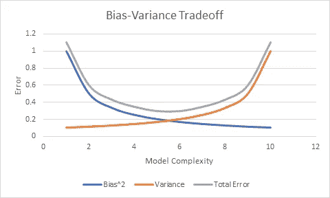

偏差-方差权衡。*作者图片*

# **高方差模型—决策树**

决策树对目标变量进行分类，在默认设置下，它不会停止，除非它对每个类别进行了完美的分类。这使得树过度适应所提供的数据，并且模型在测试数据集上的准确性将会很低。让我们用一个数据集来验证这一点。我们将使用[皮马印第安人糖尿病数据集](https://github.com/akshayamrit/Bagging-on-low-variance-models/blob/master/pima_indians_diabetes.data.csv)。

决策树的准确性:

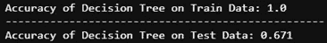

*作者图片*

# **决策树的打包**

正如我们之前讨论的，bagging 应该在不增加偏差的情况下减少我们预测的方差。这一特性的直接影响可以从预测准确性的变化中看出。装袋会让训练精度和测试精度的差异变小。我们可能不会总是观察到训练精度的变化，但是在这种情况下，测试精度总是更好。让我们检查一下装袋对数据集的影响。

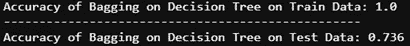

*作者图片*

这个结果证明了我们的观点！装袋提高了高方差模型的性能！

# **低方差模型—简单线性回归**

到目前为止，我们在本文中讨论的一切都是已知和直观的，但是当我们试图在简单线性回归这样的低方差模型上使用 bagging 时会发生什么呢？让我们通过演示每个袋装模型会发生什么来探索这个场景。我们可以直观地宣称，由于 bagging 只影响高方差模型，它应该对有偏模型没有影响。我们将在文章的其余部分验证我们的假设是否正确。

我们将使用[金县房价数据集](https://github.com/akshayamrit/Bagging-on-low-variance-models/blob/master/kc_house_data.csv)。我们只使用一个变量来简化可视化。让我们看看 price 和 sqft_living 之间的散点图，以大致了解它们之间的关系，并在此基础上建立一个简单的线性回归模型。

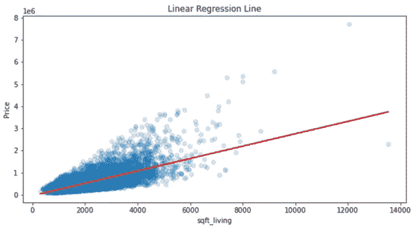

*作者提供的图片*

这种情况下简单线性回归模型的准确性:

*作者图片*

# **简单线性回归装袋**

在讨论“简单线性回归装袋的奇怪案例”之前，让我们快速检查装袋简单线性回归后的准确性是否提高或甚至保持模型性能不变。

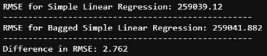

*作者图片*

尽管打包了 200 个简单的线性回归模型，RMSE(均方根误差)还是下降了 2.7 个百分点！简单线性回归的有偏性是其背后的原因。我们观察到 RMSE 的变化非常小，因为我们的模型能够很好地捕捉数据集的趋势。sqft_living 和价格之间的相关性为 0.7，简单线性回归模型捕捉了变量之间的线性关系。如果简单线性回归的相关性较低，RMSE 的差异会更大。让我们在下一节讨论为什么。

# **为什么简单线性回归对装袋效果不好？**

简单线性回归是一种有条件偏差的模型。即当变量之间存在明确的线性关系时，该模型可以被认为是稳定的。在这种情况下，即使我们对其使用 bagging，模型的准确性也不会降低。当变量之间的这种关系改变时，简单线性回归试图创建一条直线来捕捉数据的趋势。在这种情况下，单个袋装模型的偏差会增加。

由于我们的变量之间的相关性是 0.7，它不是完全相关的，但它足够好，在这里使用简单的线性回归是有意义的。这就是为什么当我们在 RMSE 装袋时，它没有大幅度下降的原因。bagging 技术创建多个线性回归模型，并取其预测值的平均值。所有这些点将位于回归线上，该回归线可以通过取每个模型的截距和系数的平均值来产生。让我们将平均回归线的预测与最终的袋装预测进行比较。

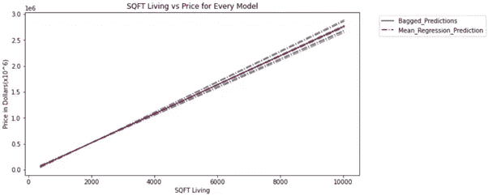

*作者图片*

该图中的每条灰线代表单独的简单线性回归模型。它们的偏差高于直接从原始数据集获得的回归线，因为 bootstrap 样本中存在许多重复点。这使得一些点比其余的点更有影响力。这导致平均回归线偏离了我们在没有装袋的情况下可以获得的回归线。

这意味着我们假设 bagging 对高偏差模型没有影响是不正确的！Bagging 确实会影响具有高偏差的模型，但它反而会降低其准确性。这是不是意味着对有高偏差的模型进行打包，总会得到比我们从原始模型中得到的结果更差的结果？让我们再看几张图来总结一下。

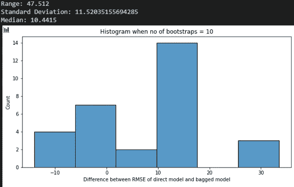

引导样本数= 10。*作者图片*

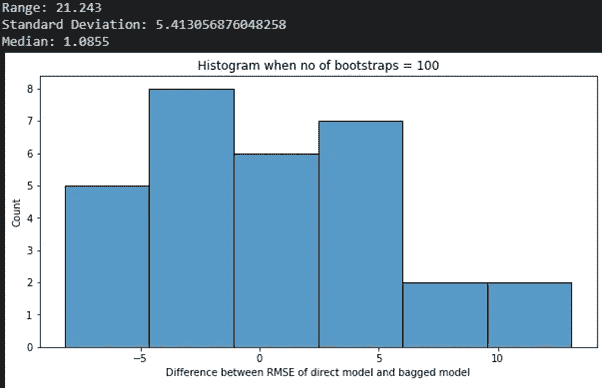

引导样本数= 100。"*作者图片"*

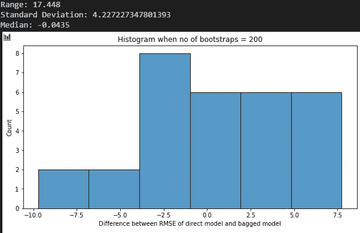

引导样本数= 200。*作者图片*

我们观察到，随着自助样本数量的增加，范围、标准偏差会缩小。RMSE 中值也向简单线性回归线的 RMSE 移动。这表明袋装预测越来越接近简单的线性回归预测，而没有偏离太多。

# **结论**

从这篇文章中可以得出以下几点:

1.  在高方差模型上装袋:在不增加偏差的情况下，模型的方差会减少。这种模型的性能会更好，所以建议装袋。
2.  对高偏差模型进行 Bagging:与没有 bagging 的模型相比，模型的准确性总是会下降。查看上面的直方图，我们可以得出结论，装袋精度随着装袋模型数量的增加而增加，并且随着 n 达到无穷大，装袋模型的精度将等于直接模型的精度。由于在有偏差模型的情况下，模型的准确性不会增加，因此不建议使用 bagging。

本文的重点是展示当我们使用 bagging 中方差较低的模型时会发生什么。目的是让读者直观地了解哪种模型适合装袋。

请注意，文章中给出的一些代码可能无法工作，因为 python 中没有这些函数。我不得不从头开始编写代码来展示每个模型的偏见，所以如果你正在寻找代码，请参考这个链接— [GitHub](https://github.com/akshayamrit/Bagging-on-low-variance-models)

# 参考

[1] Aishwarya Singh，[《集成学习综合指南》(附 Python 代码)](https://www.analyticsvidhya.com/blog/2018/06/comprehensive-guide-for-ensemble-models/)(2018)
【2】Daniel t . la rose-Chantal d . la rose，7.5 偏差-方差权衡，数据挖掘和预测分析
【3】Trevor Hastie 等人，8.7 Bagging，The Elements of Statistical Learning
【4】Bradley Boehmke 等人，10 Bagging，Hands on Machine Learning