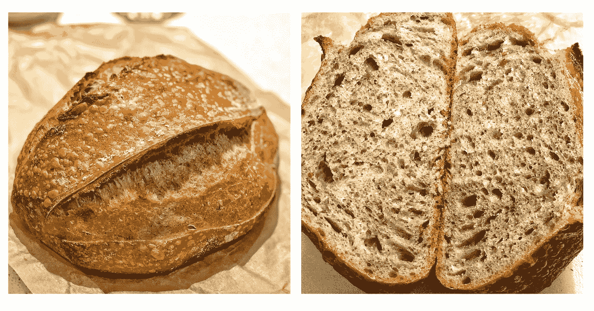
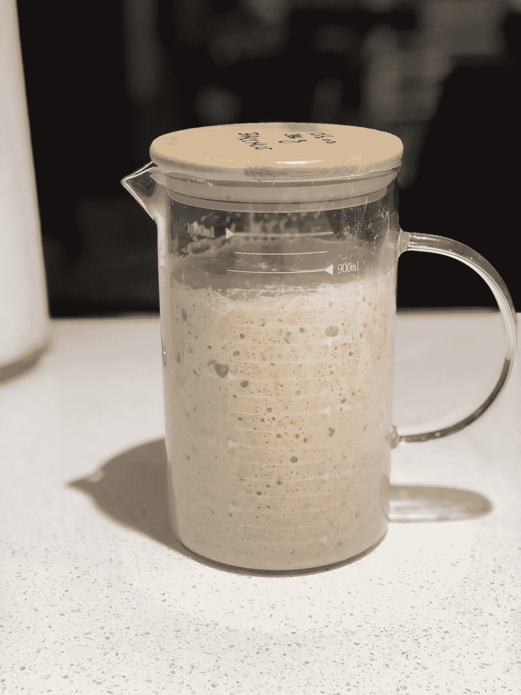
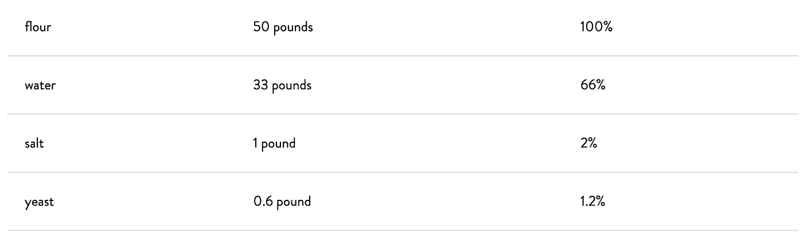
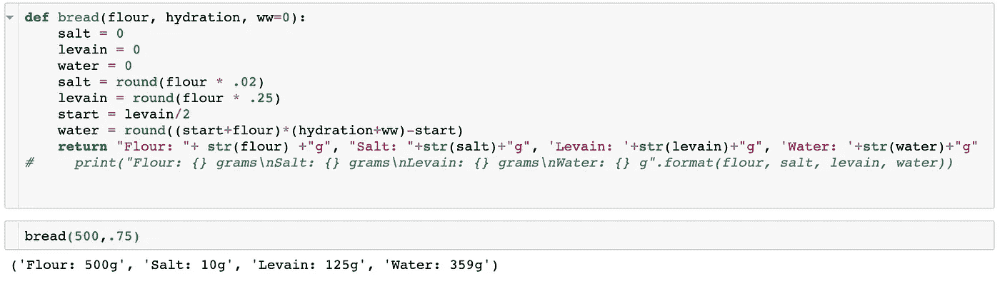
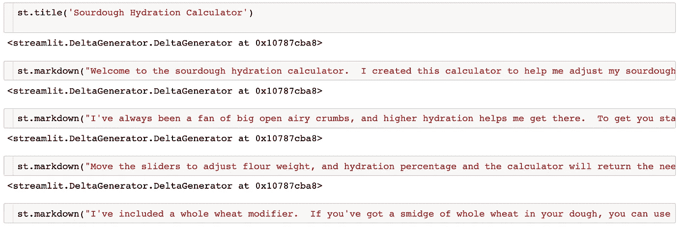
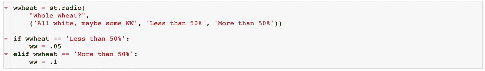
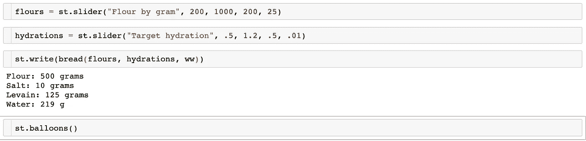
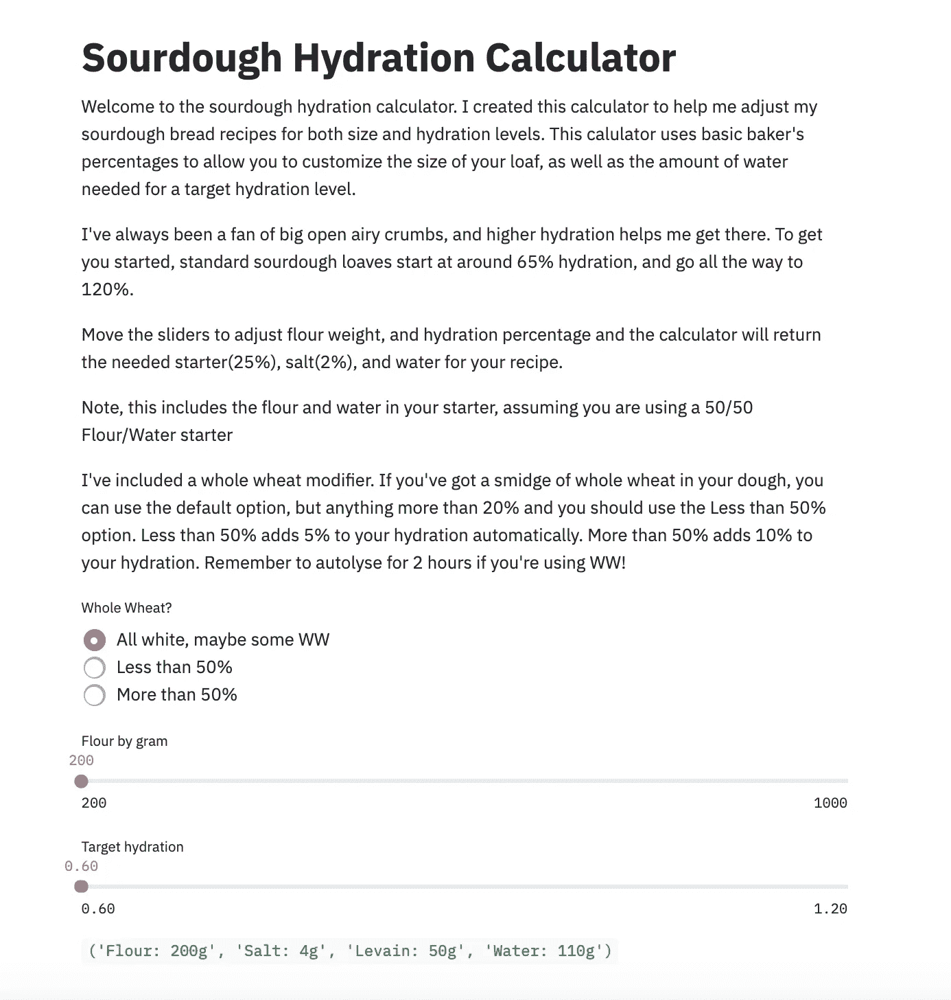

# 用 Streamlit 烤面包—

> 原文：<https://towardsdatascience.com/baking-bread-with-streamlit-fa309c7b464b?source=collection_archive---------27----------------------->

Hojicha 泡制酸面团面包

## 去拿面包屑！

大家好，让我先说这不是 streamlit 的付费帖子，也不是我的上一篇。我再次写 Streamlit，因为我在那里做了一些工作。

如果你像我一样，在冠状病毒封锁期间，你已经烤了很多。我的旅程始于一月份，当时我在巴黎，在附近的面包店吃到了我有生以来吃过的最好的面包。回来后，我受到启发，自己做了面包。我以前用过商业酵母，但这一次，我打算用酸面团的方法来做更美味的面包。经过一周半的尝试，我终于得到了一个功能启动。遇见巴克斯:

现在，巴克斯很酷，但我们不是真的在这里谈论他。巴克斯帮我做了很棒的酸面团面包，真的很棒。但是做面包可能是一个乏味的过程。这涉及到一点数学，因为你必须知道面包师的百分比，这是一套方便的预设计算方法，可以帮助面包师做出好的面包。让我们看一下，好吗？

# 一点关于烘焙的科学

你可能意识到了，也可能没有意识到，烘焙更像是一门科学，而不是艺术。你不能反复无常地使用你的配料，否则你的面包会惩罚你的。面包师的百分比有助于我们调整精确的比例，以生产出特定口径的面包。所有的面包都是从面粉、水、盐和酵母开始的。这四种原料以不同的比例混合在一起，可以生产出不同质量的面包。太多的面粉，你最终会做出只适合面包屑的超级厚煎饼。水太多，你会看到一团不会变成面包的汤。盐太多，你会杀死所有的酵母，你不会发酵，你还可能做硬面饼。你明白了。

为了解决这个问题，人们开始使用贝克百分比。这些是使用每种配料的理想比例，稍加调整，就能做出像样的面包。这些百分比是基于面粉的初始数量，一切都从那里开始。

例如，以下是亚瑟王面粉公司关于面包师百分比的一个公式:

来源:[https://www . kingarthurflour . com/pro/reference/bakers-percentage](https://www.kingarthurflour.com/pro/reference/bakers-percentage)

你会注意到面粉是 100%，所有其他成分都是 100%的百分比。盐一般固定在 2%，有些多一些，有些少一些，但我见过的食谱中没有一个超过 2.5%或低于 1.75%。对于发酵面团，一般来说，你可以用酵母代替 25%的成熟发酵剂。所有的面包食谱都会相应地调整，因此，一般来说，面包师们传递的食谱更像是数学公式，而不是实际的食谱。

然而，在这些公式中有一个关键变量是水。水合作用是制作面包的关键。水的存在不仅促进了酵母及其非常理想的副产品二氧化碳的生长，而且对面筋的形成也是必不可少的，面筋有助于捕获酵母产生的气体。一般来说，水合程度越高，你的面筋越有弹性和强度，这增加了你面包中的气泡大小，从而增加了你最终面包的膨松度。如果你喜欢有大气泡的面包，你会想要更高的水分含量，特别是在不揉的食谱中，面筋的发展是非常不干涉的。

为了得到更高的水合作用，你必须计算加入面团的水的百分比。这包括摆弄信封背面的计算，计算出你的开胃菜中有多少水和面粉，将它加回到你的总数中，并找到最终的百分比。这实际上是非常简单的数学，但是当你想要修改食谱的时候，它变得很乏味。为了简化这项任务，我想，为什么不用电脑呢？

# 终于说到重点了！

首先，我用 Python 写了一个简单的公式。这在 Jupyter 笔记本上很容易做到。任何时候我想修改食谱，只要启动它，输入我的变量，瞧！我有完美的比例。这个公式是这样的:

看，我告诉过你数学很简单。但是我不喜欢做数学，因为犯粗心错误的可能性太大了。这个函数会处理好这个问题，永远不会出错。计算机万岁！我需要做的就是用我的起始面粉重量、我想要的水合百分比和一个增加水合的可选参数(如果我使用全麦，全麦非常渴，所以通常需要增加 5-10%的额外水合)调用函数。

这很好，但唯一的问题是，我必须去我的笔记本电脑，启动 Jupyter 笔记本，手动输入数值。如果我在家计划一个食谱，这没问题，但是如果我想在厨房里做这个呢？此外，我认识的其他人可能想做他们自己的计算，我是否想在每次我想提供一些有用的建议时启动它？

输入 Streamlit。对于那些不了解情况的人来说，Streamlit 正在成为当今创建数据科学应用程序最受欢迎的框架之一。在几个小时内，你可以使用 Python 直接从你的 Jupyter 笔记本上创建一个用于机器学习、神经网络等的应用或前端，不需要额外的工作。我要用它来做面包。

# S-S-S-S-stttrreaaaaaammmlitttt！！！！

我们要做的第一件事是把我们珍贵的公式粘贴到一个新的笔记本上。然后，因为这个应用程序将是一个首页，扔在一个标题，和一些介绍性的文字解释我为什么做这个计算器，以及它是如何工作的。

这就行了。正如你所看到的，streamlit 有一个标题功能，可以自动在页面顶部粘贴一个大标题，还有一个 markdown 功能，可以让我们输入文本作为 markdown，这很方便。它会根据屏幕大小自动设置文本换行，所以你不必担心像以前蹩脚的 html 编码那样，大段的文本会超出你的页面大小。

下一步是创建交互式小部件，使拨入菜谱变得容易。我从一个单选按钮开始，询问食谱是否包括全麦。正如我前面提到的，全麦面粉一般比普通白面粉更渴。此外，它的麸皮含量往往会切断面筋，额外的水浸泡或自溶有助于软化麸皮，使其更有利于面筋。第一个单选按钮是为白面粉面团或全麦含量最低的面团预设的。我的开胃菜含有黑麦，但它不是整个面团的重要组成部分，所以我会选择这个选项。如果一个面团含有少于 50%的全麦，他们会选择“少于 50%”选项，如果它含有超过 50%，他们会选择“超过 50%”选项。这个选择之后是 If、Elif 脚本，分别为我们的全麦选项参数增加 5%或 10%的水合作用。

现在我们已经建立了变量，下一步是创建一个滑块来设置面粉重量和水合百分比变量。我更喜欢在这里使用滑块，而不是让用户手动输入金额，因为它允许我控制用户的错误。无论是我自己还是用户，在面对空白字段时，都不必担心输入错误或不确定性。只需滑动你的面粉重量，你想要的水合百分比，它会照顾自己。可以想象，该公式可以处理滑块设置的重量和百分比，但大多数家庭烘焙师不需要每批烘焙那么多。1000 克面粉足够做两个大面包，足够 4 个人吃一天。下面是代码:

st.slider(最小值、最大值、起始值、增量)

所以现在我们已经建立了一个方便易用的应用程序来设计我们自己的酸奶配方。这是我们最后一页的样子！

我已经把它上传到 Heroku，所以每个人都可以使用它，它是每个人都可以使用的快速参考。对于在厨房外工作的人来说，它也是移动友好的。

可以在这里找到 app [。](https://hydrationcalculator.herokuapp.com/)请试运行一下，让我知道你的想法！祝你烘焙好运！