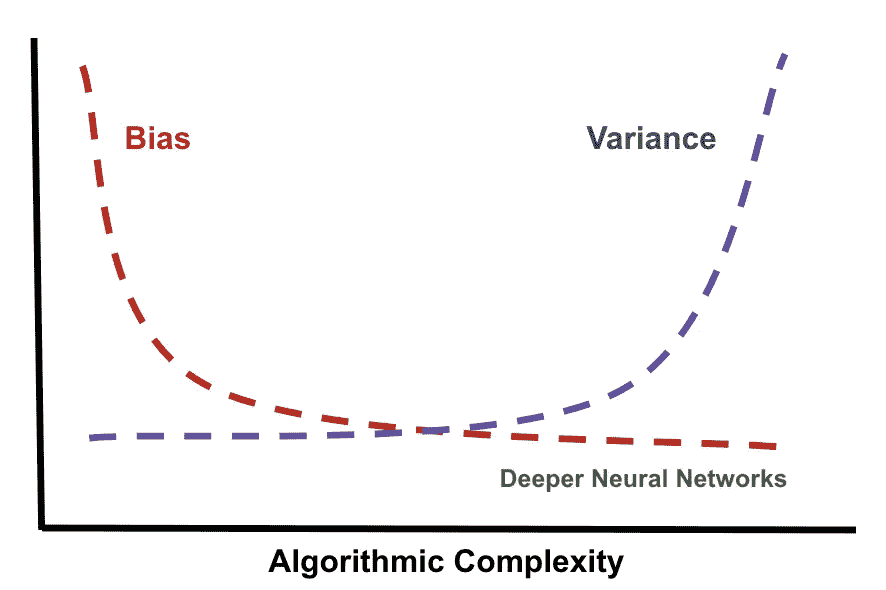
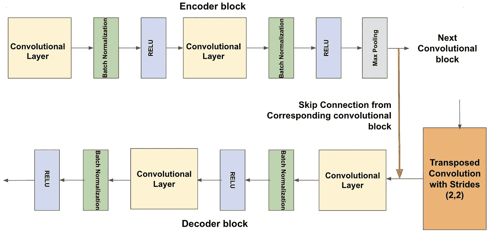
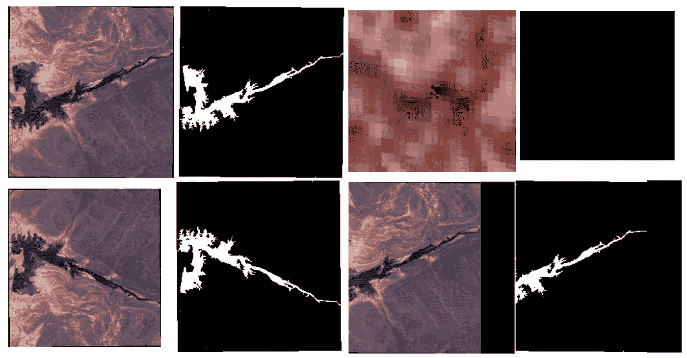
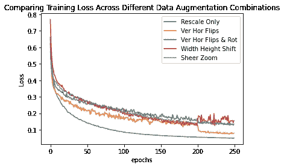
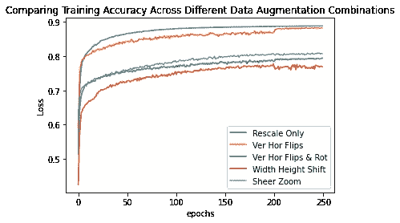
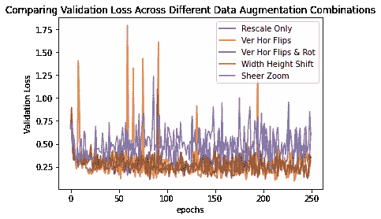
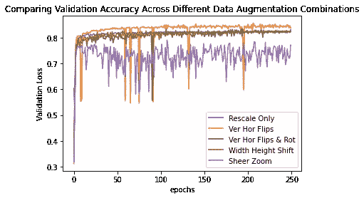
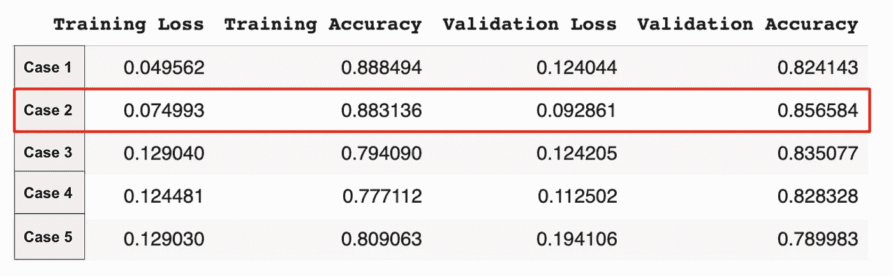
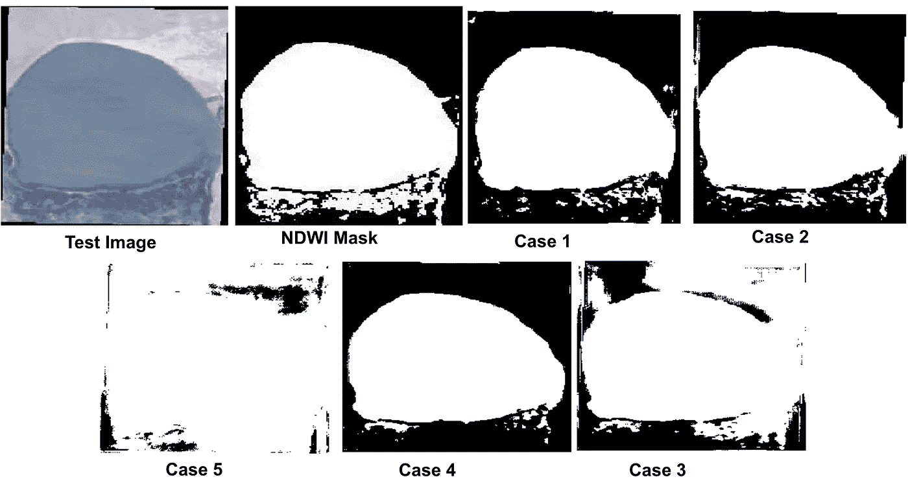
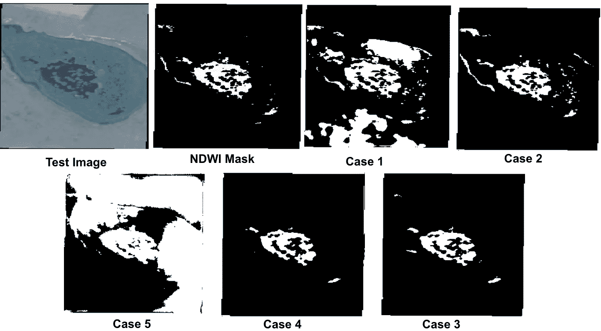

# 平衡数据扩充的正则化效果

> 原文：<https://towardsdatascience.com/balancing-the-regularization-effect-of-data-augmentation-eb551be48374?source=collection_archive---------17----------------------->

## 利用卫星图像上的图像分割应用程序来识别水体，通过数据扩充来平衡过拟合和欠拟合的需要。

## 数据扩充的效果

在训练神经网络时，数据扩充是最常用的预处理技术之一。**“增强”**这个词的字面意思是*“在尺寸或数量上变得更大的行为或过程”，*概括了这种技术的结果。但是另一个重要的影响是*它增加或扩大了数据的多样性。*多样性的增加意味着，在每个训练阶段，模型都会遇到不同版本的原始数据。

按作者

***为什么我们需要数据的这种“增加的多样性”?*** 答案就在机器学习的核心宗旨——**偏差-方差权衡**。更复杂的模型，如深度神经网络，具有较低的偏差，但存在较高的方差。这意味着，这些模型过度拟合训练数据，并会在测试数据或数据上表现不佳，这是他们以前从未见过的。这将导致*更高的* *预测误差*。因此，通过使模型在 ***一般化*** 时变得更好，来自数据扩充的增加的多样性减少了模型的方差。

对于图像，一些常见的数据增强方法是截取部分、放大/缩小、沿轴旋转、垂直/水平翻转、调整亮度和绝对强度。音频数据的数据扩充包括添加噪声、改变速度和音调。

虽然数据增强可以防止模型过度拟合，但一些 ***增强组合实际上会导致*** 拟合不足。这降低了训练速度，导致可用处理时间、GPU 配额等资源的巨大压力。此外，该模型无法学习足够多的信息来给出准确的预测，这再次导致高预测误差。在这篇博文中，我们以卫星图像的语义分割为例，来看看数据增强的不同组合对训练的影响。

## 关于数据集

这个 [Kaggle 数据集](https://www.kaggle.com/franciscoescobar/satellite-images-of-water-bodies)给出了来自哨兵 2 号的**卫星图像及其相应的分割水体的遮罩**。使用归一化差异水指数或 NDWI 计算掩膜。在数据集中总共 2841 幅图像中，分别为训练集提取了 2560 幅，为验证集提取了 256 幅，为测试集提取了 25 幅。整个分析和建模是在 GPU 支持下在 Google Colab 上完成的。

## U 网的结构

简而言之，U-NET 是一个自动编码器，具有从编码器中的每个卷积块到解码器中其对应部分的剩余或跳过连接。这导致了对称的“U”形结构。[这篇文章](/unet-line-by-line-explanation-9b191c76baf5)从原始论文开始，对 U-NET 的结构给出了全面的逐行解释。

我们使用稍微修改的 U-NET 版本，如下所示。

所使用的 UNET 块的快照(由作者提供)

## 看看数据扩充的不同案例

在 Keras ImageDataGenerator 的帮助下，我们探讨了 5 种不同的数据增强情况。我们想看看增强如何导致训练期间*过度适应或适应不足*。因此，为了对 5 个案例进行比较，使用了培训&验证期间的*准确度*和*损失*；其中二进制交叉熵作为损失函数。

**在处理语义分割时，需要记住的重要一点是将*相同的*增强应用于图像及其相应的遮罩！**

在所有 5 种情况下，图像和蒙版的像素值都以 1/255 的因子重新缩放。验证和测试集中的所有图像及其遮罩也被重新缩放。

**案例 1:** 这是*基础案例*。只有图像及其遮罩的像素值被重新缩放。没有应用任何增强。这个案例产生了一个方差最小的训练集。

**案例二:**除了重新缩放，还随机垂直或水平翻转图像及其蒙版。

**情况 3:** 对于这种情况，重新缩放、随机垂直或水平翻转以及[-20，20]度之间的随机旋转被应用于图像及其相应的遮罩。

**情况 4:** 图像和它们对应的蒙版沿着宽度和高度以因子 0.3 随机移动。

**情况 5:** 使用因子 20 将透明变换随机应用于图像及其相应的遮罩。它们也在范围[0.2，0.5]之间随机放大。

同一图像及其遮罩上的不同类型的增强(由作者提供)

## 结果的比较

在所有 5 个案例中，模型被训练了 250 个时期，批次大小为 16。Adam 优化器的学习率为 0.00001，beta 1 为 0.99，beta 2 为 0.99。在下面的图表中，我们可以看到，每个数据扩充案例都为相同的模型提供了不同的性能，这些模型在相同的优化器初始状态下接受了相同数量的时期训练。

训练历史的情节(作者)

基准案例在训练准确性和损失方面表现最佳。然而，这可能意味着过度拟合。另一方面，第三、第四和第五种情况的表现更差。这三种情况的训练准确度没有超过 80%,训练损失没有低于 0.1。这可能意味着不合身。在第二种情况下，数据增强由随机翻转图像及其相应的遮罩组成，这似乎显示了平衡的性能。尽管它的表现比基本情况稍差，但它比最后三种情况具有更高的准确性和更低的损失。

验证历史图(按作者)

验证的准确性和损失，显示了类似的趋势。最后一种情况在这两个指标上表现最差。仔细观察我们会发现，案例 3 和案例 4 在损失方面表现出与训练相似的性能，但验证准确性略高于训练。这表明不合适。对于基本情况，验证损失和准确性比它们的训练对应物差得多，这再次指向过度拟合。虽然我们看到第二种情况的验证准确性和损失波动非常大，但平均来看，它似乎是五种情况中表现最好的。

从这四个图中，我们还可以看到，对于相同数量的时期和相同的优化器初始状态，在训练期间，每个数据增加的情况都收敛在不同的点。这几乎就像 ***每一个案例都遵循着一条独立的轨迹*** 。

下表显示了训练和验证的最大准确度和最小损失。该表支持从图表中得出的结论。第二种情况似乎很好地平衡了训练中的过度适应和欠适应。

按作者

## **对 5 种情况的测试图像的预测**

我们在使用 3 幅测试图像的五个案例中的每一个案例中看到了卫星图像中水体的预测分割。再次值得注意的是，*使用 5 个不同的数据扩充组合训练的相同模型为每个测试图像预测了 5 个不同的图像。*

应注意的是，测试图像在格式方面与基础案例最为相似，因为*基础案例没有使用增强*。因此，对于所有三个图像，基本情况模型能够分割水体的整体形状。然而，案例 2 也能够捕捉微小的边缘。这证实了我们从图表中得出的结论，即基本情况模型略微超过了训练数据(由于方差最小)。

按作者

情况 3 和 4 的性能随着每个测试图像而变化。情况 5 给出了所有三幅图像(尤其是第二幅和第三幅图像)的最差预测。这可能意味着，为了在这样的数据集上训练该模型，改变绝对强度或放大太多可能会导致糟糕的预测结果。这可以归因于这样一个事实，即模型欠拟合训练数据，一个*非常高的方差*。

按作者

按作者

最后， ***又回到了核心原则——平衡偏差和方差*** 。虽然数据扩充确实具有显式的正则化效果，但利用它实际上会导致模型学习不足，从而导致预测结果不佳。因此，我们可以看到，有必要尝试不同的数据扩充组合，以找到最适合问题陈述数据集的组合。

***完整代码可以在***[***Github***](https://github.com/MS1997/Semantic-Segmentation-of-Water-Bodies)***上找到！***