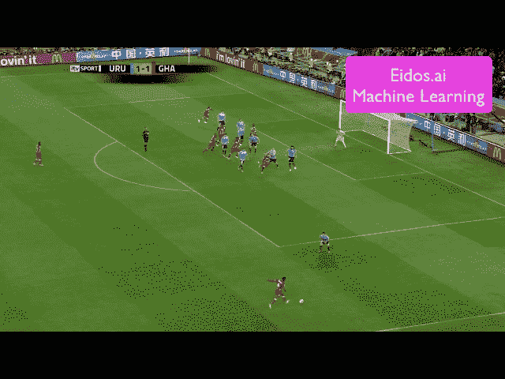
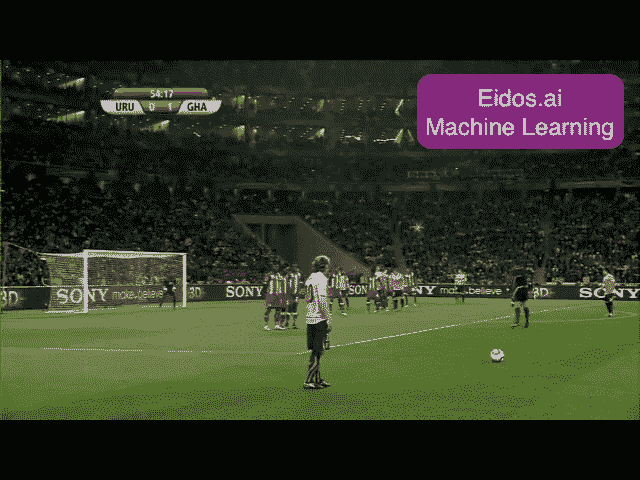
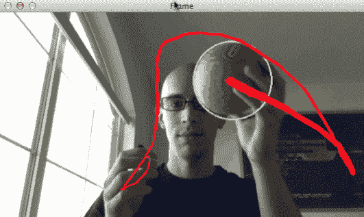
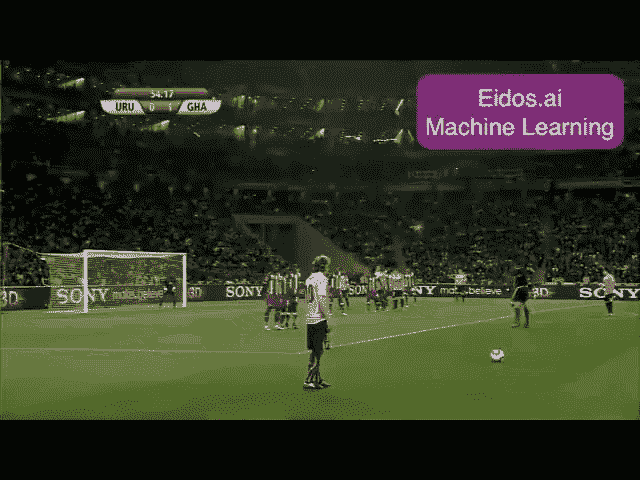
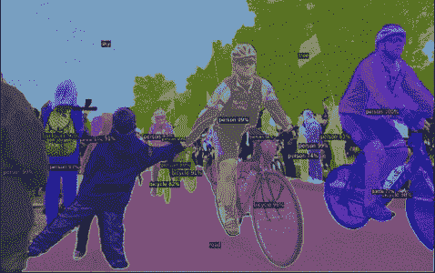
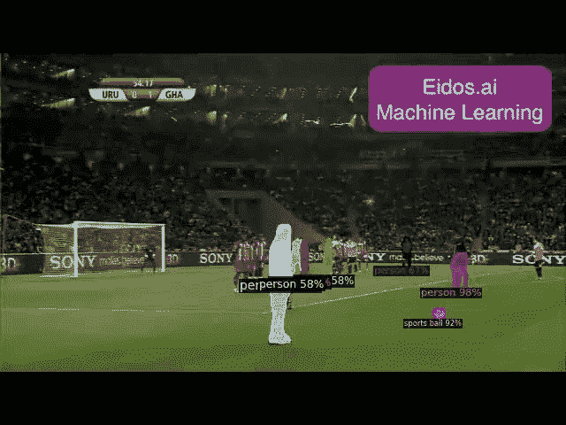
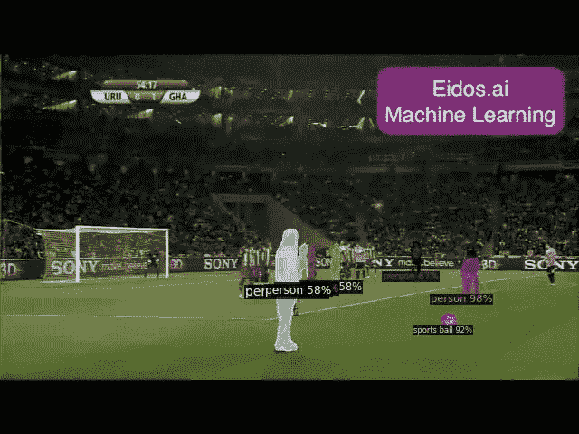
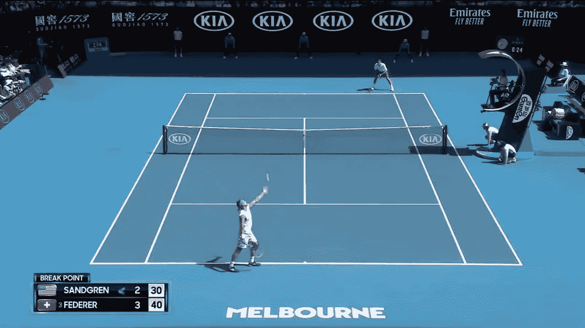
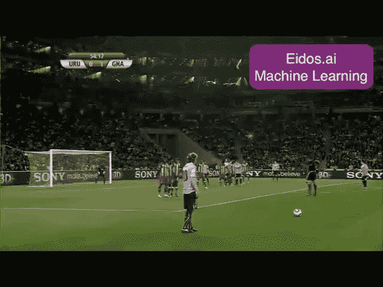

# 运动中的机器学习。

> 原文：<https://towardsdatascience.com/ball-detection-with-computer-vision-ai-in-sports-f9ef743e0ef1?source=collection_archive---------5----------------------->

## 快速浏览自动球检测的可用解决方案

## 🚩 ***目标***

我们希望评估在体育赛事中检测球的最快方法，以便开发一种体育人工智能，而无需在技术或开发人员上花费一百万美元。 ***我们很快发现，探测球是开发一个健壮的体育 AI 的关键组成部分。***

***(我不是我团队中的技术人员，这意味着这篇文章中提供的观点不会让你深入了解任何算法或神经网络)。***

## 🚩你为什么要关心？为什么是舞会？

如果你是在人工智能运动利基**完全相关** **为你** **了解球探的艺术状态，**这个物体永远是任何运动的主要关注中心。如果你能探测到球(即使是在高速下)，那么你就能探测到比赛中更容易的关键事件、度量和更多有用的信息。

## 🚩 ***玩家呢？***

拥有一个成功的体育人工智能是一套出色的计算机视觉检测的结果，**现在有许多可用的神经网络擅长检测人体(例如 OpenPose ),所以球员将很容易被检测到，但球却不容易..更不用说在高速下…** 这就是为什么我们创建这个帖子来评估最快的球探方法。

**仅仅能够探测到球不会带你去那里**但是我们相信，使用一个好的球探测器和来自预训练神经网络的真人探测器是最快的开始方式。

# **简介:跟踪和检测运动物体**

正如我们之前所说的**检测** **和** **跟踪**移动物体是人工智能在这个领域取得成功和发展的关键任务。**运动相当于运动，人和物体以不同的速度和方向运动。**

跟踪移动物体并对其进行分析的能力起着至关重要的作用**。对我们来说,**开发并**教会一个人工智能去观看一场足球比赛**并检测比赛中的元素或事件**听起来像是一个简单的任务，但实际上非常具有挑战性..**

## 这里有几个原因

有时，即使是人类也很难理解复杂的体育比赛中发生了什么。看看 2010 年世界杯赛场上发生了多少疯狂的事情。很难注意到苏亚雷斯实际上是用手触球来阻止进球。对加纳来说幸运的是，裁判发现了这一点，并给了他们点球和最后一次晋级半决赛的机会。

*   相机不断地平移、变焦，有时倾斜，有时从一个完全不同的角度回放，我们的大脑非常善于否定这种运动，以至于我们甚至没有注意到它。
*   以不同的速度和不可预测的轨迹向各个方向移动的物体和人的数量
*   背景中混有球员和球，物体和外形几乎相同的人
*   假阳性，游戏外的相同物体(板凳上穿着相同服装的球员，游戏外的运动球与“游戏中”的球相同)

**但是我们人类在这项任务中表现出色！**

或者迷失在人(球员)和物体(球、网等)的快速且有时无规律的运动中。人工智能很难与人类竞争。

# 我们开始吧！—我的球探之旅

**我的目标是尝试我在谷歌搜索 5 小时内遇到的球探测器**让这个实验非常简单，没有人工智能行业的内部观点。

为了做到这一点，我使用了一种**“即插即用”**的方法，我不修改我找到的检测器和神经网络的代码，我只是下载并运行我的本地示例，只做了很小的修改。

我成功地想在下面的视频中跟踪球，当然我的期望不是太高，我意识到球移动得难以置信的快..

## 让我们看看发生了什么！！

这是我将使用 **3 个球检测器选项进行分析的视频。**

乌拉圭 vs 加哈纳[2010 年南非世界杯四分之一决赛]

# ***1st — PyImageSearch，OpenCV 球检测器***

> **好得难以置信！我搜索的第一个结果！**
> *📹以 32fps 的速度在 CPU 上运行🤯
> ✅实时功能。*

参考链接源代码:
[https://www . pyimagesearch . com/2015/09/14/ball-tracking-with-opencv/](https://www.pyimagesearch.com/2015/09/14/ball-tracking-with-opencv/)

用**和 *PyImageSearch 进行球检测和跟踪。***

这篇 PyImageSearch 文章描述了一种非常简单的检测和跟踪网球的方法:只需在图像上寻找一个绿色区域，然后找到该区域的封闭圆。轻松点。

报告的结果显示，球实际上被很好地跟踪，即使被手部分遮挡，它甚至以 32 FPS 的速度运行，这是非常高的，并允许实时检测。

到目前为止还不错，完全符合我的需求，所以我需要在我的视频上试一试！

## 这是应用该检测器的结果。

***这里做个小澄清:*** *我们确实把颜色检测器从绿色改成了白色，以便尝试检测足球，因为被设置为绿色。*

根本不起作用，它与屏幕上的其他白色物体混淆了，球从未被检测到或跟踪到。

# 第二个检测器 2(来自脸书的预训练神经网络)

> *📹*在 GPU (Nvidia GTX 1060Ti 6Gb Ram)上以 2 fps 运行，
> *❌* ***非实时能力***

参考链接源代码:
[*https://nol.cs.nctu.edu.tw:234/open-source/TrackNet/*](https://github.com/facebookresearch/detectron2)

我不拥有这个图像的权利。摘自侦探 2 Github

在第二个选项中，我将尝试实现一个由脸书提供的神经网络，该网络已经用大量对象(包括运动球)进行了预训练。我对“开箱即用”的结果很感兴趣。另外，我想看看它是否能够探测到玩家的身体。

## 这是应用该检测器的结果:

探测器 2 的结果对球来说不是很好，但对球员来说却很棒。我不拥有这个图像的权利。

球员们都被完美地探测到了。**关于球，它在几帧内被探测到**但这是我第一次看到它被探测到！

只有静止或缓慢运动时，才能以良好的精度检测到球对象。

> 我们发现**当球处于静止位置时，它能够被探测器 2 检测到**，并且具有高置信度得分。

但是这种预先训练的神经网络**对于像球这样快速移动的物体**有问题。

这让我想到了最后一个实验，一个定制的跟踪器，特别是**基于热图解决快速移动的物体**这下一个发展是有希望的，因为对网球的近乎完美的检测(这是一个更小的球，移动更快！)

# 第三轨道网

> *📹*在文档中说明它能够以 22fps 的速度运行！允许实时能力**但不是那么正确..**
> 在我的 GPU 上(英伟达 GTX 1060Ti 6Gb Ram) **它以 2 fps 的速度运行..**
> ****没有实时能力。****

***参考链接源代码:**
[*https://nol.cs.nctu.edu.tw:234/open-source/TrackNet/*](https://nol.cs.nctu.edu.tw:234/open-source/TrackNet/)*

*这是我跟踪球的最佳选择，尽管探测是在网球上**我相信它可以更容易地探测到一个更大的球，并且永远不会以那么高的速度运行，**但是…*

**

*这看起来很适合我们的提议，小网球被完美地检测和跟踪。我不拥有这个图像的权利。摘自 TrackNet Github*

## *应用该检测器的结果:*

**

***我错了，结果很糟糕** …尽管与 PyImageSearch 检测器相比，足球的检测有所改进，但帧中有太多的误报…这意味着 TrackNet 即使在根本没有球的情况下也能检测到球…*

*此外**它以 2 fps 运行，而不是文档中提到的 22 fps** ，这阻碍了实时分析和检测的可能性。*

*一个很大的优势是，这个 TrackNet 神经网络在如何用你自己的数据训练方面有很好的文档和建议。这可能是解决足球上的球检测的一个解决方案，但这显然不是一件容易的事情。*

*如果任何人有足球数据集(真实的和/或合成的),我们有兴趣合作训练这个神经网络或开发一个定制的解决方案，请发送电子邮件到 **gcor@eidos.ai***

# *从结果得出的结论*

*总之，在人工智能运动中，没有“即插即用”的神经网络会把你带到那里，在这个领域没有全局解决方案。这对于那些早期进入这一领域并开发全球解决方案的人来说是一个不可思议的优势。这还没有到来..*

*但是，即使没有全球解决方案，每个不同的情况都可以用不同的方法来解决，为每个问题创建定制的解决方案。*

*这就是为什么你需要联系一个团队来开发这种类型的人工智能。*

*如果你有兴趣与我们合作或建立你的人工智能。*

***伸手！***

*我们是一家专注于机器学习，特别是计算机视觉的软件公司，你可以通过 info@eidos.ai 联系我们，我们的网站是[**https://eidos . ai**](https://eidos.ai)*

*敬请关注我们下个月在 medium 上的下一篇文章！*