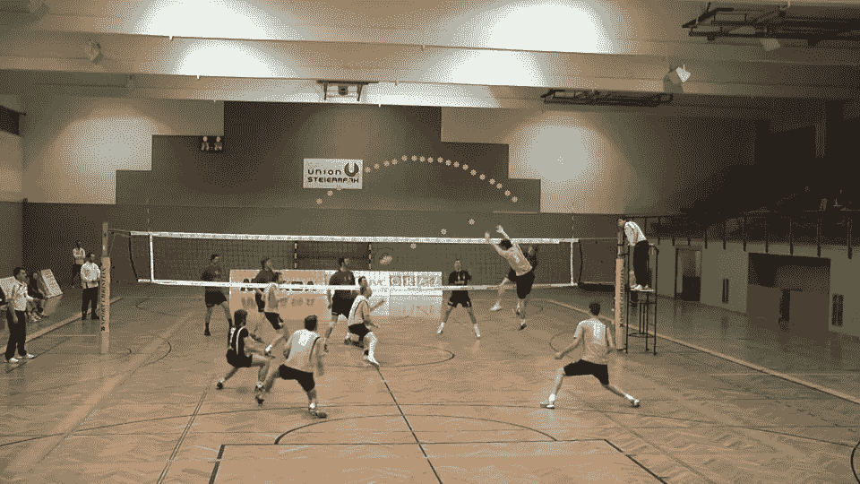
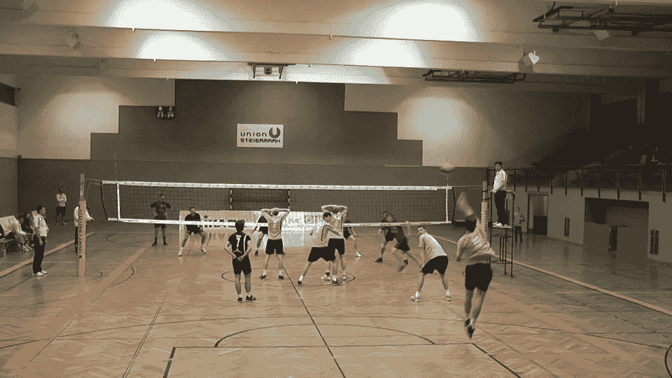
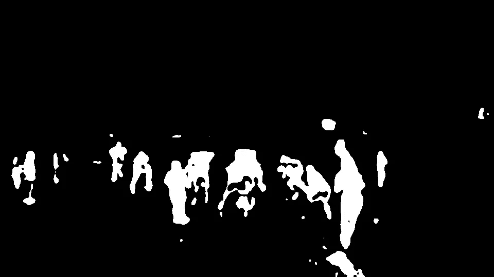
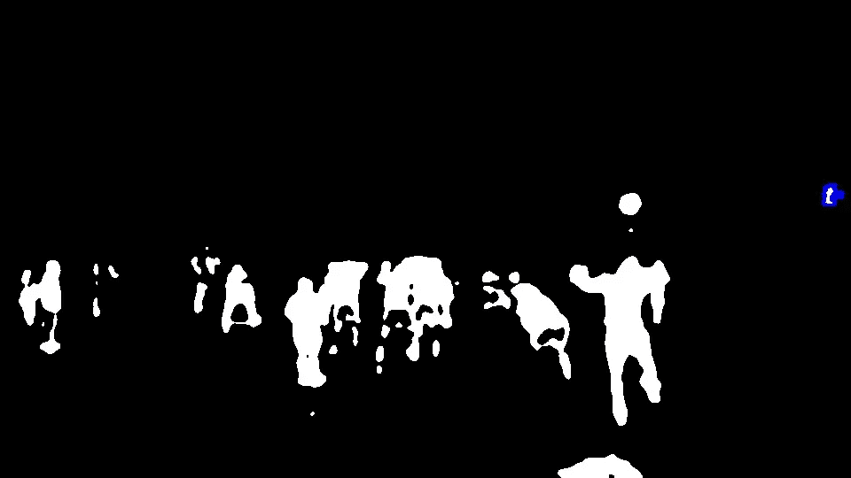
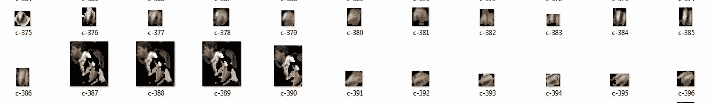
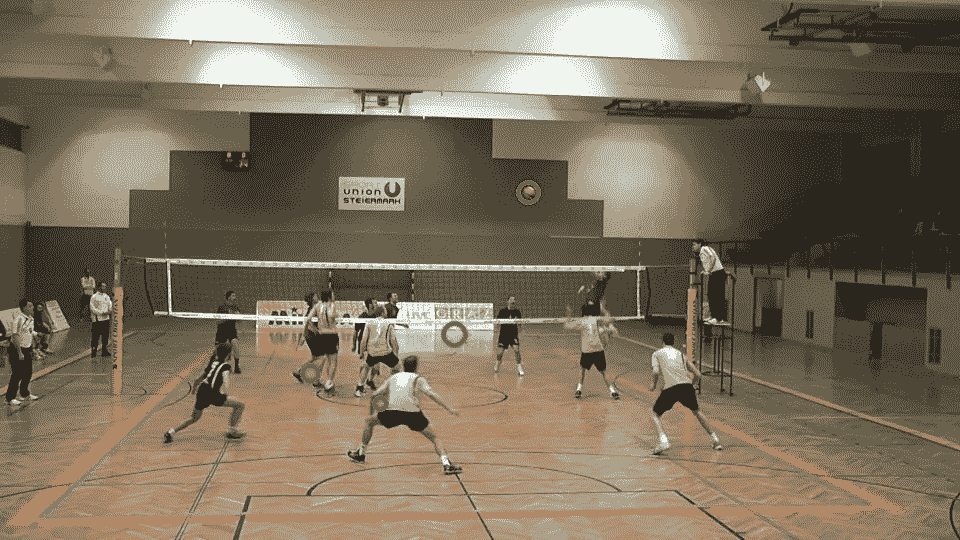
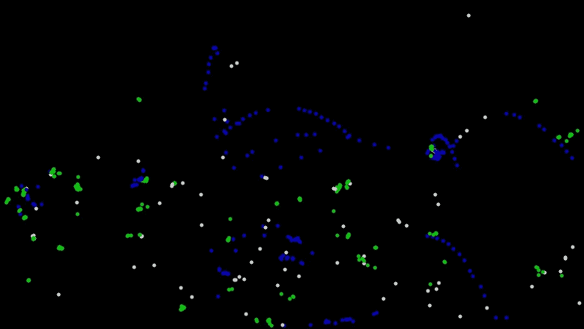
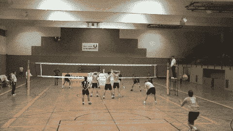

# 用 OpenCV 和 Tensorflow 实现排球中的球跟踪

> 原文：<https://towardsdatascience.com/ball-tracking-in-volleyball-with-opencv-and-tensorflow-3d6e857bd2e7?source=collection_archive---------11----------------------->

## 运动技术中的计算机视觉和神经网络

## 介绍

在[第一次在运动中应用 AI 的经历](/squats-detector-with-opencv-and-tensorflow-ce934f19aeb9)之后，我受到了继续下去的启发。家庭练习看起来是一个无关紧要的目标，我的目标是团队合作。

人工智能在体育领域是一个相当新的事物。有几个有趣的作品:

*   [篮球](https://dev.to/stephan007/open-source-sports-video-analysis-using-maching-learning-2ag4)
*   [网球](https://www.researchgate.net/publication/329740964_Convolutional_Neural_Networks_Based_Ball_Detection_in_Tennis_Games)
*   [排球](https://www.tugraz.at/institute/icg/research/team-bischof/lrs/downloads/vb14/)

我是个打排球的大粉丝，那就说说最后一个参考吧。这是一个分析当地业余联赛的奥地利机构的网站。
有些文档需要阅读，更重要的是——打开视频数据集。

排球是一项复杂的运动，有许多不同的方面。所以我从一个小但非常重要的东西开始——球。

跟踪球是一项非常著名的任务。谷歌给出了很多链接，但其中许多只是一个演示。显然，在摄像机前识别和跟踪颜色不同的大球无法与真实游戏球检测相比，真实游戏球检测中的球很小，移动很快，并融入背景中。

最后，我们想得到这样的东西:



开始之前，让我们注意一下视频数据集的一些细节:

*   摄像机是静态的，位于球场后面
*   技术水平允许自由看球(职业选手击球太狠，没有电视回放几乎不可能看球)
*   不幸的是，球的颜色，蓝色和黄色，与地面没有太大的对比。这使得所有基于颜色的方法变得毫无意义

## 解决办法

到目前为止，最明显的方法——用颜色——不起作用，我用了一个事实，球在移动。然后让我们找到移动的物体并捡球，听起来很容易。

OpenCV 包含检测移动物体和背景移除的工具:

```
mask = backSub.apply(frame)     
mask = cv.dilate(mask, None)     
mask = cv.GaussianBlur(mask, (15, 15),0)     
ret,mask = cv.threshold(mask,0,255,cv.THRESH_BINARY | cv.THRESH_OTSU)
```

还有这样的图片:



转化为:



在这个例子中，球在顶部，人的大脑和眼睛可以很容易地发现它。我们是怎么决定的？从这幅图中可以推断出一些规律:

*   这个球是一团
*   这是图片上最高的斑点

第二条规则不太管用。例如，在这张图片中，最高的斑点是裁判的肩膀。



但是最高斑点方法为进一步的步骤提供了初始数据。

我们可以收集这些斑点，并训练一个分类器来区分球。

这个数据集看起来像这样:



在人工智能方面——它是彩色图像的二进制分类，非常类似于[猫对狗挑战](https://www.kaggle.com/c/dogs-vs-cats)。

有许多方法可以实现，但最流行的方法是用 [VGG 神经网络](https://blog.keras.io/building-powerful-image-classification-models-using-very-little-data.html)。

一个问题-球图片非常小，多个卷积层不适合在那里。所以我不得不把 VGG 切割成一个非常简单的建筑:

```
model = Sequential([Convolution2D(32,(3,3), activation='relu',       input_shape=input_shape),         MaxPooling2D(),            Convolution2D(64,(3,3), activation='relu'),         
 MaxPooling2D(),         
Flatten(),         
Dense(64, activation='relu'),         
Dropout(0.1),         
Dense(2, activation='softmax')       
])

model.compile(loss="categorical_crossentropy",   optimizer=SGD(lr=0.01), metrics=["accuracy"])
```

这个模型很简单，产生的结果一般:大约 20%的假阳性和大约 30%的假阴性。
这当然比什么都没有强，但还不够。

应用于游戏的模型产生许多假球:



实际上有两种假球:

*   他们在随机的时间出现在随机的地方
*   这个模型总是犯错误，把别的东西当成球

## 轨道

作为下一步，有一个想法，球不是随机运动，而是遵循抛物线或直线轨迹。

对该几何图形上的斑点运动的验证将切断随机和一致的错误。

有一个在一场球赛中记录轨迹的例子:



其中定向路径用蓝色表示，静态路径用绿色表示，随机路径用灰色表示。

只有蓝色的轨迹才有趣。它们至少由 3 个点组成，并且有一个方向。方向非常重要，因为如果下一个点在实际流中丢失并且没有检测到新的路径，则可以预测下一个点。

应用于片段的这一逻辑生成了非常逼真的跟踪:



## 链接

[Github 回购](https://github.com/tprlab/vball)

[视频源](https://www.tugraz.at/institute/icg/research/team-bischof/lrs/downloads/vb14/)

[**利用时空上下文改进体育活动识别**](https://files.icg.tugraz.at/f/d5668bbb4a/?raw=1)
乔治·瓦尔特纳、托马斯·毛特纳和霍斯特·比朔夫
在 *Proc。DVS-体育领域计算机科学会议(DVS/GSSS)，2014 年*

[**自动化体育游戏分析的室内活动检测与识别**](https://files.icg.tugraz.at/f/43f43cbc00/?raw=1)
乔治·瓦尔特纳、托马斯·毛特纳和霍斯特·比朔夫
在 *Proc。奥地利模式识别协会(AAPR/OAGM)研讨会，2014 年*