# 强盗算法

> 原文：<https://towardsdatascience.com/bandit-algorithms-34fd7890cb18?source=collection_archive---------9----------------------->

## [婴儿机器人强化学习指南](https://towardsdatascience.com/tagged/baby-robot-guide)

## 多武装匪徒:第三部分


[埃尔佩佩](https://unsplash.com/@elpepe?utm_source=medium&utm_medium=referral)在 [Unsplash](https://unsplash.com?utm_source=medium&utm_medium=referral) 上拍照


# 概观

> 机器人宝宝在商场走失。利用强化学习，我们想帮助他找到回到妈妈身边的路。然而，在他开始寻找她之前，他需要从一组电源插座充电，每个插座的电量略有不同。
> 
> 使用多臂强盗问题中的策略，我们需要在最短的时间内找到最好的插座，让机器人宝宝充电上路。

这是关于多重武装匪徒的六集系列的第三集。到目前为止，我们已经介绍了在 Multi-Armed Bandits 中使用的[数学框架和术语](/multi-armed-bandits-part-1-b8d33ab80697)以及[Bandit 框架](/multi-armed-bandits-part-2-5834cb7aba4b)，其中我们描述了我们试图解决的问题，并给出了我们将用来定义和测试问题环境的基本代码块的细节。

现在我们已经有了合适的术语、符号和测试框架，所有缺少的是一个可以解决强盗问题的实际算法，在给出不同奖励级别的行动之间进行选择，以寻找最佳行动。在接下来的几个部分中，我们将研究几个这样的算法，它们的复杂度越来越高。

为了让我们开始，我们将首先看看解决 Bandit 问题的一些最基本的方法，并检查以下算法:

*   [**贪婪算法**](#d7a7)
*   [**乐观-贪婪算法**](#1519)
*   [**【ε-贪婪算法】**](#0145)

此外，为了让我们评估解决 Bandit 问题的不同方法，我们将描述 [***后悔***](#b390) 的概念，其中您将您的算法的性能与理论上最佳的算法的性能进行比较，然后后悔您的方法没有表现得更好一点！

bandit 算法和测试框架的所有代码都可以在 github 上找到: [Multi_Armed_Bandits](https://github.com/WhatIThinkAbout/BabyRobot/tree/master/Multi_Armed_Bandits)

# 概述


> 机器人宝宝进入了一个充电室，里面有 5 个不同的电源插座。每个插座返回的电荷数量略有不同。我们希望在最短的时间内给机器人宝宝充电，所以我们需要找到最好的插座，然后使用它，直到充电完成。
> 
> 这和多臂强盗问题是一样的，除了我们不是在找一个能给出最好回报的吃角子老虎机，而是在找一个能给出最多电量的电源插座。


# 贪婪算法

每次我们插入一个插座，我们都会得到一个奖励，以一定数量的电荷的形式，我们得到的每个奖励都可以让我们计算出一个插座的真实输出的更准确的估计。如果我们随后选择具有最高估计值的插座，希望这将是最佳可用插座。

当选择具有最高值的动作时，在时间步' *t 【T3 ')选择的动作可以由公式表示:*

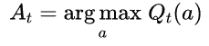

其中“ *argmax* ”指定选择动作“ *a* ”，其中 *Qₜ(a)* 被最大化。记住' *Qₜ(a)'* 是动作' *a* 在时间步 *'t '，*的估计值，所以我们选择当前估计值最高的动作。

当采用这种方法时，选择具有最高估计值的动作，我们称之为“*贪婪地选择”*，具有最大值的动作(可能不止一个)称为*“贪婪动作”。*

所有这些听起来像是选择一个好的动作的合理方法，但是有一个主要的缺陷:贪婪算法想要选择具有最佳估计的动作，但是没有提供形成这些估计的方法。它纯粹利用可用的信息，但不做生成这些信息所需的任何探索。

因此，贪婪算法最初是从尚未尝试的动作中进行选择，因此对它们的真实值没有估计。此外，即使选择了一个好的操作，也不能保证这是最好的操作，因为贪婪算法现在已经锁定了所选择的操作，所以不会测试其他操作来确认当前的操作是否是最好的。因此，可以提供更高长期回报的行动将被错过。

# 乐观贪婪算法

修改贪婪算法的一个非常简单的方法是将初始动作估计值设置为非常高的值，以使其在搜索最优动作时探索可用动作的集合。

在电源插座问题中，如果动作估计被初始化为零，一旦采取一个动作，假设插座返回甚至最小量的电荷，该动作的平均回报将变得大于零。结果，在贪婪算法的眼里，这个动作会比其他所有动作都好，因此会永远是被选中的动作。

相反，如果动作估计被初始化为高于任何可能的套接字输出的值，则当首次尝试套接字时，其平均回报降低。然后，它的估计值低于任何其他值，因此在下一个时间步中不被选择。这导致在第一个' *k* '时间步中尝试每个套接字(其中' *k* 是套接字的数量)。

如果我们实现这个算法，我们就能确切地看到发生了什么:

因此，在上面的代码中，我们从我们在[第 2 部分](http://link to Part 2)中定义的标准 *PowerSocket* 类中派生出一个新的 *OptimisticPowerSocket* 。唯一的区别是，现在将套接字奖励值的估计值' *Q* '初始化为所提供的初始估计值，并且将该套接字被尝试的次数' *n* '设置为 1，以考虑初始化。

如果我们将插座估计值初始化为略高于最大可能奖励值的值，那么这将鼓励在早期步骤中进行探索，而不会花费太长时间来发现哪个插座产生最高奖励。

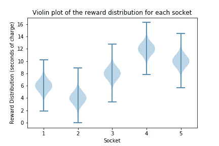

回顾每个插座的奖励分布的小提琴图，最高输出是大约 16 秒的充电。因此，我们选择了值 20，这比最大可能的奖励稍高，并初始化了所有的套接字估计值，如下表所示。

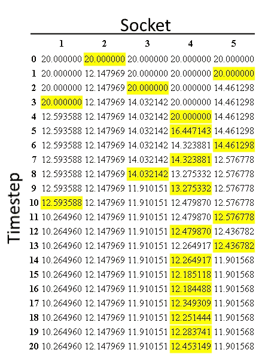

表 1:使用乐观-贪婪算法对 20 个时间步长的插座回报估计。

表 1 显示了在 20 个时间步长上对 5 个插座中的每一个插座的回报估计。黄色高亮显示的单元显示在每个时间步长选择的套接字。需要注意的要点是:

*   最初，所有套接字的估计值都设置为 20。
*   在每个时间步长，使用贪婪算法选择插座，因此选择具有当前最大估计值的插座。当不止一个插座具有最大值时，随机选择其中一个。可以看出，这发生在前四个时间步长(0–3)。
*   在时间步骤 4，只有一个插座仍未测试(插座 4)。因为它的初始估计值仍然是 20，所以它的估计值是所有套接字中最高的，因此被选为贪婪操作。
*   作为初始化的结果，在前 5 个时间步骤中，5 个插座中的每一个都被尝试一次。这推广到标准的 Bandit 问题，其中在第一个“ *k* 时间步中，每个“ *k* ”动作将被尝试一次。
*   在接下来的几个时间步骤(5–13)中，可以看到尝试了各种插座。这是该过程的探索阶段，因为该算法搜索具有最高回报的套接字(要采取的最佳行动)。
*   从时间步骤 14 向前，算法已经锁定到插座 4。这是开发阶段，在此期间发现了最佳行动，并且只有这一行动将被采取。

下图显示了相同的结果(尽管这里显示的是前 30 个时间步)。可以看出，对于每个插座，估计的回报如何从初始值 20 开始，然后随着时间的推移而减少。一旦非最佳插座的估计值低于最佳插座的真实值(如图中的黑线所示)，则不会再次尝试。在除了最佳插座(插座 4)之外的所有插座都发生这种情况之后，只有它将被选择，并且只有它的估计值将向真实值收敛。非最优行为的回报估计永远不会收敛到它们的真实回报。

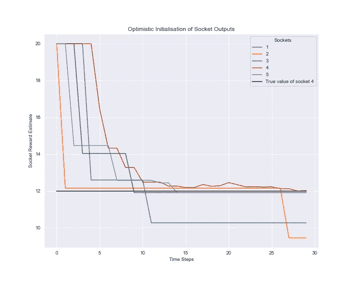

图 3.1:电源插座输出的乐观初始化。

从上面的图表可以看出，乐观贪婪算法工作得很好。不需要太长的时间，次优行动就会被丢弃，焦点就会转向最优行动，如果我们想在最短的时间内获得最大的电量，我们就要采取最优行动。

然而，我们的实验有几个问题:

*   首先，我们作弊了！基于我们对套接字输出的了解，我们选择了最初的套接字估计值 20。在现实世界中，在机器人宝宝的例子中，我们可能没有这方面的知识。
*   其次，我们不太擅长作弊！我们选择值 20，因为它略高于我们在查看套接字输出时获得的最高输出(参见上面 violin-plot 中 socket 4 的输出)。然而，事实证明这并不是最好的价值。

看看下面的图，显示了平均总回报和插座选择百分比，是在一系列初始值的 30 个时间步长内获得的。

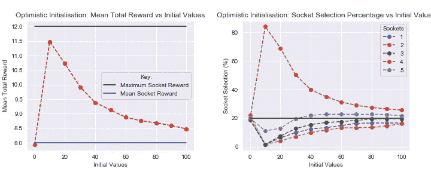

图 3.2:乐观初始化。

在上面的图中，有几点需要注意:

*   当初始插座值被设置为零时，平均总回报具有大约 8 的值。在这种情况下，实现的是纯粹的贪婪算法。没有探索，只有剥削，所以会随机选择插座。在我们的例子中，平均套接字输出是 4、6、8、10 和 12，所以平均套接字回报是 8。这也可以从插座选择百分比图中看出。在初始化值为零的情况下，以相等的概率选择所有的插座，并且因为有 5 个插座，所以每个插座以 20%的概率被选择。
*   类似地，对于非常大的初始值，平均总回报开始向值 8 下降，这标志着所有插座以相等的概率被选择的点。在这种情况下，从每个套接字返回的奖励比选择的初始值小得多。因此，估计的回报要花更长的时间才能降到接近真实的最大回报。在此期间，每个插座将有近似相等的真实回报的高估。
*   最大平均总奖励不会在初始值为 20 时出现。相反，如下图 3.3 所示，当初始估计值设置为 11 时，实际上会发生这种情况。这也可以在上面的选择概率图中看到，其中，对于初始值 11，选择最佳插座的概率增加到最大值，而同时对于所有其他插座降低到最小值。由于该初始化值大于除了最佳插座奖励之外的所有值，一旦选择了最佳插座，其估计奖励将被设置为高于所有其他值(假设其返回接近其平均奖励值)，因此它将被贪婪地选择用于所有剩余的时间步骤。因此，最佳套接字只需要测试一次，使其成为贪婪操作。

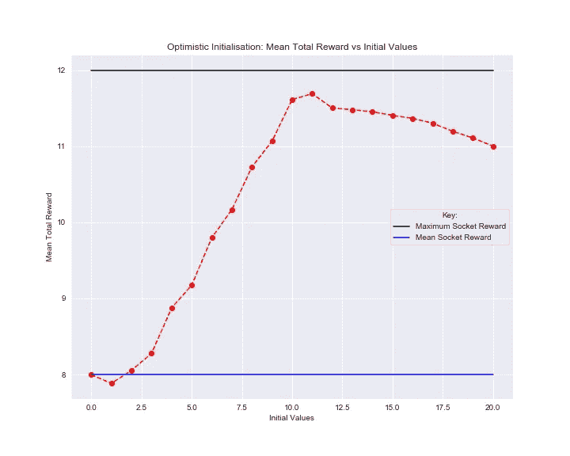

图 3.3:乐观初始化——平均总报酬与初始值。

乐观贪婪算法是一种在测试早期鼓励探索的简单方法。最初将尝试所有动作，并且如果使用合适的初始化值，该算法将快速丢弃非最佳动作并聚焦于最佳动作。然而，如上所示，一个选择不当的初始值会导致次优的总回报，如果事先不知道可能的回报范围，就很难选择最佳的初始值。

另一个主要缺点是，探索局限于最初的时间步骤，将其应用限制在 ***静止*** 问题上，其中每个行动的回报从不改变。它不适合 ***非平稳*** 的情况，在这种情况下，由于缺乏持续的探索，行动奖励会随时间而变化。

# ε-贪婪算法(ε-贪婪)

正如我们已经看到的，一个纯粹的贪婪策略有很高的风险选择一个次优插座，然后坚持这个选择。结果就是永远找不到最好的插座。

克服这个问题的一个简单方法是引入探索元素。这正是 Epsilon-Greedy 所做的:

*   默认情况下，行动是贪婪地选择的。具有最高估计奖励的动作是所选择的动作。
*   然而，在每个时间步长，可以从所有可能动作的集合中随机选择一个动作。以概率'*ε*'(ε)选择随机动作。

以这种方式，探索被添加到标准贪婪算法中。随着时间的推移，每一个行为都将被反复取样，以给出对其真实回报价值越来越准确的估计。

实现ε-贪婪策略的代码如下所示。注意，这改变了 socket tester 类的行为，修改了它在可用套接字之间的选择方式，而不是对实际套接字的改变。

在每个时间步' *select_socket* '被调用。如果随机值' *p* '小于ε，则将选择随机动作，否则将选择具有最高当前估计回报的插座。

查看下图，可以看出 *ε* 的值如何影响对套接字问题的探索和利用:

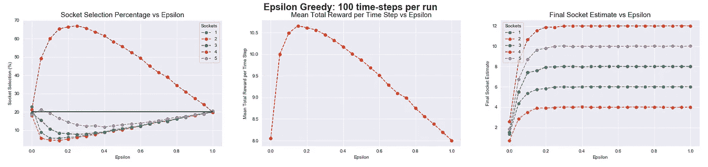

图 3.4: Epsilon-Greedy —每次运行 100 个时间步。

*   当 *ε* 值为零时，这就是贪婪算法。每个插座以相等的概率被选择。没有插座是随机选择的，也没有探索。
*   随着 *ε* 的增加，行动的随机选择也增加，因此，探索也增加。最初，这导致以增加的频率定位和选择最佳插座。与此同时，非最佳插座开始被较少地选择。
*   最佳插座的选择，以及平均总奖励的相应增加，持续到大约为 0.2 的 *ε* 值。这一点代表了勘探\开发权衡的顶峰。探索是寻找最好的行动，而开发是选择这个行动。
*   在选择最佳插座的高峰之后，勘探和开发之间的平衡开始向有利于勘探的方向转变。随机选择插座的可能性越来越大。结果，非最佳插座开始被更频繁地选择，因此平均总报酬开始下降。
*   套接字的随机选择继续增加，直到 *ε* 的值为 1，此时算法已经切换为没有利用的纯探索策略。插座再次被完全随机地选择，并且每个插座以相等的概率被选择，而不考虑其估计的回报。

ε-贪婪策略是在基本贪婪算法中增加探索的一种简单方法。由于行动的随机抽样，所有行动的估计奖励值将收敛于其真实值。这可以从上面显示的最终插座估算图中看出。在 *ε* 值高于大约 0.2 的情况下，估计的套接字值都与其真实值匹配。这也是 Epsilon-Greedy 算法的缺点:非最优的行动继续被选择，它们的回报估计被改进，即使它们已经被确定为非最优。因此，对最佳行动的利用没有最大化，总的整体回报也低于预期。

# 遗憾

在插座选择问题中，如果在每个时间步都选择了最好的插座，将获得最大可能的回报。每次选择一个非最佳插座，可以获得的总的可能回报从这个理论上的最大值进一步减少。结果你 ***后悔*** 选择了这个插座，反而希望你选择了最好的那个。正如术语*后悔*所暗示的，你可能无法提前知道你正在做一个非最优的选择，只有在事后你才会意识到你的错误。

尽管您可能无法提前判断是否选择了最佳操作，但您可以计算出您的选择策略与最佳策略相比的表现，在最佳策略中，最佳操作是在每个时间步选择的。这两种政策获得的总回报的差异代表了遗憾。

最佳动作由下式给出:

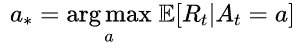

*最佳行动是在每个时间步选择时，最大化预期(平均)回报的行动。*

通过在总共' *T* '个时间步长内，取所实施政策获得的奖励与如果遵循最优政策本应获得的奖励之间的差值，计算遗憾' *L* ':

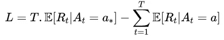

因此，对于所有的' *T* '时间步，最优策略获得了在每个时间步采取最优行动时所获得的期望报酬。由此我们减去从我们的策略所选择的行动中返回的预期回报的总和，其中所选择的行动，以及因此它的预期回报，可以在每个时间步长变化。

通过最小化遗憾的价值，我们可以最大化回报的总和。

## ε-贪婪的后悔

ε-Greedy 通过以概率' *ε* '随机选择任何可能的动作来实现探索。因此，在' *T* '时间步的过程中，行动的' *εT* 将被随机选择。

此外，在插座选择问题的一般形式中，有' *k* '个不同的插座可供选择，其中只有一个会给出最大可能的回报。剩下的' *k-1'* 插座会给出一个次优奖励。结果，存在选择次优插座的' *εT(k-1)/k'* 轮。

如果在选择次优行动的几轮中，我们幸运地选择了第二好的插座，其中奖励与最好的插座相差一个固定的量“δ”(delta)，那么这将使我们对ε贪婪的后悔最小。这由下式给出:

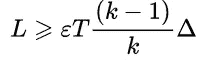

对于所有其他非最佳插座，所获得的奖励和最佳奖励之间的差将高于“δ”，因此大于或等于符号，因为在这种情况下遗憾将更大。

由于'ε'，'δ'和' *k* '都是常数，因此ε-Greedy 的结果最低界限遗憾与时间成线性关系( *T* '将只是乘以一个常数值)。这意味着在找到最佳行动后，遗憾将继续增加。

这可以从下图中看出。在最初的几个时间步骤之后，通过ε贪婪方法获得的总累积奖励线性增加。然而，由于随机探索仍在发生，这一增长率略低于最佳行动积累其回报的速率，导致后悔随时间线性增加。在运行的早期阶段，遗憾的增加率稍高，这是由于还没有找到最佳动作，因此在这些时间步骤中更有可能选择次优插座。

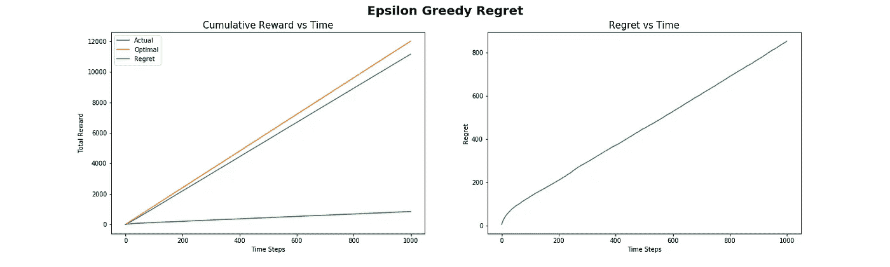

## 摘要

在这一部分，我们来看看多臂强盗，我们最终研究了一些可以用来解决强盗问题的算法。

纯粹的贪婪算法，除非它有一些可能的行动奖励的初始知识，并不比简单的随机选择方法好多少。然而，通过一些轻微的修改，例如*乐观-贪婪*使用大的初始值或者*ε贪婪*引入随机探索的方法，选择性能可以大大提高。

然而，即使有了这些改进，总回报仍然远远低于最佳水平。*乐观-贪婪*的表现非常依赖于为其初始奖励选择的值，并且 *Epsilon Greedy* 继续探索所有行动的集合，即使它已经获得足够的知识来知道这些行动中哪些是不好的行动。结果， *Epsilon Greedy* 算法被证明具有线性后悔，其中返回的奖励和最优奖励之间的差异继续随着时间线性增加。

在本系列的剩余部分中，我们将看看解决 Bandit 问题的几个更复杂的方法，即 ***置信上限*** 算法和 ***Thompson 采样*** ，这两种方法都降低了后悔的程度，从而产生了更高的回报水平。使用这些，我们可以在超快的时间内给机器人宝宝充电！


```
**< Part 2:** [**The Bandit Framework**](/multi-armed-bandits-part-2-5834cb7aba4b) **Part 4:** [**UCB Bandit Algorithm**](/the-upper-confidence-bound-ucb-bandit-algorithm-c05c2bf4c13f) **>**
```