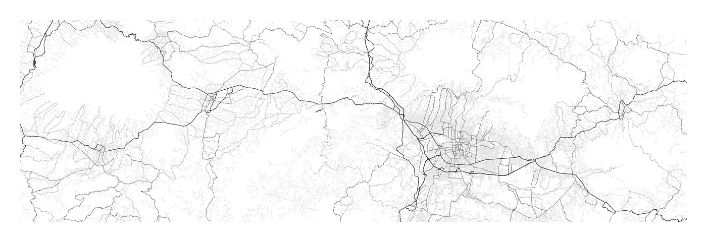
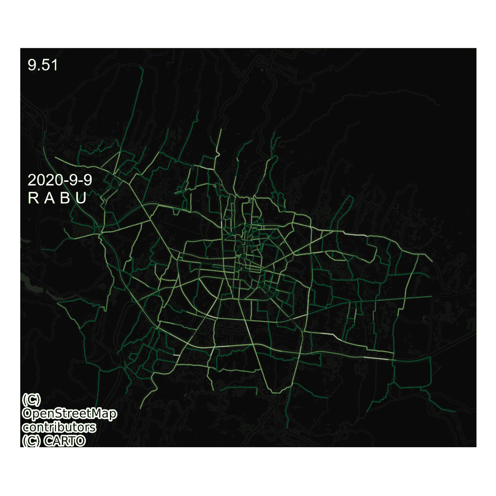
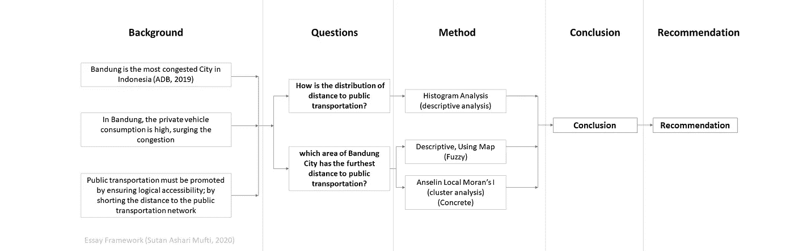
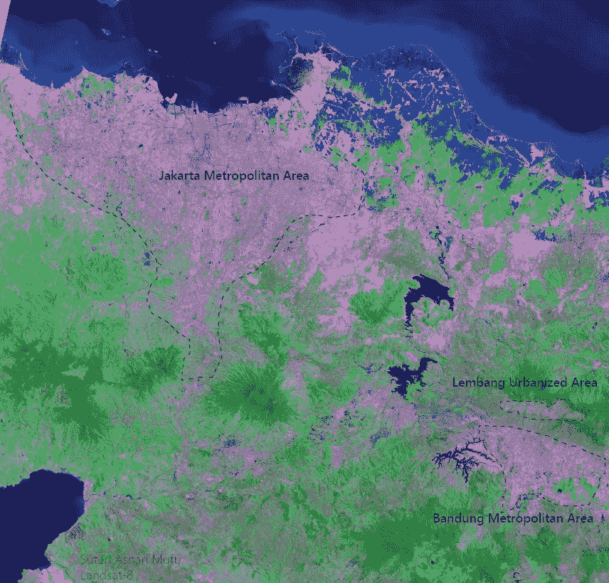
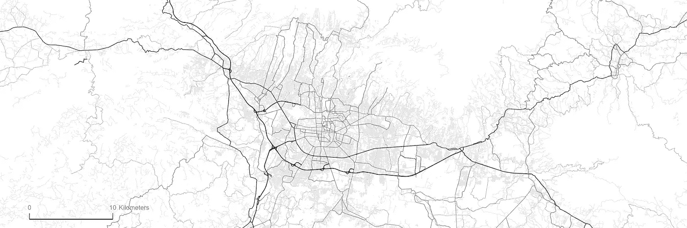
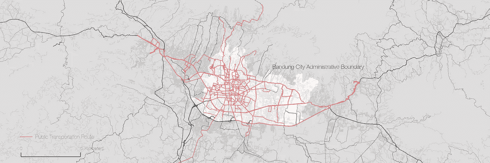
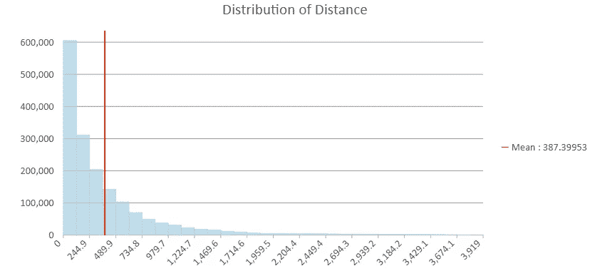
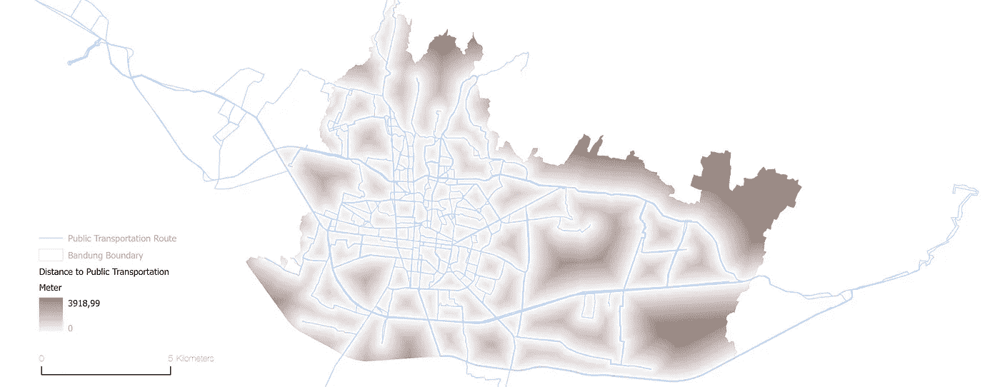
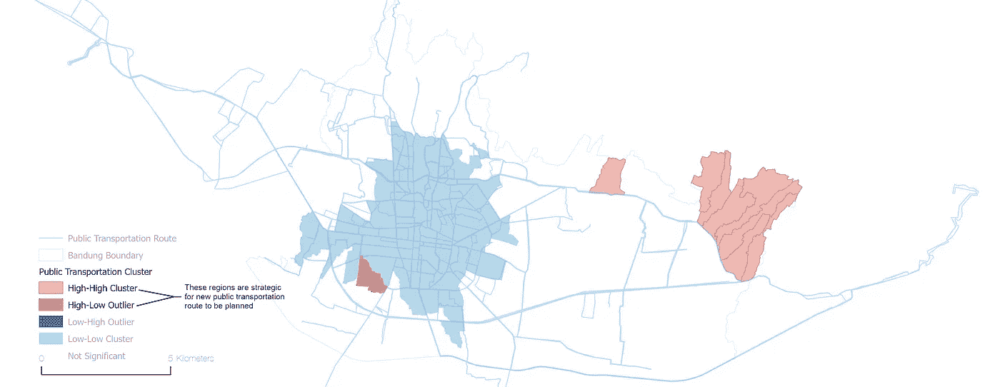

# 万隆市公共交通:服务覆盖分析

> 原文：<https://towardsdatascience.com/bandung-city-public-transportation-service-coverage-analysis-425ff9948561?source=collection_archive---------42----------------------->

万隆附近的街道网络(来源:作者，2020；OpenStreetMap 贡献者)

## [实践教程](https://towardsdatascience.com/tagged/hands-on-tutorials)

## 万隆市的公共交通服务覆盖怎么样？万隆市的公共交通网络尚未覆盖哪些区域？

# 介绍

万隆市是印度尼西亚西爪哇省的省会，也有自己的交通问题。一度被认为是印尼最拥堵的城市之一，亚洲第 14([ADB，2019](https://www.adb.org/sites/default/files/publication/524596/ado2019-update.pdf) )。这是令人震惊的，因为预计雅加达是最拥堵的城市，因为雅加达是首都，也因其拥堵而受欢迎，但雅加达是第二名(例如，[椰子雅加达(2019)](https://coconuts.co/jakarta/news/bandung-not-jakarta-is-indonesias-most-traffic-congested-city-according-to-new-study/) ，D [etik (2019)](https://news.detik.com/berita-jawa-barat/d-4736921/bandung-kota-termacet-versi-adb-polantas-belum-terlalu-kok) 等等)。万隆市甚至比孟买还糟糕。这让身为万隆市居民的我思考；**是什么让拥堵如此严重？我们如何解决拥堵问题？**

万隆市 1 天的时空干扰因子(来源:作者分析，2020；底图:OpenStreetMap 贡献者；CARTO 在[知识共享署名-相似分享 2.0](https://creativecommons.org/licenses/by-sa/2.0/) 许可下获得许可(CC BY-SA 2.0)

好吧，不可避免的解决办法是市民步行，骑自行车，或者根本不旅行。虽然步行和骑自行车限制了旅行者的耐力，但公共交通成为了解决方案。公共交通支持长途旅行，因为它使用石油/另一种能源，因此节省了旅行者的体力。通过共享空间，公共交通使交通更节能，空间效率更高，这也是它被推广的原因。

在这篇文章中，公共交通成为了讨论的主题。对于市民来说，使用公共交通应该是容易和合理的。如上所述，这种通路依赖于人的耐力，而耐力有限，旅行距离也有限。因此，**到公共交通的距离应该尽可能地靠近市民**。我敢打赌，你不会乘坐公共交通工具进行 7 公里的步行，但如果只是 300 米的步行呢？缩短距离确保了市民步行或骑自行车到公共交通站的低能耗。在我看来，这是公共交通规划的第一要务。于是我想到一个问题:**公共交通的距离分布如何？**和**万隆市哪个区域距离公共交通最远？**

通过了解远离公共交通的区域，我们可以规划或建议一条提供公共交通服务的新路线。通过了解距离的分布，我们可以了解公共交通可达性的现状。这种分布可以与其他城市进行比较，甚至可以与人口数据一起进行分析，以进行进一步的相关性分析，但这是另一篇文章的另一个主题。让我们先把注意力集中在简单的问题上。

本文分为六个部分。

*   首先，**简介**:你现在正在阅读。这一部分解释了本文的背景；
*   二、**目标与方法**:本文试图达到的目标和实现的途径；
*   三、**关于万隆市:**万隆在哪里，与雅加达的关系以及万隆市公共交通的大致描述；
*   第四，**分析**:进行分析；
*   五、**结论**:回答主问题，总结结果；
*   六、**建议**:下一步做什么解决问题，做改进。

# 目标和方法

本文的目标是**描述万隆市到最近公共交通网络的距离**，以及**识别离公共交通网络最远的区域(****)**。

**主要的地理分析技术是公共交通网络的欧氏距离分析。**该欧几里得距离的结果是连续空间数据(栅格)的形式，因此在统计上可视为[间隔/比率数据](https://www.freecodecamp.org/news/types-of-data-in-statistics-nominal-ordinal-interval-and-ratio-data-types-explained-with-examples/)。与传统/典型统计数据的不同之处在于，它具有空间属性，因此我们可以制作一个关于它的地图。

**距离的描述将通过理解由欧几里德距离产生的距离**的分布来完成。这将使用直方图分析来完成，我们不需要空间信息。

**将使用地图对地理区域标识进行可视化和分析。光栅数据实际上是一幅图像，所以我们可以用一种颜色来显示这些值。为了使官僚机构和政策规划变得具体和实用，我将采用基于最小行政边界单位的分区统计( *Kelurahan* )。之所以这样做，是因为这种分析产生的栅格的解释性质是模糊的([罗宾逊(2009](https://dx.doi.org/10.4135/9780857020130.n12) )，[扎德(1988)](https://doi.org/10.1109/2.53) )。虽然我必须说，我喜欢模糊地做，因为它清楚地表明它是什么，但要制定一项政策，我们必须明确界限。**

此外，上述识别(使用地图)将通过进行 Anselin Local Moran's I(聚类)分析来完成。进行这种分析是为了确定需要干预的战略区域。这种分析考虑到了地理关系，因此可以推断出空间关系和因果关系。别担心，我不会用数学来烦你的。这种分析的目的只是为了识别集群。

论文框架(来源:作者，2020)

# 关于万隆市

对于这一部分，我将分为两个小节。第一小节是**雅加达和万隆**；这解释了万隆和雅加达之间的地理特征和关系。第二分段是**万隆市公共交通；**这是万隆公共交通的简要信息。

## 雅加达和万隆

****的地图****爪哇岛的雅加达和万隆建成环境，Landsat 影像的假着色(来源:作者分析，2019；包含来自美国地质调查局 提供的 [*Landsat-8 图像的修改内容)*](https://www.usgs.gov/centers/eros/data-citation?qt-science_support_page_related_con=0#qt-science_support_page_related_con)

万隆市位于印度尼西亚爪哇岛。它是西爪哇省的首府。该市是万隆都市区的核心，包括西万隆县、万隆县和 Cimahi 市。如上图所示，万隆没有雅加达宽。万隆与雅加达的关系多年来一直在加强。连接雅加达和万隆的 Cipularang 收费公路的开发甚至为万隆市带来了更多的交通和投资( [Dorodjatoen (2009](https://core.ac.uk/download/pdf/291485267.pdf) ))。下图中的粗线显示了 Cipiularang 收费公路；这条路位于城市的南部。

****万隆市路网图**1:275.000 比例尺(来源:作者分析，2020；OpenStreetMap 贡献者[许可证(CC BY-SA 2.0)](https://creativecommons.org/licenses/by-sa/2.0/)**

## **万隆市公共交通**

**城市公共交通主要有两种类型:公交网络和小巴网络。小型巴士网络类似于菲律宾的吉普尼。这辆小巴叫“ *angkot* ”，无处不在。公交网络只是一种在世界任何地方都能找到的典型公交。这辆巴士由一家国有企业 Damri 公司运营。虽然城市间的公共交通是存在的，而且通常由私人公司运营，但这不在本文的主题范围之内。该网络如下图所示。**

****

****图**中的**图**万隆都市区公共交通网络及万隆市行政边界(来源:作者，2020；OpenStreetMap 贡献者[许可(CC BY-SA 2.0)](https://creativecommons.org/licenses/by-sa/2.0/)；路线数据: [angkot.web.id](https://angkot.web.id/route/#/)**

**根据经验，万隆系统的一个主要功能是没有公共交通停靠点。你可以在任何地方上船，也可以在任何地方下船，只要你是在线路内上船/下船。公共交通站是有的，但在社会中并没有制度化。**

**另一种公共交通工具是由 Gojek 和 Grab 提供的出租车和叫车服务(就像优步一样)。打车有它自己的问题，因为政府的政策不承认打车是公共交通。然而，这些非路线基础的公共交通工具不是这个话题的议题。**

# **分析**

**本节分为两小节:**距离分布**，和**最远距离地理标识**。**

## **距离分布**

**使用欧几里德距离，可以生成分辨率为 10 米的栅格。Y 轴表示细胞的频率。所以，下面的 Y 轴图代表了实际面积，如果我们把它乘以 100 平方米。如图所示，平均距离为 387.4 米。这很好，因为空间规划指导部规定，以公交为导向的开发区距离交通设施 800 米。虽然，我们必须注意，387，4 m 是欧几里得的，不是基于网络分析的。这意味着我们假设人们直接飞往交通网络，因此这种分析更多的是一种近似。然而，仍有一些地区的距离超过 800 米。**

****

**到最近交通网络的距离直方图(来源:作者的分析，2020 年)**

## **地理标识欧几里得距离**

**下面这张地图是欧几里德距离分析的结果。这是一幅分辨率为 10 米的栅格图像，其中包含的数字表示到最近交通网络的距离。较暗的单元格表示离最近的蓝线(公共交通网络)较远。最远距离 3918.99 米。**

****

**使用欧氏距离的模糊分析(来源:作者分析，2020；路线数据: [angkot.web.id](https://angkot.web.id/route/#/)**

**原始欧氏距离栅格是模糊的。没有界限来决定哪个区域高或者低。当然，我们可以将其与前面提到的 800 米 TOD 距离进行比较，但它截断了远距离的统计特性。例如，这将距离为 900 米的区域视为距离为 3，000 公里的区域。对我来说，更合理的方法是识别聚类。识别集群是有帮助的，因为我们可以创建到达集群的新路径。这是合理的，因为通过将网络的一条线添加到一个集群(假设是一个区域)，它会影响集群周围的区域。这有效地缩短了距离。**

**Anselin Moran 的-I 是一种空间统计方法，用于通过了解数据的空间关系来识别聚类。结果是每个地理单元的分类，有 4 类:高-高、高-低、低-高和低-低。高-高意味着该区域的值(或地理单元)被高值区域包围。高低意味着该区域的值被低值区域包围，以此类推。一个地理单元的低/高通过与其他单元进行比较来统计确定。**

**在这种情况下，有 3 个识别的聚类:高-高、低-低和高-低，如下图所示。有 8 个高-高区域，有 1 个高-低区域。低-低区域意味着该区域周围的距离很短，这很好，但现在这不是本文的兴趣所在。高低点区域是一个距离网络很远的区域，但它被距离很近的区域所包围。现在，在城市的东部有许多高-高区域，我会说:**这些(东部)区域在万隆市的公共交通可达性方面是最差的。****

****

**距离聚类分析(来源:作者分析，2020；路线数据: [angkot.web.id](https://angkot.web.id/route/#/)**

# **结论**

**万隆市被认为是印尼最拥堵的城市(亚行，2019)。为此，公共交通不可避免地必须得到促进。其中一个方法是缩短到公共交通的距离。这样，公共交通的可达性可以得到改善，因为人们更容易步行。本文探讨万隆市与公共交通的距离，本文使用的主要方法是进行欧氏距离分析。**

**首先，本文从欧氏距离的角度分析了距离的分布。这些区域的平均距离是 387.4 米。这很棒，因为它低于空间规划部 TOD 指南建议的 800 米步行距离。但是，直方图显示，有些区域距离最近的公共交通超过 800 米。**

**其次，本文制作了两张地图:欧氏距离地图，这是一种模糊分析；和聚类图(使用区域统计和安瑟林·莫兰的 I 到最低行政边界(*凯鲁拉汉*))来支持政策规划。大多数远离公共交通的地区位于城市的东部。这些东部地区对于即将制定的新公共交通计划具有战略意义。**

# **建议**

**现在我们知道，城市东部的公共交通可达性很差。在未来，这个问题需要通过规划新的路线来解决。必须咨询当地人，以便更好地规划路线目的地。**

**这项研究只确定了距离，但有些地区不需要公共交通。例如，作为跑道的机场跑道占用了大量土地。这项研究将机场跑道确定为远离公共交通网络的区域，因此我们需要考虑距离背后的土地利用。也许，这些区域无法进入是有原因的。下一步的研究应该考虑土地利用(或土地覆盖)。**

**最后，下一次分析需要考虑人口因素。就像土地使用一样，也许，有些地区就是没有居民。尽管这些地区远离公共交通网络，但规划一条通往无人居住的荒凉地区的交通路线是不合理的(以确保商业可行性)。除此之外，还有一些地区发展规划考虑在内。**