# 银行机构定期存款预测模型

> 原文：<https://towardsdatascience.com/bank-institution-term-deposit-predictive-model-83afe1d2b08c?source=collection_archive---------23----------------------->

## 循序渐进的方法


在 [Unsplash](https://unsplash.com/s/photos/data-science?utm_source=unsplash&utm_medium=referral&utm_content=creditCopyText) 上由 [Carlos Muza](https://unsplash.com/@kmuza?utm_source=unsplash&utm_medium=referral&utm_content=creditCopyText) 拍摄的照片

感谢 [10 学院](https://www.10academy.org/)培训项目，通过参与不同的项目，我了解了许多数据科学概念，每个项目都以自己的方式面临挑战。

**银行机构定期存款预测模型**是我觉得有意思的一个项目。它的主要目标是建立一个模型，预测客户是否会订阅银行定期存款，本文旨在分享我建立模型的一步一步的方法。

## 内容

*   数据
*   探索性数据分析
*   数据预处理
*   机器学习模型
*   比较结果
*   预言；预测；预告
*   结论
*   继续教育

## 数据

此项目中使用的数据集(Bank-additional-full.csv)包含银行客户的数据。数据集及其信息可以在这里[获得](http://archive.ics.uci.edu/ml/datasets/Bank+Marketing)。执行数据分析的第一步是导入必要的库和数据集。

```
# importing the necessary libraries
import pandas as pd
import numpy as np
import matplotlib.pyplot as plt
import matplotlib as mpl
import seaborn as sns

import warnings
warnings.filterwarnings('ignore')#importing the dataset
dataset = pd.read_csv('bank-additional-full.csv', sep=';')
dataset.name = 'dataset'
dataset.head()
```

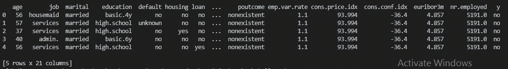

作者图片

## 探索性数据分析

EDA 是机器学习模型开发的重要组成部分，因为它帮助我们理解我们的数据并提取有用的见解，这将有助于[特征工程](https://en.wikipedia.org/wiki/Feature_engineering#:~:text=Feature%20engineering%20is%20the%20process,as%20applied%20machine%20learning%20itself.)。本项目中执行的一些 EDA 包括但不限于以下内容:

*   **数据集的形状和大小**

```
# function to check the shape of a dataset
def data_shape(data):
    print(data.name,'shape:',data.shape)# function to check the size of a dataset
def data_size(data):
    print(data.name,'size:',data.size)# Getting the shape of the dataset
data_shape(dataset)# Getting the size of the dataset
data_size(dataset)
```

数据集形状:(41188，21)
数据集大小:864948

**。shape** 返回数据集的行数和列数。

**。size** 返回数据中元素的数量，即行数乘以列数。

*   **信息和统计汇总**

```
# function to ckeck the information of a dataset
def data_info(data):
    print(data.name,'information:')
    print('---------------------------------------------')
    print(data.info())
    print('---------------------------------------------')# Getting the information of the dataset
data_info(dataset)
```

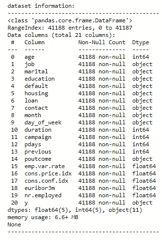

作者图片

**。info()** 用于获得数据集的简明摘要。

```
# Getting the statistical summary
dataset.describe().T
```

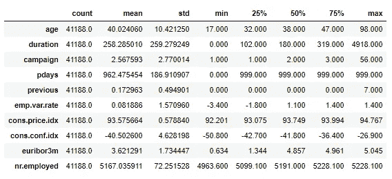

作者图片

**。describe()** 用于查看一些基本的统计细节，如百分位数、平均值、标准差等。数据集中的数字列。

*   **唯一值和缺失值**

```
# function to get all unique values in the categorical variables
def unique_val(data):
    cols = data.columns
    for i in cols:
        if data[i].dtype == 'O':
            print('Unique values in',i,'are',data[i].unique())
            print('----------------------------------------------')# Getting the unique values in the categorical columns
unique_val(dataset)
```

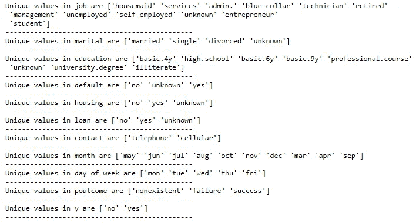

作者图片

**。unique()** 返回数据集分类列中的唯一值。

```
# function to check for missing values
def missing_val(data):
    print('Sum of missing values in', data.name)
    print('------------------------------')
    print(data.isnull().sum())
    print('------------------------------')# Getting the missing values in the dataset
missing_val(dataset)
```

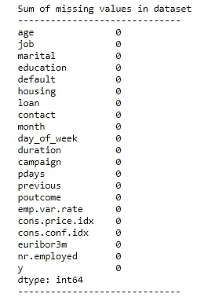

作者图片

**。isnull()。sum()** 返回数据集中每一列缺失值的总和。幸运的是，我们的数据集没有缺失值。

*   **分类变量和数值变量**

```
# Categorical variables
cat_data = dataset.select_dtypes(exclude='number')
cat_data.head()# Numerical variables
num_data = dataset.select_dtypes(include='number')
num_data.head()
```

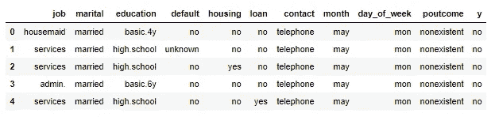

分类变量

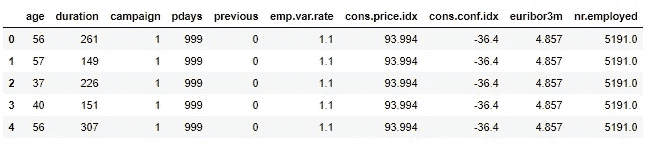

数字变量

**。select _ dtypes(exclude = ' number)**返回所有不具有数值数据类型的列。

**。select _ dtypes(exclude = ' number)**返回所有具有数字数据类型的列。

*   **单变量和双变量分析**

我利用 tableau(一种数据可视化工具)进行单变量和双变量分析，tableau 的故事可以在[这里](https://public.tableau.com/views/ExploratoryDataAnalysis-Week6/ExploratoryDataAnalysis?:language=en&:display_count=y&:origin=viz_share_link)找到。

*   **相关性**

```
# using heatmap to visualize correlation between the columns
fig_size(20,10)
ax = sns.heatmap(dataset.corr(), annot=True, fmt='.1g', 
                 vmin=-1, vmax=1, center= 0)# setting the parameters
fig_att(ax, "Heatmap correlation between Data Features", 
        "Features", "Features", 35, 25, "bold")
plt.show()
```

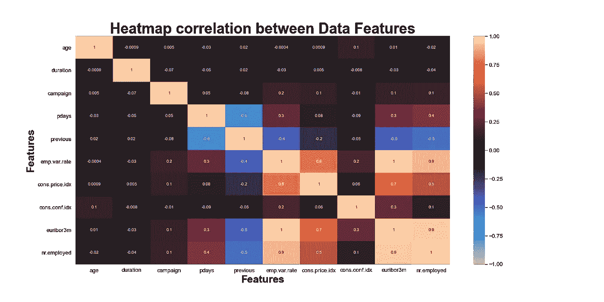

作者图片

相关性显示数据集中变量之间的关系。

*   **异常值**

Seaborn boxplot 是检查数据集异常值的方法之一。

```
# Using boxplot to identify outliers
for col in num_data:
    ax = sns.boxplot(num_data[col])
    save(f"{col}")
    plt.show()
```

上面的代码将数据集中的数值列可视化，并使用四分位间距(IQR)方法处理检测到的异常值。代码可以在这个 [GitHub 库](https://github.com/gloryodeyemi/10AcademyWeeklyChallenges/tree/master/week6/notebooks)中找到。

在 EDA 过程中，我发现了我们的目标变量“y”——客户是否订阅了定期存款？(二进制:“是”，“否”)，是高度不平衡的，这可能会影响我们的预测模型。这一点很快就会被注意到，本文给出了一些处理职业不平衡的技巧。

## 数据预处理

在构建机器学习模型时，对数据进行预处理以获得高效的模型是很重要的。

```
# create list containing categorical columns
cat_cols = ['job', 'marital', 'education', 'default', 'housing',
            'loan', 'contact', 'month', 'day_of_week', 'poutcome']# create list containing numerical columns
num_cols = ['duration', 'campaign', 'emp.var.rate',"pdays","age",       'cons.price.idx', 'cons.conf.idx', 'euribor3m', 'nr.employed', 'previous']
```

在此阶段完成了以下预处理:

*   **编码分类列**

机器学习算法只读取数值，这就是为什么我们需要将分类值改为数值。我使用 pandas get_dummies 方法和类型转换对列进行一次性编码。

```
# function to encode categorical columns
def encode(data):
    cat_var_enc = pd.get_dummies(data[cat_cols], drop_first=False)
    return cat_var_enc# defining output variable for classification
dataset_new['subscribed'] = (dataset_new.y == 'yes').astype('int')
```

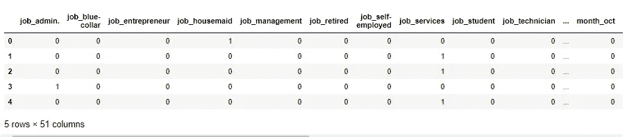

作者图片

*   **重新调整数值列**

另一种数据预处理方法是重新调整我们的数字列；这有助于在特定范围内使我们的数据正常化。这里使用了 Sklearn 预处理 StandardScaler()。

```
# import library for rescaling
from sklearn.preprocessing import StandardScaler# function to rescale numerical columns
def rescale(data):
    # creating an instance of the scaler object
    scaler = StandardScaler()
    data[num_cols] = scaler.fit_transform(data[num_cols])
    return data
```

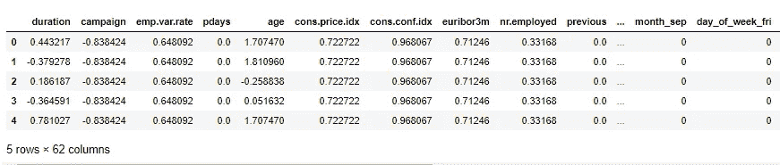

作者图片

*   **指定因变量和自变量**

为了继续建立我们的预测模型，我们必须指定我们的因变量和自变量。

独立变量—是被分析过程的输入。

因变量—因变量是流程的输出。

```
X = data.drop(columns=[ "subscribed", 'duration'])
y = data["subscribed"]
```

列“duration”已被删除，因为它对输出目标有很大影响(例如，如果 duration=0，则 y =“no”)。

*   **分割数据集**

在构建机器学习模型时，总是将数据集分为训练集和测试集是合理的，因为这有助于我们评估模型的性能。

```
# import library for splitting dataset
from sklearn.model_selection import train_test_split# split the data
X_train,X_test,y_train,y_test = train_test_split(X,y,test_size = 0.1,random_state=1)
```

*   **降维**

在我们有大量变量的情况下，建议考虑通过保留最重要的变量来减少这些变量，有各种技术可以做到这一点，例如:主成分分析、TSNE、自动编码器等。对于这个项目，我们将考虑 PCA。

```
# import PCA
from sklearn.decomposition import PCA# create an instance of pca
pca = PCA(n_components=20) # fit pca to our data
pca.fit(X_train)
pca_train = pca.transform(X_train)
X_train_reduced = pd.DataFrame(pca_train)
```

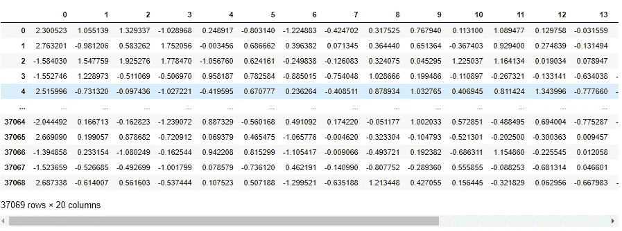

作者图片

*   **阶层失衡**

如前所述，我们有一个高度不平衡的阶层，如果不加以处理，这会影响我们的预测。

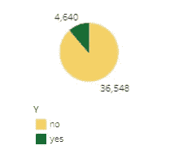

作者图片

在这个项目中，我利用 SMOTE(合成少数过采样技术)来处理类不平衡。

```
# importing the necessary function 
from imblearn.over_sampling import SMOTE# creating an instance
sm = SMOTE(random_state=27)# applying it to the training set
X_train_smote, y_train_smote = sm.fit_sample(X_train_reduced, y_train)
```

**注意:**对训练数据使用 SMOTE 为宜。

## 机器学习模型

咻！，我们终于成功地建立了模型；当试图建立机器学习模型时，数据预处理可能是如此困难。我们不要浪费时间，直接开始吧。

本项目中考虑的机器学习算法包括:

*   逻辑回归
*   XGBoost
*   多层感知器

所使用的交叉验证(这是非常重要的，尤其是在我们有不平衡类的情况下)方法包括:

*   **K-Fold:** K-Fold 将给定的数据集分割成 K 个部分/折叠，其中每个折叠在某个点被用作测试集。
*   **分层 K-Fold:** 这是返回分层褶皱的 K-Fold 的变体。折叠是通过保留每个类别的样本百分比来完成的。

```
# import machine learning model libraries
from sklearn.linear_model import LogisticRegression
from xgboost import XGBClassifier
from sklearn.neural_network import MLPClassifier# import libraries for cross validation
from sklearn.model_selection import KFold
from sklearn.model_selection import StratifiedKFold
from sklearn.model_selection import cross_validatemetrics = ['accuracy', 'roc_auc', f1', 'precision', 'recall']# function to build machine learning models
def model(model, cv_method, metrics, X_train, X_test, y_train):
    if (model == 'LR'):
        # creating an instance of the regression
        model_inst = LogisticRegression()
        print('Logistic Regression\n----------------------')
    elif (model == 'XGB'):
        # creating an instance of the classifier
        model_inst = XGBClassifier()
        print('XGBoost\n----------------------')
    elif (model == 'MLP'):
        # creating an instance of the classifier
        model_inst = MLPClassifier()
        print('Multi Layer Perceptron\n----------------------')

    # cross validation
    if (cv_method == 'KFold'):
        print('Cross validation: KFold\n--------------------------')
        cv = KFold(n_splits=10, random_state=100)
    elif (cv_method == 'StratifiedKFold'):
        print('Cross validation: StratifiedKFold\n-----------------')
        cv = StratifiedKFold(n_splits=10, random_state=100)
    else:
        print('Cross validation method not found!')
    try:
        cv_scores = cross_validate(model_inst, X_train, y_train, 
                                   cv=cv, scoring=metrics)   
        # displaying evaluation metric scores
        cv_metric = cv_scores.keys()
        for metric in cv_metric:
            mean_score = cv_scores[metric].mean()*100
            print(metric+':', '%.2f%%' % mean_score)
            print('')

    except:
        metrics = ['accuracy', 'f1', 'precision', 'recall']
        cv_scores = cross_validate(model_inst, X_train, y_train, 
                                   cv=cv, scoring=metrics)
        # displaying evaluation metric scores
        cv_metric = cv_scores.keys()
        for metric in cv_metric:
            mean_score = cv_scores[metric].mean()*100
            print(metric+':', '%.2f%%' % mean_score)
            print('') return model_inst
```

**评估指标**

*   **精度:**正确预测的数据点个数。对于不平衡的数据集，这可能是一个误导性的指标。因此，建议考虑其他评估指标。
*   **AUC**(ROC 曲线下的面积):它提供了对所有可能的分类阈值的综合性能测量。
*   **精度:**计算为正确预测的正例数除以预测的正例总数的比率。
*   **召回:**指被你的算法正确分类的相关结果总数的百分比。
*   **F1 评分:**这是准确率和召回率的加权平均值。

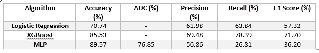

k 倍交叉验证评估指标

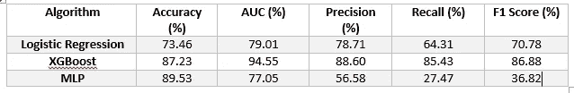

分层 K 倍评估指标

## **比较结果**

*   **K 线折叠 vs 层状 k 线折叠**

从上表中可以看出，与 K 倍交叉验证相比，分层 K 倍验证呈现出更好的结果。K 倍交叉验证未能提供逻辑回归和 XGBoost 模型的 AUC 评分。因此，为了进一步比较，将使用分层的 K 倍结果。

*   **机器学习模型**

从得到的结果来看，XGBoost 被证明是比逻辑回归和 MLP 更好的预测模型，因为它在 4/5 的评价指标中具有最高的百分比值。

## 预言；预测；预告

XGboost 是性能最好的模型，用于预测。

```
# fitting the model to the train data
model_xgb = xgb.fit(X_train_smote, y_train_smote)# make predictions
y_pred = xgb.predict(X_test_pca)
```

## 结论

这个项目的主要目标是建立一个模型来预测将订阅银行定期存款的客户，我们通过考虑三个不同的模型并使用最佳模型来进行预测，从而实现了这一目标。我们还经历了为模型准备数据和选择各种评估指标来衡量模型性能的严格步骤。

在得到的结果中，我们观察到 XGBoost 是最好的模型，在 4/5 的评估指标中有很高的百分比值。

## **深造**

在这个项目中，我只用了三种机器学习算法。然而，算法如；SVM、随机森林、决策树等。可以探索。

这个项目的详细代码可以在这个 [GitHub 库](https://github.com/gloryodeyemi/10AcademyWeeklyChallenges/tree/master/week6)中找到。

我知道这是一个很长的旅程，但谢谢你陪我到最后。我也再次感谢学院和我的同学们给了我参与这个项目的绝佳机会。

## 参考

*   [语法检查器](http://www.grammarly.com)
*   [阶层失衡](/methods-for-dealing-with-imbalanced-data-5b761be45a18)
*   [数据集](http://archive.ics.uci.edu/ml/datasets/Bank+Marketing)
*   [特征工程](https://en.wikipedia.org/wiki/Feature_engineering#:~:text=Feature%20engineering%20is%20the%20process,as%20applied%20machine%20learning%20itself.)
*   [主成分分析](/all-you-need-to-know-about-pca-technique-in-machine-learning-443b0c2be9a1)
*   [画面](https://public.tableau.com/en-gb/s/resources)
*   [机器学习算法](https://scikit-learn.org/stable/)