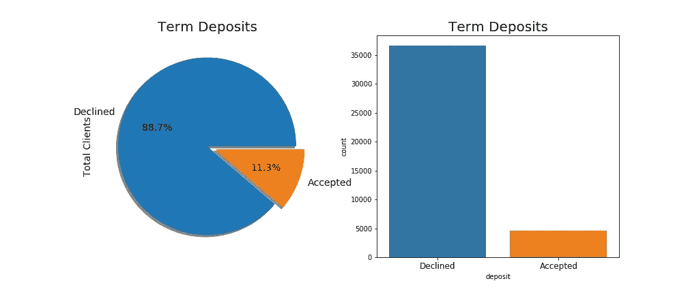
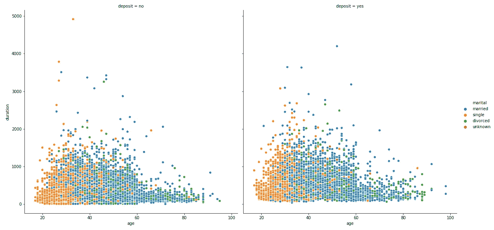
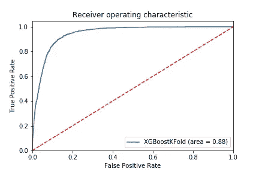
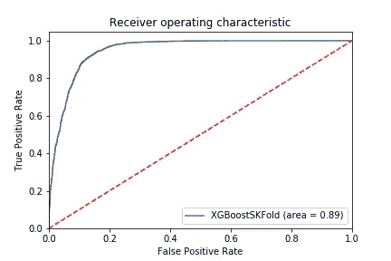

# 银行机构定期存款预测模型

> 原文：<https://towardsdatascience.com/bank-institution-term-deposit-predictive-model-9f0b7c2fd38f?source=collection_archive---------18----------------------->

## 不同机器学习模型在银行定期存款预测中的比较。


蒂姆·埃文斯在 [Unsplash](https://unsplash.com?utm_source=medium&utm_medium=referral) 上拍摄的照片

# **简介**

葡萄牙银行的投资和投资组合部门希望能够识别出有可能认购其定期存款的客户。由于营销经理越来越有兴趣仔细调整他们的定向活动，以严格选择联系人，手头的任务是找到一个模型，可以预测哪些未来客户将订阅银行的定期存款。
在这篇文章中，我将讨论数据探索、数据清理、特征提取、处理类别不平衡，以及开发一个强大的机器学习算法来预测哪些潜在客户将使用不同的机器学习库来订阅定期存款。包含所有代码的 Github 库在这里[可以找到](https://github.com/johnlotome/Bank-deposit-predictive-model)。

**套餐**

下面是使用的不同的机器学习和 python 包。

# **探索性数据分析**

探索性数据分析通常是每个数据科学项目的初始过程。通常，对数据进行初步调查以识别模式、异常值、不平衡以及检验先前的假设是至关重要的。汇总统计和可视化主要用于执行探索性数据分析。

> "没有常规的统计问题，只有可疑的统计常规."大卫·考克斯爵士



定期存款的认购利率

从上面的输出中，可以提取数据的一些模式。根据潜在客户是否认购定期存款对数据进行分组表明，大多数客户没有认购定期存款，88.7%的客户拒绝认购，而 11.3%的客户接受了认购要约。我们试图预测的这种阶层比例的显著差异导致了不平衡的数据。



一组基于婚姻状况的订阅费率

上面的输出显示了订阅定期存款的客户群和根据婚姻状况拒绝订阅的客户群。

# **数据预处理**

## 使用 PyOD 清除异常值

异常值是与其他观察值显著不同的数据点，这可能是由于测量中的可变性，或者它可能表明实验误差。在不检查和处理异常值的情况下训练机器学习模型的诱惑通常是失败的原因。数据中的异常值会极大地影响模型的准确性，但是简单地从数据中移除异常值而不考虑对结果的影响是一种不好的做法，因为异常值并不总是一件坏事。

> “离群值不一定是坏事。这些只是观察结果，与其他观察结果没有遵循相同的模式。但是异常值可能是非常有趣的。例如，如果在一个生物实验中，一只老鼠没有死，而其他所有的老鼠都死了，那么理解为什么会这样会很有趣。这可能会导致新的科学发现。因此，检测异常值非常重要。”皮埃尔·拉法叶·德·米肖，作家和统计学家。

检测异常值的常见做法是使用箱线图、直方图和散点图。这种方法在大型数据集中可能效率不高。PyOD，python 库有不同的算法，可以用来检测和清除异常值。对于这种情况，我们使用 k-最近邻检测器。

## 一键编码

数据集通常包含数字和分类变量，但机器学习算法只理解数字而不理解文本，这就是为什么我们需要转换或变换分类变量，这一过程称为分类编码。有两种类型的分类编码:

*   标签编码
*   一键编码

当分类列中的类别包含具有某种顺序或层次结构的数据时，标签编码非常有用。One-Hot 编码的工作方式是，根据列中类别的数量，将要编码的列分成多个列。然后，根据哪一列有什么值，类别被替换为 1 和 0。我们还使用 StandardScaler 来重新调整所有数字列。这是有用的，因为一些变量经常在不同的尺度上测量，并且不会对模型拟合做出同等贡献，这可能导致训练的模型产生一些偏差。

## 处理不平衡数据

在不平衡的数据集上训练机器学习模型可能会导致不准确的预测。在这种情况下，我们使用随机抽样技术来处理不平衡数据。随机过采样的工作原理是从少数类中随机采样数据，并复制它以创建更多的样本，这个过程一直重复，直到分布相等。
随机采样技术的缺点之一是，它可能会导致过度拟合，因为它会复制现有的少数数据集。

## 利用主成分分析进行维数约简

降维是一种减少数据集中输入变量或特征数量的技术。更多的输入特征通常会使预测建模任务对模型更具挑战性，这被称为维数灾难。有不同的降维技术，如自动编码器和 t-SNE，这是一种概率技术。对于我们的情况，我们使用主成分分析(PCA)进行降维。PCA 执行数据到低维空间的线性映射，使得低维表示中数据的方差最大化。我们只对特征进行了 PCA，不包括标签。

# 系统模型化

下面的代码片段显示了我在比较不同建模算法时使用的一种方法。初始化参数时需要四个参数

1.  型号类型。对于这个案例，我使用了 XGBoost 分类器、多层感知器分类器**、**逻辑回归和支持向量机。
2.  交叉验证技术，即 k 倍或分层 k 倍
3.  x 是数据集的特征
4.  哪个是标签

不同模型的初始化

# 结果和结论

在所有选择的模型中，即使使用超参数调整，XGBoost 分类器也具有更高的准确度分数。下图显示了所使用的 XGBoost 模型的不同指标得分。使用分层 k 倍和 k 倍交叉验证时，得分略有显著差异。分层 k 倍比 k 倍有更高的分数。

```
Accuracy scores of the model: 0.88

 Classification report of the model
--------------------------------------
              precision    recall  f1-score   support

           0       0.89      0.87      0.88      3442
           1       0.88      0.90      0.89      3537

    accuracy                           0.88      6979
   macro avg       0.89      0.88      0.88      6979
weighted avg       0.89      0.88      0.88      6979

 Confusion Matrix of the model
--------------------------------------
[[2993  449]
 [ 354 3183]]
```

我们的模型的准确率为 0.88，精确度和召回率高于 0.87。

使用 k 倍交叉验证时的 ROC 图显示得分为 0.88。



k 倍 ROC 图

当使用分层 k 倍时，得分增加了 0.01



分层 k 倍 ROC 图

由于 XGBoost 对少数类具有更高的精确度、召回率和 f1 分数，而少数类是潜在客户是否会认购定期存款的更重要的分类，因此银行应使用 XGBoost 模型。通过不同的超参数调整技术，模型可以得到更高的分数。

尊重并感谢我所有的同学和[10 学院](http://10academy.org)的工作人员，感谢他们的支持。

# 参考

[](https://machinelearningmastery.com/how-to-configure-k-fold-cross-validation/) [## 如何配置 k 倍交叉验证-机器学习精通

### k-fold 交叉验证过程是评估机器学习性能的标准方法。

machinelearningmastery.com](https://machinelearningmastery.com/how-to-configure-k-fold-cross-validation/) [](https://machinelearningmastery.com/model-based-outlier-detection-and-removal-in-python/) [## Python -机器学习掌握中的 4 种自动离群点检测算法

### 分类或回归数据集中异常值的存在会导致拟合不佳和预测性降低…

machinelearningmastery.com](https://machinelearningmastery.com/model-based-outlier-detection-and-removal-in-python/) [](https://www.analyticsvidhya.com/blog/2019/02/outlier-detection-python-pyod/) [## 使用 PyOD 库学习 Python 离群点检测的精彩教程

### 我最近的数据科学项目涉及预测特定商店中每种产品的销售额。有几个…

www.analyticsvidhya.com](https://www.analyticsvidhya.com/blog/2019/02/outlier-detection-python-pyod/) [](https://scikit-learn.org/stable/modules/generated/sklearn.neural_network.MLPClassifier.html) [## 。神经网络。MLP 分类器-sci kit-学习 0.23.2 文档

### sklearn.neural_network 类。MLP classifier(hidden _ layer _ sizes =(100，)，activation='relu '，*，solver='adam'…

scikit-learn.org](https://scikit-learn.org/stable/modules/generated/sklearn.neural_network.MLPClassifier.html)  [## Python API 参考-xgboost 1 . 3 . 0-快照文档

### 本页给出了 xgboost 的 Python API 参考，更多内容请参考 Python 包介绍…

xgboost.readthedocs.io](https://xgboost.readthedocs.io/en/latest/python/python_api.html) [](https://scikit-learn.org/stable/modules/generated/sklearn.ensemble.RandomForestClassifier.html) [## 3.2.4.3.1.sk learn . ensemble . randomforestclassifier-sci kit-learn 0 . 23 . 2 文档

### class sk learn . ensemble . RandomForestClassifier(n _ estimators = 100，*，criterion='gini '，max_depth=None…

scikit-learn.org](https://scikit-learn.org/stable/modules/generated/sklearn.ensemble.RandomForestClassifier.html)