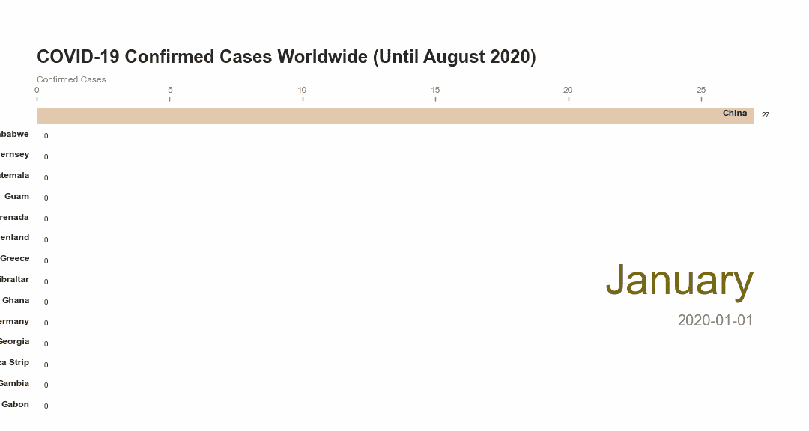
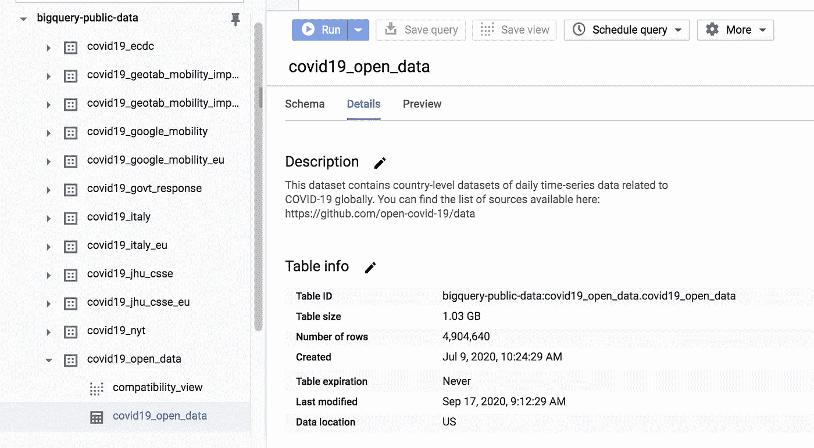
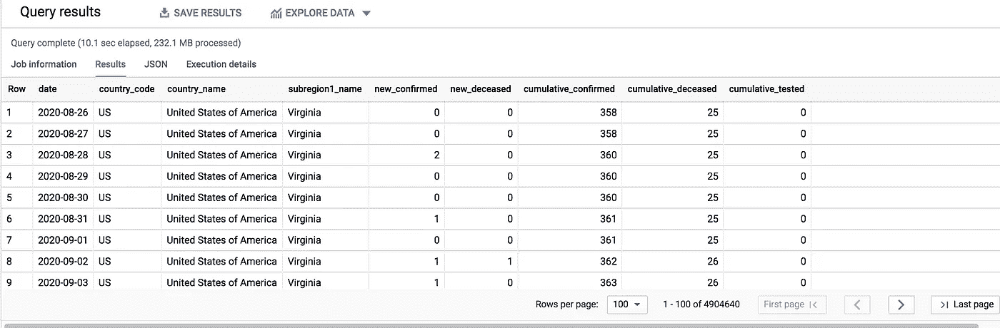
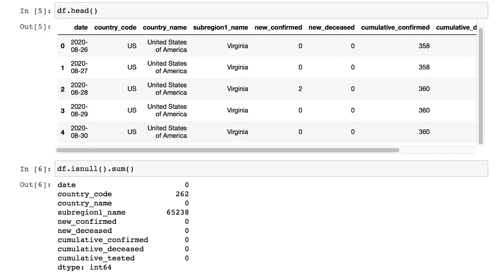
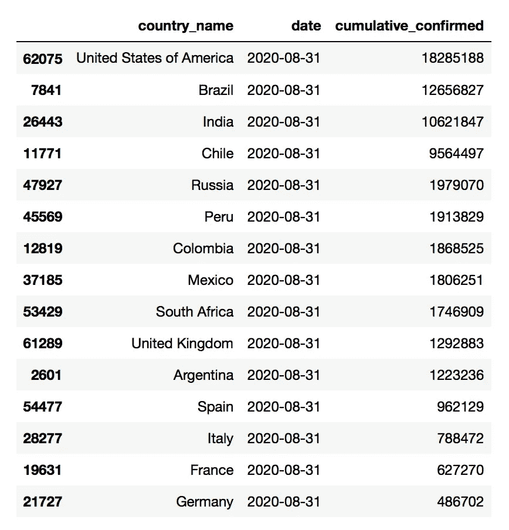
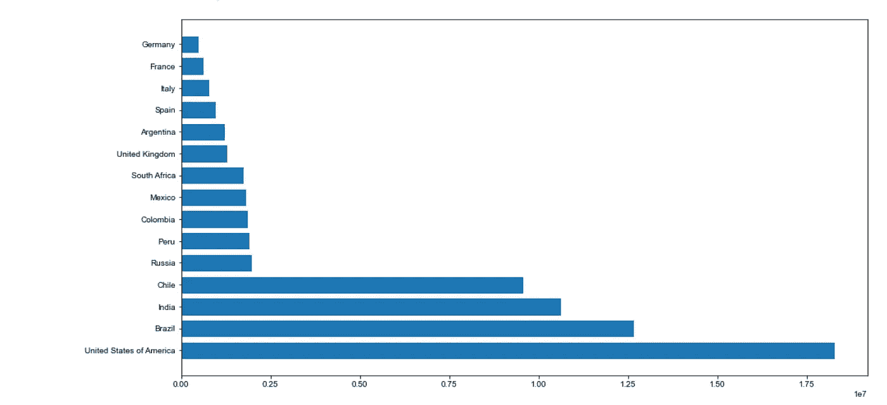
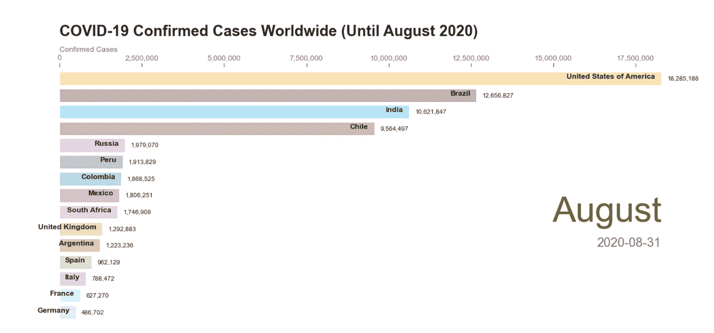
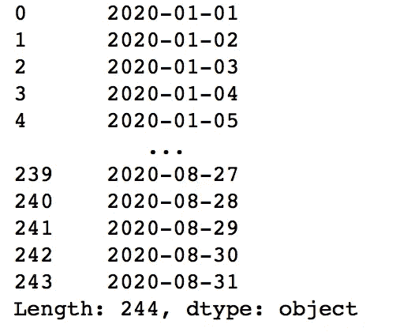

# Python 条形图竞赛动画:新冠肺炎案例

> 原文：<https://towardsdatascience.com/bar-chart-race-animation-with-python-covid-19-cases-43655a47ed23?source=collection_archive---------20----------------------->

## [变更数据](https://towardsdatascience.com/tagged/data-for-change)



条形图比赛 GIF

八个多月来，新冠肺炎已经摧毁了许多国家。100 万病例已经得到证实，而且这个数字每天都在增加。

感谢谷歌为我们公开和免费提供了 Corona 数据集。它使我们有可能做我们自己的与这个疫情相关的分析，例如，创建条形图比赛动画。数据存储在谷歌云平台上，可以在这里[访问](https://console.cloud.google.com/bigquery?p=bigquery-public-data&d=covid19_open_data&page=dataset)。

# **收集数据**

首先在`bigquery-public-data`数据集中找到名为`covid19_open_data`的 [BigQuery](https://cloud.google.com/bigquery) 表。



新冠肺炎数据集。*作者图片*

共 45 栏，逐日呈现各个国家(和地区)的电晕案例信息。您可以根据要进行的分析类型，专门选择要下载的数据。例如，我运行下面的 SQL 来检索日期、国家、地区和发生的案例数。

```
SELECT
  date,
  country_code,
  country_name,
  subregion1_name,
  COALESCE(new_confirmed,0) AS new_confirmed,
  COALESCE(new_deceased,0) AS new_deceased,
  COALESCE(cumulative_confirmed,0) AS cumulative_confirmed,
  COALESCE(cumulative_deceased,0) AS cumulative_deceased,
  COALESCE(cumulative_tested,0) AS cumulative_tested
FROM
  `bigquery-public-data.covid19_open_data.covid19_open_data`
```



查询结果。*作者图片*

您可以将结果保存到。CSV 文件，稍后使用 Python 打开它。

# 准备数据

现在，让我们用 Python 来转换数据。首先要做的是打开 Jupyter 笔记本，然后导入必要的包来转换和可视化数据。之后，打开。csv 文件并将其保存为 DataFrame 对象。

```
import pandas as pd
import matplotlib.pyplot as plt
import matplotlib.ticker as ticker
import matplotlib.animation as animation
import numpy as np
import matplotlib.colors as mcimport colorsys
from IPython.display import HTML
from datetime import datetime
from random import randintdf = pd.read_csv ('covid19-20200917.csv')
```

为了利用数据，我们需要首先了解数据的特征。您可以通过查看数据类型和每一列的值来探索它。



*作者图片*

从上面的结果中，我们知道在**国家代码**和**子区域 1 名称**列中有空值。

就我而言，分析的目的是创建一个从 2020 年初到去年 8 月每个国家确诊病例总数的条形图。我们可以依赖数据集中的三个主要列；**日期**、**国家名称**、**累计确认**。这些列没有空值，所以我们可以继续下一步。

通过使用熊猫，总结每个国家每天的累计确认总数。然后，检查结果。例如，我使用`2020-08-31`作为日期参数

```
df = pd.DataFrame(df.groupby(['country_name','date'])['cumulative_confirmed'].sum()).reset_index()current_date = '2020-08-31'
dff = df[df['date'].eq(current_date)].sort_values(by='cumulative_confirmed', ascending=False).head(15)
```



8 月确诊病例最多的 15 个国家。*作者图片*

# 将数据可视化

然后，我们可以开始使用 [Matplotlib](https://matplotlib.org/) 来可视化它。

```
fig, ax = plt.subplots(figsize=(15, 8))
sns.set(style="darkgrid")
ax.barh(dff['country_name'], dff['cumulative_confirmed'])
```



*作者图片*

要创建条形图比赛动画，我们需要用某种颜色将每个国家分组。所以，不管国家的位置在哪里，看它的颜色还是可以追踪到的。

主代码在。ipynb 格式。由于美观的需要，这个特定的功能被分离到一个. py 文件中。

这个方法的主要作用是给每个国家颜色，这个颜色是随机确定的。定义了颜色的变换方式后，我们就可以继续画柱状图了。

主代码在。ipynb 格式。由于美观的需要，这个特定的功能被分离到一个. py 文件中。

在上面的方法中，我们对数据框中的数据进行了排序，因此只有每个日期确诊病例最多的 15 个国家将出现在条形图中。然后，我们给颜色的酒吧和它的属性。对于每个日期，我们提取要在条形右侧强调的月份名称。



条形图设计

如果我们使用`2020-08-31`作为日期参数，上面的图表就是 draw_barchart 方法的结果。你可以根据自己的喜好调整代码来装饰条形图。

完成条形图设计后，我们需要做的就是定义将要出现在条形图动画范围内的日期。

```
dates=pd.Series(pd.to_datetime(df[‘date’].unique()))dates=dates.where(dates < ‘2020–09–01’)dates.dropna(inplace=True)
dates = dates.astype(str)
```

就我而言，我排除了 2020 年 9 月之前的日期。日期范围如下所示:



日期范围。*作者图片*

**最后，**我们到了神奇的部分，动画！我们可以利用 **matplotlib.animation** 创建一个动画。

```
import matplotlib.animation as animation
from IPython.display import HTMLfig, ax = plt.subplots(figsize=(15, 8 ))
animator = animation.FuncAnimation(fig, draw_barchart, frames=dates)
HTML(animator.to_jshtml())
```

瞧啊。这是结果。


条形图竞赛

要将动画保存为 GIF 格式，我们可以使用以下简单的代码行。

```
animator.save('covid_til_august.gif', writer='Pillow')
```

# 结论

有很多方法可以处理数据，因为有很多工具可以支持我们。BigQuery 帮助我们获取和查询数据，Pandas 帮助我们转换和聚合数据，Matplotlib 帮助我们可视化数据。尽管如此，仍有很大的探索空间。

现在，您可以创建自己的条形图并进行自己的分析。你可以在这里看到 **Jupyter 笔记本**文件[的完整代码](https://github.com/tazkianida/Covid/blob/master/covid_bar_chart_race.ipynb)。快乐尝试，保持健康！

## 参考

[1] P. Vardhan，用 Matplotlib 在 Python 中进行条形图竞赛(2019)，[https://medium.com/r/?URL = https % 3A % 2F % 2f pratapvardhan . com % 2f blog % 2f bar-chart-race-python-matplotlib % 2F](https://pratapvardhan.com/blog/bar-chart-race-python-matplotlib/)

[2] G. Berardi，用 Python 创建平滑条形图竞赛(2020)，[https://www . datasciencecoffee . com/2020-Smooth-Bar-Chart-Race/](https://www.datasciencecoffee.com/2020-smooth-bar-chart-race/)