# 与 Plotly 进行条形图竞赛

> 原文：<https://towardsdatascience.com/bar-chart-race-with-plotly-f36f3a5df4f1?source=collection_archive---------22----------------------->

## 巴塞罗那最常见的婴儿名字

最近，**动画条形图**变得非常流行，尽管它们看起来很难创建，但事实是使用像**这样的库，它们很容易执行。在这篇文章中，我们将一步一步地解释如何制作一个**条形图比赛**与**plottly**来可视化从 1996 年到 2017 年在**巴塞罗纳**市最常见的婴儿名字。**

你想知道这个动画条形剧情是怎么制作的吗？继续阅读🌈

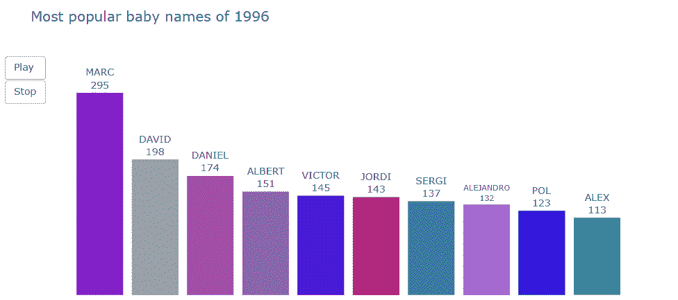

# 数据集

该数据集可以在**巴塞罗那**公开数据中找到，包含了**巴塞罗那市最常见的 25 个婴儿名字，**按性别分类。

 [## 巴塞罗那最常见的 25 个宝宝名字，按性别分类-25 _ noms _ padro _ any _ sexe _ 1996 _ 2018 . CSV…

### 这个数据集包含了出生到出院的 25 个最常见的孩子名字的频率数据

open data-a jument . Barcelona . cat](https://opendata-ajuntament.barcelona.cat/data/en/dataset/est-noms-nadons/resource/e1b5dd1f-a88e-43eb-86d1-d3880d9a6718) 

# 探索性数据分析和数据清理

**探索性数据分析**包括分析数据集的主要特征，通常采用**可视化方法**和**汇总统计**。目标是理解数据，发现模式和异常，并在我们执行进一步评估之前检查假设。

下载完 **csv 文件**后，我们可以使用[**Pandas . read _ CSV**](https://pandas.pydata.org/pandas-docs/stable/reference/api/pandas.read_csv.html)函数将其加载到 **Pandas 数据框**中，并使用 [**pandas 可视化前 5 行。data frame . head**](https://pandas.pydata.org/pandas-docs/stable/reference/api/pandas.DataFrame.head.html)**方法。**

**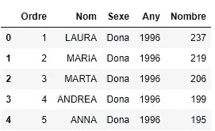**

**前五排**

**不合适的**数据类型**和**缺失值**是数据集最常见的问题。我们可以使用 [**熊猫轻松分析这两者。DataFrame.info**](https://pandas.pydata.org/pandas-docs/stable/reference/api/pandas.DataFrame.info.html) 方法。此方法提供了数据框的简明摘要，包括每列的数据类型、非空值的数量以及内存使用情况。**

**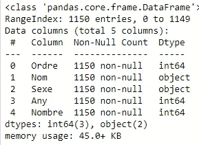**

**信息方法**

**数据集不包含**空值**和**数据类型**是预期的。**

**如上所示，数据帧包含 5 列:(1) Ordre，(2) Nom，(3) Sexe，(4) Any，和(5) Nombre。巴塞罗那开放数据提供了大部分加泰罗尼亚语的数据集。因此，在开始可视化之前，我们必须将数据集翻译成英语。首先，我们用 [**熊猫翻译列名。DataFrame.rename**](https://pandas.pydata.org/pandas-docs/stable/reference/api/pandas.DataFrame.rename.html) 功能如下:**

**使用[的**熊猫。DataFrame.columns**](https://pandas.pydata.org/pandas-docs/stable/reference/api/pandas.DataFrame.columns.html) 属性，我们可以检查翻译是否正确执行。接下来，我们用**熊猫翻译列 Sex 的值。DataFrame.replace** 功能。**

**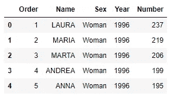**

**翻译数据帧**

**当检查列名的唯一值时，我们可以观察到多个条目包含尾随空格。**

**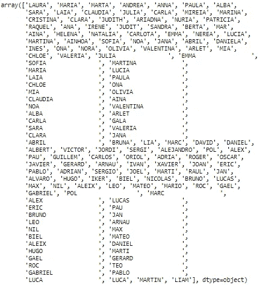**

**多个条目包含尾随空格**

**我们删除了 [**熊猫的尾随空格。**串联](https://pandas.pydata.org/pandas-docs/stable/reference/api/pandas.Series.apply.html)方法。该方法对 Series 对象的每个元素(**列名**)调用 Python 函数( **lambda x: x.strip()** )。**

**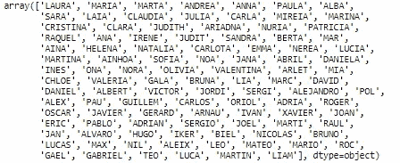**

**如上所示，尾部空格被成功删除。**

**数据清理完毕！！👏现在！我们准备好开始条形图竞赛了！**

# **色彩设计**

**该数据集包含了 25 个最常见的男女婴儿名字。由于我们将制作两个交互式**条形图**，一个用于女性姓名，另一个用于男性姓名，我们将数据分为两个数据集，如下所示:**

****

**女性名字**

**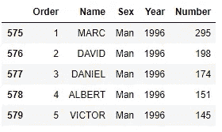**

**男性名字**

**请注意，我们只选择了 10 个最常见的婴儿名字。**

**接下来，我们将为每个名称分配一种独特的颜色。为此，我们创建了一个函数，它接受**系列**和 **RGB** (红、绿、蓝)颜色格式(从 0 到 255 的整数值)的每个参数的**最小和最大强度**作为输入。该函数返回一个**字典**，其中**键**是系列的唯一名称，而**值**是 RGB 颜色。这些颜色是使用函数 **random.randint(a，b)** 随机分配的，该函数返回一个介于 **a** 和 **b** 之间的随机整数(两者都包括在内)。**

**利用上面的函数，我们创建了两个字典，一个用于女性名字，另一个用于男性名字。字典的值是字符串( **'rgb({}，{}，{})'** )，因为这是我们稍后将用来给条分配颜色的符号。**

**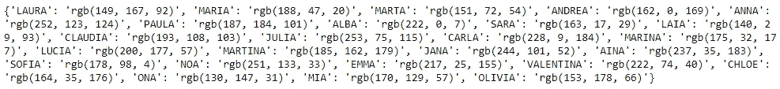**

**女性名字词典**

**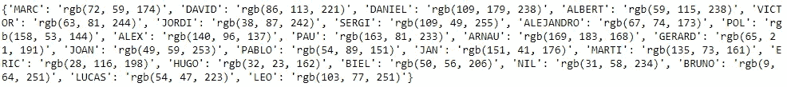**

**男性名字词典**

**正如你所观察到的，对于女性名字来说，主要颜色是红色。相反，男性的名字主要是蓝色调。**

**现在，我们在两个数据框中创建一个名为 Color 的列，使用[**熊猫为每个名字(根据字典)指定一种颜色。**方法如下:](https://pandas.pydata.org/pandas-docs/stable/reference/api/pandas.Series.map.html)**

**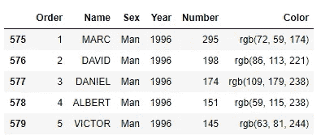**

**df_man 数据帧前五行**

**现在，我们准备创建条形图！**

# **条形图竞赛**

**要制作一个**条形图竞赛**，首先我们必须创建一系列**帧**。每个**帧**包含一年的**柱状图**(从 1996 年到 2017 年)。**

**如上图所示，我们使用 [**plotly.graph_objects 创建了一个条形图。**](https://plotly.com/python-api-reference/generated/plotly.graph_objects.Bar.html) 栏功能(在**库中定义)Plotly** 。一个**条形图**显示了**分类变量**和**数值变量**之间的关系。在这个可视化中，每个条代表一个名字( **x 轴—分类变量**)，其高度与婴儿数量成比例( **y 轴—数值变量**)。条的**颜色是我们之前分配给每个名称的颜色。此外，我们在横条上包含一个**文本**，显示婴儿的名字(**轴 x** )和数量(**轴 y** )。由于我们不想在鼠标悬停在条上时显示任何信息，我们将参数 **hoverinfo** 设置为等于**‘无’。******

**我们创建的第二个元素是使用 **plotly.graph_objects 的布局。布局**功能，这里我们定义了**轴**、**标题**、**背景颜色**等等。可以看出，在处理颜色时， **Plotly** 不仅支持 **rgb** 还支持**十六进制**符号。为了指定背景颜色，我们使用形式为 **#RRGGBB** 的字符串，其中 **RR** (红色)、 **GG** (绿色)和 **BB** (蓝色)是介于 00 和 FF 之间的十六进制数，代表颜色的强度。**

**接下来，我们使用 **plotly.graph_objects 创建框架对象。框架**功能，输入**条对象**(数据参数)和**布局对象**(布局参数)。最后，我们将框架对象添加到一个列表中。**

**在创建了**帧列表**后，我们准备好使用 **plotly.graph_objects 生成**条形图比赛**图。图**功能，提供输入:**

*   **初始年份的柱状图(**数据**自变量)**
*   **初始地块的布局(**布局**自变量)**
*   **帧列表(**帧**自变量)**

**现在，我们准备创建两个动画条形图！💪**

**对女孩来说👧**

**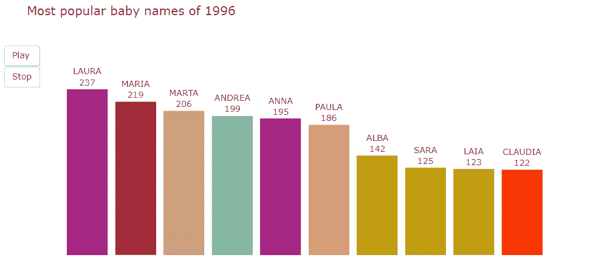**

**动画条形图-巴塞罗那最受欢迎的婴儿名字**

**对于男孩来说👦 :)**

****

**动画柱状图——巴塞罗那最受欢迎的婴儿名字**

# **录像**

**一定不要忘了提一下启发我写这篇文章的视频！**

**阿曼达:)**